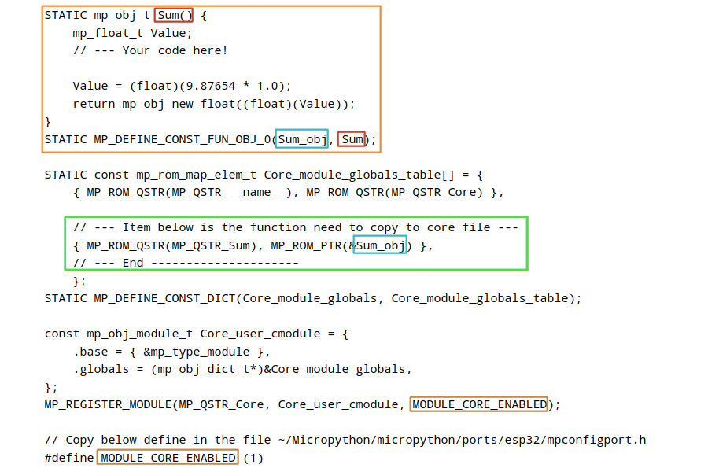

<style>
    table {
        width: 100%;
    }
</style>

# MicroPython

MicroPython是2013年在Kickstarter上募資開始建立的小型硬體編程，因為資源有限，而將Python濃縮成一款小型包，載入硬體微控制器的一項開源專案。

MicroPython怎麼寫？跟Python一模一樣。MicroPython除了留有Python的許多迷你化的標準函式庫，也有例如 machine、network等硬體相關的專屬函式庫用於控制硬體相關功能。

詳細可參考 : [官方文件](https://docs.python.org/zh-tw)

源代碼下載地址 : [MicroPython](https://micropython.org/download/)

MicroPython的出現讓許多畏懼低階語言的開發者有機會以高階語言玩玩硬體端，也能加快原本物聯網開發者的開發速度。

但目前MicroPython包含的函式庫還十分有限，所以太複雜的專案難以完成。

## 核心庫

  - py/-- 核心python實現，包括編譯器、運行時和核心庫。

  - mpy cross/--用於將腳本轉換為預編譯字節碼的 *Micropyhon* 交叉編譯器。 該程序用於將 *MicroPython* 腳本預編譯為 .mpy 文件，然後可將其包含到固件或可執行文件中。讓這程序在 *MicroPython* 中使用。

  - extmod/--在 *C* 中實現的附加（非核心）模塊用以提供一些額外的功能。

  - tools/--各種工具

  - docs/--sphinx格式的用戶文檔。呈現的HTML文檔可在[http://docs.tpyboard.com](http://docs.tpyboard.com)上找到。

## 其他組件

  - ports/teensy/--運行在teensy 3.1上的MicroPython版本（初步但功能正常）。

  - ports/pic16bit/--16位pic微控制器的MicroPython版本。

  - ports/cc3200/--在TI的cc3200上運行的Micropython版本。

  - ports/esp8266/--運行在espressf的esp8266 soc上的MicroPython版本。

  - ports/esp32/--運行在espressf的esp32 soc上的MicroPython版本。

  - ports/nrf/--在nrf51和nrf52 mcu上運行的MicroPython版本。

  - ports/unix/--在unix上運行的微星版本。

  - ports/bare-arm/--用於ARM MCU的最小MicroPython版本。主要用於控制代碼大小。

  - ports/stm32/--運行在Pyboard和類似的stm32板上的Micropyhon版本（使用st的cube-hal驅動程序）。

  - ports/minimal/--最小的Micropython內核檔案。用以移植其他開發版。

  - tests/--測試框架和測試腳本。

  - example/--幾個Python腳本示例。

MicroPython包含了諸如交互式提示，任意精度整數，關閉，列表解析，生成器，異常處理等高級功能。適合運行在只有256k的代碼空間和16k的RAM的芯片上。 

MicroPython旨在盡可能與普通Python兼容，讓您輕鬆將代碼從桌面傳輸到微控制器或嵌入式。

## 網上相關程式庫

```
make submodules
```
這將獲取移植所需的所有相關儲存在git內的程式庫子模塊。 使用這命令獲取更新的子模塊的最新版本。

```
make deplibs
```

這將構建所有可用的相關程式庫（無論是否使用它們）。 如果使用其他選項（例如交叉編譯）構建 MicroPython，則應將相同的選項集傳遞給 make deplibs。 要啟用或禁用相關程式庫，需要編輯 mpconfigport.mk 文件，其中包含選項的開關設定。  
例如:
要構建 SSL 模塊（上述 upip 工具需要，因此默認啟用），*MICROPY_PY_USSL* 應設置為 *1*。
但是仍需要使用以上的 make submodules 命令來獲取相關程式庫。

## 標準庫介紹

注意:MicroPython中支持的格式，看最下的表格

- builtin -- 內建函數和異常

  - const
  - bytearray
  - bitwise

const() 及劃線 _ 開頭的變量可以減少RAM的使用。因編譯器在編譯時用數字代替符號。如變數需要更改則需要儲存在RAM內。因此只讀對象必須是不可變的字節或字符串。不能使用 join 或 format 等方法。列表或數組必須使用到 RAM。

```python
# 位元組數組 bytearray

prime_numbers = [2, 3, 5, 7]
# 轉換列表至數組
byte_array = bytearray(prime_numbers)
print(byte_array)

> bytearray(b'\x02\x03\x05\x07')

string = "Python is interesting."
# 選擇合適的字元編碼，例如 'utf-8'
byte_array = bytearray(string, 'utf-8')
print(byte_array)

> bytearray(b'Python is interesting.')

size = 5
# 初始值為0
byte_array = bytearray(size)
print(byte_array)

> bytearray(b'\x00\x00\x00\x00\x00')


# 位元運作 bitwise

MASK    = ~0b00001111
value    = 0b10101010
newValue = 0b00000101

# MASK 將以上後4位取補數用作清零
value = (value & MASK) 

> value = 0b10100000

# 原數值尾4位清零保留其它值再組合新值
value = value | newValue

> value = 0b10100101


```

- array -- 數值數組 

```python
import array

# unsigned byte
arr = array.array('B') 
# integer
arr = array.array('i', [11, 22, 33, 44, 55])
# float
arr = array.array('f', [1.1, 2.2, 3.3, 4.4, 5.5])

x.append([4, 5])
print(x)
> [1, 2, 3, [4, 5]]

x.extend([4, 5])
print(x)
> [1, 2, 3, 4, 5]

```

- gc -- 回收內存碎片

```python
import gc

gc.mem_free()
gc.mem_alloc()
# 強制對堆中未引用的對象進行垃圾回收
gc.collect() 		
```

- math -- 數學運算函數
- sys -- 系統特定功能
- ubinascii -- 二進制/ ASCII互轉

```python
import ubinascii

# 轉換二進制數據為16進製字符串
ubinascii.hexlify(data[, sep])
# 轉換HEX數據為二進製字符串
ubinascii.unhexlify('313233')
# 轉換 Base64 編碼數據為二進製字符串
ubinascii.a2b_base64(data)			
```

- ucollections -- 容器數據類型
- uerrno -- 系統錯誤代碼
- uhashlib -- 散列算法
- uheapq -- 堆隊列算法
- uio -- 輸入/輸出流
- ujson -- JSON 編碼和解碼

```python
import ujson

obj = {1:2, 3:4, "a":6}
# 將dict類型轉換為字符串
jsObj = ujson.dumps(obj)

with open("filename.txt", "w") as f:
    json.dumps(jsObj, f)

# 將字符串轉換為dict類型 			
parsed = ujson.loads(jsObj) 

with open("filename.txt", "r") as f:
   parsed = json.loads(f)

```

- os -- 基本的操作系統

```python
import os

ilist=os.listdir()
print(ilist)

> ['boot.py','main.py','data.txt']

```

- ure -- 正則表達式

正規運算式 (regular expression) 常用在對文件進行解析 ，首先要設定好配對形式 (pattern) 字串 (string) ，然後以該配對形式字串與所欲處理之字串利用 ure 中相關功能的函數 (function) 進行處理。

形式字串需要用到很多中介字元 (metacharacter) ，如下

 > <font color="#FF1000">. ^ $ * + ? { } [ ] \ | ( )</font>

使用原始字串的原因是避免在字串中出現過多的反斜線。

```python
import re

# 比較以$開頭的string字符串
re.match(r'\$', string)	
regex = ure.compile("[\r\n]")
regex.split("line1\rline2\nline3\r\n")

> ['line1', 'line2', 'line3', '', '']

re.split(r'\s+', 'a b   c')
re.split(r'[\s\,]+', 'a,b, c  d')
re.split(r'[\s\,\;]+', 'a,b;; c  d')
> ['a', 'b', 'c']

```

- select -- 高效地等待I/O

所有socket方法都曾阻塞系統正常運作。當socket讀取或寫入時，程序不能做任何其他事情。可能的解決方案有將客戶端的工作委託給單獨的線程。 然而，創建線程並在它們之間切換並不是低消耗的操作。 為了解決這個問題有一種使用套接字的異步方式。 主要思想是將維護套接字的狀態委託給操作系統，並讓它在有內容要從套接字讀取或準備寫入時通知程序。

除了一行server.setblocking(0)和一般創建socket的方法是相同。 這樣做是為了使socket設為非阻塞。它可以為多個客戶端提供服務。

select.select要求操作系統分別檢查給定的socket是否準備好寫入、讀取或是否有一些異常。 這就是為什麼它通過三個套接字列表來指定期望哪個套接字是可寫的、可讀的，以及應該檢查錯誤的。

```python
import select, socket, sys, Queue
server = socket.socket(socket.AF_INET, socket.SOCK_STREAM)
server.setblocking(0)
server.bind(('localhost', 50000))
server.listen(5)
inputs = [server]
outputs = []
message_queues = {}
while inputs:
    readable, writable, exceptional = select.select(
        inputs, outputs, inputs)
    for s in readable:
        if s is server:
            connection, client_address = s.accept()
            connection.setblocking(0)
            inputs.append(connection)
            message_queues[connection] = Queue.Queue()
        else:
            data = s.recv(1024)
            if data:
                message_queues[s].put(data)
                if s not in outputs:
                    outputs.append(s)
            else:
                if s in outputs:
                    outputs.remove(s)
                inputs.remove(s)
                s.close()
                del message_queues[s]
    for s in writable:
        try:
            next_msg = message_queues[s].get_nowait()
        except Queue.Empty:
            outputs.remove(s)
        else:
            s.send(next_msg)
    for s in exceptional:
        inputs.remove(s)
        if s in outputs:
            outputs.remove(s)
        s.close()
        del message_queues[s]

```
 
- usocket -- socket 模塊

```python
# server.py
import socket

HOST = ''
PORT = 5050

with socket.socket(socket.AF_INET, socket.SOCK_STREAM) as s:
    s.bind((HOST, PORT))
    s.listen(2)
    coon, addr = s.accept()
    with coon:
        print('Connected by', addr)
        while True:
            data = coon.recv(1024)
            if not data:
                break
            coon.sendall(data)


# client.py
import socket

HOST = 'localhost'
PORT = 5050

with socket.socket(socket.AF_INET, socket.SOCK_STREAM) as s:
    s.connect((HOST, PORT))
    s.sendall(b'Hello Server!')
    data = s.recv(1024)
print('Recevied', repr(data))

```


- ussl -- SSL/TLS module
- ustruct -- 打包和解壓縮原始數據類型

在ustruct轉換數據類型是。必須注意大小端 <font color="#FF1000">endian</font> 問題。也就是字節數內容是高位還是低位順序。

```python
import ustruct

ustruct.pack('HH', 1, 2)
> b'\x01\x00\x02\x00'

ustruct.unpack('HH', b'\x01\x00\x02\x00')
> (1,2)

# pack函數由一組數值變成字串。如下: 
id, tag, version, count按照指定的格式轉換。
組合成 ss 的一個字符串。用以方便儲存或傳送。

ss = struct.pack("!H4s2I", id, tag, version, count);

# unpack函數由字串分解為一組數值。如下:
 ! 表示我們要使用網絡字節順序解析，
因為我們的數據 ss 是從網絡中接收到的，
在網絡上傳送的時候它是網絡字節順序的。
 - H 表示一個unsigned short的id, 
 - 4s 表示4字節長的字符串， 
 - 2I 表示有兩個unsigned int類型的數據。

id, tag, version, count = struct.unpack("!H4s2I", ss)

# 模擬出相似於 C 中的類似結構
struct Header
{
    unsigned short id
    char[4] tag;
    unsigned int version;
    unsigned int count;
}
```
- time -- 時間相關函數

```python
import time

time.sleep(1)			  # 1秒
time.sleep_ms(1)		# 0.001秒
time.sleep_us(1)		# 0.000001秒

tStart = time.ticks_ms()
tStop = time.ticks_ms()
# 測量微分時間
tElapse = (tStop - tStart) / 1000.0 	

```
- uzlib -- zlib解壓縮
- uasyncio -- 異步程序

異步程序是基於協同調度的方法。程序/任務只能在await代碼中操作。如果await中沒有任何協程，則不可能進行任何任務。要注意是 **await** 語法只能出現在通過 **async** 修飾的函數中，否則會報SyntaxError錯誤。簡單就是由 **asyncio** 類別調用 **async** 函數， 而函數內的 **await** 為可臨時終斷的節點。也是恢復的接入點。

asyncio能在中途中斷、中途返回值給其他協程、中途恢復、中途傳入參數的函數等，和一般的函數只能在起始傳入參數，不能中斷，而且最後返回值給父函數之後就結束的概念不一樣。定義協程很簡單，只要在定義函數時再前面加入 **async** 這個關鍵字如下例子

```python
import asyncio

async def count():
    i = 0
    while True:
        print(i)
        i += 1
        await asyncio.sleep(1)
        
async def main():
    asyncio.create_task(count())
    await asyncio.sleep(5)
    
asyncio.run(main())
asyncio.new_event_loop()
asyncio.run(main())

```


### MicroPython 中支持的數據類型的格式如下表

|代表字符|C 格式|Python 格式|字節數|
|:---:|:---:|:---:|:---:|
|b|signed char|integer|1|
|B|unsigned char|integer|1|
|h|short|integer|2|
|H|unsigned short|integer|2|
|i|int|integer|4|
|I|unsigned int|integer or long|	4|
|l|long|integer|4|
|L|unsigned long|long|4|
|q|long long|long|8|
|Q|unsigned long long|long|8|
|s|char[]|string|1|
|P|void *|long||
|f|float|float|4|
|d|double|float|8|

注意：(<font color="#FF0010">f</font> 和 <font color="#FF0010">d</font> 取決於浮點支持)

### struct 根據本地機器字節順序轉換.可以用格式中的第一個字符來改變對齊方式定義如下表

|代表字符|字節順序|大小和對齊方式|
|:---:|:---:|:---:|
|@|native|湊夠4個字節|
|=|native|按原字節數|
|<|little-endian|按原字節數|
|>|big-endian|按原字節數|
|!|network (<font color="#FF0010">></font>)|按原字節數|

### socket 模塊中定義了許多和協議相關的宏，整理出了下表

|宏名稱|值|功能|用途|
|:---:|:---:|:---:|:---:|
|AF_INET|2|地址|TCP/IP – IPv4|
|AF_INET|10|地址|TCP/IP - IPv6|
|SOCK_STREAM|1|最終類型|TCP流|
|SOCK_DGRAM|2|類型|UDP 數據報|
|SOCK_RAW|3|真實類型|原始真實性|
|SO_REUSEADDR|4 |有效類型|socket可重用|
|IPPROTO_TCP|16|IP 協議號|TCP協議|
|IPPROTO_UDP|17|IP協議號|UDP協議|
|SOL_SOCKET|4095|評價指標級別 ||

### socket TCP/IP 連接程序


### 位元組順序


### 位元運算


### 正則字元

|字元	|說明|
|:---:|:---|
|.|	除了新行符號外的任何字元，例如 '.' 配對除了 '\n' 之外的任何字元|
|^	|字串開頭的子字串或排除指定字元或群組，例如 'a\[\^b\]c' 配對除了 'abc' 之外的任何 a 開頭 c 結尾的三字元組合|
|$	|字串結尾的子字串，例如 'abc$' 配對以 'abc' 結尾的字串|
|\*|	單一字元或群組出現任意次數，例如 'ab*' 配對 'a' 、 'ab' 或 'abb' 等等|
|+	|單一字元或群組出現至少一次，例如 'ab+' 配對 'ab' 或 'abb' 等等|
|?|	單一字元或群組 0 或 1 次，例如 'ab+' 配對 'a' 或 'ab'|
|{m,n}|	單一字元或群組的 m 到 n 倍數，例如 'a{6}' 為連續六個 'a' ， 'a{3,6}' 為三到六個 'a'|
|[]	|對中括弧內的字元形成集合，例如 '[a-z]' 為所有英文小寫字母|
|\\|	特別序列的起始字元|
|\|	|單一字元或群組的或，例如 'a\|b' 為 'a' 或 'b'|
|()	|對小括弧內的字元形成群組|


### 正則常用函數

|特別|	說明|
|:---:|:---|
|\\number|	群組的序數|
|\\A	|字串的開頭字元|
|\\b	|作為單字的界線字元，例如 r'\bfoo\b' 配對 'foo' 或 'bar foo baz' |
|\\B|	作為字元的界線字元，例如 r'py\B' 配對 'python' 或 'py3' |
|\\d|	數字，從 0 到 9 |
|\\D|	非數字|
|\\s|	各種空白符號，包括新行符號 \n |
|\\S|	非空白符號|
|\\w|	任意文字字元，包括數字|
|\\W|	非文字字元，包括空白符號|
|\\Z|	字串的結尾字元|


## 基礎庫總結如下表

爲了做區分這部分庫在命名上稍有改變在最前加了字母u，例如原版的 json 模塊在MicroPython中改名爲 ujson ，不過在使用的時候用 json 和 ujson 兩個名稱都可以。

|程式庫名稱	|說明	|例子|
|:---:|:---:|:---|
|builtin	|內建函數和異常<br/><font color="#FF1000">（不需要引入模塊）</font>|	abs()、pow()、max()、min()、bin()、hex()、input()、print()、len()、range()、next()|
|math	|浮點運算相關函數	|cos()、exp()、log()、sin()、e、pi|
|cmath	|複數運算相關函數	|cos()、exp()、log()、sin()、e、pi
|gc	|垃圾回收控制	|enable()、disable()、collect()|
|sys|	系統相關功能	|exit()、stdin()、stdout()|
|uarray	|數組相關功能	|append()、extend()|
|ubinascii	|二進制和ASCII格式轉化|	hexlify()、unhexlify()、a2b_base64()、b2a_base64()|
|ucollections|	集合相關內容	||
|uerrno|	定義了一些錯誤碼	||
|uhashlib	|哈希和信息摘要算法	|sha256、sha1、md5|
|uheapq	|堆相關操作|	heappush()、heappop()、heapify()|
|uio|	流和文件相關操作	|open()|
|ujson|	python數據類型和json相互轉換|	dump()、dumps()、load()、loads()|
|uos|	文件系統相關操作|	chdir()、listdir()、mkdir()、remove()、rename()|
|ure|	正則表達式相關功能	|complie()、search()、match()、sub()|
|uselect	|steam相關異步功能	||
|usocket|	socket相關功能，用於網絡通信	||
|ussl	|SSL/TLS相關功能	||
|ustruct	|打包解包基礎數據類型	||
|utime|	時間相關功能|	time()、sleep()|
|uzlib|	壓縮與解壓縮相關功能（當前只能解壓縮）||	
|_thread	|多線程功能（還在試驗中）	||


## 嵌入式設備相關庫

|程式庫名稱	|說明	|例子|
|:---:|:---:|:---|
|btree	|BTree數據庫||
|framebuf|	幀緩衝模塊，可以用於圖形輸出等||
|machine|	包含了對模塊上CPU、外設等片上資源相關的操作	|reset()、soft_reset()、reset_cause()、disable_irq()、enable_irq()、lightsleep()、deepsleep()、Pin、ADC、UART、SPI、I2C、RTC、WDT、SDCard|
|micropython|解釋器與系統相關內容	|
|network	|網絡搜索、連接、建立AP等相關操作	|connect()、scan()、ifconfig()|
|urequests|用於HTTP訪問||
|ubluetooth|藍牙相關操作||
|ucryptolib|加密解密等功能	||
|uctypes	|提供與C兼容功能||


# MicroPython 最小固件移植

將 *MicroPython* 移植到新開發板的集成最小固件。
首先，我們將最小目錄複製到新目錄 *example_port* 下，然後看下該目錄下的各個文件，功能如下

```shell
cd ports
mkdir example_port
```

  - frozentest.py -- 測試用的源代碼文件
  - frozentest.mpy -- 利用micropython自帶的編譯工具mpy-cross對frozentest.py編譯出的字節碼文件
  - main.c -- c代碼入口
  - uart_core.c -- 串口驅動文件
  - mpconfigport.h -- 主要的配置文件
  - mphalport.h -- hal層的配置文件
  - qstrdefsport.h -- 外部符號的定義
  - stm32f405.ld -- 默認的鏈接腳本
  - Makefile -- 如下介紹
  - README.md -- 說明的md文件

其中，需要修改的文件包括：<font color="#FF0010"> Makefile</font>，<font color="#FF0010">stm32f405.ld</font>，<font color="#FF0010">uart_core.c</font>，<font color="#FF0010">main.c</font>，<font color="#FF0010">mpconfigport.h </font>

另外，还需要增加如下文件：

 - start.S -- 初始化代碼，也就是最終編譯出bin文件的入口，用於初始化棧，sram，nand flash以及復制代碼到sram等，並最終跳轉到main.c文件中的主要函數
 - nand.c / nand.h -- nand flash 驅動文件
 - uart.h -- 串口驅動頭文件
 - libgcc.a -- 從編譯工具鏈獲得，用於提供除法相關的符號定義
 - mylibc.a -- 增加對printf函數以及字符串庫的支持，這裡沒有使用工程自帶的printf函數，原因是自帶的printf函數打印整形數據會出現錯誤

最小的 *MicroPython* 固件移植例子:

```c
#include "py/compile.h"
#include "py/runtime.h"
#include "py/repl.h"
#include "py/gc.h"
#include "lib/utils/pyexec.h"

#include <stdio.h>

static char heap[2048];

int main (int argc, char **argv) {
    gc_init(heap, heap + sizeof(heap));

    mp_init();

    pyexec_friendly_repl();

    mp_deinit();
    return 0;
}

void nlr_jump_fail(void *val) {
    while (1) {
        ;
    }
}

void NORETURN __fatal_error(const char *msg) {
    while (1) {
        ;
    }
}

mp_lexer_t *mp_lexer_new_from_file(const char *filename) {
    mp_raise_OSError(MP_ENOENT);
}

mp_import_stat_t mp_import_stat(const char *path) {
    return MP_IMPORT_STAT_NO_EXIST;
}

mp_obj_t mp_builtin_open(uint n_args, const mp_obj_t *args, mp_map_t *kwargs) {
    return mp_const_none;
}

MP_DEFINE_CONST_FUN_OBJ_KW(mp_builtin_open_obj, 1, mp_builtin_open);

```

## 相關編譯 make 檔案

```
include ../../py/mkenv.mk

CROSS = 0

# Include py core make definitions
include $(TOP)/py/py.mk

LIBS =

SRC_C = \
    main.c \

$(BUILD)/firmware.elf: $(OBJ)
    $(ECHO) "LINK $@"
    $(Q)$(LD) $(LDFLAGS) -o $@ $^ $(LIBS)
    $(Q)$(SIZE) $@

$(BUILD)/firmware.bin: $(BUILD)/firmware.elf
    $(Q)$(OBJCOPY) -O binary $^ $@

$(BUILD)/firmware.hex: $(BUILD)/firmware.elf
    $(Q)$(OBJCOPY) -O ihex -R .eeprom $< $@

include $(TOP)/py/mkrules.mk
```

## 配置 *MicroPython* 文件  

這些配置在名為 mpconfigport.h 和 mphalport.h 檔案內。

<font color="#FF0010">mpconfigport.h</font> 配置文件包含特定於機器的配置，包括是否啟用不同的 *MicroPython* 功能等方面。  
<font color="#FF0010">mphalport.h</font> 配置包括類型定義、根指針、電路板名稱、微控制器名稱等。

## 將新增模塊功能移植到開發板

在文件 modulexx.c 中添加模塊定義。

```c
#include "py/mpconfig.h"
#include "py/obj.h"

STATIC const mp_map_elem_t pyb_module_globals_table[] = {
    { MP_OBJ_NEW_QSTR(MP_QSTR___name__), MP_OBJ_NEW_QSTR(MP_QSTR_pyb) },
};

STATIC MP_DEFINE_CONST_DICT(pyb_module_globals, pyb_module_globals_table);

const mp_obj_module_t pyb_module = {
    .base = { &mp_type_module },
    .globals = (mp_obj_dict_t*)&pyb_module_globals,
};
```

相應地修改配置文件 <font color="#FF0010">mpconfigport.h</font>

```c
// extra built-in modules to add to the list of known ones
extern const struct _mp_obj_module_t pyb_module;

#define MICROPY_PORT_BUILTIN_MODULES \
    { MP_OBJ_NEW_QSTR(MP_QSTR_pyb), (mp_obj_t)&pyb_module },
```

如果移植正確，那麼應標準的命令行解釋器如下

```
>>> 2
2
>>> print(“Hello!”)
Hello!
>>>
```

# MicroPython C 函數庫生成器

使用 **C** 函數庫生成器，創建 **C** 代碼模板用於「extmod」中提供附加「非核心」模塊。這功能也可修改已有的 **C** 程式庫，使其能成為 **MicroPython** 的程式庫。


**Core** 是函數庫名稱, **Sum** 是函數名稱。 橙色區域是一個新的創建函數, 綠色區域是存儲所有新創建函數的函數庫。

 

## 使用 ESP32 交叉編譯 mpy 文件的例子

```c
// MicroPython 應用程序接口的頭文件
#include "py/dynruntime.h"

// 計算階乘的輔助函數
STATIC mp_int_t factorial_helper(mp_int_t x) {
    if (x == 0) {
        return 1;
    }
    return x * factorial_helper(x - 1);
}

// 這是 Python 調用的函數，如 factorial(x)
STATIC mp_obj_t factorial(mp_obj_t x_obj) {
    // 從 MicroPython 輸入中提取整數
    mp_int_t x = mp_obj_get_int(x_obj);
    // 計算階乘
    mp_int_t result = factorial_helper(x);
    // 將結果轉換為整數返回
    return mp_obj_new_int(result);
}
// 對上述函數的 Python 定義
STATIC MP_DEFINE_CONST_FUN_OBJ_1(factorial_obj, factorial);

// 在導入模塊時調用的入口點
mp_obj_t mpy_init(mp_obj_fun_bc_t *self, size_t n_args, size_t n_kw, mp_obj_t *args) {
    // 這是第一個必須設置的全局字典入口
    MP_DYNRUNTIME_INIT_ENTRY

    // 函數的命名空間
    mp_store_global(MP_QSTR_factorial, MP_OBJ_FROM_PTR(&factorial_obj));

    // 最後必須恢復全局字典
    MP_DYNRUNTIME_INIT_EXIT
}

```

## Makefile 文件名區分大小寫，*makefile* 中的 **M** 必須是大寫

```make
# MicroPython 目錄的位置
MPY_DIR = ../../..

# 模塊功能名稱
MOD = factorial

# 源文件 (.c or .py)
SRC = factorial.c

# 構建的架構為（x86, x64, armv7m, xtensa & xtensawin）
ARCH = xtensawin

# 獲取編譯和鏈接模塊的規則
include $(MPY_DIR)/py/dynruntime.mk

```

## 用於 ESP32 的 mpy 交叉編譯器及相關編譯模塊

由於 MicroPython 尚未安裝 ESP32 的編譯器, 我們需要單獨安裝它如下

[下載 ESP32 編譯器工具集](https://dl.espressif.com/dl/xtensa-esp32-elf-linux32-1.22.0-59.tar.gz)

```shell
# 將下載文件 xtensa-esp32-elf-linux32-1.22.0-59.tar.gz 解壓到以下路徑
cd ~/esp
tar -xzf ~/Desktop/xtensa-esp32-elf-linux32-1.22.0-59.tar.gz

# 通過編輯 bashrc 文件將工具鏈路徑添加到環境中：
sudo vi ~/.bashrc

# 在 bashrc 文件末尾添加以下代碼,調整為安裝路徑
export PATH=$PATH:$HOME/esp/xtensa-esp32-elf/bin

# 保存更改的 bashrc 文件。 打開一個新的終端並輸入以下命令
echo $PATH

# 應該是 v0.25 或更高版本
pip3 install pyelftools 

# 檢查工具是否可用
xtensa-esp32-elf-gcc -v

```

## 交叉編譯程序命令

```shell
make

LINK build/factorial.o
arch:         EM_XTENSA
text size:    104
rodata size:  8
bss size:     0
GOT entries:  3
GEN factorial.mpy


# 將編譯好的文件複製到ESP32模塊
ampy -p /dev/ttyUSB0 put factorial.mpy

```

## 在 MicroPython 中使用

複製到模塊導入路徑中 以便可以 MicroPython 可以在找到。 

```python
import factorial
print(factorial.factorial(10))

> 3628800
```

# 將構建映像刻錄到板上 (WeAct Studio STM32F411CEU)

[樣板 WeAct Studio STM32F411CEU6 Core Board](https://github.com/WeActTC)

[下載已編譯 Hex 檔案](https://github.com/WeActTC/WeAct_F411CE-MicroPython/releases)

```shell
sudo apt-get build-dep dfu-util
sudo apt-get install libusb-1.0-0-dev
```

下載固件 : firmware_internal_rom_stm32f411_v1.12-35.hex
將固件從十六進制 (HEX) 轉換為二進制 (BIN)

```shell
sudo apt-get update
sudo apt-get install binutils
objcopy --input-target=ihex --output-target=binary firmware_internal_rom_stm32f411_v1.12-35.hex stm32f411.bin
sudo dfu-util -a 0 -s 0x08000000:leave -t 0 -D stm32f411.bin

```

安裝工具 **Screen** 用於訪問開發板

```shell
sudo apt install screen
sudo apt purge modemmanager
sudo chmod 666 /dev/ttyACM0
screen /dev/ttyACM0

```

由源代碼構建 MicroPython

源代碼下載地址 : [MicroPython](https://micropython.org/resources/micropython-master.zip)

將Git文件下載到所需的目錄位置及安裝相關編譯器


# 移植到 **STM32** 開發板 (WeAct_F411CE-MicroPython)

```shell
sudo apt-get update -y
sudo apt-get install -y gcc-arm-none-eabi
sudo apt-get install -y binutils-arm-none-eabi
sudo apt-get install -y libnewlib-arm-none-eabi
cd ~/MicroPython
git clone https://github.com/micropython/micropython
cd ~/MicroPython/micropython/ports/stm32
make submodules update
make
cd ~/MicroPython/micropython/mpy-cross
make -j4
cd ~/MicroPython/micropython/ports/stm32/boards
git clone https://github.com/WeActTC/WeAct_F411CE-MicroPython.git WeAct_F411CE
cd ~/MicroPython/micropython/ports/stm32
make BOARD=WeAct_F411CE -j
cd ~/MicroPython/micropython/ports/stm32/build-WeAct_F411CE
```

編譯文件是存儲在 *build-WeAct_F411CE* 文件夾內，安裝 *dfu-util* 工具來刻錄 firmware.dfu 檔案

```shell
sudo apt-get install dfu-util
sudo dfu-util --list

```


數據將刻錄到 *Intrenal Flash* 內部存儲位置如上屏幕截圖

```shell
sudo dfu-util -i 0 -a 0 -d 0483:df11 -D firmware.dfu

```

```c
#define MICROPY_HW_SPIFLASH_ENABLE_CACHE (1)
```


erase firmware 

```shell
dd if=/dev/zero of=zeroes bs=330000 count=1
dfu-util -a 0 -s 0x0801f000 -D zeroes

```