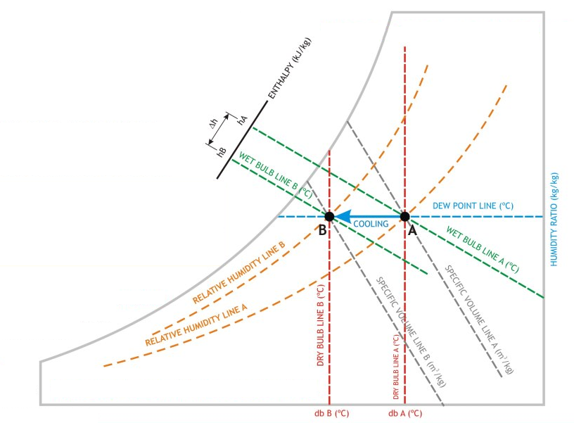
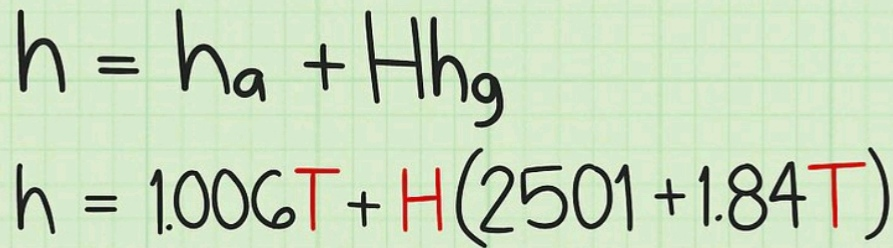

# 空調系統 - Psychrometric Chart Quick Guide

**7** properties can be obtained at any point in psychrometric chart. You can locate the point by any 2 properties. The properties as listed below.
 - Dry bulb temperature (℃)
 - Wet bulb temperature (℃)
 - Dew point temperature (℃)
 - Relative humidity (%)
 - Humidity ratio (kg / kg dry air)
 - Enthalpy (kJ / kg)
 - Specific volume (m³ / kg)



If you know the flow rate of the ACMV system, you can calculate the kW at any point.
```
    =	flow rate * enthalpy / specific volume
    =	(m³/s) * (kJ/ kg) / (m³/kg)
    =	kJ/s
    =	kW
```
Generally the power between 2 points is useful. It is the cooling load.
Enthalpy at any point can be calcuated with formula as below.

{: #size-image}

Where T is the dry bulb temperature and the H is the humidity ratio.