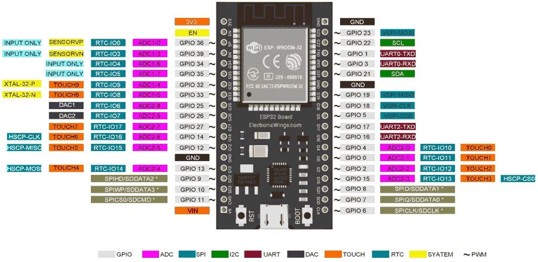
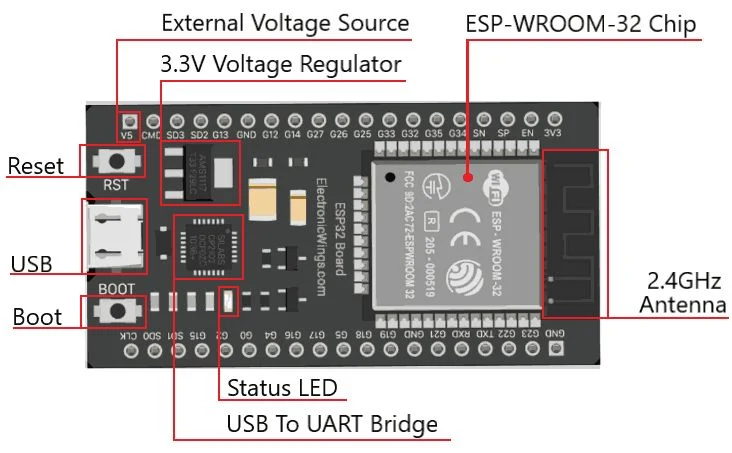
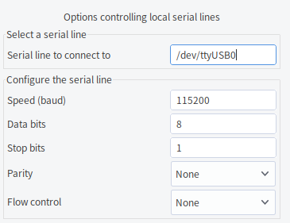

# ESP32 Installation
Please see the below link for details in Linux version [information](https://docs.espressif.com/projects/esp-idf/en/latest/esp32/get-started/linux-setup.html)



<font color="#FF1000">Please be reminded to use Python 3.10.xx as the new one may have problem when it is installed.</font>

# Basic Python 3 installation in Linux for ESP
```
1. Install Prerequisites
> sudo apt-get install git wget flex bison gperf python python-pip python-setuptools cmake ninja-build ccache libffi-dev libssl-dev dfu-util

2.Setting up Python 3 
> sudo apt-get install python3 python3-pip python3-setuptools

3. Making Python 3 the default interpreter
> sudo update-alternatives --install /usr/bin/python python /usr/bin/python3 10

4. Check port on Linux
> ls /dev/tty*

```
# Summary procedure to install ESP
 
Open Terminal, and run the following commands:
```
> mkdir -p ~/esp
> cd ~/esp
> git clone --recursive https://github.com/espressif/esp-idf.git
> cd esp-idf
> git submodule update --init --recursive
> cd ~/esp/esp-idf
> pip freeze > requirements.txt
> python -m pip install -r requirements.txt
> ./install.sh
> . $HOME/esp/esp-idf/export.sh
> alias get_idf='. $HOME/esp/esp-idf/export.sh'
> source ~/.bashrc
```

<font color="#FF1000">You may use vi to add the 「alias get_idf='. $HOME/esp/esp-idf/export.sh'」 into the end of the file ~/.bashrc in order to add the function to any terminal.</font>


**ESP-IDF will be downloaded into ~/esp/esp-idf**
Now you can run get_idf to set up or refresh the esp-idf environment in any terminal session.

# An example to complie a sample program
```
> cd ~/esp
> cp -r $IDF_PATH/examples/get-started/hello_world .
> cd ~/esp/hello_world
> get_idf
> idf.py set-target esp32
> idf.py menuconfig --style monochrome
> idf.py build
> idf.py -p /dev/ttyUSB0 flash
```
### Set ESP32 into flashing mode

ESP32 boards have 2 buttons, one labeled Boot or B and one Reset or EN. To go into flash mode, <font color="#FF1000">press and hold the Boot button, and then press the Reset button shortly</font> (about half a second is fine). The Boot button was held for a few more seconds, and then release it. That will be set in the right mode.



#  Monitor of a sample program
```
> idf.py -p /dev/ttyUSB0 flash monitor

To exit the serial monitor, type Ctrl-]
```

# Compile MicroPython with ESP32 by Source

## Install MicroPython
```
> mkdir ~/Micropython
> cd ~/Micropython
> git clone https://github.com/micropython/micropython
> cd ~/Micropython/micropython/ports/esp32
> make ESPIDF= 
# This will print the supported hashes, copy the one you want.
# Supported git hash (v3.3): 9e70825d1e1cbf7988cf36981774300066580ea7
# Supported git hash (v4.0) (experimental): 4c81978a3e2220674a432a588292a4c860eef27b
```

## Install ESP32
```
> mkdir ~/Micropython/esp
> cd ~/Micropython/esp
> git clone https://github.com/espressif/esp-idf.git
> cd ~/Micropython/esp/esp-idf
> git checkout 9e70825d1e1cbf7988cf36981774300066580ea7
> git submodule update --init --recursive
```

## Python dependencies
```
> cd ~/Micropython/micropython/ports/esp32
> python3 -m venv build-venv
> source build-venv/bin/activate
> pip install --upgrade pip
> pip install -r ~/Micropython/esp/esp-idf/requirements.txt
> cd ~/Micropython/esp/esp-idf
> ./install.sh
> export IDF_PATH="$HOME/Micropython/esp/esp-idf"
> export ESPIDF="$HOME/Micropython/esp/esp-idf"
> source ~/Micropython/esp/esp-idf/export.sh
```

## Install Cross Complier
```
> sudo apt-get install git wget make libncurses-dev flex bison gperf python python-serial
> cd ~/Micropython/micropython/mpy-cross
> make
```

## Build ESP32 with Micropython
```
> cd ~/Micropython/micropython/ports/esp32
> export IDF_PATH="$HOME/Micropython/esp/esp-idf"
> export ESPIDF="$HOME/Micropython/esp/esp-idf"
> source ~/Micropython/esp/esp-idf/export.sh

> nano boards/GENERIC/mpconfigboard.mk
----> SDKCONFIG += boards/sdkconfig.ble

> export BOARD=GENERIC_SPIRAM
> make -j4 submodules
> make -j4
> esptool.py --chip esp32 --port /dev/ttyUSB0 --baud 115200 write_flash -z 0x1000 build-GENERIC_SPIRAM/firmware.bin

# Add function to Micropython with C Code
# The usermod folder is under the folder micropython as ~/Micropython/micropython/usermod
# Every function have separated function e.g. ~/Micropython/micropython/usermod/simplefunction
> cd ~/Micropython/micropython/ports/esp32

# Modify the file ~/Micropython/micropython/ports/esp32/mpconfigport.h to include the additional function
# '#define MODULE_SIMPLEFUNCTION_ENABLED (1)' was added at the end of the mpconfigport.h which is inside the c file as below
# MP_REGISTER_MODULE(MP_QSTR_simplefunction, simplefunction_user_cmodule, MODULE_SIMPLEFUNCTION_ENABLED); 
# The last parameter of the MP_REGISTER_MODULE control the function include in the firmware or not.
# Independant definiation shall be added for separated function. 

> make clean
> make -j4 USER_C_MODULES=../../usermod all
> esptool.py --chip esp32 --port /dev/ttyUSB0 --baud 115200 write_flash -z 0x1000 build-GENERIC_SPIRAM/firmware.bin
```
# One Command Mode
```
> cd ~/Micropython/micropython/ports/esp32 && export IDF_PATH="$HOME/Micropython/esp/esp-idf" && source ~/Micropython/esp/esp-idf/export.sh
> export BOARD=GENERIC_SPIRAM && cd ~/Micropython/micropython/ports/esp32 && make -j4 USER_C_MODULES=../../usermod all
> esptool.py --chip esp32 --port /dev/ttyUSB0 --baud 115200 write_flash -z 0x1000 build-GENERIC_SPIRAM/firmware.bin
```

# Rebuild with clean
```
> export BOARD=GENERIC_SPIRAM && cd ~/Micropython/micropython/ports/esp32 && make clean && make -j4 USER_C_MODULES=../../usermod all
# configuration file for activate the micropython function
> file:///home/dickyko/Micropython/micropython/ports/esp32/mpconfigport.h
```
# PuTTY to test the MicroPython
```
# setting in PuTTY to connect to ESP32
# Help to list all modules with Quotation mark
> help ("modules")
# Help to list of specific ModuleName without Quotation mark
> help (ModulesName)
```



If you want to use the existing complier microPython bin file for ESP32 you may in download it in [microPython ESP32](https://micropython.org/download/esp32/)


# ESP32 Library

##_network modules

```python
import network

wlan = network.WLAN(network.STA_IF) # create station interface
wlan.active(True)       # activate the interface
wlan.scan()             # scan for access points
wlan.isconnected()      # check if the station is connected to an AP
wlan.connect('essid', 'password') # connect to an AP
wlan.config('mac')      # get the interface's MAC address
wlan.ifconfig()         # get the interface's IP/netmask/gw/DNS addresses

ap = network.WLAN(network.AP_IF) # create access-point interface
ap.config(essid='ESP-AP') # set the ESSID of the access point
ap.config(max_clients=10) # set how many clients can connect to the network
ap.active(True)         # activate the interface

```

## machine modules

### machine.Pin class:

```python
from machine import Pin

p0 = Pin(0, Pin.OUT)    # create output pin on GPIO0
p0.on()                 # set pin to "on" (high) level
p0.off()                # set pin to "off" (low) level
p0.value(1)             # set pin to on/high

p2 = Pin(2, Pin.IN)     # create input pin on GPIO2
print(p2.value())       # get value, 0 or 1

p4 = Pin(4, Pin.IN, Pin.PULL_UP) # enable internal pull-up resistor
p5 = Pin(5, Pin.OUT, value=1) # set pin high on creation

```

### machine.UART class:

```python
from machine import UART

uart1 = UART(1, baudrate=9600, tx=33, rx=32)
uart1.write('hello')  # write 5 bytes
uart1.read(5)         # read up to 5 bytes

```

### machine.SPI， machine.SoftSPI class:

```python
from machine import Pin, SPI

hspi = SPI(1, 10000000)
hspi = SPI(1, 10000000, sck=Pin(14), mosi=Pin(13), miso=Pin(12))
vspi = SPI(2, baudrate=80000000, polarity=0, phase=0, bits=8, firstbit=0, sck=Pin(18), mosi=Pin(23), miso=Pin(19))


from machine import Pin, SoftSPI

# construct a SoftSPI bus on the given pins
# polarity is the idle state of SCK
# phase=0 means sample on the first edge of SCK, phase=1 means the second
spi = SoftSPI(baudrate=100000, polarity=1, phase=0, sck=Pin(0), mosi=Pin(2), miso=Pin(4))

spi.init(baudrate=200000) # set the baudrate

spi.read(10)            # read 10 bytes on MISO
spi.read(10, 0xff)      # read 10 bytes while outputting 0xff on MOSI

buf = bytearray(50)     # create a buffer
spi.readinto(buf)       # read into the given buffer (reads 50 bytes in this case)
spi.readinto(buf, 0xff) # read into the given buffer and output 0xff on MOSI

spi.write(b'12345')     # write 5 bytes on MOSI

buf = bytearray(4)      # create a buffer
spi.write_readinto(b'1234', buf) # write to MOSI and read from MISO into the buffer
spi.write_readinto(buf, buf) # write buf to MOSI and read MISO back into buf

```

### machine.I2S，machine.I2S class:

```python
from machine import Pin, I2C

i2c = I2C(0)
i2c = I2C(1, scl=Pin(5), sda=Pin(4), freq=400000)


from machine import Pin, SoftI2C

i2c = SoftI2C(scl=Pin(5), sda=Pin(4), freq=100000)

i2c.scan()              # scan for devices

i2c.readfrom(0x3a, 4)   # read 4 bytes from device with address 0x3a
i2c.writeto(0x3a, '12') # write '12' to device with address 0x3a

buf = bytearray(10)     # create a buffer with 10 bytes
i2c.writeto(0x3a, buf)  # write the given buffer to the peripheral

```

### machine.Timer class:

```python
from machine import Timer

tim0 = Timer(0)
tim0.init(period=5000, mode=Timer.ONE_SHOT, callback=lambda t:print(0))

tim1 = Timer(1)
tim1.init(period=2000, mode=Timer.PERIODIC, callback=lambda t:print(1))

```

### machine.esp class:

```python
import esp

esp.osdebug(None)       # turn off vendor O/S debugging messages
esp.osdebug(0)          # redirect vendor O/S debugging messages to UART(0)

# low level methods to interact with flash storage
esp.flash_size()
esp.flash_user_start()
esp.flash_erase(sector_no)
esp.flash_write(byte_offset, buffer)
esp.flash_read(byte_offset, buffer)

```

### machine.esp32 class:

```python
esp32.hall_sensor()     # read the internal hall sensor
esp32.raw_temperature() # read the internal temperature of the MCU, in Fahrenheit
esp32.ULP()             # access to the Ultra-Low-Power Co-processor

```