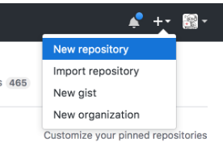
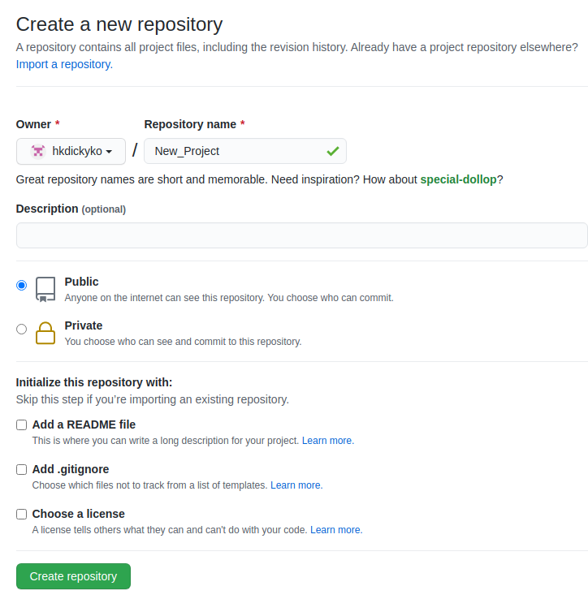
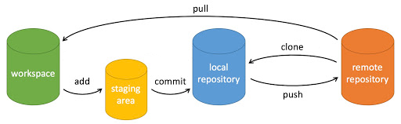

# GitHub 開新專案
## 開一個專案
上傳檔案到GitHub，要先在GitHub上面開一個專案。在 GitHub 網站的右上角點選「+」號，並選擇「New repository」:



## 在 Deepin 安装 **Git**

```
$ sudo apt-get install git
```

## 創建項目
輸入Git項目的名稱，創建一個項目。



# 基本操作命令




## 初始化 Git 項目

```
# 在本地電腦空間初始化一個空的 Git 項目
$ git init

# 這指令主要是跟遠端有關的操作。
# 在這裡的 origin 是一個「代名詞」，指的是後面那 GitHub 伺服器的位置。
# 設定好遠端節點後，接下來就可以把文件從 GitHub 伺服器，下載或上傳至本地電腦。
$ git remote add origin git@github.com:hkdickyko/hkdickyko.github.io
```

設定好遠端節點後，接下來就可以把文件下載或上載 GitHub 伺服器。


## 上傳功能(更新內容)

```
# 將更改的文件添加到 Git 項目
$ git add .

# 是這次的Git項目承諾做什麼事，「初始化项目版本」可以替換為您想要的任何名稱。
$ git commit -m '初始化项目版本'

# 把本地電腦這個分支的內容，推向 GitHub 伺服器。
# origin是代表git@github.com:hkdickyko/hkdickyko.github.io
$ git push -u origin master
```

## 下載功能(更新內容)

```
# 命令用於從遠程獲取代碼並合併本地的版本
$ git pull origin master
```

## 克隆項目至本地電腦

```
# 這指令主要是克隆 Git 項目至本地電腦。
# 在當前目錄下創建一個 hkdickyko.github.io 的目錄，用於保存下載下來的版本記錄
$ git clone git://github.com/hkdickyko/hkdickyko.github.io

# 如有代理服務器。因端口設置，則可能要用 https 的形式才能下載，如下
$ git clone https://github.com/hkdickyko/hkdickyko.github.io
```

## 設置時提交的用戶信息

```
# 這指令主要是设置用户名稱
$ git config --global user.name hkdickyko

# 這指令主要是设置用户電子郵件地址
$ git config --global user.email hkdickyko@gmail.com
```

## Git 設置構建節點，下載及上傳的例子如下


找一個適合的目錄，安裝檔案步驟如下:

```
# 工作 Git 主目錄
$ mkdir git
$ cd git

# 新安裝 Git
$ sudo apt-get remove git
$ sudo apt-get install git

# 無 proxy 用
$ git clone git://github.com/hkdickyko/hkdickyko.github.io
# 有 proxy 用
$ git clone https://github.com/hkdickyko/hkdickyko.github.io

# 初始化 Git
$ git init

# 設置聯繫資料
$ git remote add origin git@github.com:hkdickyko/hkdickyko.github.io
$ git remote set-url origin https://github.com/hkdickyko/hkdickyko.github.io

# 設置用戶資料
$ git config --global user.name hkdickyko
$ git config --global user.email hkdickyko@gmail.com

# 登入上傳或下載目錄，以進行相關操作
$ cd hkdickyko.github.io
```

## 下載文檔

```
$ git pull
```

## 上傳文檔

```
$ git add .
$ git commit -m 'first'
$ git push

Username : 用戶名稱
Password : 個人訪問密码由用戶創建

# 可以一行输入，如下所示
$ git add . && git commit -m first && git push

Username : 用戶名稱
Password : 個人訪問密码由用戶創建
```

# 結語

上面只提到Github中的一般指令，請參閱Github文檔了解詳細資訊 [https://docs.github.com/cn](https://docs.github.com/cn)