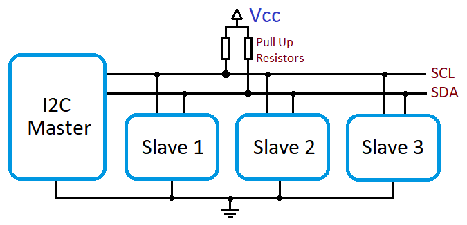
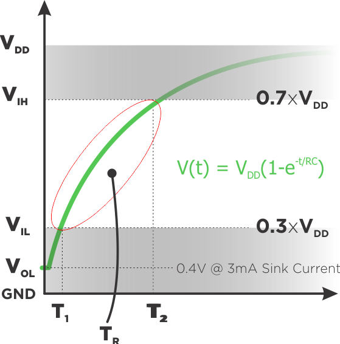
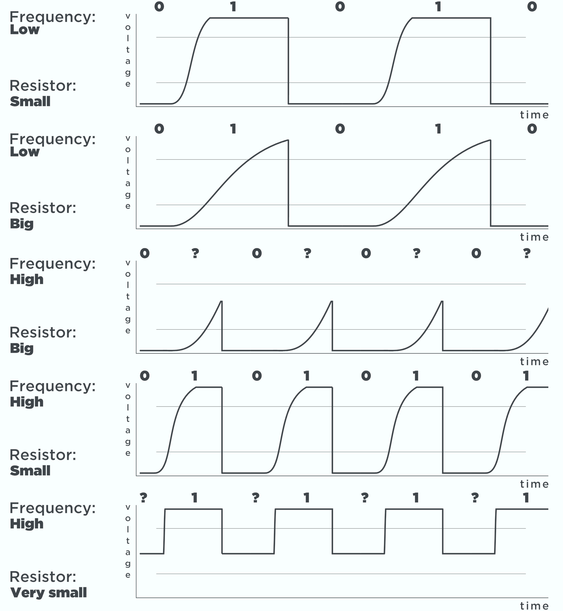

# I2C bus 的 pull-up 電阻設計

I2C bus 的 pull-up 電阻設計，是一個兩難的局面：

 - Rp 很小：low-to-high 的變化速度會很快，clock速度沒有限制，但影響 low 的位準。
 - Rp 很大：low-to-high 的變化速度會太慢，low 的位準沒有問題，但限制 clock 速度。

I2C 規格中定義的 VIL，也就是 0.3 VCC，才能讓其它裝置覺得 bus 的狀態是 low。

根據 I2C 的規範，在 100 KHz 的 standard mode 和 400 KHz 的 fast mode 下，I2C 裝置最少要能驅動 3 mA 的電流。

首先計算 VIL：

 > 
VIL = VCC * 0.3 

 > 
= 3.3V * 0.3

 > 
= 0.99 V

因此最少要將訊號線拉到 0.99 V。此時 Rp 上的電位差就是：3.3 – 0.99 =2.31 V

如果 output driver 最大可以流過 3 mA 的電流，用 3 mA 的電流要造出 2.31 V 的壓差，電阻就是：

 > 
V = IR

 > 
2.31 = 0.003 * R

 > 
R = 770(Ω)

如果將 SCL 或 SDA 拉到 0 V，就要在 Rp 上造出完整的 3.3 V 壓差，這時的電阻值就是：

 > 
V = IR

 > 
3.3 = 0.003 * R

 > 
R = 1100(Ω)

TR上升時間受總線的寄生電容和上拉電阻影響

# 寄生電容問題

寄生電容，也稱為`雜散電容`，是電路中電子元件之間或電路模塊之間，由於相互靠近所形成的電容，寄生電容是寄生元件，是不可避免的。在任意兩段導體之間均有非零的電容，這種電容在高頻情況中體現得尤為突出。

這個電路中，電容器上的電壓可以用一個看起來很恐怖但其實很簡單的數學式來表示：

 }=V_{cc}\times(1-e^{\frac{-t}{RC}}))

## 電阻與頻率的關係如下圖

# 結論

上升時間(Tr)和下降時間Tf直接受到上拉電阻和總線寄生電容的影響。 如果上拉電阻太高，則Tr和Tf會很大；反之， 降低總線速度，如果上拉電阻太小，則會導致功耗過大。

如果總線上只有一個從機（走線長度較短），則可以使用內部上拉電阻（〜30K），更優的方案是使用外部電阻。

一般而言，在 3.3 V、400 KHz 以下，且裝置數量少於 10 個、電路板又不大的狀況下，2.2 KΩ 到 4.7 KΩ 這樣的數值幾乎可以滿足大部分的設計，但經過以上說明，希望讀者可以更加了解 pull-up 電阻與 I2C bus 電路設計之間的關係，在需要時知道如何計算。