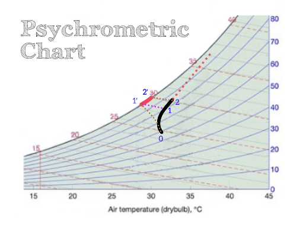

# 空調系統 - 水塔霧化蒸氣

當空氣由水塔低位進入。而需要被冷卻的熱水由高位落下。

黑線起點「0」為室外溫度狀態。
沿著紅色點狀線由低位「0」上升通過「1」或「2」。

紅色點狀線的起點和終點分別為，
室外空氣狀態和水塔之入水狀態即水塔`入水溫度及100%濕度`。

假設「1」為水塔剛有水蒸氣的出風溫度，「1'」即室外空氣的濕球溫度。
而「1」和「1'」的熱含量(Enthalpy)大至相等。

假設「2」爲水塔的最高出風溫度。「2'」所有的熱含量也和「2」：相近。

所以多出的熱含量「2'」-「1'」是與室外空氣和水塔出口空氣熱含量的相差，
在水塔出風位置隨即被室外空氣冷卻而化為霧狀水蒸氣。
再慢慢由附近的空氣吸收。

水塔風量越大黑線長度越短。
紅線為霧化水蒸氣的空氣。如黑線長度未及至「1」。則沒有水蒸氣出現。

