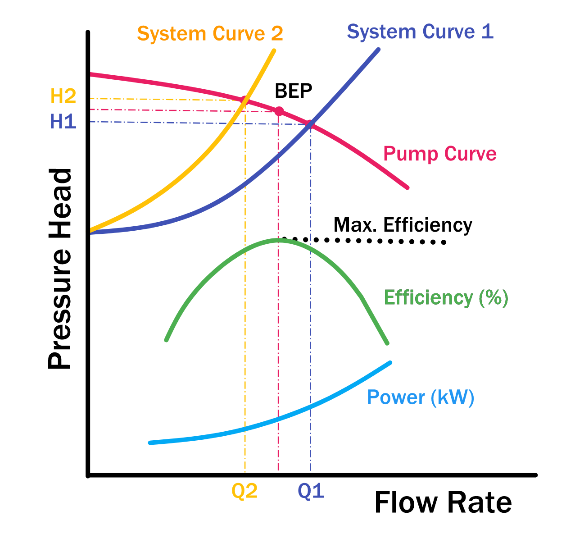

# 水泵特性曲線

一般選擇水泵的設計運行工作點，應該在這個水泵的最佳效能點上。
即水泵在這個水壓及水流量上運作，水泵的效率是最高。如下圖紅色的點相，

而綠色部分為水泵的最佳設計範圍。

水泵的水流量改變範圍:
 - 在壓力增加時，應不能低于水泵的最高效率水流量的70個百分點。
 - 如壓力降低時，也不應高于水泵的最高效率水流量的15個百分點。
 
選擇的範圍超出以上提議。水泵有可能產生震盪，水泵氣蝕，軸偏差，
入水端和出水端水循環及水泵過熱等問題。請參考附圖如下。

下圖是簡單介紹系統曲線與其它水泵特性之關係:

 - 在H2及Q2時是這個系統是處於最大的水阻力，水流是最小。
 - 在H1及Q1時是這個系統是處於最小的水阻力。小流是最大。

基於日常水管閥之調整，系統曲線會在H2及H1之間改變。
當水管老化時，系統阻力也會增加。

