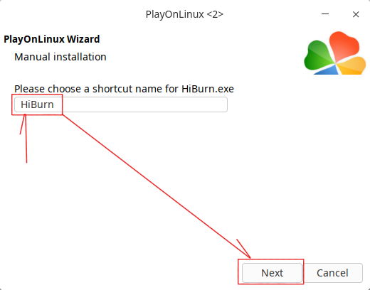
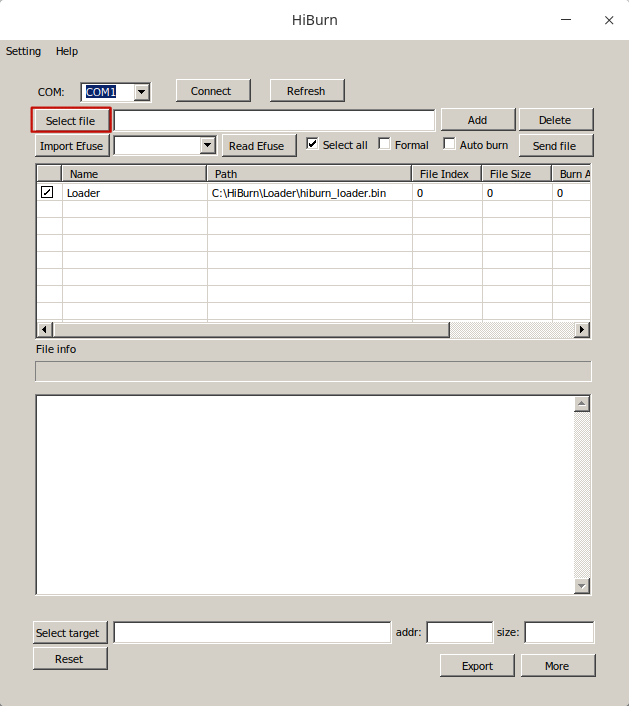

# 鴻蒙操作系統 (**LiteOS**)

本安裝是基於 **Deepin Linux** 電腦系統，不需要 **Windows** 及 **Visual Studio Code** 等軟件。直接在最少電腦資源下制作 **IoT** 控制方案。

## 在電腦上安裝 **Deepin Linux** (安裝方法請看官方網站資訊)

 - 網上官方下載位置 : [Deepin](https://www.deepin.org/en/download/)

## 在任何安裝之前檢查 **Linux** 更新

```
$ sudo apt update
```

## Python編譯安裝

### 下載 **Python**

- 網上官方下載位置 :  [Python](https://www.python.org/downloads/)

### 解壓安裝包到合適的文件目錄


### 安裝依賴檔案

```
sudo apt install make build-essential libssl-dev zlib1g-dev liblzma-dev
sudo apt install libbz2-dev libreadline-dev libsqlite3-dev llvm
sudo apt install libncurses5-dev libncursesw5-dev xz-utils tk-dev

```

### 編譯及安裝 **Python**

```
$ cd ~/Python-3.9.6
$ ./configure --enable-optimizations --with-ssl
$ make -j8
$ sudo make altinstall

```

### 安装後的清理

```
$ sudo make clean
$ sudo apt autoremove

```

### 查看安装位置

```
$ which python3.9
```


### 創建虛擬環境

```
mkdir ~/HarmonyOS
cd ~/HarmonyOS
python -m venv HM
source ~/HarmonyOS/HM/bin/activate

```

### 退出虛擬環境

```
deactivate
```

### 更新軟鏈接檔案

```
$ sudo rm -rf /usr/bin/python
$ sudo ln -s /usr/local/bin/python3.9 /usr/bin/python

```

### 更新 **python pip** 檔案

```
$ sudo apt-get install python3-pip
$ python -m pip install --upgrade pip

```


## 在 **Python** 虛擬環境中安裝鴻蒙操作系統安裝環境

### 安裝鴻蒙操作系統所需的python檔案

```
$ pip install SCons
$ pip install kconfiglib
$ pip uninstall crypto pycryptodome
$ pip install pycryptodome
$ pip install ecdsa

```

## 安裝 **node.js**（nvm node.js 版本管理器）

```
$ sudo apt install curl
$ curl https://raw.githubusercontent.com/creationix/nvm/master/install.sh | bash
$ source ~/.bashrc
$ nvm --version 
	(List current version)
$ nvm ls-remote 
	(List all available version)
$ nvm install 14.17.3 
	(install version 14.17.3 into your linux system)
$ node --version 
	(v14.17.3 shall be shown)
	
```

## 安裝鴻蒙操作系統包管理器 (HarmonyOS Package Manager - hpm)

```
 $ npm install --registry=https://registry.npm.taobao.org --loglevel=silly
 $ npm cache clean --force
 $ npm install
 $ npm install --save core-js@3.15.2
 $ npm install -g @ohos/hpm-cli
 $ npm update -g @ohos/hpm-cli
 $ hpm -V
 
```

## 克隆硬件程序源代碼

```
$ mkdir ~/HarmonyOS/package_1	        
$ cd ~/HarmonyOS/package_1	        
	(the package is installed under folder package_1)
$ hpm init -t dist					
	(prepare the package environment)
$ hpm i @bearpi/bearpi_hm_nano		
	(Clone the bearpi_hm_nano from internet)
	
```
	
## 編譯硬件程序源代碼
	
```
$ source ~/HarmonyOS/HM/bin/activate	
$ cd ~/HarmonyOS/package_1	        
$ hpm dist

```

## 安裝 **PlayOnLinux** 使用 **HiBurn** 燒錄鴻蒙.bin文件到Hi3861開發板


---

```
$ sudo apt-get update
$ sudo dpkg --configure -a
$ sudo apt-get install playonlinux

```

### 如果需要刪除 **PlayOnLinux** 安装

```
$ sudo apt-get remove playonlinux

```

- 下載燒錄程式 [HiBurn](https://harmonyos-m.51cto.com/posts/1197)

### **PlayOnLinux** USB端口配置及安裝程序

**PlayOnLinux** 安裝程序 (創建 **HiBurn** 捷徑)

---


---


---


---


---


---


---


---


---


---


---



---


---
選擇 allinone.bin 檔案燒錄開發板



---


---

**USB** 端口配置程序

為了修改 **WINE** USB端口配置，請在運行 **HiBurn** 後使用的以下命令，然後再將控制板插入到電腦USB端口 (不能在 **Python** 虛擬環境中運行)
```
rm -rf ~/.PlayOnLinux/wineprefix/C_driver/dosdevices/com1
ln -s /dev/ttyUSB0 ~/.PlayOnLinux/wineprefix/C_driver/dosdevices/com1
ls -l ~/.PlayOnLinux/wineprefix/C_driver/dosdevices

```
---


---
按 **Connect** 掣來連接開發板


---
再按 **RESET** 掣觀察開發板連按狀態


---


---
勾選 **Auto burn** 後再按開發板上的 **RESET** 掣進行燒錄


---


---


## 安裝 **minicom** 測試 **USB** 串口連接 

```
$ dmesg | grep tty
$ sudo apt-get install minicom
$ sudo minicom -D /dev/ttyUSB0

```

### 按下復位按鈕重啟開發板來顕示資訊
---


---


---

  
# 以下用於測試開發板的 **UDP** 及 **TCP** 程序


使用 **ifconfig** 找到開發板的IP，開發板IP是必須根據實際設置,，Port是你自己設定,。在程式中預設為8888。**nc** 默认為 **TCP** 端口，**-u** 参数是將其設置為 **UDP** 端口。 **minicom** 仍用來觀察開發板。

## 開發板為服務器 ( Server )

開發版服務器  **IP** 為執行時 **DHCP** 分配。要在執行時用 **ifconfig** 尋找。

### 測試 **UDP** 串口連接

```
$ nc -u 192.168.3.127 8888
您可以從客戶端到服務器端輸入文本

```


### 測試 **TCP** 串口連接

```
$ nc 192.168.3.127 8888
您可以從客戶端到服務器端輸入文本

```


## 開發板為客戶端 ( Client )

開發板客戶端發送到主機服務器，主機的 **IP** 要內嵌到開發板程式中。可用 **ifconfig** 尋找。

### 測試 **UDP** 串口連接

```
$ nc -u -l 8888	
收到客戶端的信息

```

### 測試 **TCP** 串口連接

```
$ nc -l 8888	
收到客戶端的信息 

```

## 安裝 **Open Java**

```
$ sudo apt-get install openjdk-8-jre
$ java -version

```

## 額外補充 (編譯程序時不是必須)

### **Visual Studio Code** 安裝

- 網上官方下載位置 :  [Visual Studio Code on Linux](https://code.visualstudio.com/Download)
- 點擊安裝 **Visual Studio Code**

### **Visual Studio Code** 中安裝 **DevEco** 設備工具

- 網上官方下載位置 : [DevEco](https://device.harmonyos.com/cn/ide#download_release)

- 解壓到目錄位置 **~/Downloads** 下

```
$ cd ~/Downloads/devicetool-linux-tool-2.1.0.0
$ chmod 777 ./deveco-device-tool-2.1.0+279451.b672a187.run
$ ./deveco-device-tool-2.1.0+279451.b672a187.run
	(DevEco 的檔案目錄及檔案名稱會因實際情況改變)

$ sudo apt-get install python3-venv
$ sudo apt install authbind
$ sudo touch /etc/authbind/byport/69
$ sudo chmod 777 /etc/authbind/byport/69
$ sudo install -o root -g root -m 0644 ~/.local/share/deveco-device-tool/99-jtag.rules /etc/udev/rules.d/99-jtag.rules
$ sudo install -o root -g root -m 0644 ~/.local/share/deveco-device-tool/99-platformio-udev.rules /etc/udev/rules.d/99-platformio-udev.rules
$ sudo udevadm control -R /usr/bin/authbind
$ ./deveco-device-tool-2.1.0+279451.b672a187.run


```