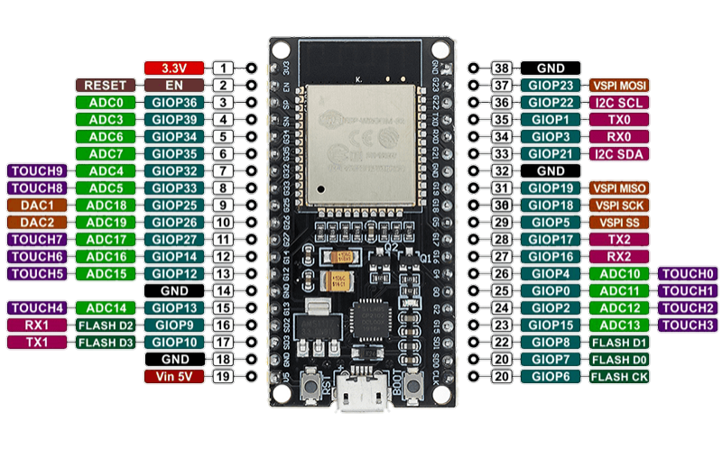
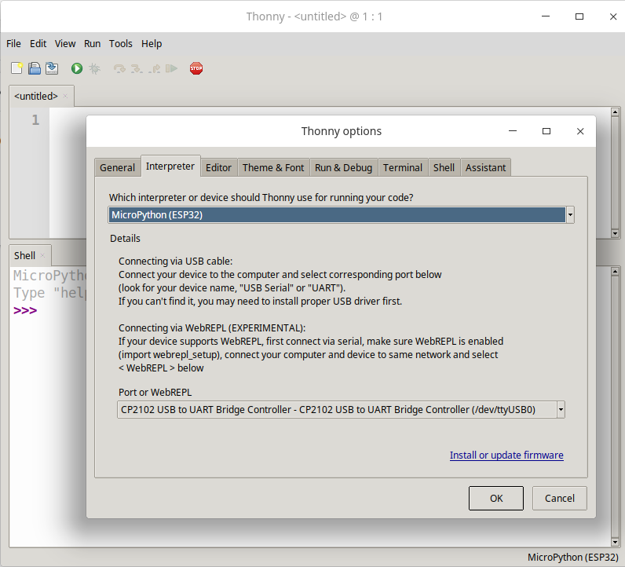
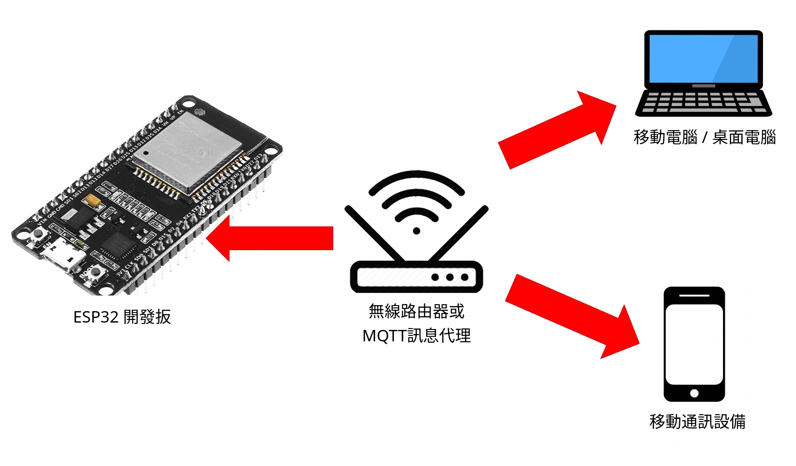
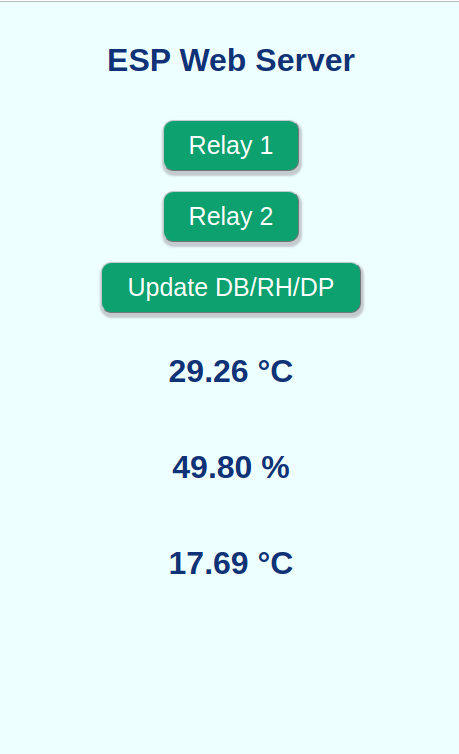
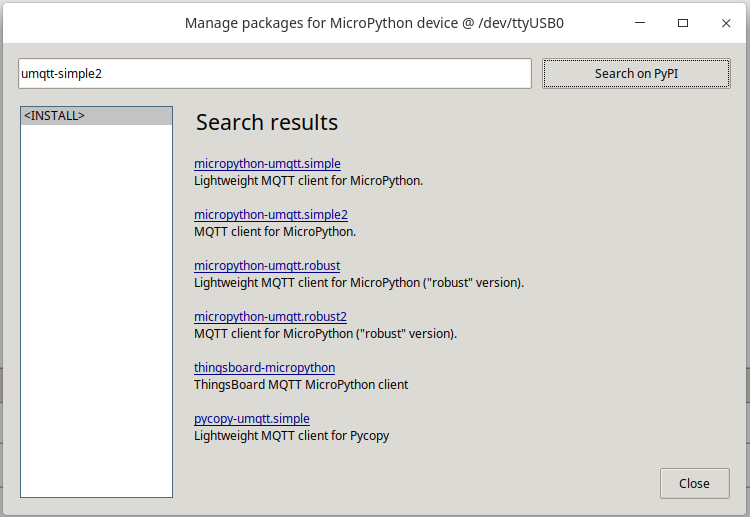
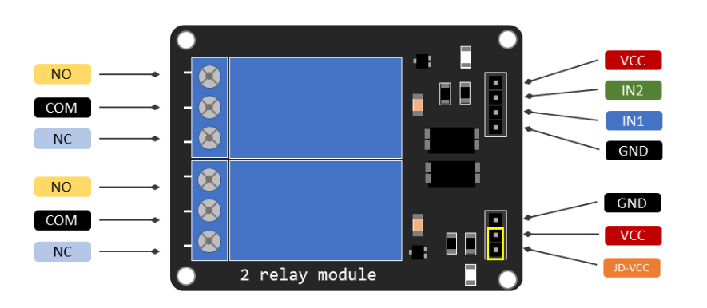
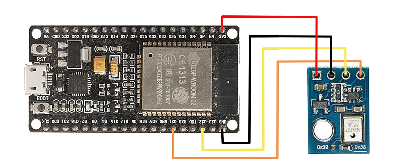

# MicroPython 在 ESP32 內的安裝方法

MicroPython 有 Python許多迷你化的標準函式庫，也有例如 *machine*、*network* 等硬體相關的專屬函式庫用於控制硬體相關功能

- 源代碼下載地址 : [MicroPython](https://micropython.org/download/)

## 改裝 ESP32 開發板


網址下載 [ESP32 的 microPython 內核](https://micropython.org/download/esp32/)，下載已編譯的 **MicroPython** 版的 **ESP32** 內核，用以燒錄到 ESP32 的開發版內。


燒錄方法如下:


- 安裝 **esptool** 作燒錄 ESP 開發版之工具
- *esp32-20180511-v1.9.4.bin* 為 **MicroPython** 版預制的 **ESP32** 內核，其中 *20180511-v1.9.4* 為預製內核的開發日期及版本號碼
- */dev/ttyUSB0* 為 *USB* 接口地址

 

```
$ pip install esptool
$ esptool.py --chip esp32 --port /dev/ttyUSB0 write_flash -z 0x1000 esp32-20180511-v1.9.4.bin

```

ESP 開發板圖示如下




## 安裝 **ampy** 來將*microPython* 上傳/下載文件 *ESP32* 到開發扳內

- */dev/ttyUSB0* 為 *USB* 接口地址

```
$ sudo pip3 install adafruit-ampy
$ echo "export AMPY_PORT='/dev/ttyUSB0'" >> ~/.bashrc

```

---

|            ampy 指令            |       指令描述        |
|:-------------------------------|:--------------------:|
| ampy ls                        | 列出目錄文件 |
| ampy rm "abc" | 删除目錄文件 |
| ampy mkdir "abc" | 創建目錄 |
| ampy rmdir "abc" | 删除目录 |
| ampy put src.py dest.py   | 上傳目錄文件 |
| ampy get src.py dest.py   | 下載目錄文件 |
 


## 安裝 *minicom* 測試 *ESP32* 到開發扳串口連接 

```
$ dmesg | grep tty
$ sudo apt-get install minicom
$ sudo minicom -D /dev/ttyUSB0
$ minicom

```


## 安裝 *Thonny* 處理輸入和輸出 *ESP32* 到開發扳

```
$ sudo apt install python3 python3-pip python3-tk
$ bash <(wget -O - https://thonny.org/installer-for-linux)

```

選擇 *ESP32* 到開發扳如下所示，文件上傳、下載可直接使用程序功能



## MicroPython 資料

常用的 MicroPython 指令

- help('modules')
- help('module')
- dir('modules')

常用的 MicroPython 檔案

- boot.py – 該腳本在開發板啟動時執行為開發板設置各種配置選項
- main.py – 這是 *Python* 程序的主腳本在 *boot.py* 之後執行

## ESP32 相關工具 




### 啟動設置

boot.py 包括WiFi基本命令設置, 帶檢查內存大小的命令 

 - SSID, PASSWORD - 必須根據你的家庭WiFi設置修訂
 
```python
import network
import utime
import ubinascii
import gc

__sta=None

def connectWifi(ssid, pwd):
  global __sta
  if __sta is None:
    __sta=network.WLAN(network.STA_IF)
    __sta.active(True)    
    __sta.connect(ssid, pwd)
    print('Connecting to WiFi STA ...')
    utime.sleep(8)
  if __sta.isconnected():
    print('Connected: {} : {}.'.format(ssid, __sta.ifconfig()[0]))
  else:
    print('{} connect failure!'.format(ssid))
    return None

def scanAP():
  global __sta
  if __sta is None:
    __sta=network.WLAN(network.STA_IF)
  __sta.active(True)
  aps=__sta.scan()
  for ap in aps:
    ssid=ap[0].decode()
    mac=ubinascii.hexlify(ap[1], ':').decode()
    rssi=str(ap[3])+'dBm'
    print('{:>20} {:>20} {:>10}'.format(ssid, mac, rssi))

def getIP():
  global __sta
  if __sta is None:
    print("Not connect yet!")
  else:
    return __sta.ifconfig()

def df(dir='/'):
  from os import statvfs
  s=statvfs(dir)
  print((s[0]*s[3]) / 1048576,'MB') 

connectWifi(SSID, PASSWORD)
gc.collect()
print("---------------------------------------")

```


## 網絡服務器

webserver.py 處理 *JSON* 的最小網絡服務器

```python
try:
  import usocket as socket
except:
  import socket
import ujson
import gc
import utime

class webserver:
    
  def __init__(self,port):
    self.__html=None
    self.__jSonStr=None
    self.__webserver=None
    self.__callback=None
    self.__webserver=socket.socket(socket.AF_INET, socket.SOCK_STREAM)
    self.__webserver.bind(('', port))
    self.__webserver.listen(5)
    self.__conn=None
 
  def html_color(self,ID,rgb):
    strValue="."+ID+"{background-color:"
    pt0=self.__html.find(strValue)+len(strValue)
    pt1=self.__html.find(";}",pt0)
    self.__html=self.__html[:pt0]+rgb + self.__html[pt1:]
 
  def html_text(self,ID,txt):
    strValue=" id=\""+ID+"\">"
    pt0=self.__html.find(strValue)+len(strValue)
    pt1=self.__html.find("</",pt0)
    self.__html=self.__html[:pt0]+txt + self.__html[pt1:]
    
  def html_update(self):
    self.__conn.send('HTTP/1.1 200 OK\n')
    self.__conn.send('Content-Type: text/html\n')
    self.__conn.send('Connection: close\n\n')
    self.__conn.sendall(self.__html)
    self.__conn.close()
 
  def html_page(self,filename):
    if self.__html is None:
      f=open(filename)
      self.__html=f.read()
      f.close()

  def callback(self,pCallback):
    self.__callback=pCallback;

  def loop(self):
    response="Error!"
    while True:
      self.__conn,addr=self.__webserver.accept()
      if not self.__html is None:
        response=self.__html
      request=self.__conn.recv(1024)
      request=str(request)
      pt0=request.find("{")
      pt1=request.find("}",pt0)+1
      if pt0 < 10:
        self.__jSonStr=request[pt0:pt1]
        if self.__jSonStr.find("{")==0:
          self.__jSonStr=self.urldecode(self.__jSonStr)
          parsed=ujson.loads(self.__jSonStr) 
          self.updateStatus(parsed)
        else:
          self.html_update()
      else:
        self.html_update()
      gc.collect()
      
  def urldecode(self,strV): 
    dic={"%21":"!","%22":'"',"%23":"#","%24":"$","%26":"&","%27":"\"","%28":"(","%29":")","%2A":"*","%2B":"+","%2C":",","%2F":"/","%3A":":","%3B":";","%3D":"=","%3F":"?","%40":"@","%5B":"[","%5D":"]","%7B":"{","%7D":"}"}
    for k,v in dic.items():
      strV=strV.replace(k,v)
    return strV

  def updateStatus(self,jlist):
    if not self.__callback is None:
      self.__callback(jlist)
    else:
      print("callback not set!")

```


### 網絡服務器主網頁

index.html

 - 可以導入互聯網 *javascript* 服務器, 如 *jQuery*


```javascript
<!DOCTYPE html>
<html>
<head>
  <title>ESP Web Server</title>
  <meta http-equiv="Content-Type" content="text/html; charset=utf-8"/>
  <meta name="viewport" content="width=device-width, initial-scale=1">
  <script src="https://cdnjs.cloudflare.com/ajax/libs/jquery/3.3.1/jquery.min.js"></script>
  <style>
  html{
    font-family:Helvetica;
    display:inline-block;
    margin:0px auto;
    text-align:center;
    background-color:#eeffff;
  }

  h1{
    color:#0F3376;
    padding:2vh;
  }

  .button {
    padding:10px 25px;
    position:relative;
    font-family: 'Open Sans', sans-serif;
    font-size:25px;
    text-decoration:none;
    color:#fff;
    box-shadow: 1px 3px 2px 2px rgba(167, 167, 173, 0.589);
    border-radius: 10px;
    border-color: #c3c9cc;
    border-width:1px;
  }

  .button::before {
    content:"";
    display:block;
    position:absolute;
    width:100%;
    height:100%;
    padding-left:2px;
    padding-right:2px;
    padding-bottom:4px;
    left:-2px;
    top:5px;
    z-index:-1;
    border-radius: 10px;
  }

  .button:active {
    text-shadow: 0px 1px 1px rgba(255,255,255,0.3);
    box-shadow: 1px 3px 2px 2px rgba(167, 167, 173, 0.589);
    top:7px;
  }

  .button:active::before {
    top:-2px;
  }

  div {
    margin:20px;
  }

  .b1{background-color:rgb(13,161,112);}
  .b2{background-color:rgb(13,161,112);}
  .b3{background-color:rgb(13,161,112);}

</style>
<script>
  $(function() {

    function buildBtn(ID, bName, jsonObj){
      var jString="<a href='?"+JSON.stringify(jsonObj)+"'\"><button class=\"button "+ID+"\">"+bName+"</button></a>";
      $("#"+ID).append(jString);
    }

    var jsonObj1={'btn1':'t'};
    buildBtn("b1", "Relay 1", jsonObj1);

    var jsonObj2={'btn2':'t'};
    buildBtn("b2", "Relay 2", jsonObj2);

    var jsonObj3={'btn3':'t'};
    buildBtn("b3", "Update T / RH", jsonObj3);

  });
</script>
</head>
<body>
  <h1>ESP Web Server</h1> 
  <div id="b1"></div>
  <div id="b2"></div>
  <div id="b3"></div>
  <h1 id="degree"></h1>
  <h1 id="RH"></h1>
  <h1 id="dp"></h1>
</body>
</html>

```


### 網絡服務器主功能模塊

main.py - 處理最小網絡服務器功能的示例 

 - 8080*是你在 *WiFi* 路由器地址中設置的轉發端口

```python
from webserver import webserver 

on="rgb(206,101,40)"
off="rgb(13,161,112)"

flag1=False
flag2=False
flag3=False

def updateStatus(jlist):
  global flag1, flag2, flag3
  if "btn1" in jlist.keys():
    if flag1: 
      web.html_status("b1",off)
      flag1=False
    else:
      web.html_status("b1",on)
      flag1=True
  if "btn2" in jlist.keys():
    if flag2: 
      web.html_status("b2",off)
      flag2=False
    else:
      web.html_status("b2",on)
      flag2=True
  if "btn3" in jlist.keys():
    if flag3: 
      web.html_status("b3",off)
      flag3=False
    else:
      web.html_status("b3",on)
      flag3=True

web = webserver(8080)
web.html_page("index.html")
web.callback(updateStatus)
web.loop()

```





## *MQTT* 基本工具

安裝 **MQTT** 功能包 *uqmtts-simple2* 到 *ESP32* 到開發扳

mqttClient.py 處理 *MQTT* 最小的功能示例 




```python
import utime
import gc
from lib.umqtt.simple2 import MQTTClient as _MQTTClient

class mqttClient:
    
  def __init__(self,IP,ID): 
    self._IP=IP
    self._ID=ID
    self._user="MQTT_User"
    self._pwd="MQTT_password"
    self._port=1883
    self._qos=1
    self._timeout=3
    self._client=None
    self._callback=None;

  def connection(self,user,password,Port,qos,timeout):
    self._user=user
    self._pwd=password
    self._port=Port
    self._qos=qos
    self._timeout=timeout

  def callback(self,callback):
    self._callback=callback
     
  def _sub_callback(self,topic,msg,retained,dup):
    if not self._callback is None:
      self._callback(topic.decode('ascii'),msg.decode('ascii'))
    else:
      print('TOPIC: {},  MSG: {}'.format(topic.decode('ascii'),msg.decode('ascii')))

  def publish(self,topic,message):
    self._client.publish(topic,message,qos=self._qos)
    for i in range(self._timeout):
      utime.sleep_ms(10)

  def subscribe(self,topic):
    self._client.subscribe(topic)
    for i in range(self._timeout):
      utime.sleep(1)
      self._client.check_msg()

  def connect(self):
    self._client= _MQTTClient(self._ID,self._IP,port=self._port,user=self._user,password=self._pwd)
    self._client.set_callback(self._sub_callback)
    self._client.connect()
    print("MQTT Conneted")

  def disconnect(self):
    self._client.disconnect()
    gc.collect()
    print("MQTT disconneted.")

```


###  *MQTT*主功能模塊

main.py - 處理最小*MQTT*網絡功能的示例 

 - 1883是你預設在 WiFi 路由器地址中設置的轉發端口 (MQTT 的標準默認端口)
 - ServerIP是你服務器互聯網地址,例如:63.218.123.41
 - connection 函數可不設置,默認值為 ("MQTT_User", "MQTT_password",1883,1,3)


```python
from mqttClient import mqttClient

def callback(topic,msg):
  print('Callback: {}, {}'.format(topic, msg))

mqttc = mqttClient(ServerIP,"MQTT_Client_ID")
mqttc.callback(callback)
mqttc.connection("MQTT_User","MQTT_password",1883,1,3)
mqttc.connect()
mqttc.publish("temp","test QoS 1 test ----------------")
mqttc.subscribe("temp")
mqttc.disconnect()

```


## 硬件通用輸入/輸出




 - 帶上跳線帽 *VCC* 和 *JD-VCC* 引腳連接。 是繼電器直接由開發扳電源引腳供電，繼電器模塊和開發扳電路彼此沒有物理隔離。
 - 在沒有跳線帽的情況，需要提供一個獨立的電源，通過 *JD-VCC* 引腳為繼電器的電磁鐵供電。 該配置通過模塊的內置光耦合器將繼電器與開發扳物理隔離，從而防止在出現電尖峰時損壞開發扳。
 

 
|常閉配置 (NC)|| 
|:---:|:---:|  
|HIGH 信號|電流正在流動|  
|LOW 信號 | 電流不流動|  

 - 當電流 **通常** 時間流動時，應該使用常閉配置，而只想偶爾停止它。

|常開配置（NO)||
|:---:|:---:|  
|HIGH 信號 | 電流不流動|
|LOW 信號 | 流動的電流|

- 當望電流 **偶爾** 時間流動時，應該使用常開配置，例如，偶爾打開燈。

### ESP32 AHT10 連接




### ESP32 IO 通用輸入/輸出

```python
import machine
import time
import math

class esp32IO:
    
  def __init__(self,freq=400000):
    self.__freq=freq
    self.__hspi=None
    self.__vspi=None
    self.__i2c=None
    
  def On(self,pinID):
    return machine.Pin(pinID, machine.Pin.OUT)

  def Off(self,pinID):
    return machine.Pin(pinID, machine.Pin.IN)

  def i2cInit(self):
    self.__i2c=machine.I2C(scl=machine.Pin(22),sda=machine.Pin(21),freq=self.__freq)

  def i2cCmd(self,address,data):
    self.__i2c.writeto(address,data)

  def i2cCmdOffset(self,address,data,offset):
    self.__i2c.writeto_mem(address,offset,data)

  def i2cRead(self,address,length):
    return self.__i2c.readfrom(address,length)
      
  def i2cReadOffset(self,address,length,offset):
    return self.__i2c.readfrom_mem(address,offset,length)

  def spi_init(self,pbaudrate=80000000):
    self.__hspi = machine.SPI(1, sck=machine.Pin(14), mosi=machine.Pin(13), miso=machine.Pin(12), baudrate=pbaudrate)
    self.__vspi = machine.SPI(2, sck=machine.Pin(18), mosi=machine.Pin(23), miso=machine.Pin(19), baudrate=pbaudrate)

  def spiRead(self,hspi,length):
    if hspi:
        return self.__hspi.read(length)
    else:
        return self.__vspi.read(length)

  def spiReadOffset(self,hspi,length,offset):
    if hspi:
        return self.__hspi.read(length,offset)
    else:
        return self.__vspi.read(length,offset)

  def spiReadOffset(self,hspi,length,offset=0x00):
    buf = bytearray(length)     
    if hspi:
        return self.__hspi.readinto(buf, offset) 
    else:
        return self.__vspi.readinto(buf, offset)
    return buf

  def spiWrite(self,hspi,data):
    if hspi:
      return self.__hspi.write(data)      
    else:
      return self.__vspi.write(data)      

  def spiWriteRead(self,hspi,data,length):
    buf = bytearray(length)
    if hspi:
      MOSI_buf = data
      self.__hspi.write_readinto(MOSI_buf, MISO_buf)
    else:
      MOSI_buf = data
      self.__vspi.write_readinto(MOSI_buf, MISO_buf)
    return buf
        

class devices:
    
  def __init__(self):
    self.__humidty=0.0
    self.__temperature=0.0
    self.__dewpoint=0.0

  def aht10(self):
    AHT10_ADDRESS=0x38
    CMD_INITIALIZE = bytearray([0xE1, 0x08, 0x00])
    CMD_MEASURE = bytearray([0xAC, 0x33, 0x00])
    AHT10_RESET = bytearray([0xBA])
    AHT_CONST=pow(2,20)
    __espx=esp32IO()
    __espx.i2cInit()
    __espx.i2cCmd(AHT10_ADDRESS,AHT10_RESET)
    time.sleep_ms(75)
    __espx.i2cCmd(AHT10_ADDRESS,CMD_INITIALIZE)
    __espx.i2cCmd(AHT10_ADDRESS,CMD_MEASURE)
    time.sleep_ms(100)
    __buf=__espx.i2cRead(AHT10_ADDRESS, 6)
    __humidty_raw=__buf[1] << 12 | __buf[2] << 4 | __buf[3] >> 4
    __degree_raw=(__buf[3] & 0x0F) << 16 | __buf[4] << 8 | __buf[5]
    self.__humidty=float((__humidty_raw/AHT_CONST)*100)
    self.__temperature=float((__degree_raw/AHT_CONST)*200-50)
    if self.__humidty>0:
        factor = (math.log(self.__humidty, 10) - 2) / 0.4343 + (17.62 * self.__temperature) / (243.12 + self.__temperature)
        self.__dewpoint = float(243.12 * factor / (17.62 - factor))
        return (self.__temperature, self.__humidty, self.__dewpoint)
    else:
        return self.aht10() 

```

main.py - 通用輸入/輸出功能的示例 

```python
from esp32IO import esp32IO
from esp32IO import devices
import time
from webserver import webserver 

on="rgb(206,101,40)"
off="rgb(13,161,112)"
flag1=True
flag2=True
flag3=True
devices = devices()
espx = esp32IO()


def updateStatus(jlist):
  global flag1, flag2, flag3
  if "btn1" in jlist.keys():
    if flag1: 
      web.html_color("b1",on)
      espx.On(25)
      web.html_update()
      flag1=False
    else:
      web.html_color("b1",off)
      espx.Off(25)
      web.html_update()
      flag1=True
  if "btn2" in jlist.keys():
    if flag2: 
      web.html_color("b2",on)
      espx.On(26)
      web.html_update()
      flag2=False
    else:
      web.html_color("b2",off)
      espx.Off(26)
      web.html_update()
      flag2=True
  if "btn3" in jlist.keys():
    info = devices.aht10()
    web.html_text("degree","{:.2f} °C".format(info[0]))
    web.html_text("RH","{:.2f} %".format(info[1]))
    web.html_text("dp","{:.2f} °C".format(info[2]))
    web.html_update()

web = webserver(8080)
web.html_page("index.html")
web.callback(updateStatus)
web.loop()
    

    
```