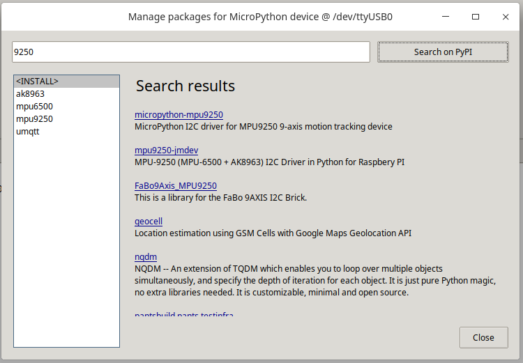
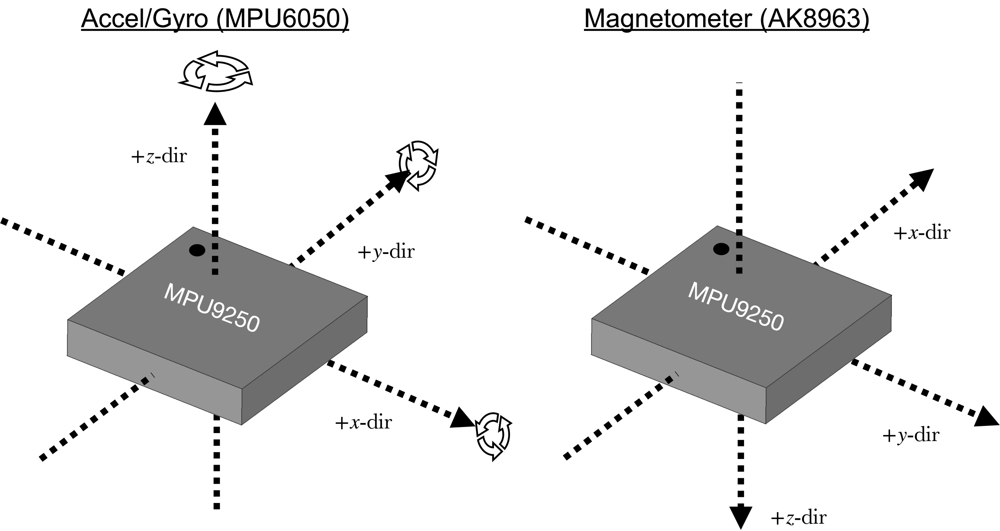
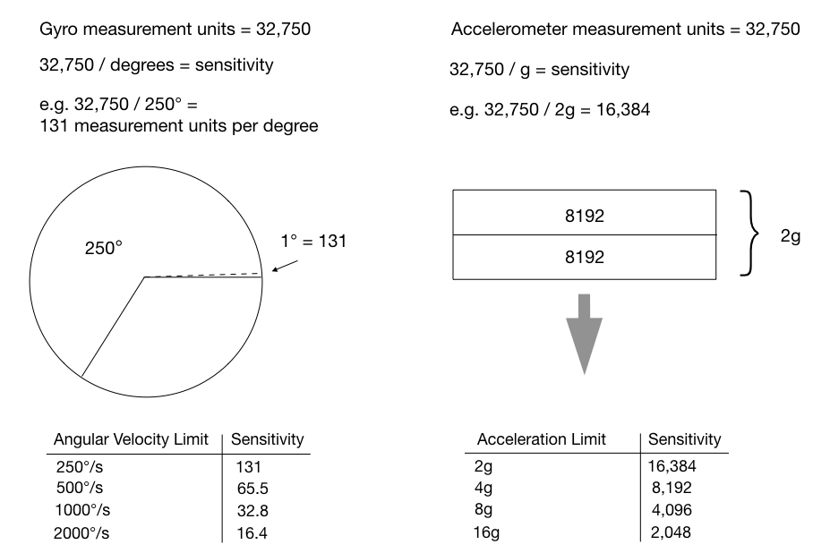

## MicroPython MPU-9250 (MPU-6500 + AK8963)


[現有的代碼庫 MPU-9250](https://github.com/tuupola/micropython-mpu9250)



## MPU9250 是兩個集成電路(MPU-6500 + AK8963)的組合



## x, y 和 z 軸的關係變量值的說明


## 三軸加速度計 ( $ A_{\theta}, A_{\phi}, M_{\varphi} $ )

### 繞 X 軸旋轉角度 $ A_{\theta} $ = roll	

$$ A_{\theta}=\arctan\left(\frac{A_{y}}{A_{z}}\right) $$

### 繞 Y 軸旋轉角度 $ A_{\phi} $ = pitch 

$$ A_{\phi}=\arctan\left(\frac{-A_{x}}{\sqrt{A_{y}^2+A_{z}^2}}\right) $$ 

 - $ A_{x}, A_{y}, A_{y} $ 是三軸加速度計測量的 x, y 和 z 軸加速度變化 

## 用三軸加速度計及三軸磁力計估計偏航 *yaw*

### 繞 Z 軸旋轉角度 $ M_{\varphi} $ = yaw

$$ A_{norm}=\sqrt{A_{x}^2 + A_{y}^2 + A_{z}^2 } $$

$$ \phi=-\arcsin\left(\frac{A_{x}}{A_{norm}}\right) $$

$$ \theta=\arcsin\left(\frac{A_{Y}}{\cos(\phi)\times{A_{norm}}}\right) $$

$$ M_{norm}=\sqrt{mag_{x}^2 + mag_{y}^2 + mag_{z}^2 } $$

$$ m_{x}=\frac{mag_{x}}{M_{norm}} $$ 

$$ m_{y}=\frac{-mag_{y}}{M_{norm}} $$

$$ m_{z}=\frac{mag_{z}}{M_{norm}} $$

$$ M_{x}=m_{x}\times\cos(\phi)+m_{z}\times\sin(\phi) $$

$$ M_{y}=m_{x}\times\sin(\theta)\times\sin(\phi)+m_{y}\times\cos(\theta)-m_{z}\sin(\theta)\times\cos(\phi) $$

$$ M{\varphi}=\arctan\left(\frac{M_{y}}{M_{x}}\right) $$

 - $ mag_{x}, mag_{y}, mag_{z} $ 是三軸磁力計測量的 x, y 和 z 軸磁場強度變化

## 三軸陀螺儀 ( $ G_{\theta}, G_{\phi}, G_{\varphi} $ )

$$ G_{\theta}=w_{x}\times\delta(t) $$

$$ G_{\phi}=w_{y}\times\delta(t) $$

$$ G_{\varphi}=w_{z}\times\delta(t) $$


對三軸加速度計輸入值( $ A_{\theta}, A_{\phi}, M_{\varphi} $ )和三軸陀螺儀( $ G_{\theta}, G_{\phi}, G_{\varphi} $ )使用卡爾曼濾波器計算( $ \theta, \phi, \varphi $ )

 
main.py - 處理最小功能的示例 

```python
from machine import I2C, Pin, Timer
from mpu9250 import MPU9250
from ak8963 import AK8963
import math
from d3d import D3D

i2c = I2C(scl=Pin(22), sda=Pin(21))
dummy = MPU9250(i2c) # this opens the bybass to access to the AK8963

# Code for Calibration
print("Waiting for Calibration")
ak8963 = AK8963(i2c)

#offset, scale = ak8963.calibrate(count=256, delay=200)
#print("Calibration completed.")

# sensor = MPU9250(i2c, ak8963=ak8963)
# print("{}:{}".format(offset, scale))
ak8963 = AK8963(i2c, offset=(44.3584, -10.05469, -24.70254), scale=(0.9937236, 0.9021546, 1.129655))

sensor = MPU9250(i2c, ak8963=ak8963)
flag = False

def sw():
    #print("---{}".format(flag))
    return flag

def getmag():                               # Return (x, y, z) tuple (blocking read)
#    print(sensor.magnetic)
    return sensor.magnetic

def read_sensor(timer):
#  radAngXYZ = d3x.getAngleXYZ(sensor.acceleration, sensor.magnetic)
#  print("Basic:{}".format(d3x.rad2Deg(radAngXYZ)))
#   print("roll:{}, pitch:{}, yaw:{}".format(roll, pitch, yaw))
#   d2R = d3x.deg2Rad([roll, pitch, yaw])
#   print(d2R)
#   print(radAngXYZ)
#   qr = d3x.euler_to_quaternion(radAngXYZ)
#   print(qr)
#   qe = d3x.quaternion_to_euler(qr)
#   print(qe)
#   print(d3x.quaternion_to_matrix(qr))
#  print("deg:{}".format(sensor.gyro))
  print(d3x.update(sensor.acceleration, d3x.rad2Deg(sensor.gyro) , sensor.magnetic))

def setStop(timer):
    global flag
    print("Stop")
    flag = True 

print("MPU9250 id: " + hex(sensor.whoami))
print("\n")
d3x = D3D()
tim = Timer(1)
tim.init(period=10000, mode=Timer.ONE_SHOT, callback=setStop)

d3x.calibrate(getmag, sw)
print("bias:{}".format(d3x.magbias))
timer_0 = Timer(0)
timer_0.init(period=1000, mode=Timer.PERIODIC, callback=read_sensor)

```    


D3D.py 處理 *3D* 計算代碼

```python
import math
try:
    import utime as time
except ImportError:
    import time

from math import sqrt, atan2, asin, degrees, radians
from deltat import DeltaT

class D3D:

  def __init__(self, timediff=None):
    self.factor = 180 / math.pi
    self.magbias = (0, 0, 0)          
    self.deltat = DeltaT(timediff)    
    self.q = [1.0, 0.0, 0.0, 0.0]     
    GyroMeasError = radians(40)       
    self.beta = sqrt(3.0 / 4.0) * GyroMeasError
    self.pitch = 0
    self.heading = 0
    self.roll = 0
    self.declination = 0 

  def getAngleXYZ(self, acceleration, magnetic):
    x, y, z = acceleration
    magX, magY, magZ = magnetic
    pitch = math.atan(x / math.sqrt((y * y) + (z * z)));
    roll = math.atan(y / math.sqrt((x * x) + (z * z)));
    yaw = math.atan(z / math.sqrt((x * x) + (y * y)));
    Xh = (magX * math.cos(pitch)) + (magY * math.sin(roll) * math.sin(pitch)) + (magZ * math.cos(roll) * math.sin(pitch));
    Yh = (magY * math.cos(roll)) - (magZ * math.sin(roll));
    yaw = math.atan2(-Yh, Xh);
    return (roll, pitch, yaw)

  def rad2Deg(self, xyz):
      roll = xyz[0] * self.factor
      pitch = xyz[1] * self.factor
      yaw= xyz[2] * self.factor
      return (roll, pitch, yaw)
      
  def deg2Rad(self, xyz):
      roll = xyz[0] / self.factor
      pitch = xyz[1] / self.factor
      yaw= xyz[2] / self.factor
      return (roll, pitch, yaw)      

  def euler_to_quaternion(self,r):
    (roll, pitch, yaw) = (r[0], r[1], r[2])
    qx = math.sin(roll/2) * math.cos(pitch/2) * math.cos(yaw/2) - math.cos(roll/2) * math.sin(pitch/2) * math.sin(yaw/2)
    qy = math.cos(roll/2) * math.sin(pitch/2) * math.cos(yaw/2) + math.sin(roll/2) * math.cos(pitch/2) * math.sin(yaw/2)
    qz = math.cos(roll/2) * math.cos(pitch/2) * math.sin(yaw/2) - math.sin(roll/2) * math.sin(pitch/2) * math.cos(yaw/2)
    qw = math.cos(roll/2) * math.cos(pitch/2) * math.cos(yaw/2) + math.sin(roll/2) * math.sin(pitch/2) * math.sin(yaw/2)
    return [qx, qy, qz, qw]

  def quaternion_to_euler(self, q):
    (x, y, z, w) = (q[0], q[1], q[2], q[3])
    t0 = +2.0 * (w * x + y * z)
    t1 = +1.0 - 2.0 * (x * x + y * y)
    roll = math.atan2(t0, t1)
    t2 = +2.0 * (w * y - z * x)
    t2 = +1.0 if t2 > +1.0 else t2
    t2 = -1.0 if t2 < -1.0 else t2
    pitch = math.asin(t2)
    t3 = +2.0 * (w * z + x * y)
    t4 = +1.0 - 2.0 * (y * y + z * z)
    yaw = math.atan2(t3, t4)
    return [roll, pitch, yaw]

  def quaternion_to_matrix(self, Q):

    q0 = Q[0]
    q1 = Q[1]
    q2 = Q[2]
    q3 = Q[3]
    # First row of the rotation matrix
    r00 = 2 * (q0 * q0 + q1 * q1) - 1
    r01 = 2 * (q1 * q2 - q0 * q3)
    r02 = 2 * (q1 * q3 + q0 * q2)
    # Second row of the rotation matrix
    r10 = 2 * (q1 * q2 + q0 * q3)
    r11 = 2 * (q0 * q0 + q2 * q2) - 1
    r12 = 2 * (q2 * q3 - q0 * q1)
    # Third row of the rotation matrix
    r20 = 2 * (q1 * q3 - q0 * q2)
    r21 = 2 * (q2 * q3 + q0 * q1)
    r22 = 2 * (q0 * q0 + q3 * q3) - 1
    # 3x3 rotation matrix
    rot_matrix = [[r00, r01, r02],
                  [r10, r11, r12],
                  [r20, r21, r22]]
                            
    return rot_matrix

  def quaternion_multiply(Q0,Q1):
    # Extract the values from Q0
    w0 = Q0[0]
    x0 = Q0[1]
    y0 = Q0[2]
    z0 = Q0[3]
    # Extract the values from Q1
    w1 = Q1[0]
    x1 = Q1[1]
    y1 = Q1[2]
    z1 = Q1[3]
    # Computer the product of the two quaternions, term by term
    Q0Q1_w = w0 * w1 - x0 * x1 - y0 * y1 - z0 * z1
    Q0Q1_x = w0 * x1 + x0 * w1 + y0 * z1 - z0 * y1
    Q0Q1_y = w0 * y1 - x0 * z1 + y0 * w1 + z0 * x1
    Q0Q1_z = w0 * z1 + x0 * y1 - y0 * x1 + z0 * w1
    # Create a 4 element array containing the final quaternion
    final_quaternion = [Q0Q1_w, Q0Q1_x, Q0Q1_y, Q0Q1_z]
    # Return a 4 element array containing the final quaternion (q02,q12,q22,q32) 
    return final_quaternion

  def calibrate(self, getxyz, stopfunc, wait=0):
    magmax = list(getxyz())             
    magmin = magmax[:]
    while not stopfunc():
        if wait != 0:
            if callable(wait):
                wait()
            else:
                time.sleep(wait/1000)  # Portable
        magxyz = tuple(getxyz())
        for x in range(3):
          magmax[x] = max(magmax[x], magxyz[x])
          magmin[x] = min(magmin[x], magxyz[x])
    self.magbias = tuple(map(lambda a, b: (a +b)/2, magmin, magmax))

  def update(self, accel, gyro, mag, ts=None):     # 3-tuples (x, y, z) for accel, gyro and mag data
    mx, my, mz = (mag[x] - self.magbias[x] for x in range(3)) # Units irrelevant (normalised)
    ax, ay, az = accel                  # Units irrelevant (normalised)
    gx, gy, gz = (radians(x) for x in gyro)  # Units deg/s
    q1, q2, q3, q4 = (self.q[x] for x in range(4))   # short name local variable for readability
    # Auxiliary variables to avoid repeated arithmetic
    _2q1 = 2 * q1
    _2q2 = 2 * q2
    _2q3 = 2 * q3
    _2q4 = 2 * q4
    _2q1q3 = 2 * q1 * q3
    _2q3q4 = 2 * q3 * q4
    q1q1 = q1 * q1
    q1q2 = q1 * q2
    q1q3 = q1 * q3
    q1q4 = q1 * q4
    q2q2 = q2 * q2
    q2q3 = q2 * q3
    q2q4 = q2 * q4
    q3q3 = q3 * q3
    q3q4 = q3 * q4
    q4q4 = q4 * q4

    # Normalise accelerometer measurement
    norm = sqrt(ax * ax + ay * ay + az * az)
    if (norm == 0):
        return # handle NaN
    norm = 1 / norm                     # use reciprocal for division
    ax *= norm
    ay *= norm
    az *= norm

    # Normalise magnetometer measurement
    norm = sqrt(mx * mx + my * my + mz * mz)
    if (norm == 0):
        return                          # handle NaN
    norm = 1 / norm                     # use reciprocal for division
    mx *= norm
    my *= norm
    mz *= norm

    # Reference direction of Earth's magnetic field
    _2q1mx = 2 * q1 * mx
    _2q1my = 2 * q1 * my
    _2q1mz = 2 * q1 * mz
    _2q2mx = 2 * q2 * mx
    hx = mx * q1q1 - _2q1my * q4 + _2q1mz * q3 + mx * q2q2 + _2q2 * my * q3 + _2q2 * mz * q4 - mx * q3q3 - mx * q4q4
    hy = _2q1mx * q4 + my * q1q1 - _2q1mz * q2 + _2q2mx * q3 - my * q2q2 + my * q3q3 + _2q3 * mz * q4 - my * q4q4
    _2bx = sqrt(hx * hx + hy * hy)
    _2bz = -_2q1mx * q3 + _2q1my * q2 + mz * q1q1 + _2q2mx * q4 - mz * q2q2 + _2q3 * my * q4 - mz * q3q3 + mz * q4q4
    _4bx = 2 * _2bx
    _4bz = 2 * _2bz

    # Gradient descent algorithm corrective step
    s1 = (-_2q3 * (2 * q2q4 - _2q1q3 - ax) + _2q2 * (2 * q1q2 + _2q3q4 - ay) - _2bz * q3 * (_2bx * (0.5 - q3q3 - q4q4)
         + _2bz * (q2q4 - q1q3) - mx) + (-_2bx * q4 + _2bz * q2) * (_2bx * (q2q3 - q1q4) + _2bz * (q1q2 + q3q4) - my)
         + _2bx * q3 * (_2bx * (q1q3 + q2q4) + _2bz * (0.5 - q2q2 - q3q3) - mz))

    s2 = (_2q4 * (2 * q2q4 - _2q1q3 - ax) + _2q1 * (2 * q1q2 + _2q3q4 - ay) - 4 * q2 * (1 - 2 * q2q2 - 2 * q3q3 - az)
         + _2bz * q4 * (_2bx * (0.5 - q3q3 - q4q4) + _2bz * (q2q4 - q1q3) - mx) + (_2bx * q3 + _2bz * q1) * (_2bx * (q2q3 - q1q4)
         + _2bz * (q1q2 + q3q4) - my) + (_2bx * q4 - _4bz * q2) * (_2bx * (q1q3 + q2q4) + _2bz * (0.5 - q2q2 - q3q3) - mz))

    s3 = (-_2q1 * (2 * q2q4 - _2q1q3 - ax) + _2q4 * (2 * q1q2 + _2q3q4 - ay) - 4 * q3 * (1 - 2 * q2q2 - 2 * q3q3 - az)
         + (-_4bx * q3 - _2bz * q1) * (_2bx * (0.5 - q3q3 - q4q4) + _2bz * (q2q4 - q1q3) - mx)
         + (_2bx * q2 + _2bz * q4) * (_2bx * (q2q3 - q1q4) + _2bz * (q1q2 + q3q4) - my)
         + (_2bx * q1 - _4bz * q3) * (_2bx * (q1q3 + q2q4) + _2bz * (0.5 - q2q2 - q3q3) - mz))

    s4 = (_2q2 * (2 * q2q4 - _2q1q3 - ax) + _2q3 * (2 * q1q2 + _2q3q4 - ay) + (-_4bx * q4 + _2bz * q2) * (_2bx * (0.5 - q3q3 - q4q4)
          + _2bz * (q2q4 - q1q3) - mx) + (-_2bx * q1 + _2bz * q3) * (_2bx * (q2q3 - q1q4) + _2bz * (q1q2 + q3q4) - my)
          + _2bx * q2 * (_2bx * (q1q3 + q2q4) + _2bz * (0.5 - q2q2 - q3q3) - mz))

    norm = 1 / sqrt(s1 * s1 + s2 * s2 + s3 * s3 + s4 * s4)    # normalise step magnitude
    s1 *= norm
    s2 *= norm
    s3 *= norm
    s4 *= norm

    # Compute rate of change of quaternion
    qDot1 = 0.5 * (-q2 * gx - q3 * gy - q4 * gz) - self.beta * s1
    qDot2 = 0.5 * (q1 * gx + q3 * gz - q4 * gy) - self.beta * s2
    qDot3 = 0.5 * (q1 * gy - q2 * gz + q4 * gx) - self.beta * s3
    qDot4 = 0.5 * (q1 * gz + q2 * gy - q3 * gx) - self.beta * s4

    # Integrate to yield quaternion
    deltat = self.deltat(ts)
    q1 += qDot1 * deltat
    q2 += qDot2 * deltat
    q3 += qDot3 * deltat
    q4 += qDot4 * deltat
    norm = 1 / sqrt(q1 * q1 + q2 * q2 + q3 * q3 + q4 * q4)    # normalise quaternion
    self.q = q1 * norm, q2 * norm, q3 * norm, q4 * norm
    yaw = self.declination + degrees(atan2(2.0 * (self.q[1] * self.q[2] + self.q[0] * self.q[3]),
        self.q[0] * self.q[0] + self.q[1] * self.q[1] - self.q[2] * self.q[2] - self.q[3] * self.q[3]))
    pitch = degrees(-asin(2.0 * (self.q[1] * self.q[3] - self.q[0] * self.q[2])))
    roll = degrees(atan2(2.0 * (self.q[0] * self.q[1] + self.q[2] * self.q[3]),
        self.q[0] * self.q[0] - self.q[1] * self.q[1] - self.q[2] * self.q[2] + self.q[3] * self.q[3]))
    return (roll, pitch, yaw)

```

[現有的代碼庫 MPU-9250 帶補償係數](https://github.com/micropython-IMU/micropython-fusion)

[MPU-9250 調教準參數計算原理](https://github.com/alrevuelta/sensor-calibration)

## 調校方法簡介

### 三軸陀螺儀

繞 *X*, *Y* 和 *Z* 三個座標軸旋轉的角速度分量 $ GYR_{X} $ , $ GYR_{Y} $ 和 $ GYR_{Z} $ 均為16位有符號整數。 從原點向旋轉軸方向看去，取正值時為順時針旋轉，取負值時為逆時針旋轉。

三個角速度分量以 **度/秒** 為單位，能夠表示的角速度範圍，即倍率可統一設定，有4個可選倍率：250度/秒, 500度/秒, 1000度/秒, 2000度/秒。 以 $ GYR_{X} $ 為例，若倍率設定為250度/秒，則意味著GYR取正最大值32768時，當前角速度為順時針250度/秒；若設定為500度/秒，取32768時表示當前角速度為順時針500度/秒。顯然，倍率越低精度越好，倍率越高表示的範圍越大。倍率默認設定為250度/秒。 只需將不同倍率對應的標誌寫入對應寄存器即可修改。
  
$$ g_{x}=\frac{1000\times{GYR_{X}}}{32768} $$ 

### 三軸加速度計

加速度計的三軸分量 $ ACC_{X} $ , $ ACC_{Y} $ 和 $ ACC_{Z} $ 均為16位有符號整數，分別表示器件在三個軸向上的加速度，取負值時加速度沿座標軸負向，取正值時沿正向。

三個加速度分量均以重力加速度 *g* 的倍數為單位，能夠表示的加速度範圍，即倍率可以統一設定，有4個可選倍率：2g, 4g, 8g, 16g。 只需將不同倍率對應的標誌寫入對應寄存器即可修改。 倍率默認設定為2g，以 $ ACC_{X} $ 為例，在倍率為2g的時候，$ ACC_{X} $ 的最小值為-32768，最大值為32768。 當 $ ACC_{X} $ 為32768時，當前加速度為沿 **X** 軸正方向2倍的重力加速度。

加速度计算公式如图所示：

$$ a_{x}=\frac{2\times{g}\times{ACC_{X}}}{32768} $$



### 校準芯片數據

芯片的數據夾雜有噪音，在芯片處理靜止狀態時數據擺動都可能超過 2% 。 除了噪音，各項數據還會有偏移的現象，也就是說數據並不是圍繞靜止工作點擺動，因此要先對數據偏移進行校準 ，再通過濾波算法消除噪音。  
   


### 三軸陀螺儀

三軸陀螺儀校準是比較簡單的工作，我們只需要找出擺動的數據圍繞的中心點即可。 我們以 $ GYR_{X} $ 為例，在芯片處理靜止狀態時，這個讀數理論上講應當為 **0**但它往往會存在偏移量，取一組校準值的均值進行計算偏移量，每次的讀數都減去偏移量就可以得到校准後的讀數了。 當然這個偏移量只是估計值，比較準確的偏移量要對大量的數據進行統計才能獲知，數據量越大越準，但統計的時間也就越慢。 一般校準可以在每次啟動系統時進行。


### 三軸加速度計

三軸加速度計分量就不能這樣簡單的完成了，因為芯片靜止時的加速度並不為 **0**。

加速度值的偏移來自兩個方面，
 - 芯片的測量精度，導至它測得的加速度向量並不垂直於大地稱為讀數偏移；
 - 芯片在整個系統上安裝的精度是有限的，系統與芯片的座標系很難達到完美重合稱為角度偏移。 
因為讀數和角度之間是非線性關係，所以要想以高精度進行校準必須先單獨校準讀數偏移，再把芯片固定在系統中後校準角度偏移。然而，由於校準角度偏移需要專業設備且對於一般應用來說，兩步校準帶來的精度提升並不大，因此通常只進行讀數校準即可。

為了盡量避免讀數偏移帶來的影響，首先將開發板牢牢地固定在系統中，並使二者座標系盡可能的重合。
此時，我們認為芯片的 $ ACC_{X} $ 和 $ ACC_{Y} $ 的理論值應為 **0**，$ ACC_{Z} $ 的理論值應為-16384（默認2g的倍率）。
由於 $ ACC_{X} $ 和 $ ACC_{Y} $ 的理論值應為0，與角速度量的校準類似，這兩個讀數偏移量可用統計均值的方式校準。  $ ACC_{Z} $ 則需要多一步處理，即在統計偏移量的過程中，每次讀數都要加上16384，再進行統計均值校準。

$$ \tan\phi_{xyz} = \frac{G_{py}}{G_{pz}} $$


