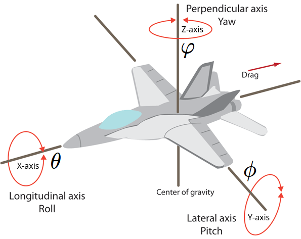

## MicroPython MPU-9250 (MPU-6500 + AK8963)


[現有的代碼庫 MPU-9250](https://github.com/tuupola/micropython-mpu9250)


## MPU9250 是兩個集成電路(MPU-6500 + AK8963)的組合


## x, y 和 z 軸的關係變量值的說明




## 上述代碼庫中的默認值如下

三軸加速度計 $ m/s^2 $ , 三軸磁力計 $ μT $ , 三軸陀螺儀 $ rad/s $ 

## 校準芯片數據方法簡介

芯片的數據夾雜有噪音，在芯片處理靜止狀態時數據擺動都可能超過 2% 。 除了噪音，各項數據還會有偏移的現象，也就是說數據並不是圍繞靜止工作點擺動，因此要先對數據偏移進行校準 ，再通過濾波算法消除噪音。  

[MPU-9250 調教準參數計算原理](https://github.com/alrevuelta/sensor-calibration)

## 三軸加速度計 ( $ A_{\theta} $ , $ A_{\phi} $ , $ M_{\varphi} $ )

加速度計的三軸分量 $ ACC_{X} $ , $ ACC_{Y} $ 和 $ ACC_{Z} $ 均為16位有符號整數，分別表示器件在三個軸向上的加速度，取負值時加速度沿座標軸負向，取正值時沿正向。

三個加速度分量均以重力加速度 *g* 的倍數為單位，能夠表示的加速度範圍，即倍率可以統一設定，有4個可選倍率：2g, 4g, 8g, 16g。 只需將不同倍率對應的標誌寫入對應寄存器即可修改。 倍率默認設定為2g，以 $ ACC_{X} $ 為例，在倍率為2g的時候，$ ACC_{X} $ 的最小值為-32768，最大值為32768。 當 $ ACC_{X} $ 為32768時，當前加速度為沿 **X** 軸正方向2倍的重力加速度。

加速度计算公式如图所示： 

$$ A_{x}=\frac{2\times{g}\times{ACC_{X}}}{32768} $$

---


---

### 繞 X 軸旋轉角度 $ A_{\theta} $ = roll	

$$ A_{\theta}=\arctan\left(\frac{A_{y}}{A_{z}}\right) $$

### 繞 Y 軸旋轉角度 $ A_{\phi} $ = pitch 

$$ A_{\phi}=\arctan\left(\frac{-A_{x}}{\sqrt{A_{y}^2+A_{z}^2}}\right) $$ 


 - $ A_{x}, A_{y}, A_{y} $ 是三軸加速度計測量的 x, y 和 z 軸加速度變化 

为方便计算。以下公式简化为

- 绕IMU的 X 轴旋转：横滚角 row $ \theta $ ， 转动 r 角度
- 绕IMU的 Y 轴旋转：俯仰角 pitch $ \phi $，转动 p 角度
- 绕IMU的 Z 轴旋转：航向角 yaw $ \varphi $， 转动 y 角度

陀螺仪解算姿态角公式：


计数部分省略，最终公式如下:


姿态融合：

由上面的分析可知，加速度计在静止时刻，根据感受到的重力加速度，可以计算出 roll 和 pitch 角，并且角度计算只与当前姿态有关。而陀螺仪是对时间间隔内的角速度积分，得到每一次的角度变换量，累加到上一次的姿态角上，得到新的姿态角，陀螺仪可以计算 roll、pitch、yaw 三个角。

实际上，加速度仅在静止时刻可以得到较准确的姿态，而陀螺仪仅对转动时的姿态变化敏感，且陀螺仪若本身存在误差，则经过连续的时间积分，误差会不断增大。因此，需要结合两者计算的姿态，进行互补融合。当然，这里只能对 roll 和 pitch 融合，因为加速度计没有得到 yaw。


K 为比例系数，需要根据实际来调整，如选用 0.4。

註：解这个方程，可以得到 roll 和 pitch 角（由于绕 Z 旋转时，感受到的重力加速度是不变的，因此加速度计无法计算 yaw 角）

## 四元数


## 用三軸加速度計及三軸磁力計估計偏航 *yaw*

三軸加速度計分量就不能這樣簡單的完成了，因為芯片靜止時的加速度並不為 **0**。

加速度值的偏移來自兩個方面，
 - 芯片的測量精度，導至它測得的加速度向量並不垂直於大地稱為讀數偏移；
 - 芯片在整個系統上安裝的精度是有限的，系統與芯片的座標系很難達到完美重合稱為角度偏移。 
因為讀數和角度之間是非線性關係，所以要想以高精度進行校準必須先單獨校準讀數偏移，再把芯片固定在系統中後校準角度偏移。然而，由於校準角度偏移需要專業設備且對於一般應用來說，兩步校準帶來的精度提升並不大，因此通常只進行讀數校準即可。

為了盡量避免讀數偏移帶來的影響，首先將開發板牢牢地固定在系統中，並使二者座標系盡可能的重合。
此時，我們認為芯片的 $ ACC_{X} $ 和 $ ACC_{Y} $ 的理論值應為 **0**，$ ACC_{Z} $ 的理論值應為-16384（默認2g的倍率）。
由於 $ ACC_{X} $ 和 $ ACC_{Y} $ 的理論值應為0，與角速度量的校準類似，這兩個讀數偏移量可用統計均值的方式校準。  $ ACC_{Z} $ 則需要多一步處理，即在統計偏移量的過程中，每次讀數都要加上16384，再進行統計均值校準。

$$ \varphi_{xyz} = \arctan\left(\frac{h_{y}}{h_{x}}\right)\pm{D} $$

 - D 是地理北與水平分量之間的偏角

[網上文章關於在磁域中完成三軸磁力計校準](https://www.hindawi.com/journals/js/2010/967245/)

---

### 計算 X 及 Y 軸旋轉角度 $ \phi, \theta $ = pitch, roll

$$ A_{norm}=\sqrt{A_{x}^2 + A_{y}^2 + A_{z}^2 } $$

$$ A_{\phi}=\phi=-\arcsin\left(\frac{A_{x}}{A_{norm}}\right) $$

$$ A_{\theta}=\theta=\arcsin\left(\frac{A_{y}}{\cos(\phi)\times{A_{norm}}}\right) $$

### 繞 Z 軸旋轉角度 $ M_{\varphi} $ = yaw

地球磁場 $ M_{norm} $ :

$$ M_{norm}=\sqrt{mag_{x}^2 + mag_{y}^2 + mag_{z}^2 } $$

$$ m_{x}=\frac{mag_{x}}{M_{norm}} $$ 

$$ m_{y}=\frac{mag_{y}}{M_{norm}} $$

$$ m_{z}=\frac{mag_{z}}{M_{norm}} $$

 - $ mag_{x}, mag_{y}, mag_{z} $ 是三軸磁力計測量的 x, y 和 z 軸磁場強度變化

$$ M_{x}=m_{x}\times\cos(\phi)+m_{z}\times\sin(\phi) $$

$$ M_{y}=m_{x}\times\sin(\theta)\times\sin(\phi)+m_{y}\times\cos(\theta)-m_{z}\sin(\theta)\times\cos(\phi) $$

$$ M_{z}=-m_{x}\times\cos(\theta)\times\sin(\phi)+m_{y}\times\sin(\theta)+m_{z}\cos(\theta)\times\cos(\phi) $$

如果公式計算正確則 $ \sqrt{M_{x}^2 + M_{y}^2 + M_{z}^2 }=1$ ，這可用作確定程式有否出錯。

### 以上公式 (4) 仍不能計算出正確數值，原因如下：
---
 - 因每當 $ \arctan $ 在計算中會有 $ M_{x}=0 $ 及不同角象限問題，公式就會出錯，所以使用 $ atan2 $

當 $ M_{y}\geq{0} $ 即<font color="#FF0010">0</font>至<font color="#FF0010">180</font>度如下:

$$ M{\varphi}=\arctan\left(\frac{M_{y}}{M_{x}}\right)=atan2(M_{y}, M_{x}) $$


當 $ M_{y}<{0} $ 即<font color="#FF0010">180</font>至<font color="#FF0010">360</font>度如下

$$ M{\varphi}=2\pi+\arctan\left(\frac{M_{y}}{M_{x}}\right) = 2\pi+atan2(M_{y}, M_{x}) $$

<font color="#FF0010">注意事項</font>
 - 因在計算時精確度問題，會嚴重影響計算時的準確性。而 **MicroPython** 的變數準確度要自己設定以避免計算上自動設定數據類型的誤差。
 - 在校準 **yaw** 時，要儘量旋轉測量模塊。以獲取更多樣化的數據。從而在計算補償值時能更準確。（使用其它設備輔助校準方法，或將其旋轉一整圈以確定完整的磁場強度數值）。
 - 首先需要校準。然後使用 X、Y 和 Z 讀數來計算“北”相對於現在指向的任何方式的位置（請記住，“北”根據您所在的位置而變化多達 30 度（稱為 磁偏角），所以要計算準確真實數值其實是不可能的。但實際上大多數應用程序只需要一個相對角度。請注意強磁鐵（例如所有現代電機中的磁鐵）會嚴重干擾遠距離（甚至3米或更遠）。

## 三軸陀螺儀 ( $ G_{\theta}, G_{\phi}, G_{\varphi} $ )

繞 *X*, *Y* 和 *Z* 三個座標軸旋轉的角速度分量 $ GYR_{X} $ , $ GYR_{Y} $ 和 $ GYR_{Z} $ 均為16位有符號整數。 從原點向旋轉軸方向看去，取正值時為順時針旋轉，取負值時為逆時針旋轉。

三個角速度分量以 **度/秒** 為單位，能夠表示的角速度範圍，即倍率可統一設定，有4個可選倍率：250度/秒, 500度/秒, 1000度/秒, 2000度/秒。 以 $ GYR_{X} $ 為例，若倍率設定為250度/秒，則意味著GYR取正最大值32768時，當前角速度為順時針250度/秒；若設定為500度/秒，取32768時表示當前角速度為順時針500度/秒。顯然，倍率越低精度越好，倍率越高表示的範圍越大。倍率默認設定為250度/秒。 只需將不同倍率對應的標誌寫入對應寄存器即可修改。

三軸陀螺儀校準是比較簡單的工作，我們只需要找出擺動的數據圍繞的中心點即可。 我們以 $ GYR_{X} $ 為例，在芯片處理靜止狀態時，這個讀數理論上講應當為 **0**但它往往會存在偏移量，取一組校準值的均值進行計算偏移量，每次的讀數都減去偏移量就可以得到校准後的讀數了。 當然這個偏移量只是估計值，比較準確的偏移量要對大量的數據進行統計才能獲知，數據量越大越準，但統計的時間也就越慢。 一般校準可以在每次啟動系統時進行。
  
$$ w_{x}=\frac{1000\times{GYR_{X}}}{32768} $$ 

---

$$ G_{\theta}=w_{x}\times\delta(t) $$

$$ G_{\phi}=w_{y}\times\delta(t) $$

$$ G_{\varphi}=w_{z}\times\delta(t) $$

---

對三軸加速度計輸入值( $ A_{\theta}, A_{\phi}, M_{\varphi} $ )和三軸陀螺儀( $ G_{\theta}, G_{\phi}, G_{\varphi} $ )使用卡爾曼濾波器計算找出( $ \theta, \phi, \varphi $ )


## 三种基本滤波方法

- 互补滤波器
- 卡尔曼滤波器（具有常数矩阵）
- Mahony&Madgwick 滤波器

注：Madgwick 的方案在某些方面与 Mahony 的方案有显著不同，但与 Mahony 的方案共享反馈回路理念。此外，Madgwick 还提供了 Mahony 滤波器的 C 代码非常有用。


讨论方法，其中

- 不估计陀螺仪偏差
- 包括陀螺仪偏差估计
- 考虑三轴
- 评估了一些近似值和改进

1. 准备工作

姿态估计任务相当于计算评估物体旋转的运动方程

$$


$$


## 卡爾曼濾波器計算

卡尔曼滤波算法是一组数学方程，它提供了一种计算效率高的方法，通过检测到的测量值来估计一些未知变量。卡尔曼滤波器通过监测当前输入数据、先前输入数据和先前状态预测，操作递归函数来预测线性问题的当前状态。

卡尔曼滤波器基于递归贝叶斯滤波。因此系统的噪声被假定为高斯噪声。卡尔曼滤波器通常适用于线性系统。如用於非线性系统设计的卡尔曼滤波器的扩展，称为扩展卡尔曼滤波器 (EKF)。

- 加速度计特别容易受到振动和向心力的影响，这些可以通过低通滤波器（充当移动平均滤波器）进行过滤。
- 陀螺仪在短期内是精确的，但由于漂移，积分很快就会失去精度。因此，需要一个允许短期陀螺仪数据的高通滤波器，从而消除长期漂移。

在任何给定时刻，信号都会受到低通滤波器或高通滤波器的影响，其中 $x_t $是来自传感器的测量值，$ y_t $
是经过滤波的最终输出，$\alpha$  是滤波器系数：

低通滤波器公式：

$$
y_t = (1-\alpha)x_t + \alpha y_{t-1}
$$

高通滤波器公式：

$$
y_t = (1-\alpha)y_{t-1} + (1-\alpha) (x_t - x_{t-1})
$$

滤波器系数 $\alpha$ 描述了陀螺仪测量结束和加速度计读数开始的边界，反之亦然。它决定了输出在多大程度上依赖于当前读数或到达的新值。根据上述定义，$\alpha$ 通常高于 <font color="#FF0010">0.5</font>。滤波器系数 $\alpha$ 确定：

$$
\alpha = \frac {\tau} {\tau - \Delta t}
$$

其中 $\tau$ 是所需时间常数，即读数响应的时间间隔。$\Delta t$ 是采样周期。

互补滤波器的数学模型可表示为如下公式，其中 $\theta t$ 表示当前方向，$\alpha$ 为滤波器系数，$\omega$ 为陀螺仪的角速度，$a$ 为从加速度计获得的加速度：

$$
\theta_t = (1-\alpha) (\theta_{t-1} + \omega \Delta t) + \alpha a
$$

然而，互补滤波器对于噪声或有偏差的数据并不是特别稳健，因它只是使用当前可用的信息，没有直接补偿传感器噪声的方法。互补滤波器的常规应用是将垂直加速度和气压读数的测量结果结合起来，以获得垂直速度的近似值。与卡尔曼滤波器类似，而互补滤波器原理的新版本，如扩展互补滤波器 (ECF)。它们保证了高水平的准确性和增强的抗噪声能力，同时保持了计算效率。

[卡爾曼濾波器計算原理](https://hkdickyko.github.io/%E7%B7%A8%E7%A8%8B/Kalman-Filter)
 
 
## 電路排線連接圖 


 
main.py - 處理最小功能的示例 

```python
import math
from machine import I2C, Pin, Timer
from lib.mpu9250 import MPU9250
from lib.mpu6500 import MPU6500
from lib.ak8963 import AK8963
from tools.d3d import D3D, Kalman

try:
    import utime as time
except ImportError:
    import time

tdelta = 200
i2c = I2C(scl=Pin(22), sda=Pin(21))

dummy = MPU9250(i2c)
ak8963 = AK8963(i2c)
mpu6500 = MPU6500(i2c)
print("Waiting for Calibration")
gyro_Offset = mpu6500.calibrate()
offset, scale = ak8963.calibrate(count=256, delay=tdelta)
mpu6500 = MPU6500(i2c, gyro_offset=gyro_Offset)
ak8963 = AK8963(i2c, offset=offset, scale=scale)
sensor = MPU9250(i2c, mpu6500=mpu6500, ak8963=ak8963)
print("Calibration completed.")

def read_sensor(timer):
  global tStart
  roll, pitch, yaw, accurate = d3x.getAngleXYZ(sensor.acceleration, sensor.magnetic)
  roll, pitch, yaw = d3x.getDegrees((roll, pitch, yaw))
  Aroll = roll
  Apitch = pitch
  Ayaw = yaw

  tStop = time.ticks_ms()
  tElapse = (tStop - tStart) / 1000.0
  tStart = time.ticks_ms()
  x, y, z = sensor.gyro
  x, y, z = d3x.getDegrees((x, y, z))

  roll = kalman0.getAngle(roll, x, tElapse)
  pitch = kalman1.getAngle(pitch, y, tElapse)
  yaw = kalman2.getAngle(yaw, z, tElapse)
  print("{:8.2f}, {:8.2f}, {:8.2f}  :  {:8.2f} --- {:6.2f}, {:6.2f}, {:6.2f}".format(roll, pitch, yaw, Ayaw, roll-Aroll, pitch-Apitch, yaw-Ayaw))

print("MPU9250 id: " + hex(sensor.whoami) + "\n")
d3x = D3D()
kalman0 = Kalman()
kalman1 = Kalman()
kalman2 = Kalman()

roll, pitch, yaw, index = d3x.getAngleXYZ(sensor.acceleration, sensor.magnetic)
roll, pitch, yaw = d3x.getDegrees((roll, pitch, yaw))
kalman0.setAngle(roll)
kalman1.setAngle(pitch)
kalman2.setAngle(yaw)
tStart = time.ticks_ms()

timer_0 = Timer(0)
timer_0.init(period=tdelta*1, mode=Timer.PERIODIC, callback=read_sensor)

```    

d3d.py 處理 *3D* 計算代碼

```python
from math import sin, cos, asin, atan, atan2, sqrt, pi, degrees
import array

try:
    import utime as time
except ImportError:
    import time

class D3D:

  def __init__(self, timediff=None):
    pass

  def getAngleXYZ(self, acceleration, magnetic):
    AccX, AccY, AccZ = acceleration
    magX, magY, magZ = magnetic
    
    A_norm = float(sqrt(AccX * AccX + AccY * AccY + AccZ * AccZ))
    pitch = float(asin(-AccX/A_norm)) 
    roll = float(asin(AccY/(cos(pitch)*A_norm))) 
    yaw = float(0.0)
    
    M_norm = float(sqrt(magX * magX + magY * magY + magZ * magZ))
    m_x = float(magX / M_norm)
    m_y = float(magY / M_norm)
    m_z = float(magZ / M_norm)

    M_y = float((m_y*cos(roll))) + float((m_x*sin(roll)*sin(pitch))) - float((m_z*sin(roll)*cos(pitch)))
    M_x = float((m_x*cos(pitch)) + (m_z*sin(pitch)));
    M_z = float((-m_x*cos(roll)*sin(pitch))) + float((m_y*sin(roll))) + float((m_z*cos(roll)*cos(pitch)))

    accurate = float(sqrt(M_x*M_x + M_y*M_y + M_z*M_z))

    if M_y>=0.0:
       yaw = float(atan2(M_y, M_x))
       
    if M_y<0.0:
      yaw = 2*pi+float(atan2(M_y, M_x))
    
    return (roll, pitch, yaw, accurate)

  def getDegrees(self, xyz):
     x, y, z = xyz
     return degrees(x), degrees(y), degrees(z)

class Kalman:
    
  def __init__(self, timediff=None):
    self.q_angle = 0.001
    self.q_bias = 0.003
    self.R = 0.03
    self.angle = 0.0
    self.bias = 0.0
    self.rate = 0.0
    self.P = array.array('d', [0.0, 0.0, 0.0, 0.0])
    self.P[0] = 0.0
    self.P[1] = 0.0
    self.P[2] = 0.0
    self.P[3] = 0.0
    
  def getAngle(self, newAngle, newRate, dt):
    self.rate = float(newRate - self.bias)
    self.angle = self.angle + float(dt*self.rate)
    self.P[0] = self.P[0] + float(dt*self.P[3] - self.P[1] - self.P[2] + self.q_angle)
    self.P[1] = self.P[1] - float(dt*self.P[3])
    self.P[2] = self.P[2] - float(dt*self.P[3])
    self.P[3] = self.P[3] + float(self.q_bias*dt)
    y = float(newAngle-self.angle)
    S = self.P[0] + self.R
    K = array.array('f', [0.0, 0.0])
    K[0] = float(self.P[0]/S)
    K[1] = float(self.P[2]/S)
    self.angle = self.angle + float(K[0]*y)
    self.bias = self.bias + float(K[1]*y)
    P00_temp = self.P[0]
    P01_temp = self.P[1]
    self.P[0] = self.P[0] - float(K[0]*P00_temp)
    self.P[1] = self.P[1] - float(K[0]*P01_temp)
    self.P[2] = self.P[2] - float(K[1]*P00_temp)
    self.P[3] = self.P[3] - float(K[1]*P01_temp)
    return self.angle

  def setAngle(self, angle):
    self.angle = angle
    
  def getRate(self):
      return self.rate
      
  def setQAngle(self, angle):
    self.q_angle = angle
      
  def setQBias(self, bias):
    self.q_bias = bias
    
  def setR(self, R):
    self.R = R

  def getQAngle(self):
    return self.q_angle
      
  def getQBias(self):
    return self.q_bias
    
  def getR(self):
    return self.R
    
```


   