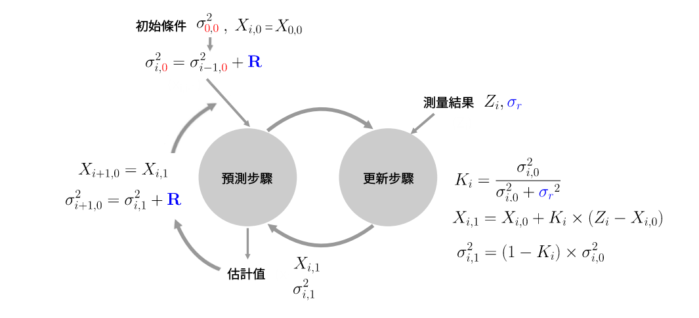

# Kalman Filter (卡爾曼濾波)

是一種利用線性系統狀態，通過系統輸入及輸出數據，它能夠從不完全及包含雜訊的測量中，估計動態系統的狀態。

## 初始化估值 

只執行一次，它提供兩個參數，即使初始化參數不精確，卡爾曼濾波器也能收斂到接近真實值。如果我們用更準確的值初始化，卡爾曼濾波器更快的收斂到近真實值。

 - 初始系統狀態值 $ \color{Blue}X_{\color{Red}0,\color{Red}0} $
	
 - 初始狀態測量設備誤差 $ \color{Blue}\sigma_{\color{Red}0,\color{Red}0} $

 - 初始化的估計不確定性是誤差方差 $ \color{Blue}\sigma_{\color{Red}0,\color{Red}0}^{2} $

### 預測估值 (測量值位置從  `1` 開始)

$$ X_{index,{\color{Red}{status}}} $$

 - index = 測量值編號 (測量值位置) 
 - status = 計算值狀態 (0:初始值或估計值, 1:計算修正估值)
 
### 由於模型具有恆定動態，因此預測估計等於當前初始估值。

$$ X_{i,{\color{Red}0}}=X_{i-1,{\color{Red}0}} $$
	 
$$ X_{1,{\color{Red}0}}=X_{0,{\color{Red}0}} $$

### 延伸估值的不確定性方差 + 估計系統噪聲方差 `(R) 在整個估計過程中是固定不變`的

$$ \sigma_{i,{\color{Red}0}}^{2}=\sigma_{i-1,{\color{Red}0}}^{2}+{\color{blue}R} $$

$$ \sigma_{1,{\color{Red}0}}^{2}=\sigma_{0,{\color{Red}0}}^{2}+{\color{blue}R} $$

## <mark>反復計算</mark>

### 測量值計算參數

#### 來自測量設備的測量值 : $ {\color{DarkGreen}Z_{i}} $

#### 來自測量設備誤差為 (`測量設備誤差在整個估計過程中是固定不變的`) : $ {\color{blue}\sigma_{r}} $

#### 來自測量設備誤差方差為 (`測量設備誤差方差在整個估計過程中是固定不變的`) : $ {\color{blue}\sigma_{r}^{2}} $

例如，如果如果設備準確誤差為 0.1 誤差方差為 

$$ {\color{blue}{0.1}}^{2}={\color{blue}{0.01}} $$

### 計算卡爾曼增益 (卡爾曼增益介於 `0` 到 `1` 之間)

 - 測量設備誤差在整個估計過程中是固定不變的 : $ {\color{blue}\sigma_{r}} $

#### 卡爾曼增益

$$ K_{i}=\frac{\sigma_{i,\color{Red}0}^{2}}{\sigma_{i,\color{Red}0}^{2}+{\color{blue}\sigma_{r}}^{2}} $$

---

### 參數更新估值 

#### 新估值 : 增量之間的距離 = (測量值 - 預測估值)

$$ X_{i,1}=X_{i,\color{Red}0}+K_{i}\times{({\color{DarkGreen}Z_{i}}-X_{i,\color{Red}0})} $$
   
#### 更新誤差方差估值 

$$ \sigma_{i,1}^{2}={(1-K_{i})}\times\sigma_{i,\color{Red}0}^{2} $$

### 預測估值 (下一輪預測開始初始估值)

- 系統噪聲方差 (R) `在整個估計過程中是固定不變的`

$$ X_{i+1,\color{Red}0}=X_{i,1} $$

$$ {\sigma_{i+1,\color{Red}0}^{2}}=\sigma_{i,1}^{2}+{\color{blue}R} $$

## 重複以上 (<mark>反復計算</mark>) 過程

#### 例如在第一輪計算後

$$ X_{2,\color{Red}0}=X_{1,1} $$

$$ {\sigma_{2,\color{Red}0}^{2}}=\sigma_{1,1}^{2}+{\color{blue}R} $$

---

# 總結

衹是在開始時設定一個比較近似的任意值。這個初始值只用一次，在計算後會被更新。
最困難是最初決定系統的誤差值(R)。而設備的誤差值 ($ \sigma_{r} $) 一般會在設備資料表中提供，`這兩個數值會在整個計算過程中重複使用`。
在第一次計算後。將計算值作為下一次的初始值，重複反復計算過程。這個數值就會收歛到接近真實值。