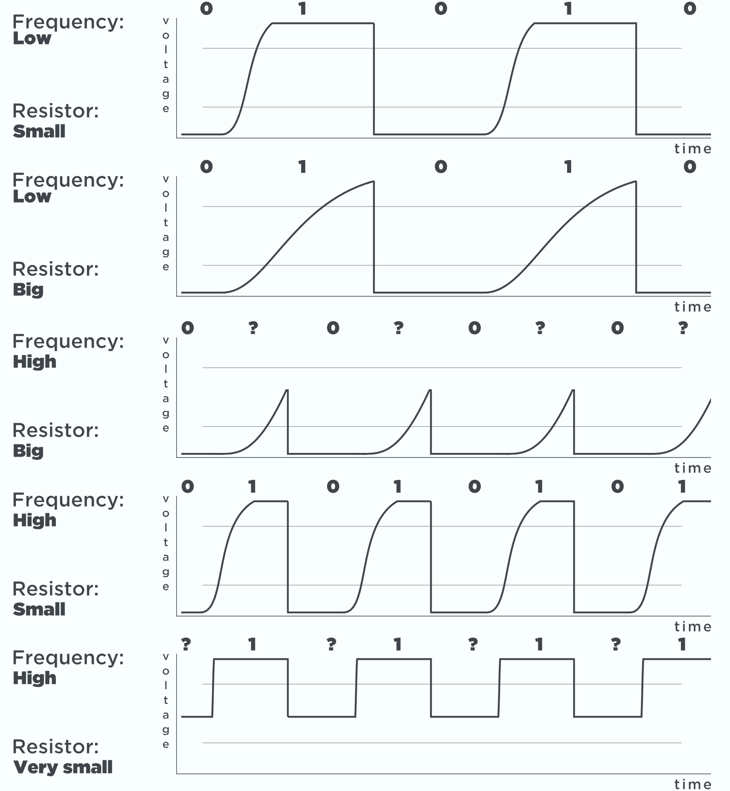

# I<sup>2</sup>C bus 的 pull-up 電阻設計
I<sup>2</sup>C bus 的 pull-up 電阻設計，是一個兩難的局面：

 - R<sub>p</sub> 很小：low-to-high 的變化速度會很快，clock速度沒有限制，但影響 low 的位準。
 - R<sub>p</sub> 很大：low-to-high 的變化速度會太慢，low 的位準沒有問題，但限制 clock 速度。


I<sup>2</sup>C 規格中定義的 V<sub>IL</sub>，也就是 0.3 V<sub>CC</sub>，才能讓其它裝置覺得 bus 的狀態是 low。

根據 I<sup>2</sup>C 的規範，在 100 KH<sub>z</sub> 的 standard mode 和 400 KH<sub>z</sub> 的 fast mode 下，I<sup>2</sup>C 裝置最少要能驅動 3 mA 的電流。

首先計算 V<sub>IL</sub>：V<sub>IL</sub>= V<sub>CC</sub> * 0.3 = 3.3 * 0.3 = 0.99 V

因此最少要將訊號線拉到 0.99 V。此時 R<sub>p</sub> 上的電位差就是：3.3 – 0.99 =2.31 V

如果 output driver 最大可以流過 3 mA 的電流，用 3 mA 的電流要造出 2.31 V 的壓差，電阻就是：
```
V = IR
2.31 = 0.003 * R
R = 770（Ω）
```
如果將 SCL 或 SDA 拉到 0 V，就要在 R<sub>p</sub> 上造出完整的 3.3 V 壓差，這時的電阻值就是：
```
V = IR
3.3 = 0.003 * R
R = 1100（Ω）
```
# 寄生電容問題
寄生電容，也稱為`雜散電容`，是電路中電子元件之間或電路模塊之間，由於相互靠近所形成的電容，寄生電容是寄生元件，是不可避免的。在任意兩段導體之間均有非零的電容，這種電容在高頻情況中體現得尤為突出。

這個電路中，電容器上的電壓可以用一個看起來很恐怖但其實很簡單的數學式來表示：

 > V（t）= V<sub>CC</sub>（1 − e <sup>−（t / RC）</sup>）


