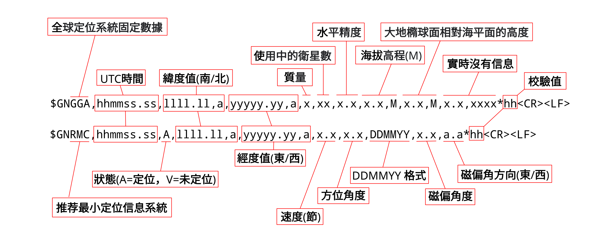
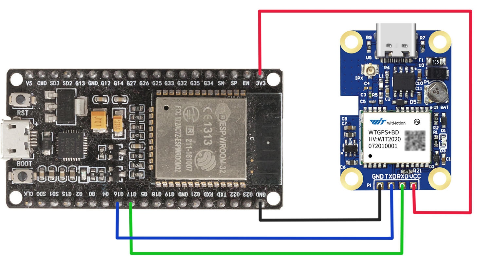

# 定位系統

## 常見NMEA-0183語句內容

### 位識別符

|位識別符|語句內容|
|:---:|:---|
|GN|GNSS, 全球導航衛星定位系統|
|GP|GPS|
|BD|BDS北斗|
|GL|Galileo, GLONASS|

### 語句名

|語句名|語句內容|
|:---:|:---|
|RMC|UTC時間、定位狀態（A－可用，V－可能有錯誤）、緯度值、經度值、對地速度、日期等|
|GGA|UTC時間、緯度值、經度值、定位狀態（無效、單點定位、差分）、觀測的GPS衛星個數、HDOP值、GPS橢球高、天線架設高度、差分數據齡期、差分基準站編號、校驗和|
|GLL|UTC時間、緯度值、經度值、定位狀態（無效、單點定位、差分）、校驗和|
|GSA|定位模式（M－手動，強制二維或三維定位；A－自動，自動二維或三維定位）、定位中使用的衛星ID號、PDOP值、HDOP值、VDOP值|
|GSV|視野中的GPS衛星顆數、PRN編號、衛星仰角、距正北的角度（方位角）、信噪比|
|MSS|信標台的信號強度、信噪比、信標頻率、串列傳輸速率、通道號|
|VTG|對地速度等|
|ZDA|UTC時間、年、月、日、當地時區、時區的分鐘值等|


### NMEA-0183語句格式

|符號（ASCII)|定義|HEX|DEX|說明|
|:---:|:---:|:---:|:---:|:---|
|$|起始位|24|36|語句起始位|
|aaccc|地址域|||前兩位為位識別符，後三位為語句名|
|“，”|域分隔符號|2C|44|域分隔符號|
|ddd……ddd|資料塊|||發送的資料內容|
|“*”|校驗和符|2A|42|星號分隔符號，表明後面的兩位數是校驗和|
|hh|校驗和|||校驗和|
|/|終止符|0D,0A|13,10|回車，換行 \<CR>\<LF>|


GPS模組發送過來的原始資料有很多，通常我們只需要其中的一部分資訊就足夠，如對於導航的功能，我們只需要以語句名 <font color="#FF0010">GGA</font> 或 <font color="#FF0010">RMC</font> 開頭的數據已足夠一般使用。位識別符只是識別數據來自那個全球定位系統，以下會詳細介紹這兩個原始資料，從中解析出經緯度、日期時間等有效資訊。




### GGA例子如下：

$GNGGA,065100.000,2223.07736,N,11412.21642,E,1,11,3.0,55.4,M,0.0,M,,*47

|字段|資料|語句內容|
|:---:|:---:|:---|
|字段0|$|起始位符號|
|字段0|GN|為全球導航衛星定位最小定位信息|
|字段0|GGA|為Global Positioning System Fix Data全球定位系統固定數據|
|字段1|065102.000|hhmmss.sss格式|
|字段2|2223.07749|ddmm.mmmm，度分格式|
|字段3|N|N=北緯, S=南緯|
|字段4|11412.21630|dddmm.mmmm，度分格式|
|字段5|E|E=東經, W=西經|
|字段7|1|質量 1=成功, 0=失敗|
|字段8|11|使用中的衛星數|
|字段9|3|水平精度|
|字段10|55.4|海拔高度(M)|
|字段11|0.0|大地橢球面相對海平面的高度(M)|
|字段12||實時沒有信息|
|字段13||實時沒有信息|
|字段14|47|校驗值|

### RMC例子如下：

$GNRMC,065102.000,A,2223.07749,N,11412.21630,E,0.00,100.53,091021,,,A*71

|字段|資料|語句內容|
|:---:|:---:|:---|
|字段0|$|起始位符號|
|字段0|GN|為全球導航衛星定位最小定位信息|
|字段0|RMC|為Recommended Minimum Specific GPS/TRANSIT Data（RMC）推荐最小定位信息系統|
|字段1|065102.000|hhmmss.sss格式|
|字段2|A|A=定位，V=未定位|
|字段3|2223.07749|ddmm.mmmm，度分格式|
|字段4|N|N=北緯, S=南緯|
|字段5|11412.21630|dddmm.mmmm，度分格式|
|字段6|E|E=東經, W=西經|
|字段7|0.00|速度 節，Knots|
|字段8|100.53|方位角度|
|字段9|091021|DDMMYY 日月年 格式|
|字段10||磁偏角(000 - 180）度|
|字段11||磁偏角方向 E=東, W=西|
|字段12|71|校驗值|

[現有的GPS代碼庫](https://github.com/inmcm/micropyGPS)

main.py - 用於全球導航衛星定位系統的 *MicroPython* 程序

```python
import re
import uasyncio as asyncio
from machine import UART
from micropyGPS import MicropyGPS

async def sender():
    swriter = asyncio.StreamWriter(uart1, {})
    while True:
        await swriter.awrite('Hello uart.\n')
        print('Wrote')
        await asyncio.sleep(2)

async def receiver():
    sreader = asyncio.StreamReader(uart1)
    while True:
        GGA_sentence = await sreader.readline()
        if re.match(r'\$', GGA_sentence):
            GGA_sentence = GGA_sentence.decode('Ascii')
            for y in GGA_sentence:
                sentence = my_gps.update(y)
                if sentence:
                    fileStr = "{:10.8f}, {:10.8f} -- {} : {} : {}".format(my_gps.latitude[0], my_gps.longitude[0], my_gps.altitude, my_gps.satellites_in_use, my_gps.satellites_used)
                    print(fileStr)
       

uart1 = UART(2, baudrate=9600, tx=17, rx=16)
uart1.init(9600, bits=8, parity=None, stop=1) 
my_gps = MicropyGPS(location_formatting="dd")
loop = asyncio.get_event_loop()
loop.create_task(receiver())
loop.run_forever()

```

注意：*ESP32* 開發板中的 **Tx** 和 **Rx** 是交叉連接到全 *球導航衛星定位單元* 中的 **Rx** 和 **Tx** 



