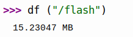
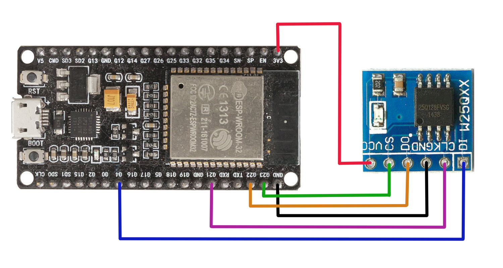
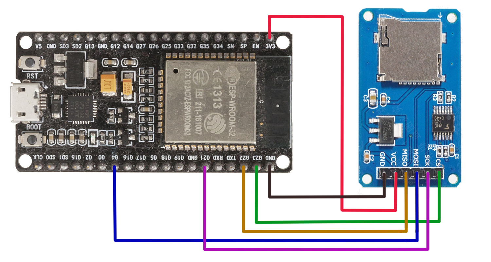

# 存儲設備

## W25QXX Flash (閃存)

*MicroPython* 定義了一個 *RAMBlockDev* 類，提供三個基本方法，分別是 readblocks, writeblocks, ioctl

*MicroPython* 提供內置設備來訪問主閃存，開機時，*MicroPython* 將嘗試檢測閃存上的文件系統並自動配置和掛載它。 如果沒有找到文件系統，*MicroPython* 將嘗試創建一個跨越整個閃存的 *FAT* 文件系統。

[官方文檔，文件系統](https://docs.micropython.org/en/latest/reference/filesystem.html#)

[w25qxx.py 互聯網資源](https://www.programmersought.com/article/36588111905/)


MISO (Master Out Slave In) 是 DO , MOSI (Master In Slave Out) 是 DI

main.py - 處理閃存功能的示例

```shell
import uos
import ujson
from machine import  Pin, SPI
from drivers.w25qxx import W25QXX_BlockDev
 
spi = SPI(baudrate=10000000, polarity=1, phase=1, sck=Pin(21), mosi=Pin(4), miso=Pin(22))
cs = Pin(23, Pin.OUT)
flash = W25QXX_BlockDev(SPI = spi, CS_PIN = cs)
uos.VfsFat.mkfs(flash)
uos.mount(flash, '/flash')

data = {
 "CPU": "ESP32",
 "Flash": "Flash Test"}
 
with open('/flash/info.txt','w')as f:
    f.write(ujson.dumps(data))
    
with open('/flash/info.txt','r') as f:
    d = ujson.loads(f.read())
    print(d)

```

可以使用之前創建的命令來檢查 *W25Q128* 的大小為如下所示





## SD Card (微型SD卡)

[官方文檔 sdcard.py](https://github.com/micropython/micropython/blob/master/drivers/sdcard/sdcard.py)

將 *sdcard.py* 複製到 ESP 開發板根目錄, 引腳 23 是 CS 接點

main.py - 處理微型SD功能的示例

```shell
import os
import ujson
from machine import Pin, SoftSPI
from drivers.sdcard import SDCard

spisd = SoftSPI(-1, mosi=Pin(4), miso=Pin(22), sck=Pin(21))
sd = SDCard(spisd, Pin(23))
vfs = os.VfsFat(sd)
os.mount(vfs, '/sd')
os.chdir('sd')
print('SD Card 包含文件:{}'.format(os.listdir()))

data = {
 "CPU": "ESP32",
 "SD": "CARD Test"}
 
with open('/sd/info.txt','w')as f:
    f.write(ujson.dumps(data))
    
with open('/sd/info.txt','r') as f:
    d = ujson.loads(f.read())
    print(d)

```

可以使用之前創建的命令來檢查 *SD Card* 的大小為如下所示


