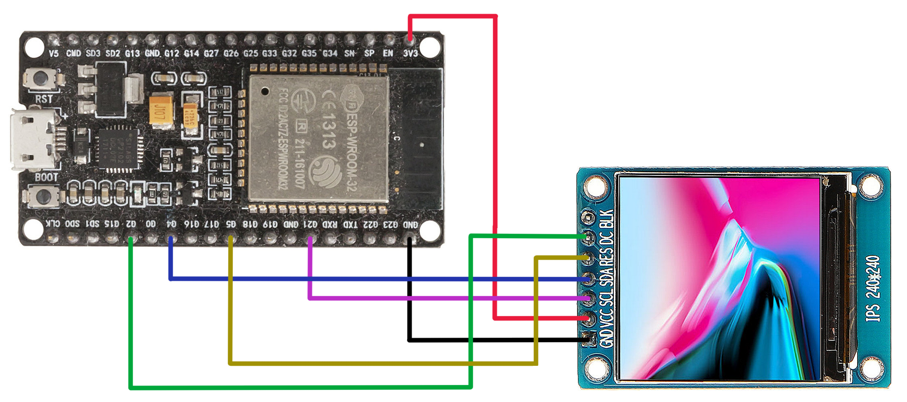
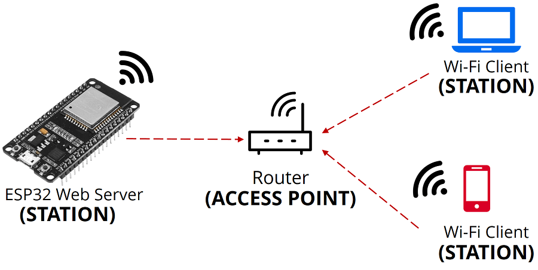
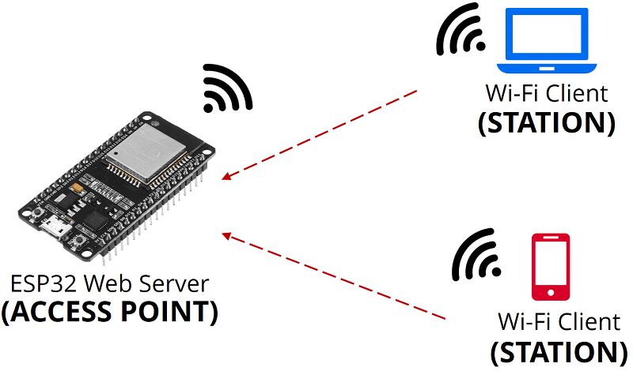
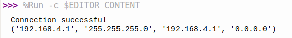

# 顯示模塊設置


[ST7789 連接信息](https://www.instructables.com/Adding-CS-Pin-to-13-LCD/)

[ST7789.py 互聯網資源](https://github.com/devbis/st7789py_mpy)

main.py - 處理最小*MQTT*網絡功能的示例 

```python
from machine import  Pin, SPI
import random
import st7789
import time

spi = SPI(baudrate=40000000, polarity=1, phase=1, sck=Pin(21), mosi=Pin(4), miso=Pin(22)) # MOSI=SDA, SCL=SCK
display = st7789.ST7789(
    spi, 240, 240,
    reset=Pin(5, Pin.OUT),
    dc=Pin(2, Pin.OUT),
)
display.init()

while True:
    display.fill(
        st7789.color565(
            random.getrandbits(8),
            random.getrandbits(8),
            random.getrandbits(8),
        ),
    )
    time.sleep(1)

```





textout.py - 處理最小*MQTT*網絡功能的示例 

```python
import framebuf
import gc
from uctypes import bytearray_at, addressof

class TextOut:
    
  def __init__(self, display, font, lineHeight, fgColor=0xffff, bgColor=0x0000, colormap=framebuf.RGB565):
    self.display = display
    self.font = font
    self.lineHeight = lineHeight
    self.fgColor = fgColor
    self.bgColor = bgColor
    self.colormap = colormap
    self.top = 0
    
  def rgb(self, r, g=0, b=0):
        try:
            r, g, b = r  # see if the first var is a tuple/list
        except TypeError:
            pass
        color = (r & 0xf8) << 8 | (g & 0xfc) << 3 | b >> 3 
        return (color<<8 & 0xFF00) + (color>>8 & 0x00FF)

  def setTop(self, top):
      self.top = top

  def setFont(self, font):
      self.font = font

  def setLineHeight(self, height):
    self.lineHeight = height

  def setFgColor(self, r, g, b):
    self.fgColor = self.rgb(r, g, b)
      
  def setBgColor(self, r, g, b):
    self.bgColor = self.rgb(r, g, b)

  def Text(self, text, w, h, top, color=0xffff):
    fbuf = framebuf.FrameBuffer(bytearray(w * h * 2), w, h, self.colormap)
    fbuf.text(text, 0, 0, color)
    self.display.blit_buffer(fbuf, 0, top, w, h)
    gc.collect()
    gc.mem_free()

  def drawText(self, string):
    lines = string.split('\n', 1)
    n = len(lines)
    for i in range(n):
        x = 0
        for char in lines[i]:    
            x = self._drawChar(char, x, i*self.lineHeight+self.top, self.font, self.fgColor, self.bgColor, self.colormap)    
          
  def _drawChar(self, char, x, y, font, fgColor, bgColor, colormap):
    glyph, char_height, char_width = font.get_ch(char)
    bufc = bytearray_at(addressof(glyph), len(glyph))
    bufx = bytearray(char_height*char_width*2)
    if font.hmap() :
        if font.reverse():
            fbi = framebuf.FrameBuffer(bufc, char_width, char_height, framebuf.MONO_HMSB)
        else:
            fbi = framebuf.FrameBuffer(bufc, char_width, char_height, framebuf.MONO_HLSB)
        fbo = framebuf.FrameBuffer(bufx, char_width, char_height, colormap)
        for i in range(char_width):  
            for j in range(char_height): 
                color = fbi.pixel(i, j)
                if color!=0:
                    fbo.pixel(i, j, fgColor)
                else:
                    fbo.pixel(i, j, bgColor)
    else:
        raise ValueError('Font must be horizontally mapped.')
    self.display.blit_buffer(fbo, x, y, char_width, char_height)
    gc.collect()
    gc.mem_free()
    return x+char_width
           
```

main.py - 處理最小*MQTT*網絡功能的示例 

```python
from machine import  Pin, SPI
import st7789
import fonts.myfont as myfont
import fonts.robotol as robotol
from fonts.textout import TextOut

spi = SPI(baudrate=40000000, polarity=1, phase=1, sck=Pin(21), mosi=Pin(4), miso=Pin(22)) # MOSI=SDA, SCL=SCK
display = st7789.ST7789(
    spi, 240, 240,
    reset=Pin(5, Pin.OUT),
    dc=Pin(2, Pin.OUT),
)
display.init()

tout = TextOut(display, myfont, 50)
tout.setFgColor(200,200,0)
tout.Text('MicroPython!', 240, 10, 220)
tout.Text('MicroPython!', 240, 10, 230)
tout.drawText('MicroPython\n  Hello World!')

tout.setFgColor(255,50,255)
tout.setBgColor(20,20,20)
tout.setFont(robotol)
tout.setLineHeight(35)
tout.setTop(130)
tout.drawText('  MicroPython\n  Hello World!')

```


# 顯示模塊字體創建

[在顯示設備中顯示字體](https://github.com/peterhinch/micropython-font-to-py)

font_to_py.py 是用 Python 3 編寫的命令行程序。 它在 PC 上運行。 它將帶有 ttf 或 otf 擴展名和所需高度（以像素為單位）的字體文件作為輸入，並輸出 Python 3 源文件。或者，它將接受 bdf 或 pcf 源文件（包括高度定義）。像素佈局由命令參數決定。默認情況下，字體以可變間距形式存儲。這可能會被命令行參數覆蓋。

 - -x 或 --xmap 指定水平映射 (字體文件中應使用水平映射) 
 - 30 是字體大小可改變

```shell
sudo apt-get install python3-pip
pip3 install freetype-py

cd ~/fonts
./font_to_py.py -x Robotol.ttf 30 myfont.py

```


# 互聯網顯示方法

## ESP32 互聯網連接方法

### 路由器充當接入點，*ESP32* 被設置為站點，我們通過本地網絡訪問 *ESP32*。

```python
import network
import utime

__sta=None

def connectWifi(ssid, pwd):
  global __sta
  if __sta is None:
    __sta=network.WLAN(network.STA_IF)
    __sta.active(True)    
    __sta.connect(ssid, pwd)
    print('Connecting to WiFi STA ...')
    utime.sleep(8)
  if __sta.isconnected():
    print('Connected: {} : {}.'.format(ssid, __sta.ifconfig()[0]))
  else:
    print('{} connect failure!'.format(ssid))
    return None

```



### *ESP32* 作為接入點（熱點），任何*Wi-Fi*設備能夠連接，無需連接到路由器。



```python
try:
  import usocket as socket
except:
  import socket

import network
import gc

gc.collect()
ssid = 'Test-AP'
password = '123456789'

ap = network.WLAN(network.AP_IF)
ap.active(True)
ap.config(essid=ssid, password=password)

while ap.active() == False:
  pass

print('Connection successful')
print(ap.ifconfig())

def web_page():
  html = """<html><head><meta name="viewport" content="width=device-width, initial-scale=1"></head>
  <body><h1>ESP Web Server</h1></body></html>"""
  return html

s = socket.socket(socket.AF_INET, socket.SOCK_STREAM)
s.bind(('', 80))
s.listen(5)

while True:
  conn, addr = s.accept()
  print('Got a connection from %s' % str(addr))
  request = conn.recv(1024)
  print('Content = %s' % str(request))
  response = web_page()
  conn.send(response)
  conn.close()

```

