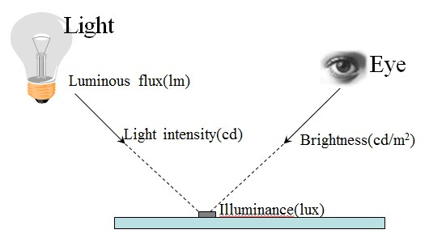
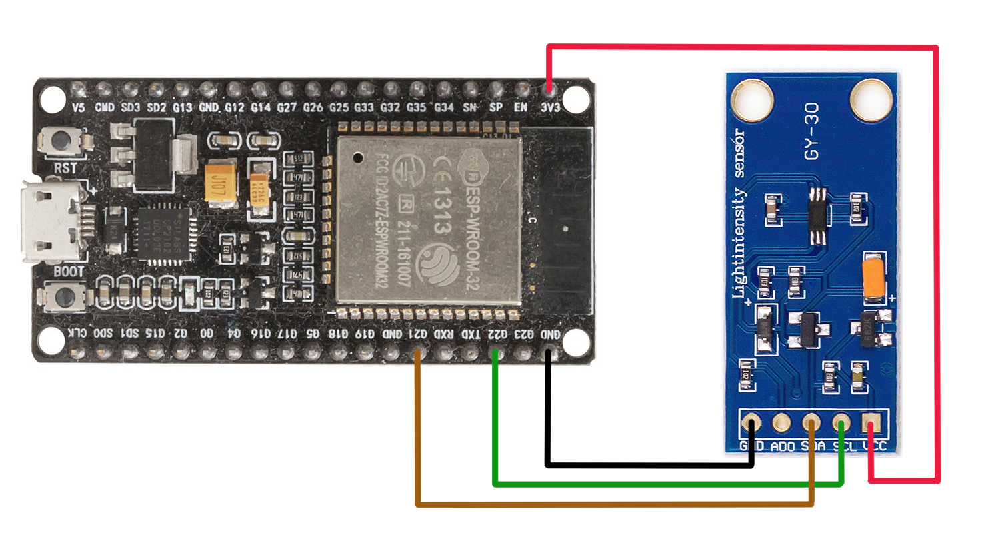

# 光強度傳感器 (GY-30 light intensity sensor)

[互聯網資源](https://github.com/PinkInk/upylib)

光通量 *Luminous flux* 這是與眼睛接收到的光的感覺相關的輻射能測量的通過率。光通量是光源每秒發出的可見光量。光通量是對光的感知功率的量度。它是每秒向各個方向發射的光的能量。




```python
from utime import sleep_ms

class GY30():

  PWR_OFF = 0x00
  PWR_ON = 0x01
  RESET = 0x07
  CONT_LUX_4 = 0x13
  CONT_LUX_1 = 0x10
  CONT_LUX_05 = 0x11
  ONCE_LUX_4 = 0x20
  ONCE_LUX_1 = 0x21
  ONCE_LUX_05 = 0x23

  def __init__(self, bus, addr=0x23):
    self.bus = bus
    self.addr = addr
    self.off()
    self.reset()
 
  def off(self):
    self.set_mode(self.PWR_OFF)

  def on(self):
    self.set_mode(self.PWR_ON)

  def reset(self):
    self.on()
    self.set_mode(self.RESET)

  def set_mode(self, mode):
    self.mode = mode
    self.bus.writeto(self.addr, bytes([self.mode]))

  def luminance(self, mode):
    if mode & 0x10 and mode != self.mode:
        self.set_mode(mode)
    if mode & 0x20:
        self.set_mode(mode)
    sleep_ms(24 if mode in (0x13, 0x23) else 180)
    data = self.bus.readfrom(self.addr, 2)
    factor = 2.0 if mode in (0x11, 0x21) else 1.0
    return (data[0]<<8 | data[1]) / (1.2 * factor)

```


main.py - 測量環境條件下的勒克斯 *lux* 水平功能的示例

```python
from machine import I2C, Pin, Timer
from drivers.gy30 import GY30

i2c = I2C(scl=Pin(22), sda=Pin(21))
gy = GY30(i2c)

while True:
  print("{:.3f} lux".format(gy.luminance(gy.CONT_LUX_05)))

```

ESP32 及 GY-30 的連接如下圖

