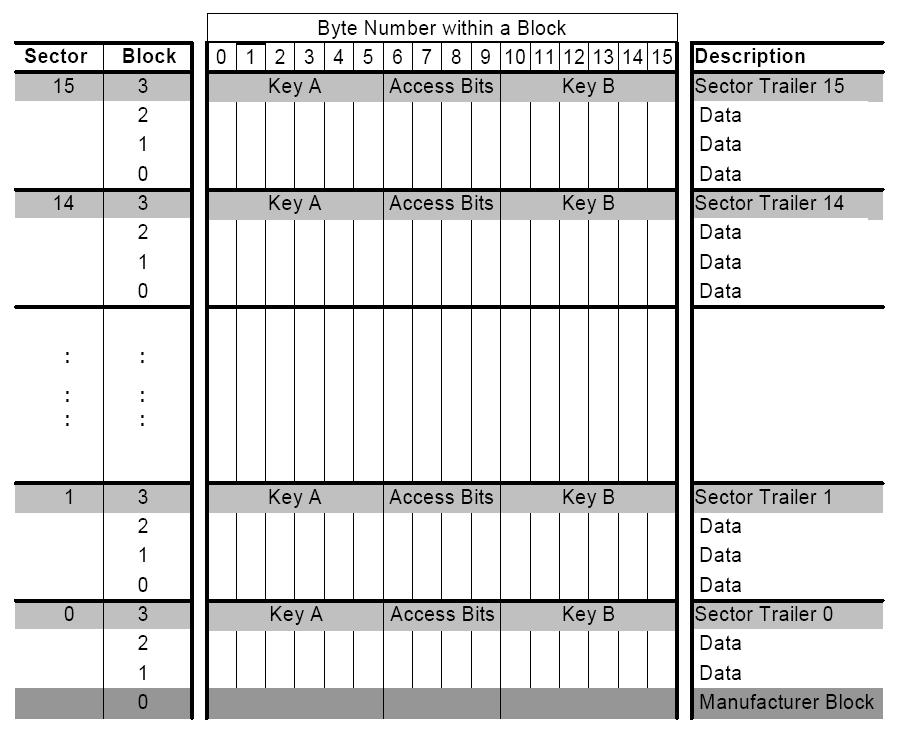
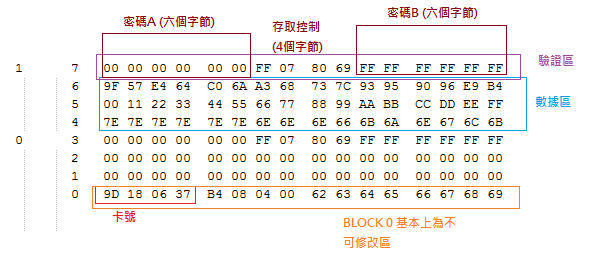

# RFC 讀卡器


## 智慧卡簡介

IC（Integrated Circuit Card）卡，也稱為智慧卡、智慧卡、微晶片卡等。IC卡按讀寫通訊方式分為接觸式、非接觸式和雙介面卡（即同時具備接觸式和非接觸式通訊介面）。IC卡因為其固有的資訊保安、方便攜帶、比較完善的標準化等優點，廣泛應用於身份認證、銀行、電信、公共交通、車場管理等領域。例如二代身份證、銀行電子錢包、電話卡、公交卡、停車卡等等。

按結構分類：
 - 記憶體卡：普通序列EEPROM記憶體，儲存方便，資訊簡單，不具備資訊加密。
 - 邏輯加密卡：儲存區外增加了邏輯控制，存取前必須核對密碼。
 - CPU邏輯卡：內嵌一顆特殊的微控制器，除了內部帶有控制器、記憶體、時序控制邏輯等，還帶有演演算法單元和作業系統。

## RF介面標準

RF介面符合非接觸智慧卡標準ISO/IEC 14443A。
讀寫器的載波電磁場始終存在（傳送中有短暫中斷），因為它用作卡的電源。對於兩個方向的資料通訊，每個資料框都只有一個起始位。所傳送的每個位元組末尾都有一個奇偶校驗位（奇校驗）。選定塊最低地址位元組的最低位首先傳送。最大幀長為163 bit（16資料位元組 + 2個CRC位元組 = 16 * 9 + 2 * 9 + 1 起始位）。


## 記憶體組織

一般常用的RFID卡片就會是MIFARE卡，其工作頻率是：13.56MHZ，MIFARE卡有分S50跟S70的 主要差異在記憶體大小，S50為1K Bytes（實際是1024 Bytes），S70為4K Bytes（實際是4096 Bytes）。

以S50卡為例，它的容量为8K位元的EEPROM分为16个扇區，每個扇區有4塊，每塊16個字節,以塊為存取單位。每个扇區有獨立的一组密碼及訪問控制。每張卡有唯一序號，為32位具有防衝突機制，支持多卡操作無电源，自带天線，内含加密控制邏輯和通訊邏輯電路資料保存期為10年，可改寫10萬次，毒無限制次

 - 工作温度：-20℃~50℃(濕度为90%)
 - 工作频率：13.56MHZ
 - 通信速率：106 KBPS
 - 讀寫距離：10 cm以内（與讀卡機有關）

而所有的資料都會存在卡的記憶區裡面。你可以想像裡面有一個超大的表格一樣是一個 64 x 16 大小的表格。如下圖。



每一個 sector (段) 包含四個 block (區) 前三個區為<font color="#FF0010">數據區</font> 第四個區為<font color="#FF0010">驗證區</font>。

而以上顯示的區域 <font color="#FF0010"> 3，7，11，15，19，23，27，31，35，39，43，47，51，55，59，63</font> 都是<font color="#FF0010">驗證區</font>不會拿來寫資料。除此之外其他區域都可以拿來寫任何資料。而新卡的話密碼A密碼B大多都會是 <font color="#FF0010">FF FF  FF FF FF FF</font>

基本上你不能改 <font color="#FF0010">0</font> 區的所有資料，除非你買特製卡才可以修改。這資料為卡號及一些商業資訊放置的區。以下是用圖片加以説明。




[RFC 讀卡器互聯網資源](https://github.com/wendlers/micropython-mfrc522)


## MicroPython 的數據轉換功能

- ubinascii -- 二進制/ ASCII互轉
- ustruct -- 打包和解壓縮原始數據類型

MicroPython中支持的格式

|代表字符|C 格式|Python 格式|字節數|代表字符|C 格式|Python 格式|字節數|
|:---:|:---:|:---:|:---:|:---:|:---:|:---:|:---:|
|b|signed char|integer|1|B|unsigned char|integer|1|
|h|short|integer|2|H|unsigned short|integer|2|
|i|int|integer|4|I|unsigned int|integer or long|	4|
|l|long|integer|4|L|unsigned long|long|4|
|q|long long|long|8|Q|unsigned long long|long|8|
|s|char[]|string|1|P|void *|long||
|f|float|float|4|d|double|float|8|

注意：(<font color="#FF0010">f</font> 和 <font color="#FF0010">d</font> 取決於浮點支持)

struct根據本地機器字節順序轉換.可以用格式中的第一個字符來改變對齊方式.定義如下

|代表字符|字節順序|大小和對齊方式|代表字符|字節順序|大小和對齊方式|
|:---:|:---:|:---:|:---:|:---:|:---:|
|@|native|湊夠4個字節|=|native|按原字節數|
|<|little-endian|按原字節數|
|>|big-endian|按原字節數|!|network (<font color="#FF0010">></font>)|按原字節數|


```python
from os import uname
from machine import  Pin, SPI
from drivers.mfrc522 import MFRC522
import ujson
import ustruct

def do_read():
    
  spi = SPI(baudrate=40000000, polarity=1, phase=1, sck=Pin(21), mosi=Pin(4), miso=Pin(22))
  rdr = MFRC522(spi, 5, 14)
  print("")
  print("Place card before reader to read from address 0x08")
  try:
    while True:
        (stat, tag_type) = rdr.request(rdr.REQIDL)
        if stat == rdr.OK:
            (stat, raw_uid) = rdr.anticoll()
            if stat == rdr.OK:
                print("\nRFC card detected")
                param = {"tag_type" : tag_type}
                strValue = "0x%02x%02x%02x%02x" % (raw_uid[0], raw_uid[1], raw_uid[2], raw_uid[3])
                param.update({"uid" : strValue})
                if rdr.select_tag(raw_uid) == rdr.OK:
                    key = [0xFF, 0xFF, 0xFF, 0xFF, 0xFF, 0xFF]
                    if rdr.auth(rdr.AUTHENT1A, 8, key, raw_uid) == rdr.OK:
                        strValue = "%s" % rdr.read(8)
                        output = ustruct.unpack('bbbbbbbbbbbbbbbb', strValue)
                        print(output)
                        param.update({"data" : output})
                        rdr.stop_crypto1()
                        return param 
                    else:
                        print("Authentication error")
                else:
                    print("Failed to select tag")
  except KeyboardInterrupt:
      pass
    
def do_write(strValue):

  spi = SPI(baudrate=40000000, polarity=1, phase=1, sck=Pin(21), mosi=Pin(4), miso=Pin(22))
  rdr = MFRC522(spi, 5, 14)
  print("")
  print("Place card before reader to read from address 0x08")
  char = list(strValue)
  inputbytes = ustruct.pack('bbbbbbbbbbbbbbbb', ord(char[0]), ord(char[1]), ord(char[2]), ord(char[3]), \
                            ord(char[4]), ord(char[5]), ord(char[6]), ord(char[7]),ord(char[8]), ord(char[9]), \
                            ord(char[10]), ord(char[11]), ord(char[12]), ord(char[13]), ord(char[14]), ord(char[15]))
  print("Data ({}) will write to RFC CARD".format(inputbytes))
  try:
    while True:
        (stat, tag_type) = rdr.request(rdr.REQIDL)
        if stat == rdr.OK:
            (stat, raw_uid) = rdr.anticoll()
            if stat == rdr.OK:
                print("\nRFC card detected")
                param = {"tag_type" : tag_type}
                strValue = "0x%02x%02x%02x%02x" % (raw_uid[0], raw_uid[1], raw_uid[2], raw_uid[3])
                param.update({"uid" : strValue})
                if rdr.select_tag(raw_uid) == rdr.OK:
                    key = [0xFF, 0xFF, 0xFF, 0xFF, 0xFF, 0xFF]
                    if rdr.auth(rdr.AUTHENT1A, 8, key, raw_uid) == rdr.OK:
                        stat = rdr.write(8, inputbytes)
                        rdr.stop_crypto1()
                        if stat == rdr.OK:
                            print("Data ({}) written to RFC CARD".format(inputbytes))
                            return param
                        else:
                            print("Failed to write data to card")
                    else:
                        print("Authentication error")
                else:
                    print("Failed to select tag")
  except KeyboardInterrupt:
      pass

print(do_read())
#print(do_write("DickyABCDickyABC"))

```


### 網絡服務器主功能模塊

mfrc522.py - RFC 讀卡器功能的示例 

```python
from machine import Pin

class MFRC522:

  OK = 0
  NOTAGERR = 1
  ERR = 2
  REQIDL = 0x26
  REQALL = 0x52
  AUTHENT1A = 0x60
  AUTHENT1B = 0x61

  def __init__(self, spi, rst, cs):
    self.rst = Pin(rst, Pin.OUT)
    self.cs = Pin(cs, Pin.OUT)
    self.rst.value(0)
    self.cs.value(1)
    self.spi = spi
    self.spi.init()
    self.rst.value(1)
    self.init()

  def _wreg(self, reg, val):
    self.cs.value(0)
    self.spi.write(b'%c' % int(0xff & ((reg << 1) & 0x7e)))
    self.spi.write(b'%c' % int(0xff & val))
    self.cs.value(1)

  def _rreg(self, reg):
    self.cs.value(0)
    self.spi.write(b'%c' % int(0xff & (((reg << 1) & 0x7e) | 0x80)))
    val = self.spi.read(1)
    self.cs.value(1)
    return val[0]

  def _sflags(self, reg, mask):
    self._wreg(reg, self._rreg(reg) | mask)

  def _cflags(self, reg, mask):
    self._wreg(reg, self._rreg(reg) & (~mask))

  def _tocard(self, cmd, send):
    recv = []
    bits = irq_en = wait_irq = n = 0
    stat = self.ERR
    if cmd == 0x0E:
        irq_en = 0x12
        wait_irq = 0x10
    elif cmd == 0x0C:
        irq_en = 0x77
        wait_irq = 0x30
    self._wreg(0x02, irq_en | 0x80)
    self._cflags(0x04, 0x80)
    self._sflags(0x0A, 0x80)
    self._wreg(0x01, 0x00)
    for c in send:
        self._wreg(0x09, c)
    self._wreg(0x01, cmd)
    if cmd == 0x0C:
        self._sflags(0x0D, 0x80)
    i = 2000
    while True:
        n = self._rreg(0x04)
        i -= 1
        if ~((i != 0) and ~(n & 0x01) and ~(n & wait_irq)):
            break
    self._cflags(0x0D, 0x80)
    if i:
        if (self._rreg(0x06) & 0x1B) == 0x00:
            stat = self.OK
            if n & irq_en & 0x01:
                stat = self.NOTAGERR
            elif cmd == 0x0C:
                n = self._rreg(0x0A)
                lbits = self._rreg(0x0C) & 0x07
                if lbits != 0:
                    bits = (n - 1) * 8 + lbits
                else:
                    bits = n * 8
                if n == 0:
                    n = 1
                elif n > 16:
                    n = 16
                for _ in range(n):
                    recv.append(self._rreg(0x09))
        else:
            stat = self.ERR
    return stat, recv, bits

  def _crc(self, data):
    self._cflags(0x05, 0x04)
    self._sflags(0x0A, 0x80)
    for c in data:
        self._wreg(0x09, c)
    self._wreg(0x01, 0x03)
    i = 0xFF
    while True:
        n = self._rreg(0x05)
        i -= 1
        if not ((i != 0) and not (n & 0x04)):
            break
    return [self._rreg(0x22), self._rreg(0x21)]

  def init(self):
    self.reset()
    self._wreg(0x2A, 0x8D)
    self._wreg(0x2B, 0x3E)
    self._wreg(0x2D, 30)
    self._wreg(0x2C, 0)
    self._wreg(0x15, 0x40)
    self._wreg(0x11, 0x3D)
    self.antenna_on()

  def reset(self):
    self._wreg(0x01, 0x0F)

  def antenna_on(self, on=True):
    if on and ~(self._rreg(0x14) & 0x03):
        self._sflags(0x14, 0x03)
    else:
        self._cflags(0x14, 0x03)

  def request(self, mode):
    self._wreg(0x0D, 0x07)
    (stat, recv, bits) = self._tocard(0x0C, [mode])
    if (stat != self.OK) | (bits != 0x10):
        stat = self.ERR
    return stat, bits

  def anticoll(self):
    ser_chk = 0
    ser = [0x93, 0x20]
    self._wreg(0x0D, 0x00)
    (stat, recv, bits) = self._tocard(0x0C, ser)
    if stat == self.OK:
        if len(recv) == 5:
            for i in range(4):
                ser_chk = ser_chk ^ recv[i]
            if ser_chk != recv[4]:
                stat = self.ERR
        else:
            stat = self.ERR
    return stat, recv

  def select_tag(self, ser):
    buf = [0x93, 0x70] + ser[:5]
    buf += self._crc(buf)
    (stat, recv, bits) = self._tocard(0x0C, buf)
    return self.OK if (stat == self.OK) and (bits == 0x18) else self.ERR

  def auth(self, mode, addr, sect, ser):
    return self._tocard(0x0E, [mode, addr] + sect + ser[:4])[0]

  def stop_crypto1(self):
    self._cflags(0x08, 0x08)

  def read(self, addr):
    data = [0x30, addr]
    data += self._crc(data)
    (stat, recv, _) = self._tocard(0x0C, data)
    return recv if stat == self.OK else None

  def write(self, addr, data):
    buf = [0xA0, addr]
    buf += self._crc(buf)
    (stat, recv, bits) = self._tocard(0x0C, buf)
    if not (stat == self.OK) or not (bits == 4) or not ((recv[0] & 0x0F) == 0x0A):
        stat = self.ERR
    else:
        buf = []
        for i in range(16):
            buf.append(data[i])
        buf += self._crc(buf)
        (stat, recv, bits) = self._tocard(0x0C, buf)
        if not (stat == self.OK) or not (bits == 4) or not ((recv[0] & 0x0F) == 0x0A):
            stat = self.ERR
    return stat

```