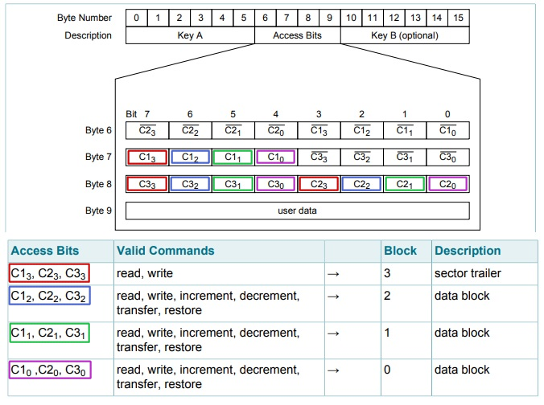

# RFC 讀卡器


## 智慧卡簡介

IC（Integrated Circuit Card）卡，也稱為智慧卡、智慧卡、微晶片卡等。IC卡按讀寫通訊方式分為接觸式、非接觸式和雙介面卡（即同時具備接觸式和非接觸式通訊介面）。IC卡因為其固有的資訊保安、方便攜帶、比較完善的標準化等優點，廣泛應用於身份認證、銀行、電信、公共交通、車場管理等領域。例如二代身份證、銀行電子錢包、電話卡、公交卡、停車卡等等。

按結構分類：
 - 記憶體卡：普通序列EEPROM記憶體，儲存方便，資訊簡單，不具備資訊加密。
 - 邏輯加密卡：儲存區外增加了邏輯控制，存取前必須核對密碼。
 - CPU邏輯卡：內嵌一顆特殊的微控制器，除了內部帶有控制器、記憶體、時序控制邏輯等，還帶有演演算法單元和作業系統。

## RF介面標準

RF介面符合非接觸智慧卡標準ISO/IEC 14443A。
讀寫器的載波電磁場始終存在（傳送中有短暫中斷），因為它用作卡的電源。對於兩個方向的資料通訊，每個資料框都只有一個起始位。所傳送的每個位元組末尾都有一個奇偶校驗位（奇校驗）。選定塊最低地址位元組的最低位首先傳送。最大幀長為163 bit（16資料位元組 + 2個CRC位元組 = 16 * 9 + 2 * 9 + 1 起始位）。


## 記憶體組織

一般常用的RFID卡片就會是MIFARE卡，其工作頻率是：13.56MHZ，MIFARE卡有分S50跟S70的 主要差異在記憶體大小，S50為1K Bytes（實際是1024 Bytes），S70為4K Bytes（實際是4096 Bytes）。

以S50卡為例，它的容量为8K位元的EEPROM分为16个扇區，每個扇區有4塊，每塊16個字節,以塊為存取單位。每个扇區有獨立的一组密碼及訪問控制。每張卡有唯一序號，為32位具有防衝突機制，支持多卡操作無电源，自带天線，内含加密控制邏輯和通訊邏輯電路資料保存期為10年，可改寫10萬次，毒無限制次

 - 工作温度：-20℃~50℃(濕度为90%)
 - 工作频率：13.56MHZ
 - 通信速率：106 KBPS
 - 讀寫距離：10 cm以内（與讀卡機有關）

而所有的資料都會存在卡的記憶區裡面。你可以想像裡面有一個超大的表格一樣是一個 64 x 16 大小的表格。如下圖。


每一個 Sector (段) 包含四個 Block (區) 前三個區為<font color="#FF0010">數據區</font> 第四個區為<font color="#FF0010">驗證區</font>。

而以上顯示的區域 <font color="#FF0010"> 3，7，11，15，19，23，27，31，35，39，43，47，51，55，59，63</font> 都是<font color="#FF0010">驗證區</font>不會拿來寫資料。除此之外其他區域都可以拿來寫任何資料。而新卡的話密碼A密碼B大多都會是 <font color="#FF0010">FF FF  FF FF FF FF</font>

基本上你不能改 <font color="#FF0010">0</font> 區的所有資料，除非你買特製卡才可以修改。這資料為卡號及一些商業資訊放置的區。以下是用圖片加以説明。


## 存取控制 (Access Bits)

位元用於<font color="#FF0010">存取控制</font>每個段裡面的每個區是否能被存取、寫入或其他操作，並且決定要透過金鑰 *A* 或金鑰 *B* 來驗證。 *0xFF0780* 是控制區塊的「出廠預設值」，代表：

- 金鑰A不可見；
- 若通過金鑰A或金鑰B驗證，即可讀取或寫入該區段的區塊0~2。
- 只有過金鑰A驗證，可讀取或改寫存取該區段的存取控制位元和金鑰B，也能改寫金鑰A。

為了簡化存取控制，如果沒有必要，我建議不要更改存取控制字節。



## 默認代碼分析 

|Bit|默認代碼|7|6|5|4|3|2|1|0|
|:---:|:---:|:---:|:---:|:---:|:---:|:---:|:---:|:---:|:---:|
|Byte 6|0xFF|1|1|1|1|1|1|1|1|
|Byte 7|0x07|0|0|0|0|0|1|1|1|
|Byte 8|0x80|1|0|0|0|0|0|0|0|
  

注意<font color="#FF0010">紅色</font>是默認設置
  
|驗證區位元|驗證區位元|驗證區位元|位元|位元|位元|控制區 |
|:---:|:---:|:---:|:---:|:---:|:---:|:---:|
|C1<sub>3</sub>|C2<sub>3</sub>|C3<sub>3</sub>|<font color="#FF0010">0</font>|<font color="#FF0010">0</font>|<font color="#FF0010">1</font>|3 (驗證區)|
|C1<sub>2</sub>|C2<sub>2</sub>|C3<sub>2</sub>|0|0|0|2 (數據區)|
|C1<sub>1</sub>|C2<sub>1</sub>|C3<sub>1</sub>|0|0|0|1 (數據區|
|C1<sub>0</sub>|C2<sub>0</sub>|C3<sub>0</sub>|0|0|0|0 (數據區|

### 驗證區存取控制組合

|C1<sub>3</sub>|C2<sub>3</sub>|C3<sub>3</sub>|讀(鑰匙A區)|寫(鑰匙A區)|讀(存取控制區)|寫(存取控制區)|讀(鑰匙B區)|寫(鑰匙B區)|
|:---:|:---:|:---:|:---:|:---:|:---:|:---:|:---:|:---:|
|0|0|0|不能|鑰匙A|鑰匙A|不能|鑰匙A|鑰匙A|
|0|1|0|不能|不能|鑰匙A|不能|鑰匙A|不能|
|1|0|0|不能|鑰匙B|鑰匙A/B|不能|不能|鑰匙B|
|1|1|0|不能|不能|鑰匙A/B|不能|不能|不能|
|<font color="#FF0010">0</font>|<font color="#FF0010">0</font>|<font color="#FF0010">1|<font color="#FF0010">不能</font>|<font color="#FF0010">鑰匙A</font>|<font color="#FF0010">鑰匙A</font>|<font color="#FF0010">鑰匙A</font>|<font color="#FF0010">鑰匙A</font>|<font color="#FF0010">鑰匙A</font>|
|0|1|1|不能|鑰匙B|鑰匙A/B|鑰匙B|不能|鑰匙B|
|1|0|1|不能|不能|鑰匙A/B|鑰匙B|不能|不能|
|1|1|1|不能|不能|鑰匙A/B|不能|不能|不能|

### 數據區存取控制組合

|C1<sub>3</sub>|C2<sub>3</sub>|C3<sub>3</sub>|讀|寫|遞增|遞減，轉移及恢復|
|:---:|:---:|:---:|:---:|:---:|:---:|:---:|:---:|:---:|
|<font color="#FF0010">0</font>|<font color="#FF0010">0</font>|<font color="#FF0010">0</font>|<font color="#FF0010">鑰匙A/B</font>|<font color="#FF0010">鑰匙A/B</font>|<font color="#FF0010">鑰匙A/B</font>|<font color="#FF0010">鑰匙A/B</font>|
|0|1|0|鑰匙A/B|不能|不能|不能|
|1|0|0|鑰匙A/B|鑰匙B|不能|不能|
|1|1|0|鑰匙A/B|鑰匙B|鑰匙B|鑰匙A/B|
|0|0|1|鑰匙A/B|不能|不能|鑰匙A/B|
|0|1|1|鑰匙B|鑰匙B|不能|不能|
|1|0|1|鑰匙B|不能|不能|不能|
|1|1|1|不能|不能|不能|不能|


[MicroPython RFC 讀卡器互聯網資源](https://github.com/cefn/micropython-mfrc522)


## MicroPython 的數據轉換功能

- ubinascii -- 二進制/ ASCII互轉
- ustruct -- 打包和解壓縮原始數據類型

MicroPython中支持的格式

|代表字符|C 格式|Python 格式|字節數|代表字符|C 格式|Python 格式|字節數|
|:---:|:---:|:---:|:---:|:---:|:---:|:---:|:---:|
|b|signed char|integer|1|B|unsigned char|integer|1|
|h|short|integer|2|H|unsigned short|integer|2|
|i|int|integer|4|I|unsigned int|integer or long|	4|
|l|long|integer|4|L|unsigned long|long|4|
|q|long long|long|8|Q|unsigned long long|long|8|
|s|char[]|string|1|P|void *|long||
|f|float|float|4|d|double|float|8|

注意：(<font color="#FF0010">f</font> 和 <font color="#FF0010">d</font> 取決於浮點支持)

struct根據本地機器字節順序轉換.可以用格式中的第一個字符來改變對齊方式.定義如下

|代表字符|字節順序|大小和對齊方式|代表字符|字節順序|大小和對齊方式|
|:---:|:---:|:---:|:---:|:---:|:---:|
|@|native|湊夠4個字節|=|native|按原字節數|
|<|little-endian|按原字節數|
|>|big-endian|按原字節數|!|network (<font color="#FF0010">></font>)|按原字節數|

main.py 用於讀寫智能卡

```python
from machine import  Pin, SPI
from drivers.rfc import rfc
import array

print("Place card")
spi = SPI(baudrate=40000000, polarity=1, phase=1, sck=Pin(21), mosi=Pin(4), miso=Pin(22))
card = rfc(spi, 5, 14)

# 默認密碼讀/寫讀2區
print(card.read(2))
print(card.write(2, "DickyABCDicky138"))
print(card.read(2))

# 設置鑰匙密碼 Dicky2 讀10區
card.setKey('Dicky2')
print(card.read(10))
# 更改鑰匙密碼 Dicky1
print(card.setKeyA(11,"Dicky1"))
# 設置鑰匙密碼 Dicky1, 再讀一遍讀10區 
card.setKey('Dicky1')
print(card.read(10))

```

rfc.py 類代碼庫用於讀寫智能卡讀/寫s

```python
import ustruct
import array
from utime import ticks_ms
from drivers.mfrc522 import MFRC522

class rfc:
    
  def __init__(self, spi, rst, cs):
    self.key=b'\xff\xff\xff\xff\xff\xff'
    self.rdr = MFRC522(spi, rst, cs)

  def _checkExist(self, value, arr):
    for i in arr:
      if value==i:
        return True
    return False

  def setKey(self, value=""):
    ikey = list(value)
    if len(ikey)!=6:
      return False
    self.key = ustruct.pack('6b', ord(ikey[0]), ord(ikey[1]), ord(ikey[2]), ord(ikey[3]), ord(ikey[4]), ord(ikey[5]))
    return True

  def read(self, block):
    while True:
      (stat, tag_type) = self.rdr.request(self.rdr.REQIDL)
      if stat == self.rdr.OK:
        (stat, raw_uid) = self.rdr.anticoll()
        if stat == self.rdr.OK:
          tagType = "0x%02x" % tag_type
          UID = "0x%02x%02x%02x%02x" % (raw_uid[0], raw_uid[1], raw_uid[2], raw_uid[3])
          if self.rdr.select_tag(raw_uid) == self.rdr.OK:
            ms = ticks_ms()
            blockArray = bytearray(16)
            if self.rdr.auth(self.rdr.AUTHENT1A, block, self.key, raw_uid) == self.rdr.OK:
              self.rdr.read(block, into=blockArray)
              self.rdr.stop_crypto1()
              return (0, tagType, UID, block, blockArray) # Data read from card
              break
            else:
              return -1 # Auth err
          self.rdr.stop_crypto1()
        else:
          return -2 # Select failed
   
  def write(self, block, strValue):
    checkArr = array.array('i', [3,7,11,15,19,23,27,31,35,39,43,47,51,55,59,63])
    if self._checkExist(block, checkArr):
      return -5 # "Key Area cannot be written
    if len(strValue)!=16:
      return -4 # Length of Data error
    else:
      char = list(strValue)
      inputbytes = ustruct.pack('16b', ord(char[0]), ord(char[1]), ord(char[2]), ord(char[3]), \
                            ord(char[4]), ord(char[5]), ord(char[6]), ord(char[7]),ord(char[8]), ord(char[9]), \
                            ord(char[10]), ord(char[11]), ord(char[12]), ord(char[13]), ord(char[14]), ord(char[15]))
      while True:
        (stat, tag_type) = self.rdr.request(self.rdr.REQIDL)
        if stat == self.rdr.OK:
          (stat, raw_uid) = self.rdr.anticoll()
          if stat == self.rdr.OK:
            tagType = "0x%02x" % tag_type
            UID = "0x%02x%02x%02x%02x" % (raw_uid[0], raw_uid[1], raw_uid[2], raw_uid[3])
            if self.rdr.select_tag(raw_uid) == self.rdr.OK:
                if self.rdr.auth(self.rdr.AUTHENT1A, block, self.key, raw_uid) == self.rdr.OK:
                    stat = self.rdr.write(block, inputbytes)
                    self.rdr.stop_crypto1()
                    if stat == self.rdr.OK:
                        return (0, tagType, UID, block) # Data written to card
                    else:
                        return -1 # Failed to write data to card
                else:
                    return -2 # Authentication error
            else:
              return -3 #"Failed to select tag"

  def setKeyA(self, block, key):
    checkArr = array.array('i', [3,7,11,15,19,23,27,31,35,39,43,47,51,55,59,63])
    if not self._checkExist(block, checkArr):
      return -1
    if len(key)!=6:
      return -4 # Length of Data error
    else:          
      ikey = list(key)
      result = self.read(block)
      char = ustruct.unpack('16b',result[4])
      inputbytes = ustruct.pack('16b', ord(ikey[0]), ord(ikey[1]), ord(ikey[2]), ord(ikey[3]), ord(ikey[4]), ord(ikey[5]), \
                                       char[6], char[7], char[8], char[9], \
                                       char[10], char[11], char[12], char[13], char[14], char[15])
      while True:
        (stat, tag_type) = self.rdr.request(self.rdr.REQIDL)
        if stat == self.rdr.OK:
          (stat, raw_uid) = self.rdr.anticoll()
          if stat == self.rdr.OK:
            tagType = "0x%02x" % tag_type
            UID = "0x%02x%02x%02x%02x" % (raw_uid[0], raw_uid[1], raw_uid[2], raw_uid[3])
            if self.rdr.select_tag(raw_uid) == self.rdr.OK:
                if self.rdr.auth(self.rdr.AUTHENT1A, block, self.key, raw_uid) == self.rdr.OK:
                    stat = self.rdr.write(block, inputbytes)
                    self.rdr.stop_crypto1()
                    if stat == self.rdr.OK:
                        return (0, tagType, UID, block) # Data written to card
                    else:
                        return -1 # Failed to write data to card
                else:
                    return -2 # Authentication error
            else:
              return -3 #"Failed to select tag"

```