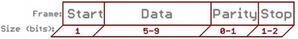
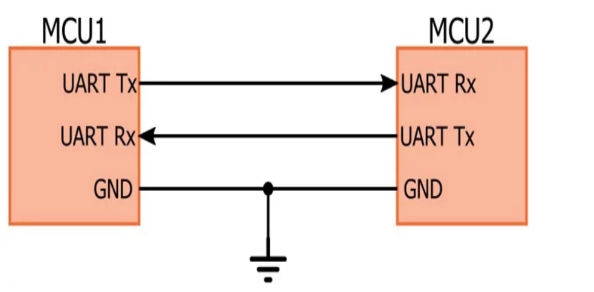
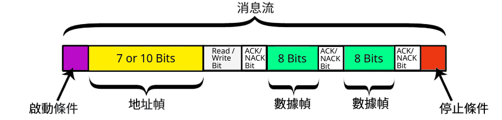
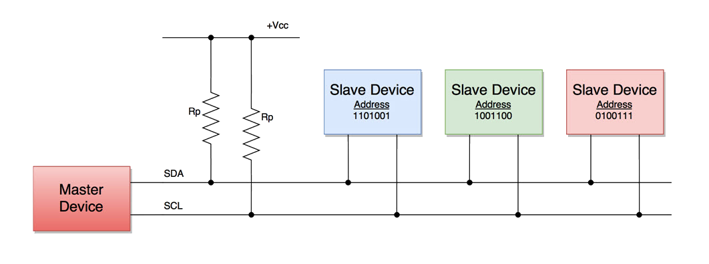
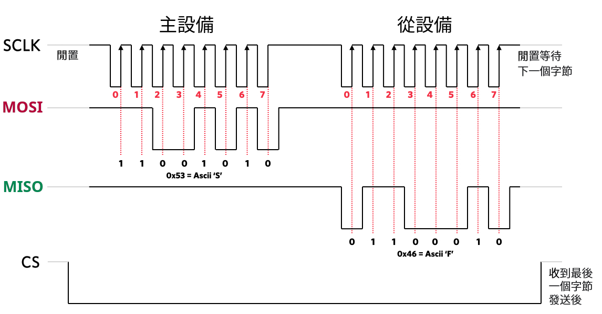
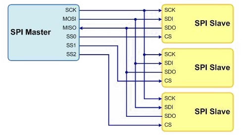
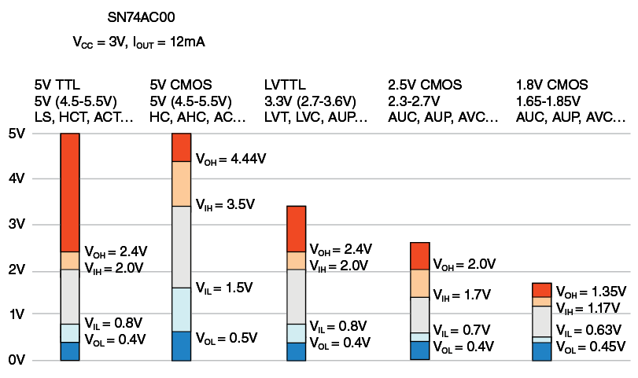

# 在嵌入式設計中經常使用的通信協議 (*UART*, *I<sup>2</sup>C* 及 *SPI*)

## UART 

通用異步收發傳輸器（Universal Asynchronous Receiver/Transmitter），通常稱作UART。是一種通用串行數據總線，用於異步通信。 該總線雙向通信，可以實現全雙工傳輸和接收。 

### UART通信協議

UART用一條傳輸線將數據一位位地順序傳送，以字符為傳輸單位，通信中兩個字符間的時間間隔多少是不固定的， 然而在同一個字符中的兩個相鄰位間的時間間隔是固定的，數據傳送速率用波特率來表示， 指單位時間內載波參數變化的次數， 或每秒鐘傳送的二進制位數，如每秒鐘傳送960個字符， 而每個字符包含10位（1個起始位， 1個停止位， 8個數據位）， 這時的波特率為9600。

|名稱|Bit(s)|描述|
|:---|:---|:---|
|起始|Start|先發出一個邏輯0信號， 表示傳輸字符的開始|
|數據位|Data|可以是5~8位邏輯0或1. 如ASCII碼（7位）， 擴展BCD碼（8位）小端傳輸|
|校驗位|Parity|數據位加上這一位後， 使得1的位數應為偶數（偶校驗）或奇數（奇校驗）
|停止位|Stop|它是一個字符數據的結束標誌。 可以是1位、1.5位、2位的高電平|
|空閒位||處於邏輯1狀態， 表示當前線路上沒有資料傳送|




### 硬件連接

硬件連接僅需要3條線，注意連接時兩個設備UART電壓，如電壓範圍不一致，必需要做電壓轉換後再連接，否則有可能損害控制板，連接如下圖所示：

 TX：發送數據端，要接對面設備的RX

 RX：接收數據端，要接對面設備的TX

 GND：保證兩設備共地



### 示例代碼

我們無法使用第 0 組UART資源，他被REPL所佔用，以及我們無法給串口id賦予大於 2。

```python
from machine import UART

# 默認值
uart=UART(1)          # rx=9, tx=10
uart=UART(2)          # rx=16, tx=17 

# 更改映射的管脚
uart = UART(2, baudrate=115200, rx=13, tx=12, timeout=10) 
```


### UART 基本的命令

|名稱|說明|
|:---|:---|
|read(10)         | 讀入10個字符|
|readline()       | 讀入一行|
|write('123')     | 向串口寫入3個字符123|
|any()            | 返回等待的字符數|


## I<sup>2</sup>C 

集成電路總線 (Inter-Integrated Circuit)，通常稱作 I<sup>2</sup>C。 是一個能夠支持多個設備的總線，包含一條雙向串行數據線SDA，一條串行時鐘線SCL。 每個連接到總線的設備都有一個獨立的地址，主機可以通過該地址來訪問不同設備。 

### I<sup>2</sup>C 通信協議

I<sup>2</sup>C 主機通過SDA線發送到從機地址（SLAVE ADDRESS）查找從機，從機地址可以是7位或10位，緊跟著從機地址的一個數據位用來表示數據傳輸方向，即第8位或11位。 為0時表示寫數據，為1時表示讀數據。數據傳輸在消息中完成，消息被分解為數據幀。該消息包括地址幀，其中包含從機的二進制地址、開始/停止條件、讀/寫位以及每個數據幀之間的 ACK/NACK。

|名稱|描述|
|:---|:---|
|啟動|SCL 線從高電平切換到低電平之前，SDA 線從高電壓電平切換到低電壓電平|
|從機地址|每個從機獨有的 7 位序列，用於在主設備需要發送/接收數據時標識從機|
|讀/寫|單個位指定主機是向從機發送數據（該位設置為“0”）還是從從機請求數據（該位設置為“1”）|
|ACK/NACK|消息中的每個幀後跟一個確認/不確認位。如果任何從設備的物理地址與主設備發送的地址匹配，則從接收設備向發送方返回一個ACK位。 （如果匹配，則該位設置為“0”，否則保持為“1”）|
|停止|當需要的數據塊通過 SDA 線傳輸時，SDA 線從低電壓電平切換到高電壓電平，然後 SCL 線從高電平切換到低電平|
|數據幀|當主設備檢測到來自從設備的 ACK 位時，第一個數據幀就可以發送了。數據幀由 8 位組成，由發送方以最高有效位在前發送。每個數據幀後緊跟一個 ACK/NACK 位，並由接收器設置為“0”以驗證該幀已成功接收。否則，它保持默認值“​​1”。根據誰在發送數據，在發送下一個數據幀之前，主設備或從設備必須接收到 ACK/NACK 位。在發送完所有數據幀後，當主機向從機發送停止條件時，傳輸停止。停止條件是在 SCL 線上的低（'0' 位）到高（'1' 位）電壓切換之後，SDA 線上的電壓從低（'0' 位）切換到高（'1' 位） ，SCL 線保持高電平。|



### 硬件連接

通常，I<sup>2</sup>C 總線信號電平5V或3.3V，如果總線上器件兼容這兩種電平，可以直接使用。如果信號電壓相差很大（比如5V和2.5V），或者電平不兼容，就需要進行電平轉換才行。



請參考鏈接中的上拉電阻設計 [Pull-Up 電阻計算](https://hkdickyko.github.io/%E7%A9%8D%E9%AB%94%E9%9B%BB%E8%B7%AF/I2C-pull-up-resistance)

### 示例代碼

```python
from machine import I2C, Pin
i2c = I2C(scl=Pin(5), sda=Pin(4), freq=100000)

```


### I<sup>2</sup>C 基本的命令

|名稱|說明|
|:---|:---|
|scan()						| 掃描0x08到0x77之間的I²C地址，並返回設備列表|
|start()					| 總線上觸發START狀態SCL為高電平時，SDA轉為低電平|
|stop()						| 總線上觸發STOP狀態SCL為高電平時，SDA轉為高電平|
|WRITE(BUF)					| BUF中的數據寫入到總線，並返回寫入的字節數|
|READINTO(BUF, NACK=TRUE)	| 總線上讀取數據並存放到BUF，沒有返回值| 

# SPI

串行外設接口（Serial Peripheral Interface Bus），通常稱作 SPI。設備以多點接口的主從關係連接。在這種類型的接口中，一個設備被認為是總線的主設備，而所有其他設備被認為是從設備。

# SPI 通信協議

SPI 設備使用主從架構以全雙工模式通信，通常與單個主設備。 控制器用於讀取和寫入的幀。通過主設備選擇 (CS)，或者從選擇 (SS) 線進行選擇，可以支持多個從設備。 SPI 被稱為四線串行總線，SPI 可以準確地描述為同步串行接口。 僅提供單一的單工通信通道。

SPI 總線由最小 4 個信號或引腳組成如下

|主設備|從設備|連接方式|引腳名稱|描述|非標準名稱|
|:---|:---:|:---:|:---:|:---|:---:|
|輸出|輸入|共用|MOSI|是Master產生數據，Slave接收的數據|COPI/DO|
|輸入|輸出|共用|MISO|是Slave產生數據，Master接收的數據|CIPO/DI|
|串行時鐘|輸入|共用|SCLK|主機產生時鐘信號給從機，告訴何時讀取數據。在時鐘的上升/下降沿發送/接收數據。||
|片選/從選|雙向|一對一|CS/SS|用於選擇特定的從機，低電平時從設備處於活動狀態。同時只能有一個從機為低電平。||

留意: 許多產品可以有非標準的 SPI 引腳名稱



### 硬件連接

通常，SPI總線信號電平5V或3.3V，如果總線上器件兼容這兩種電平，可以直接使用。如果信號電壓相差很大（比如5V和2.5V），或者電平不兼容，就需要進行電平轉換才行。




### 示例代碼

MicroPython只允許存在一個SPI，HSPI和VSPI只能存在一個，不能一起使用。 軟件SPI構造較為硬件要傳入的參數多。

```python
from machine import SPI

# 默認值
hspi = SPI(1)
vspi = SPI(2)

# 軟件SPI構造
spi = SPI(baudrate=100000, polarity=1, phase=0, sck=Pin(17), mosi=Pin(27), miso=Pin(18))

```


### SPI 基本的命令

|名稱|說明|
|:---|:---|
|write(BUF)				| 將BUF中的所有數據寫入到總線|
|read(len, data=0x00)	| 讀取len個數據的同時寫入len個data數據，以數組的形式返回讀取到的數據|
|deinit()	| 關閉|

## *UART*, *I<sup>2</sup>C* 及 *SPI* 通信協議總結


|通信協議|UART|I2C|SPI|
|:---|:---:|:---:|:---|:---:|
|複雜性|簡單|易於鏈接多個設備|增加時變得複雜|
|速度|最慢|快|最快|
|設備數量|最多 2 個|最多127個|很多|
|線數|1|2|4|
|雙工|全雙工|半雙工|全雙工|
|主從數量|一個對一個|多個對多個|一個主站對多個從站|


## *TTL* 及 *CMOS* 邏輯閾值電壓電平範圍參考

邏輯電路有幾種不同的電壓標準，其中我們最常遇到的兩種標準是 *5*V 和 *3.3*V。每個單獨的邏輯系列都有一個電壓範圍，而不是它識別為特定邏輯電平的單個電壓。 *TTL* 接受的範圍比其 *CMOS* 穩定版本大。因此，*5*V TTL 輸入會檢測到 *3.3*V 輸出的邏輯電平，而 *CMOS* 版本則不會。電壓電平總結如下圖所示。

