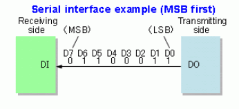

# 在嵌入式設計中經常使用的通信協議

## UART 

通用異步收發傳輸器（Universal Asynchronous Receiver/Transmitter），通常稱作UART。是一種通用串行數據總線，用於異步通信。 該總線雙向通信，可以實現全雙工傳輸和接收。 

### UART通信協議

 　　UART用一條傳輸線將數據一位位地順序傳送，以字符為傳輸單位，通信中兩個字符間的時間間隔多少是不固定的， 然而在同一個字符中的兩個相鄰位間的時間間隔是固定的，數據傳送速率用波特率來表示， 指單位時間內載波參數變化的次數， 或每秒鐘傳送的二進制位數，如每秒鐘傳送960個字符， 而每個字符包含10位（1個起始位， 1個停止位， 8個數據位）， 這時的波特率為9600。

|名稱|Bit(s)|描述|
|:---|:---|:---|
|起始|Start|先發出一個邏輯0信號， 表示傳輸字符的開始|
|數據位|Data|可以是5~8位邏輯0或1. 如ASCII碼（7位）， 擴展BCD碼（8位）小端傳輸|
|校驗位|Parity|數據位加上這一位後， 使得1的位數應為偶數（偶校驗）或奇數（奇校驗）
|停止位|Stop|它是一個字符數據的結束標誌。 可以是1位、1.5位、2位的高電平|
|空閒位||處於邏輯1狀態， 表示當前線路上沒有資料傳送|

### 硬件連接

硬件連接僅需要3條線，注意連接時兩個設備UART電壓，如電壓範圍不一致，必需要做電壓轉換後再連接，否則有可能損害控制板，連接如下圖所示：

 TX：發送數據端，要接對面設備的RX

 RX：接收數據端，要接對面設備的TX

 GND：保證兩設備共地

### Uart 電壓範圍參考

## I2C 

I2C 是一個能夠支持多個設備的總線，包含一條雙向串行數據線SDA，一條串行時鐘線SCL。 每個連接到總線的設備都有一個獨立的地址，主機可以通過該地址來訪問不同設備。 

### I2C 通信協議

集成電路總線 (Inter-Integrated Circuit)，通常稱作 I2C。主機通過SDA線發送到從機地址（SLAVE ADDRESS）查找從機，從機地址可以是7位或10位，緊跟著從機地址的一個數據位用來表示數據傳輸方向，即第8位或11位。 為0時表示寫數據，為1時表示讀數據。數據傳輸在消息中完成，消息被分解為數據幀。該消息包括地址幀，其中包含從機的二進制地址、開始/停止條件、讀/寫位以及每個數據幀之間的 ACK/NACK。

|名稱|描述|
|:---|:---|
|啟動|SCL 線從高電平切換到低電平之前，SDA 線從高電壓電平切換到低電壓電平|
|從機地址|每個從機獨有的 7 位序列，用於在主設備需要發送/接收數據時標識從機|
|讀/寫|單個位指定主機是向從機發送數據（該位設置為“0”）還是從從機請求數據（該位設置為“1”）|
|ACK/NACK|消息中的每個幀後跟一個確認/不確認位。如果任何從設備的物理地址與主設備發送的地址匹配，則從接收設備向發送方返回一個ACK位。 （如果匹配，則該位設置為“0”，否則保持為“1”）|
|停止|當需要的數據塊通過 SDA 線傳輸時，SDA 線從低電壓電平切換到高電壓電平，然後 SCL 線從高電平切換到低電平|
|數據幀|當主設備檢測到來自從設備的 ACK 位時，第一個數據幀就可以發送了。數據幀由 8 位組成，由發送方以最高有效位在前發送。每個數據幀後緊跟一個 ACK/NACK 位，並由接收器設置為“0”以驗證該幀已成功接收。否則，它保持默認值“​​1”。根據誰在發送數據，在發送下一個數據幀之前，主設備或從設備必須接收到 ACK/NACK 位。在發送完所有數據幀後，當主機向從機發送停止條件時，傳輸停止。停止條件是在 SCL 線上的低（'0' 位）到高（'1' 位）電壓切換之後，SDA 線上的電壓從低（'0' 位）切換到高（'1' 位） ，SCL 線保持高電平。|

### 硬件連接

請參考鏈接中的上拉電阻設計 [Pull-Up 電阻計算](https://hkdickyko.github.io/%E7%A9%8D%E9%AB%94%E9%9B%BB%E8%B7%AF/I2C-pull-up-resistance)

### I2C 電壓範圍參考

 通常，I2C 總線信號電平5V、3.3V居多，如果總線上器件兼容這兩種電平，可以直接使用。如果信號電壓相差很大（比如5V和2.5V），或者電平不兼容，就需要進行電平轉換才行。

# SPI

串行外設接口（Serial Peripheral Interface Bus），通常稱作 SPI。設備以多點接口的主從關係連接。在這種類型的接口中，一個設備被認為是總線的主設備，而所有其他設備被認為是從設備。

SPI 總線由 4 個信號或引腳組成

# SPI 通信協議

SPI 設備使用主從架構以全雙工模式通信，通常與單個主設備。 控制器用於讀取和寫入的幀。通過主設備選擇 (CS)，或者從選擇 (SS) 線進行選擇，可以支持多個從設備。 SPI 被稱為四線串行總線，SPI 可以準確地描述為同步串行接口。 僅提供單一的單工通信通道。

|主設備|從設備|符號|描述|非標準名稱|
|:---|:---:|:---:|:---|:---:|
|輸出|輸入|MOSI|是Master產生數據，Slave接收的數據|COPI/DO|
|輸入|輸出|MISO|是Slave產生數據，Master接收的數據|CIPO/DI|
|串行時鐘||SCLK|主機產生時鐘信號給從機，告訴何時讀取數據。在時鐘的上升/下降沿發送/接收數據。||
|片選/從選||CS/SS|用於選擇特定的從機，低電平時從設備處於活動狀態。同時只能有一個從機為低電平。||

留意: 許多產品可以有非標準的 SPI 引腳名稱

### 硬件連接

