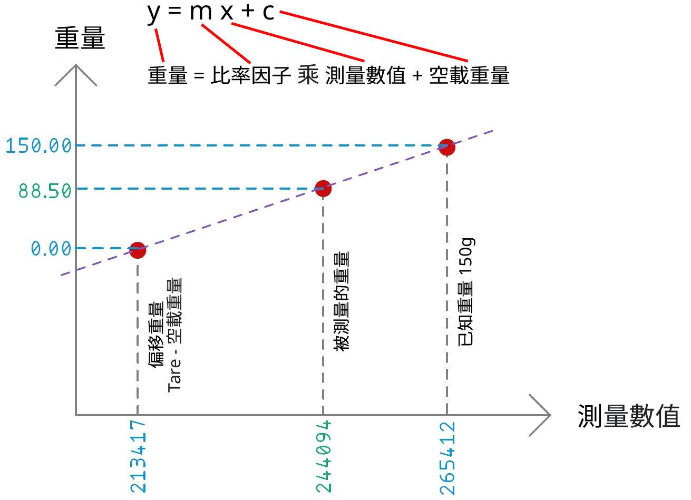

# 模數轉換器及數模轉換器

模數轉換器（ADC, A/D）是一種將模擬信號轉換為數字信號的系統。 通常，數字輸出是與輸入成正比的二進制補碼二進制數，但也有其他可能性。數模轉換器 (DAC, D/A) 執行反向功能；它將數字信號轉換為模擬信號。

## 例子 HX711 24 位模數轉換器

本模塊採用24位高精度A/D轉換器。該芯片專為高精度電子秤而設計，具有兩個模擬輸入通道，可編程增益為128的集成放大器。可配置輸入電路提供電橋電壓電橋（如壓力、負載）傳感器模型，是一種理想的高精度、低成本採樣前端模塊。

 - 通道 *A* 增益為 128 和 64 增益比
 - 通道 *B* 增益為 32 增益比
 
從稱重傳感器上的惠斯通電橋出來的四根電線通常是：

 - 勵磁+ VCC 為紅色 (E+)
 - 勵磁- 地為黑色 (E-)
 - 輸出+ 為白色 (A+)
 - 輸出- 為綠色 (A-)
 
為了得到秤測量的重量值，我們需要一個比率因子。 我們從 HX711 讀取數據，然後將已知重量放在秤上並再次讀取數據，相差數值除以已知重量將給出我們需要的比率因子。
 
零平衡的偏移通常是由傳感區域的殘餘應力引起的。殘餘應力是由電池過載或重複操作循環引起的。它應在指定零輸出信號的 0.1% 以內。

# 模數轉換器校準

這取決於數學,使用簡單的線性函數：$ y = mx + c $ 或 $ m = \frac{y-x}{b} $

 - y 是您想要的任何單位的實際重量（g, kg 或oz 等）
 - x 是來自 HX711 的原始值
 - m 是你的斜率（比率因子）
 - b 是您的交點（偏移量）

您可以使用 m 乘以 x 來獲得實際重量 y。 你的公式可能完全不同，但基本原理方法是一樣的。


 
使用稱重傳感器時，請檢查箭頭方向。箭頭表示負載方向以進行重量測量。箭頭指向下部，箭頭末端放置負載重量。
 
  [網絡資源 HX711](https://github.com/SergeyPiskunov/micropython-hx711)


```python
from drivers.hx711 import HX711
from utime import sleep_us

class Scales(HX711):
    def __init__(self, d_out, pd_sck):
        super(Scales, self).__init__(d_out, pd_sck)
        self.offset = 0

    def reset(self):
        self.power_off()
        self.power_on()

    def tare(self):
        self.offset = self.read()

    def raw_value(self):
        return self.read() - self.offset

    def stable_value(self, reads=10, delay_us=500):
        values = []
        for _ in range(reads):
            values.append(self.raw_value())
            sleep_us(delay_us)
        return self._stabilizer(values)

    @staticmethod
    def _stabilizer(values, deviation=10):
        weights = []
        for prev in values:
            if prev != 0:
                weights.append(sum([1 for current in values if abs(prev - current) / (prev / 100) <= deviation]))
        return sorted(zip(values, weights), key=lambda x: x[1]).pop()[0]


if __name__ == "__main__":
    scales = Scales(d_out=5, pd_sck=4)
    while True:
        scales.power_on()
        scales.tare()
        val = scales.stable_value()
        print(val)
        scales.power_off()

```