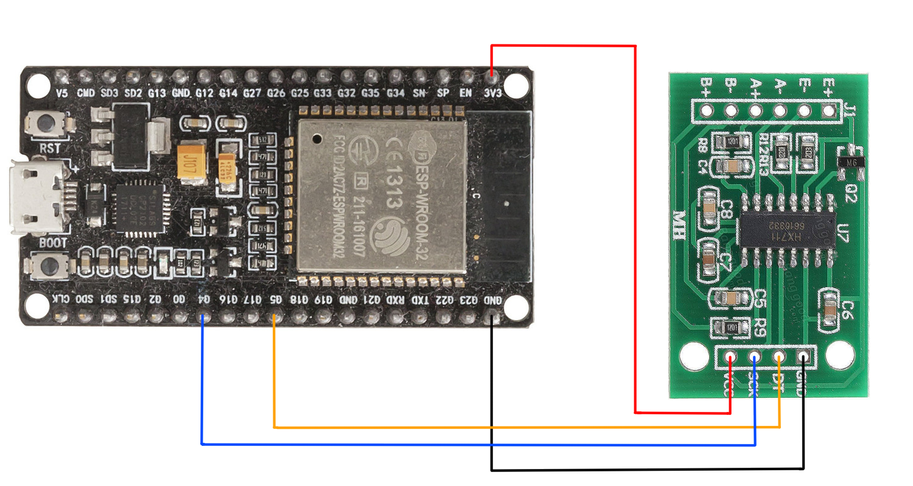

# 模數轉換器及數模轉換器

模數轉換器（ADC, A/D）是一種將模擬信號轉換為數字信號的系統。 通常，數字輸出是與輸入成正比的二進制補碼二進制數，但也有其他可能性。數模轉換器 (DAC, D/A) 執行反向功能；它將數字信號轉換為模擬信號。

## 例子 HX711 24 位模數轉換器

本模塊採用24位高精度A/D轉換器。該芯片專為高精度電子秤而設計，具有兩個模擬輸入通道，可編程增益為128的集成放大器。可配置輸入電路提供電橋電壓電橋（如壓力、負載）傳感器模型，是一種理想的高精度低成本採樣前端模塊。

 - 通道 *A* 增益為 128 和 64 增益比
 - 通道 *B* 增益為 32 增益比
 
從稱重傳感器上的惠斯通電橋出來的四根電線通常是：

 - 勵磁+ VCC 為紅色 (E+)
 - 勵磁- 地為黑色 (E-)
 - 輸出+ 為白色 (A+)
 - 輸出- 為綠色 (A-)
 
為了得到秤測量的重量值，我們需要一個比率因子。 我們從 HX711 讀取數據，然後將已知重量放在秤上並再次讀取數據，相差數值除以已知重量將給出我們需要的比率因子。
 
零平衡的偏移通常是由傳感區域的殘餘應力引起的。殘餘應力是由電池過載或重複操作循環引起的。它應在指定零輸出信號的 0.1% 以內。

# 模數轉換器校準

這取決於數學,使用簡單的線性函數：$ y = mx + c $

 - y 是您想要的任何單位的實際重量（g, kg 或 oz 等）
 - x 是來自 HX711 的原始值
 - m 是你的斜率（比率因子）
 - c 是您的交點
 - t 空載重量


這些原始值是無單位的,模塊不知道你測量是克或磅，它只知道值的變化。因此，當您從秤上移除所有重量時，仍然會測量到一個非零值。我們稱之為零偏移量(空載重量)（也稱為 y = mx + c 的 +c 部分)。

 - 空載重量 = 213417
 - 比率因子 = (265412 - 213417) / 150g = 346.6333/g

未知重量 = (要檢查的重量值 - 空載重量) / 比率因子

 - (244094 - 213417) / 346.633 = 88.4999g

您可以使用下面的計算方法來獲得實際測量重量。 為了更準確公式可能更複雜，但基本原理方法是一樣。


 
使用稱重傳感器時，請檢查箭頭方向。箭頭表示負載方向以進行重量測量。箭頭指向下部，箭頭末端放置負載重量。
 
  [網絡資源 HX711](https://github.com/SergeyPiskunov/micropython-hx711)


```python
from drivers.hx711 import HX711
from utime import sleep_us, sleep_ms

class Scales(HX711):
    def __init__(self, d_out, pd_sck):
        super(Scales, self).__init__(d_out, pd_sck)
        self.offset = 0
        self.ratio = 0

    def reset(self):
        self.power_off()
        self.power_on()

    def tare(self):
        self.offset = self.stable_value()
        return self.offset

    def raw_value(self):
        return self.read() # - self.offset

    def stable_value(self, reads=100, delay_us=500):
        values = []
        for _ in range(reads):
            values.append(self.raw_value())
            sleep_us(delay_us)
        return sum(values) / len(values)            

    def getValue(self):
        val = (scales.stable_value() - self.offset) / self.ratio
        return val

    def calibration(self, g):
        self.ratio = (scales.stable_value() - self.offset) / g
        return self.ratio

if __name__ == "__main__":
    scales = Scales(d_out=5, pd_sck=4)
    scales.power_on()
    sleep_ms(400) # 輸出穩定時間 400ms
    while not scales.is_ready():
        print(".", end='')
    print("準備期")
    sleep_ms(2000) # 穩定時間 2s
    flag = True
    while flag:
      cmd = input("\n輸入您的選擇 (o:校準空載重量 c:校準比率因子, s:測量, x:離開) : ")
      if cmd == 'o':
        print("校準空載重量 : {}".format(scales.tare()))
      if cmd == 'c':
        print("校準比率因子 : {}".format(scales.calibration(268))) # 268g 參考重量
      if cmd == 's' :
        val = scales.getValue()
        print("測量值 : {}g".format(val))
      if cmd == 'x' :
        scales.power_off()
        flag = False
    print("\n停止及離開!")

```

