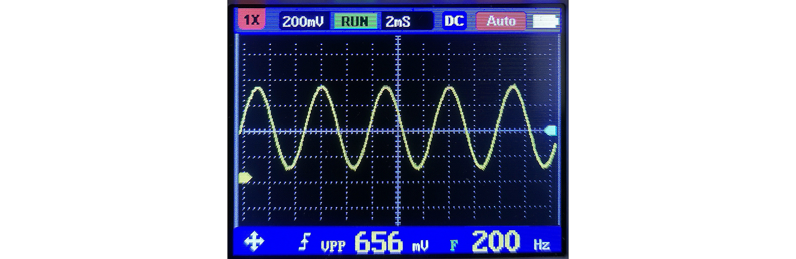
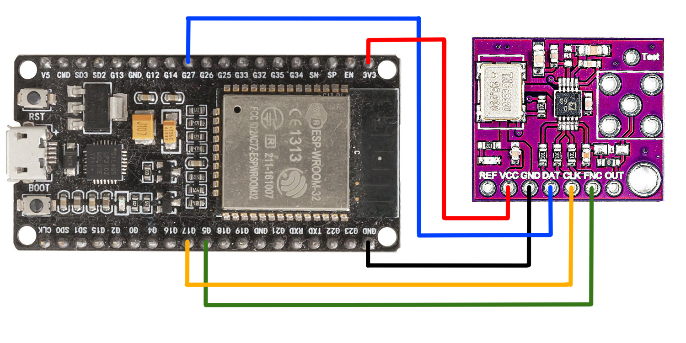

# 直接數字合成 (DDS) 

直接數字合成是頻率合成器採用的一種方法，用於從單個固定頻率參考時鐘創建任意波形。 DDS 用於信號生成,通信系統中的本地振盪器,函數發生器,混頻器,調製器,聲音合成器等應用。 

直接數字合成 (DDS) 是一種通過生成數字形式的時變信號然後執行數模轉換來產生模擬波形（通常是正弦波）的方法。由於 DDS 設備內的操作主要是數字化的，因此它可以在輸出頻率、精細頻率分辨率和寬頻譜範圍內提供快速切換。隨著設計和工藝技術的進步，DDS 設備非常緊湊且功耗極低。

準確產生和控制各種頻率和輪廓的波形的能力已成為許多行業共同的關鍵要求。無論是為通信提供具有良好雜散性能的靈活低相位噪聲可變頻率源，還是在工業或生物醫學測試設備應用中簡單地生成頻率激勵，便利性,緊湊性和低成本都是重要的設計考慮因素。

頻率生成的許多可能性對設計人員開放，從用於甚高頻合成的基於鎖相環 (PLL) 的技術到數模轉換器 (DAC) 輸出的動態編程以生成任意波形較低的頻率。但是 DDS 技術在解決通信和工業應用中的頻率（或波形）生成要求方面正在迅速獲得認可，因為單芯片 IC 器件可以簡單地生成具有高分辨率和準確度的可編程模擬輸出波形。

目前使用基於 DDS 的波形生成的應用分為兩大類：
 
 - 需要具有出色相位噪聲和低雜散性能的敏捷（即立即響應）頻率源的通信系統設計人員通常選擇 DDS，因為它兼有頻譜性能和頻率調諧分辨率.此類應用包括使用 DDS 進行調製作為 PLL 的參考以增強整體頻率可調性作為本地振盪器 (LO)，甚至用於直接 RF 傳輸。
 - DDS 作為可編程波形發生器用於許多工業和生物醫學應用。由於 DDS 是數字可編程的，可以輕鬆調整波形的相位和頻率，而無需使用傳統模擬編程波形發生器(一般需要更改的外部組件)。 DDS 允許實時簡單調整頻率以定位諧振頻率或補償溫度漂移。此類應用包括在可調頻率源中使用 DDS 來測量阻抗，生成用於微驅動的脈衝波調製信號，或檢查 LAN 或電話電纜中的衰減。


DDS IC 在通信系統和傳感器應用中變得越來越普遍。使的優勢包括：

 - 數控微赫茲頻率調諧和亞度相位調諧能力
 - 調諧輸出頻率（或相位）的跳頻速度極快；無過衝/下衝或模擬相關環路穩定時間異常的相位連續跳頻
 - DDS 的數字架構消除了與模擬合成器解決方案中的組件老化和溫度漂移相關的手動調諧和調整的需要
 - DDS 架構的數字控制接口促進了一種環境，在該環境中，可以在處理器控制下以高分辨率對系統進行遠程控制和優化

## AD9833

AD9833 是一款基於 DDS 的可編程波形發生器，在 5.5 V 電壓和 25 MHz 時鐘下運行，最大功耗為 30 毫瓦。

AD9833器件通過高速串行外設接口 (SPI) 進行編程，只需要一個外部時鐘即可生成簡單的正弦波。 DDS 設備現在可用，可以生成從小於 1 Hz 到 400 MHz（基於 1 GHz 時鐘）的頻率。其低功耗、低成本和單個小封裝的優勢，結合其固有的優異性能和對輸出波形進行數字編程（和重新編程）的能力，使 DDS 設備成為極具吸引力的解決方案。


AD9833 可以使用以下公式找到所需的頻率寄存器值:

$$ FREQREG = \frac{f_{out}\times{2^{28}}}{f_{MCLK}} $$

其中 f<sub>OUT</sub> 是 AD9833 的所需輸出頻率，f<sub>MCLK</sub> 是時鐘驅動器提供的主時鐘信號輸入的頻率。

例如，要使用 400H<sub>z</sub> 主時鐘信號設置 25MH<sub>z</sub> 的輸出頻率：

$$ FREQREG = \frac{400\times{2^{28}}}{25\times{10^{6}}} $$

$$ = 4295 (DEC) = 10C7 (HEX) = 0001000011000111_{2} $$

ad9833.py 在 **AD9833** 中生成頻率驅動程序代碼

```python
class AD9833(object):

    def __init__(self, spi, ss, ClockFreq=25000000):
        self.spi = spi
        self.ss = ss
        self.freq = 10000
        self.shape_word = 0x2000
        self.ClockFreq = ClockFreq

    def _bytes(self, integer):
        return divmod(integer, 0x100)

    def _send(self, data):
        high, low = self._bytes(data)
        buf = bytearray([high,low])
        self.ss.value(0)
        self.spi.write(buf)
        self.ss.value(1)

    def set_freq(self, value):
        self.freq = value

    def set_type(self, inter):
        if inter == 1:
            self.shape_word = 0x2020
        elif inter == 2:
            self.shape_word = 0x2002
        else:
            self.shape_word = 0x2000

    @property
    def shape_type(self):
        # square: 0x2020, sin: 0x2000, triangle: 0x2002
        if self.shape_word == 0x2020:
            return "Square"
        elif self.shape_word == 0x2002:
            return "Triangle"
        else:
            return "Sine"

    def send(self):
        word = hex(int(round((self.freq*2**28)/self.ClockFreq)))
        MSB = (int(word, 16) & 0xFFFC000) >> 14
        LSB = int(word, 16) & 0x3FFF
        # Set control bits DB15 = 0 and DB14 = 1; for frequency register 0
        MSB |= 0x4000
        LSB |= 0x4000
        self._send(0x2100)
        # Set the frequency
        self._send(LSB)  # lower 14 bits
        self._send(MSB)  # Upper 14 bits
        self._send(self.shape_word)

```


main.py 使用上面的 MicroPython 代碼的示例

```python
from machine import SPI, Pin
from drivers.ad9833 import AD9833

spi = SPI(baudrate=100000, polarity=1, phase=0, sck=Pin(17), mosi=Pin(27), miso=Pin(18))
cs = Pin(5, Pin.OUT)

wave = AD9833(spi, cs)
wave.set_freq(2000)
wave.set_type(0)
wave.send()
print("頻率: {}, 波形: {}.".format(wave.freq, wave.shape_type))

```



