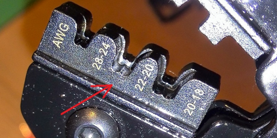

---
 category: [積體電路]
 tags: [IoT, 編程]
 title: 杜邦線製作
 date: 2021-11-12 12:00:00
 ---

 # 杜邦線

 杜邦線自己動手製作。

  - 工具：尖嘴鉗，剝線鉗，壓線鉗，剪線鉗。

  - 材料：22AWG 電線，杜邦頭簧片和膠頭。

 ## 準備電線

 把電線剪成需要的長度，兩端剝出約3mm的內芯。 稍長倒也可接受，如果太短就壓不緊了。 杜邦線要求的線規是22 AWG，是美國的國標，主要是規定了內芯直徑（大約為0.6mm）。

 ## 杜邦頭簧片卡到壓線鉗中

壓線鉗用法，如線規是 22 AWG，使用鉗子中間的壓槽，注意這裡標明為 22-20。 要注意卡槽靠近人一側（正面）的一半要闊一些，另一側（背面）就要窄一些。 闊的一半是用來壓電線膠皮的，窄的一半壓電線內芯。 手捏著簧片末端，放入卡槽，稍稍壓一壓鉗子，讓簧片卡住。 注意，簧片朝下放置，簧片上壓膠皮和內芯的部分要放在卡槽內相應的位置。 按照我的經驗，壓膠皮的部分有一定的活動範圍，大概放在這個範圍的中間為好。 如果太靠外（正面），會把簧片末端不該壓的部分壓到，導致簧片報廢。 如果太靠裡，則電線膠皮部分壓的長度不夠，牢靠度降低。 我一般先找到最靠裡的位置，然後往外伸過來2mm左右，這樣壓出的長度比較合適。 多嘗試幾次就有分寸了。

注意:下圖壓線鉗分為兩部份遠的比較高的是壓線芯用，近的低的部份是用作壓膠皮。電線膠皮要推進壓線鉗的低位部份內壓緊。

 ## 壓線
線頭從正面插入簧片內，深度以插到底為限，膠片會被簧片和鉗子的壓槽擋住，剛好位於兩部分的交界處，剛好。 把鉗子壓緊後鬆手，鉗子自動彈開，線頭就壓好了，可以取出來。 如果鉗子沒有壓到底，它是不會自動彈開的。

注意:下圖中間部份是壓線芯用，而最下部份為壓膠皮。

 ## 套膠套
 給線頭戴上套子。 插到底，應該會聽到2次咔嚓聲，簧片就被套子卡牢了。 如矽膠線，外徑太大，套子很難套進去。 這時候就要用尖嘴鉗把膠皮部分的簧片壓緊。 這一步需要耐心，可能要反复嘗試和調整，並且最終還是要一點點地推進去。

注意:下圖中簧片是套進套膠套之坑槽部分。

