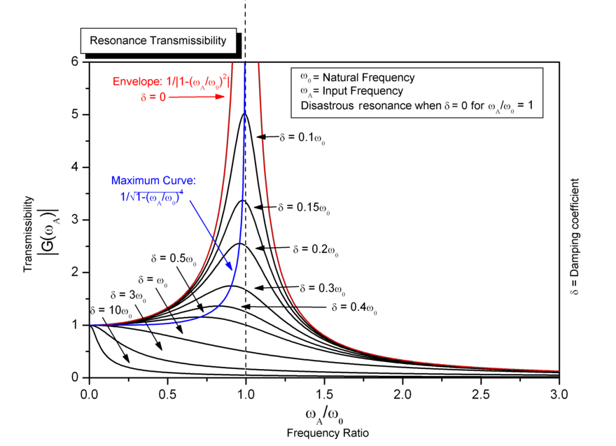
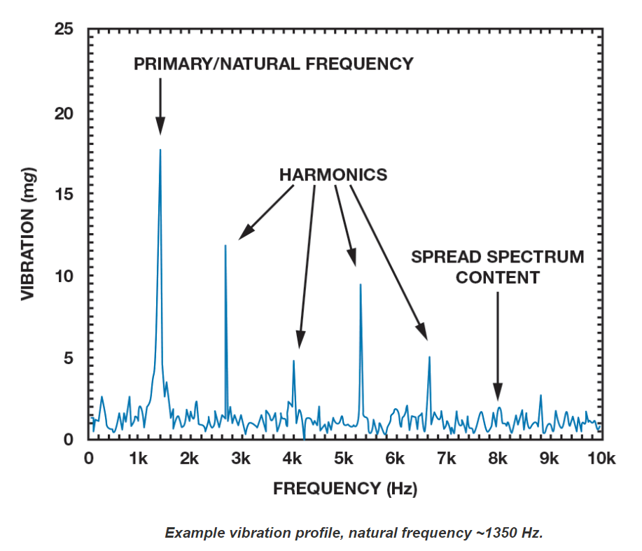
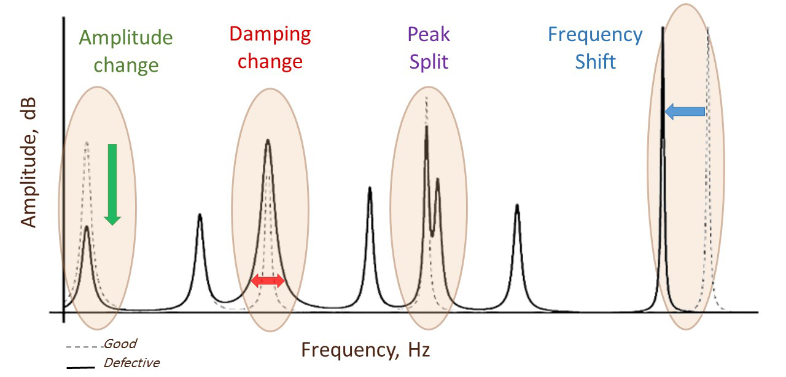

# 振動

所有物體都會振動。每個物體都有自己的振動模式。每個模式代表一個自然頻率的駐波或共振。每個物體的振動模式都是獨一無二的，就像物體的指紋一樣。這些模式描述了對象的內在動態特性。

- δ 是阻尼

當我們撞擊一個物體或應用掃頻正弦時，我們可以識別它的動態行為或頻率響應函數。為響應衝擊，所有模式都被激發，並且每個模式都以特定頻率（本徵頻率）振動。每個模式都是一個振動自由度，它以其固有頻率作為阻尼正弦波振動。物體的整體振動是所有模態振動的疊加。

我們可以使用質量彈簧阻尼器的自由振動來模擬模式（一個自由度）。振動的固有頻率（無阻尼）為

 $$ f=\sqrt{\frac{k}{m}} $$
 
在結構振動中:
 - k 代表機械特性（剛度，楊氏模量彈性特性）
 - m 代表密度和尺寸（質量）。

零件中的缺陷會降低剛度 k (彈簧的剛度)，因此固有頻率 f 根據以上公式移動（降低）。頻移與疲勞或斷裂強度具有高度相關性。所以自然頻率可以代表結構的質量。這種相關性是聲學共振測試的基礎。

## 改變振動特性的方法

- 頻移
- 阻尼
- 振動幅度
- 分裂更多峰

在實踐中，可以使用以下規則來移動固有頻率並使系統的振動響應最小化：

 - 增加剛度會增加固有頻率
 - 增加質量會降低固有頻率
 - 增加阻尼會降低峰值響應，但會擴大響應範圍
 - 降低阻尼會增加峰值響應，但會縮小響應範圍
 - 降低強迫振幅會降低共振響應

以上各點，歸納如下表。

|關係|頻率|阻尼|振幅| 
|:---:|:---:|:---:|:---:|
|正比|剛度|頻寬|共振|
|反比|質量|峰值||