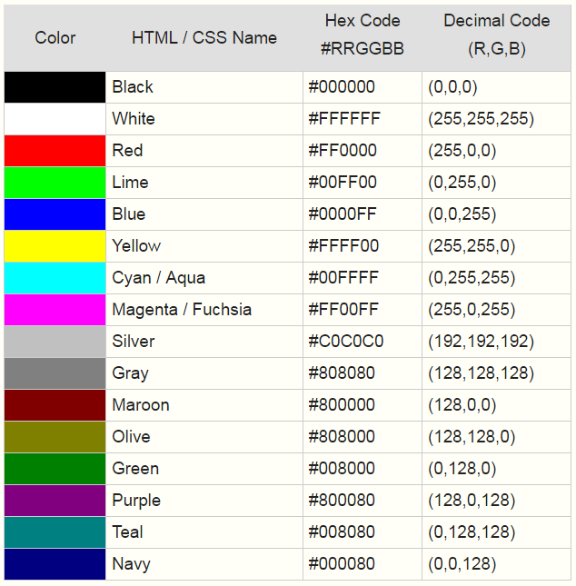
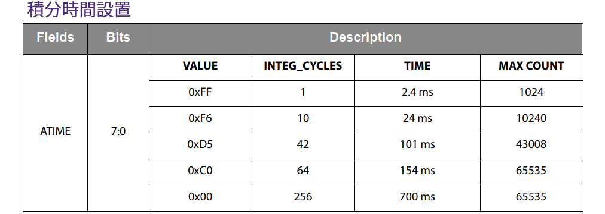

# 顏色傳感器

TCS3472 器件提供紅色、綠色、藍色 (RGB) 和清晰光感測值的數字返回。 IR 濾光片集成在芯片上並位於顏色感應光電二極管，可最大限度地減少入射光的 IR 光譜分量，並允許準確地進行顏色測量。

注意需要調節積分時間和增益倍數兩個參數，獲取相對準確的 RGB 的顏色值。






# 色溫（照明技術術語中的相關色溫或 CCT）

色溫是描述燈泡提供的光外觀的一種方式。 它以開爾文 (K) 度數為單位測量，範圍從 1,000 到 10,000。 通常，商業和住宅照明應用的開爾文溫度介於 2000K 到 6500K 之間。

# 閾值 Threshold

兩個 16 位中斷閾值寄存器允許用戶設置低於和高於 *所需亮度的限制* 。 注意閾值是按順序評估的，首先是低閾值，然後是高閾值臨界點。如果將低閾值設置為高於高閾值，則忽略高閾值，僅評估低閾值。 電子設備的閾值限制輸出對測量輸入變化的響應。產生測量讀數變化所需的總閾值取決於換能器和信號調節電子設備分辨率。


```python
import ustruct
from time import sleep_ms
import array

_COMMAND_BIT = const(0x80)
_REGISTER_AILT = const(0x04)
_REGISTER_AIHT = const(0x06)
_REGISTER_ENABLE = const(0x00)
_ENABLE_AIEN = const(0x10)
_REGISTER_APERS = const(0x0c)
_REGISTER_CONTROL = const(0x0f)
_REGISTER_ATIME = const(0x01)
_ENABLE_AEN = const(0x02)
_ENABLE_PON = const(0x01)
_REGISTER_STATUS = const(0x13)
_REGISTER_CDATA = const(0x14)
_REGISTER_RDATA = const(0x16)
_REGISTER_GDATA = const(0x18)
_REGISTER_BDATA = const(0x1a)

_CYCLES = (0, 1, 2, 3, 5, 10, 15, 20, 25, 30, 35, 40, 45, 50, 55, 60)
_GAINS = (1, 4, 16, 60)

class TCS3472():
        
    def __init__(self, i2c, led):
        self._i2c = i2c
        self._address = 0x29
        self._led = led
        self.cycles = 1
        self._active = False
        self.gain(1)
        self.integration_time(2.4)

    def _8bits(self, register, value=None):
        register |= _COMMAND_BIT
        if value is None:
            return self._i2c.readfrom_mem(self._address, register, 1)[0]
        data = ustruct.pack('<B', value)
        self._i2c.writeto_mem(self._address, register, data)

    def _16bits(self, register, value=None):
        register |= _COMMAND_BIT
        if value is None:
            data = self._i2c.readfrom_mem(self._address, register, 2)
            return ustruct.unpack('<H', data)[0]
        data = ustruct.pack('<H', value)
        self._i2c.writeto_mem(self._address, register, data)
        
    def readStatus(self):
        return self._8bits(REG_STATUS)

    def readRawData(self):
        c = self._16bits(REG_CDATA)
        r = self._16bits(REG_RDATA)
        g = self._16bits(REG_GDATA)
        b = self._16bits(REG_BDATA)
        data = (r, g, b, c)
        return self.html_hex(data)
    
    def _valid(self):
        return bool(self._8bits(_REGISTER_STATUS) & 0x01)

    def read(self, raw=False):
        was_active = self.active()
        self.active(True)
        while not self._valid():
            sleep_ms(int(self._integration_time + 0.9))
        data = tuple(self._16bits(register) for register in (
            _REGISTER_RDATA,
            _REGISTER_GDATA,
            _REGISTER_BDATA,
            _REGISTER_CDATA,
        ))
        self.active(was_active)
        if raw:
            return data
        return self.convertRGB(data)    
    
    def active(self, value=None):
        if value is None:
            return self._active
        value = bool(value)
        if self._active == value:
            return
        self._active = value
        enable = self._8bits(_REGISTER_ENABLE)
        if value:
            self._8bits(_REGISTER_ENABLE, enable | _ENABLE_PON)
            sleep_ms(3)
            self._8bits(_REGISTER_ENABLE,
                enable | _ENABLE_PON | _ENABLE_AEN)
        else:
            self._8bits(_REGISTER_ENABLE,
                enable & ~(_ENABLE_PON | _ENABLE_AEN))    
    
    def cct(self, data):
        r, g, b, c = data
        # 基於 6500K 熒光、3000K 熒光 和 60W 白熾燈值範圍很廣。 
        # RGB 值映射到它們的 XYZ 對應值、Y = 照度或勒克斯 
        x = -0.14282 * r + 1.54924 * g + -0.95641 * b
        y = -0.32466 * r + 1.57837 * g + -0.73191 * b
        z = -0.68202 * r + 0.77073 * g +  0.56332 * b
        # 計算色度坐標
        xc = X / (X + Y + Z);
        yc = Y / (X + Y + Z);
        # 使用 McCamy 公式確定 CCT
        n = (xc - 0.3320) / (0.1858 - yc)
        # 計算最終的 CCT
        cct = 449.0 * n**3 + 3525.0 * n**2 + 6823.3 * n + 5520.33
        return cct, y

    def integration_time(self, value=None):
        if value is None:
            return self._integration_time
        value = min(614.4, max(2.4, value))
        self.cycles = int(value / 2.4)
        self._integration_time = self.cycles * 2.4
        return self._8bits(_REGISTER_ATIME, 256 - self.cycles)

    def gain(self, value):
        if value is None:
            return _GAINS[self._8bits(_REGISTER_CONTROL)]
        if value not in _GAINS:
            raise ValueError("gain must be 1, 4, 16 or 60")
        return self._8bits(_REGISTER_CONTROL, _GAINS.index(value))    
    
    def onLeds(self, flag):
        if flag :
            self._led.value(1)
        else:
            self._led.value(0)
        
    def convertRGB(self, data):
        r, g, b, c = data
        r = int(255 * r / c) 
        g = int(255 * g / c)
        b = int(255 * b / c)
        return (r, g , b)
   
    def toHex(self, data):
        r, g, b = data
        return "{:02x}{:02x}{:02x}".format(int(r), int(g), int(b))
    
    def threshold(self, cycles=None, min_value=None, max_value=None):
        if cycles is None and min_value is None and max_value is None:
            min_value = self._16bits(_REGISTER_AILT)
            max_value = self._16bits(_REGISTER_AILT)
            if self._8bits(_REGISTER_ENABLE) & _ENABLE_AIEN:
                cycles = _CYCLES[self._8bits(_REGISTER_APERS) & 0x0f]
            else:
                cycles = -1
            return cycles, min_value, max_value
        if min_value is not None:
            self._16bits(_REGISTER_AILT, min_value)
        if max_value is not None:
            self._16bits(_REGISTER_AIHT, max_value)
        if cycles is not None:
            enable = self._8bits(_REGISTER_ENABLE)
            if cycles == -1:
                self._8bits(_REGISTER_ENABLE, enable & ~(_ENABLE_AIEN))
            else:
                self._8bits(_REGISTER_ENABLE, enable | _ENABLE_AIEN)
                if cycles not in _CYCLES:
                    raise ValueError("invalid persistence cycles")
                self._8bits(_REGISTER_APERS, _CYCLES.index(cycles))
                
    def gammaTable(self):
        self._gamma = array.array('B')
        for i in range(256):
            x = i / 255.0;
            value = int(pow(x, 2.5) * 255.0)
            self._gamma.append(value);
            
    def gamma(self, value):
        return self._gamma[int(value)]

```

main.py 使用上面的 MicroPython 代碼的示例

```python
from machine import Pin
from machine import I2C
from drivers.tcs3472 import TCS3472
from time import sleep_ms

i2c_bus = I2C(0, sda=Pin(21), scl=Pin(22))
led=Pin(5, Pin.OUT)
tcs = TCS3472(i2c_bus, led)
tcs.onLeds(True)
tcs.active(True)

# 調整增益以改變輸出範圍
tcs.gain(16)
# 調整積分時間以微調輸出範圍
tcs.integration_time(378)

i = 0
while i < 3:
    sleep_ms(300)
    data = tcs.read()
    print(tcs.toHex(data))
    sleep_ms(300)
    i = i + 1
tcs.onLeds(False)
tcs.active(False)

```
