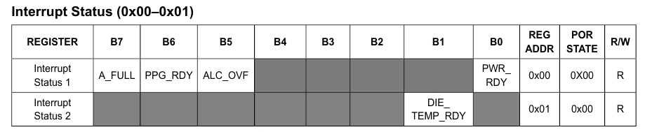
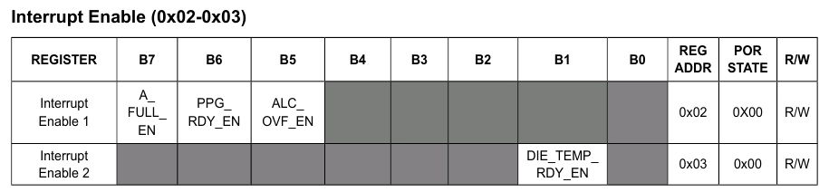
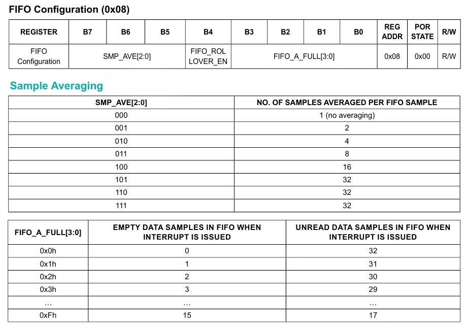
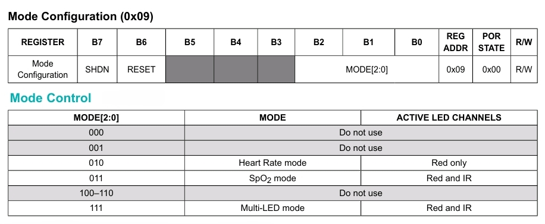
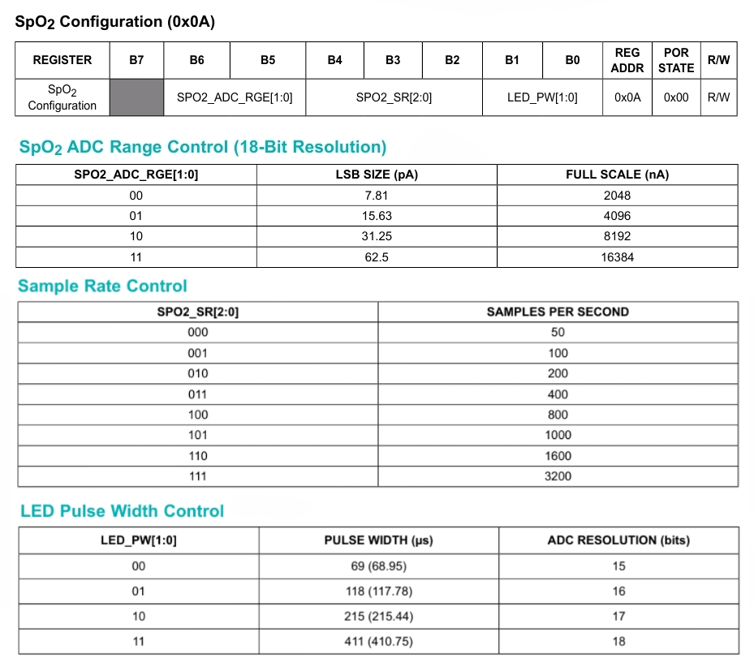
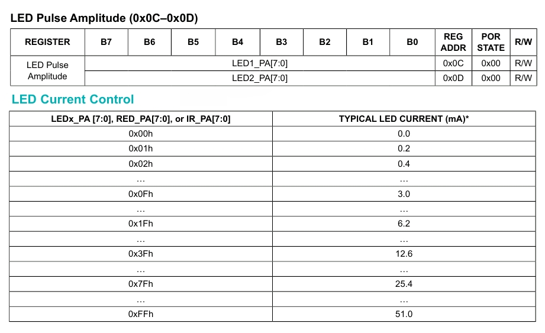
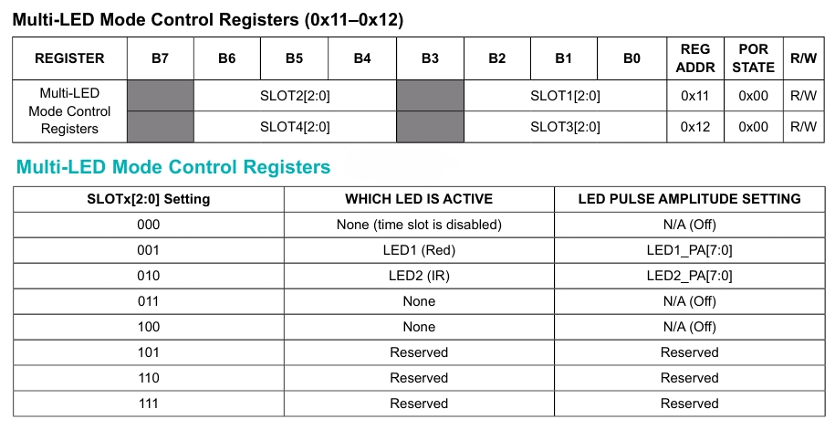
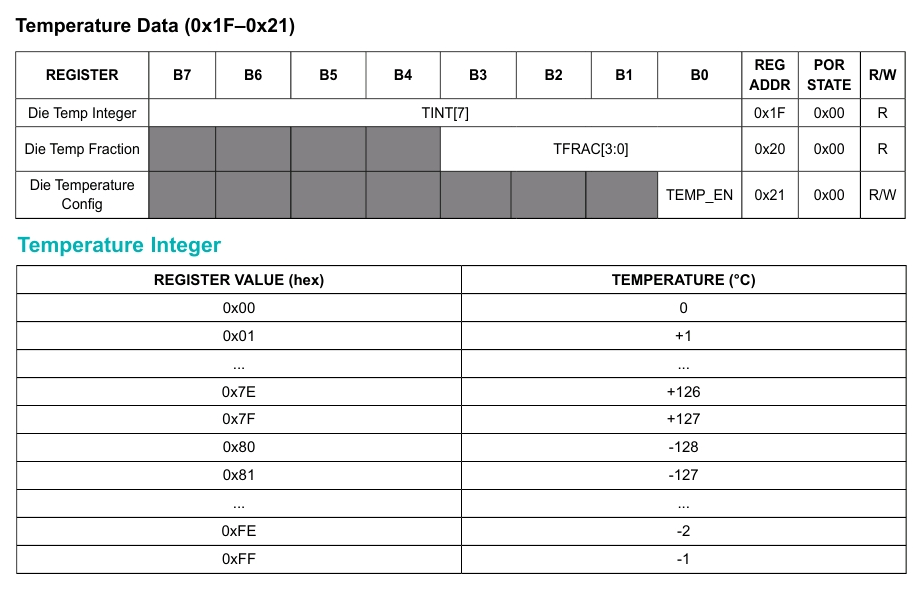

# 脈搏血氧儀和心率傳感器

[網絡資源 - 脈搏血氧儀和心率傳感器](https://github.com/n-elia/MAX30102-MicroPython-drivers)

## 從基本原理構建 Micropython 驅動器的示例

### 訪問 I<sup>2</sup>C 設備的基本功能


```python
from machine import I2C, Pin

_i2c = I2C(0, sda=Pin(21), scl=Pin(22))

# 讀寫一個字節
def _8bits(register, value=None):
    if value is None:
        return _i2c.readfrom_mem(_address, register, 1)[0]
    data = pack('<B', value)
    _i2c.writeto_mem(_address, register, data)

# 讀寫兩個字節
def _16bits(register, value=None):
    if value is None:
        data = _i2c.readfrom_mem(_address, register, 2)
        return unpack('<H', data)[0]
    data = pack('<H', value)
    _i2c.writeto_mem(_address, register, data)
    
# 讀寫六個字節
def readFIFO(register):
    data = _i2c.readfrom_mem(_address, register, 6)
    value = unpack('<6B', data)
    bytesArray = array('B', value[:6])
    red = (bytesArray[0]<<16 | bytesArray[1]<<8 | bytesArray[2]) & 0x3FFFF >> 0x03
    ir = (bytesArray[3]<<16 | bytesArray[4]<<8 | bytesArray[5]) & 0x3FFFF >> 0x03
    return [red, ir]
```




```python
def getInterrupt():
	iReady = _8bits(0x02)
	tmpReady = _8bits(0x03)
	all = ppg = alc = t = 0
	if (iReady & 0b10000000) > 0:
		all = 1
	if (iReady & 0b01000000) > 0:
		ppg = 1
	if (iReady & 0b00100000) > 0:
		alc = 1
	if (tmpReady & 0b00000010) > 0:
		t = 1
	return all, ppg, alc, t

```




```python
def setInterrupt(all=None, ppg=None, alc=None, t=None):
	
	if(all != None | ppg != None | alc != None):
		value = _8bits(0x02)
		if (all != None):
			value = (value & ~0b10000000) | 0b10000000
		if (ppg != None):
			value = (value & ~0b01000000) | 0b01000000
		if (alc != None):
			value = (value & ~0b00100000) | 0b00100000
		_8bits(0x02,value)
		
	if (t != None):
		value = _8bits(0x03)
		value = (value & ~0b00000010) | 0b00000010
		_8bits(0x03,value)
		
```



```python
SAVG_MASK = ~0b11100000
SAVG_1 = 0x00
SAVG_2 = 0x20
SAVG_4 = 0x40
SAVG_8 = 0x60
SAVG_16 = 0x80
SAVG_32 = 0xA0

def initFIFO(sample_avg = None):
    if (sample_avg = None): # FIFO 配置
	    value = _8bits(0x08)
	    value = (value & SAVG_MASK) | sample_avg
  	    value = _8bits(0x08,value)
    _8bits(0x04,0x00)  # FIFO 寫指針先清零
    _8bits(0x05,0x00)  # 溢出計數器先清零
    _8bits(0x06,0x00)  # FIFO 讀指針先清零

```



```python
def hrMode():
    _8bits(0x09,0x02)     

def spo2Mode():
    _8bits(0x09,0x03) 
    
def reset():
   _8bits(0x09,0x40)   

def shutDown():
   _8bits(0x09,0x80)     

```
   


```python
ADC_MASK = ~0b01100000
ADC_2048 = 0x00
ADC_4096 = 0x20
ADC_8192 = 0x40
ADC_16384 = 0x60

SRATE_MASK = ~0b00011100
SRATE_50 = 0x00
SRATE_100 = 0x04
SRATE_200 = 0x08
SRATE_400 = 0x0C
SRATE_800 = 0x10
SRATE_1000 = 0x14
SRATE_1600 = 0x18
SRATE_3200 = 0x1C

PWIDTH_MASK = ~0b00000011
PWIDTH_69 = 0x00
PWIDTH_118 = 0x01
PWIDTH_215 = 0x02
PWIDTH_411 = 0x03

def setSPO2(adc_range=None, sample_rate=None, led_pw=None):
	value = _8bits(0x0A)
	if(adc_range != None)
		value = (value & ADC_MASK) | adc_range
	if(sample_rate != None)
		value = (value & SRATE_MASK) | sample_rate
	if(led_pw != None)
		value = (value & PWIDTH_MASK) | led_pw
	_8bits(0x0A, value)

```



```python
def calHex(value):
	value = int(value * 51.0/ 255)
	if(value > 255):
		value = 255
	return = unpack('<B', value)

def redLed(value=0):
	value = calHex(value)
    _8bits(0x0C,value)  
    
def irLed(value=0):    
	value = calHex(value)
    _8bits(0x0D,value)  

```



```python


```



```python


```


