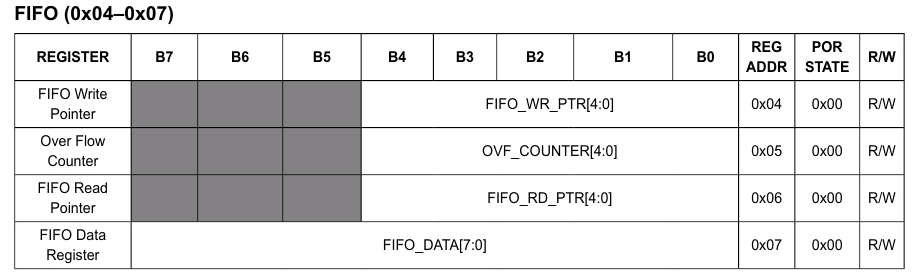
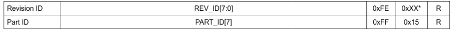
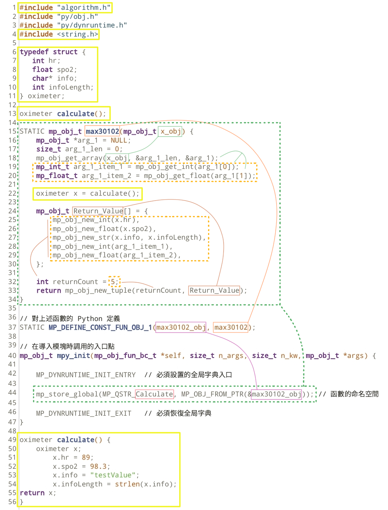
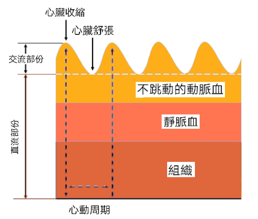

<style>
    table {
        width: 100%;
    }
</style>

# 脈搏血氧儀和心率傳感器

[網絡資源 - 脈搏血氧儀和心率傳感器](https://github.com/n-elia/MAX30102-MicroPython-drivers)

## 從基本原理構建 MicroPython 驅動器的示例

### 訪問 I<sup>2</sup>C 設備代碼


```python
from machine import I2C, Pin
from time import sleep_ms
from ustruct import pack, unpack
from array import array

_i2c = I2C(0, sda=Pin(21), scl=Pin(22))

# MAX30102 7位地址
_address = 0x57

# 讀寫一個字節
def _8bits(register, value=None):
    if value is None:
        return _i2c.readfrom_mem(_address, register, 1)[0]
    data = pack('<B', value)
    _i2c.writeto_mem(_address, register, data)

# 讀寫兩個字節
def _16bits(register, value=None):
    if value is None:
        data = _i2c.readfrom_mem(_address, register, 2)
        return unpack('<H', data)[0]
    data = pack('<H', value)
    _i2c.writeto_mem(_address, register, data)
    
```    

### 讀寫六個字節代碼

```python
# 讀寫六個字節
def readFIFO(register):
    data = _i2c.readfrom_mem(_address, register, 6)
    value = unpack('<6B', data)
    bytesArray = array('B', value[:6])
    red = (bytesArray[0]<<16 | bytesArray[1]<<8 | bytesArray[2]) & 0x3FFFF >> 0x03
    ir = (bytesArray[3]<<16 | bytesArray[4]<<8 | bytesArray[5]) & 0x3FFFF >> 0x03
    return red, ir
    
```

### 讀寫位元代碼

```python
def setBitwise(orgValue, mask, newValue):
    return (orgValue & ~mask) | newValue

```

### 中斷狀態代碼


```python
def getInterrupt():
    tmpReady = _8bits(0x00)
    al = ppg = alc = t = 0
    if (iReady & 0b10000000) > 0:
        al = 1
    if (iReady & 0b01000000) > 0:
        ppg = 1
    if (iReady & 0b00100000) > 0:
        alc = 1
    return al, ppg, alc
    
def getT_ready():        
    iReady = _8bits(0x01)
    if (iReady & 0b00000010) > 0:
        return False
    return True    
        
```

### 中斷控制代碼


```python
def enableDataReady(ppg=True):
    value=_8bits(0x02)
    if (ppg):
        value = setBitwise(value,0x40,0x40)
        _8bits(0x02,value)
    else:
        value = setBitwise(value,0x40,0x00)
        _8bits(0x02,value)

def enableAllReady(al=True):
    value=_8bits(0x02)
    if (al):
        value = setBitwise(value,0x80,0x80)
        _8bits(0x02,value)
    else:
        value = setBitwise(value,0x80,0x00)
        _8bits(0x02,value)

def enableAlcReady(alc=True):
    value=_8bits(0x02)
    if (alc):
        value = setBitwise(value,0x20,0x20)
        _8bits(0x02,value)
    else:
        value = setBitwise(value,0x20,0x00)
        _8bits(0x02,value)

def enableDieTempReady(t=True):
    value=_8bits(0x03)
    if (t):
        value = setBitwise(value,0x02,0x02)
        _8bits(0x03,value)
    else:
        value = setBitwise(value,0x02,0x00)
        _8bits(0x03,value)
		
```

### 先進先出讀寫代碼




```python
red_Data = array("i")
ir_Data = array("i")
count_Data = 0

def read():
    _read = _8bits(0x06)
    _write = _8bits(0x04)
    nSamples = 0
    global count_Data
    if(_read!=_write):
        nSamples= _write-_read
        if (nSamples < 0):
            nSamples += 32
        for i in range(nSamples):
            red, ir = readFIFO(0x07)
            red_Data.append(red)
            ir_Data.append(ir)
        count_Data = count_Data + abs(_write-_read)

```

### 先進先出讀寫控制代碼


注意: **每秒取樣頻率** = Sample Rate Control (**Samples per Second**) ÷ Sample Averaging (**No. of Samples Averaged per FIFO Sample**)

例子: 如 **200** Samples/s ÷ **4** Samples averaged per Sample 即最終輸出是 **50** 個數據每秒。

應用: 以 500 個最終數據為例。即為 10 秒，因每一秒有 50 個數據。如在這些數據內找到 15 個高低位。心跳計算結果為 **15 x 6 = 90** 次每分鐘。因一分鐘為 **6** 個 **10** 秒。


```python
SAVG_MASK = 0b11100000
SAVG_1 = 0x00
SAVG_2 = 0x20
SAVG_4 = 0x40
SAVG_8 = 0x60
SAVG_16 = 0x80
SAVG_32 = 0xA0

ROVER_MASK = 0xEF
ROVER_ENABLE = 0x10
ROVER_DISABLE = 0x00

DATA_MASK = 0b00001111

def enableRollover(rollover=True):
    value = _8bits(0x08)
    if (rollover): # FIFO 覆蓋選項
        value = setBitwise(value,ROVER_MASK,ROVER_ENABLE)
        value = _8bits(0x08,value)
    else:
        value = setBitwise(value,ROVER_MASK,ROVER_DISABLE)
        value = _8bits(0x08,value)

def initFIFO(sample_avg=0x00, data_ratio=0x0F):
    if (sample_avg != None): # FIFO 配
        value = _8bits(0x08)
        value = setBitwise(value,SAVG_MASK,sample_avg)
        value = _8bits(0x08,value)
    if (data_ratio != None): # FIFO 未讀位元數量
        value = _8bits(0x08)
        value = setBitwise(value,DATA_MASK,data_ratio)
        value = _8bits(0x08,value)
    
def clearFIFO():    
    _8bits(0x04,0x00)  # FIFO 寫指針先清零
    _8bits(0x05,0x00)  # 溢出計數器先清零
    _8bits(0x06,0x00)  # FIFO 讀指針先清零

```


### 工作模式控制代碼


```python
def hrMode():
    _8bits(0x09,0x02)     

def spo2Mode():
    _8bits(0x09,0x03) 
    
def reset():
   _8bits(0x09,0x40)   

def shutDown():
   _8bits(0x09,0x80)  

```
   
### 血氧飽和度控制代碼   
   


```python
ADC_MASK = 0b01100000
ADC_2048 = 0x00
ADC_4096 = 0x20
ADC_8192 = 0x40
ADC_16384 = 0x60

SRATE_MASK = 0b00011100
SRATE_50 = 0x00
SRATE_100 = 0x04
SRATE_200 = 0x08
SRATE_400 = 0x0C
SRATE_800 = 0x10
SRATE_1000 = 0x14
SRATE_1600 = 0x18
SRATE_3200 = 0x1C

PWIDTH_MASK = 0b00000011
PWIDTH_69 = 0x00
PWIDTH_118 = 0x01
PWIDTH_215 = 0x02
PWIDTH_411 = 0x03

def setSPO2(adc_range=ADC_4096, sample_rate=SRATE_100, led_pw=PWIDTH_411):
    value = _8bits(0x0A)
    if(adc_range != None):
        value = setBitwise(value,ADC_MASK,adc_range)
    if(sample_rate != None):
        value = setBitwise(value,SRATE_MASK,sample_rate)
    if(led_pw != None):
        value = setBitwise(value,PWIDTH_MASK,led_pw)
    _8bits(0x0A, value)

```


### LED / IR 電流控制代碼 


```python
def calHex(value):
    value = int(value * 255 / 51.0)
    if(value > 255):
        value = 255
    return value

def redLed(value=0):
    value = calHex(value)
    _8bits(0x0C,value)  
    
def irLed(value=0):    
    value = calHex(value)
    _8bits(0x0D,value)

```

### 獲取模具溫度代碼 


```python
def getT():
    _8bits(0x21, 0x01)
    reading = _8bits(0x01)
    sleep_ms(100)
    while (getT_ready()):
        sleep_ms(1);
    intg = _8bits(0x1F)
    frac = _8bits(0x20)
    return intg + (frac * 0.0625)

```

### 獲取相關識別數據代碼 



```python
def getPartID():
    return _8bits(0xFE)

def getRevisionID():
    return _8bits(0xFF)

```

## MAX30102 模塊檢索數據的核心功能 

### 初始化 MAX30102 模塊

```python
def initModule():
    enableAllReady()
    enableDieTempReady()
    initFIFO()
    spo2Mode()
    setSPO2()
    clearFIFO()
    enableRollover()
    redLed(7)
    irLed(7)    

```

### MAX30102模塊的主要讀取功能編程代碼

```python
if __name__ == "__main__":
    print("Part ID: {}".format(getPartID()))
    print("Revision ID: {}".format(getRevisionID()))
    redLed()
    irLed()
    flag = True
    while flag:
      cmd = input("\n輸入您的選擇 (h:心率 o:血氧, x:離開) : ")
      if cmd == 'h':
        count_Data = 0
        red_Data.clear()
        ir_Data.clear()
        reset()
        initModule()
        hrMode()
        sleep_ms(100)
        start = time.ticks_ms()
        sample = 500
        n = 10
        sampleRange = sample + n
        while count_Data < sampleRange:
            read()
        deltaT = time.ticks_diff(time.ticks_ms(), start)/1000
        redLed()
        irLed()
        value = heartRate(red_Data, ir_Data)
        total = len(value)
        dt = total / deltaT;
        count = 0
        iflag = True
        startpt = 0
        endpt = 0
        step = 0
        for i in range(total):
          if i > 10:
            if iflag and value[i] <= 0 :
                if i - step > 16 :
                    count = count + 1
                    step = i
                    iflag = False
                    if count == 0:
                        startpt = i
                    else:
                        endpt = i
            if value[i] > 0 :
                iflag = True
        heartbeartValue = (count) * 60 / ((endpt - startpt) / dt) 
        print("心率 : {}".format(heartbeartValue))
      if cmd == 'o':
        print("血氧 :{}".format(1))
      if cmd == 'x' :
        shutDown()
        flag = False
    print("\n停止及離開!")
    
```

## 用交叉編譯器從 C 代碼到 python 代碼 (mpy)

[互聯網 ESP32 & MAX30102 算法](https://github.com/sparkfun/SparkFun_MAX3010x_Sensor_Library)            

```python
#include "algorithm.h"
#include "py/obj.h"
#include "py/dynruntime.h"
#include <string.h>

typedef struct {
   int hr;
   float spo2;
   char* info;
   int infoLength;
} oximeter;

oximeter calculate();

STATIC mp_obj_t max30102(mp_obj_t x_obj) {
    mp_obj_t *arg_1 = NULL;
    size_t arg_1_len = 0;
    mp_obj_get_array(x_obj, &arg_1_len, &arg_1);
    mp_int_t arg_1_item_1 = mp_obj_get_int(arg_1[0]);
    mp_float_t arg_1_item_2 = mp_obj_get_float(arg_1[1]);

    oximeter x = calculate();

    mp_obj_t Return_Value[] = {
        mp_obj_new_int(x.hr),
        mp_obj_new_float(x.spo2),
        mp_obj_new_str(x.info, x.infoLength),
        mp_obj_new_int(arg_1_item_1),
        mp_obj_new_float(arg_1_item_2),
    };

    int returnCount = 5;
    return mp_obj_new_tuple(returnCount, Return_Value);
}

// 對上述函數的 Python 定義
STATIC MP_DEFINE_CONST_FUN_OBJ_1(max30102_obj, max30102);

// 在導入模塊時調用的入口點
mp_obj_t mpy_init(mp_obj_fun_bc_t *self, size_t n_args, size_t n_kw, mp_obj_t *args) {
    
    MP_DYNRUNTIME_INIT_ENTRY  // 必須設置的全局字典入口

    mp_store_global(MP_QSTR_Calculate, MP_OBJ_FROM_PTR(&max30102_obj)); // 函數的命名空間
    
    MP_DYNRUNTIME_INIT_EXIT   // 必須恢復全局字典
}

oximeter calculate() {
	oximeter x;
        x.hr = 89;
        x.spo2 = 98.3;
        x.info = "testValue";
        x.infoLength = strlen(x.info);
return x;
}

```

### 解釋以上代碼

 - 黃色為 C 程序代碼, 在 gcc 內翻譯。其它為 mpy 交叉編譯器代碼，需根據不同的開發版下編譯。 
 - 綠色虛線部分為新創建的功能，必須是一對對出現。以下代碼只會產生一個功能。
 - 橙色虛線部分為新功能內的參數部分，需要在每個功能內各自修改。
 - 標準化輸入只考慮元組或數組，只得一個參數。而元組或數組只考慮:
    - 整數
    - 浮點數
 - 標準化輸出只考慮元組或數組，只得一個參數。
 - 第一項及第四項新 C 功能的頭文件。
 - 第二及第三行是引入的 MicroPython 編譯標準程式庫。
 - 所有 C 引用的功能必不可出現在黃色以外部分。以避免在交叉編譯時會錯誤。
 - 第六至第11行是新設計的結構，用以在程式之間傳播結構資料。
 - 第13行為預設程序。使新功能在 MicroPython 應用前出現。
 - 第14至34行。為 MicroPython 交叉編譯的代碼部分。
 - 第37及44行為定義新功能函數。
 - 在第44行 MP_QSTR_<font color="#FF1000">Calculate</font> 紅色部分為 MicroPython 的新功能名稱。必需注意大小寫。
 - 第40至47行時引入標準程式庫的固定代碼。
 - 誒49至56行是新增的 C 代碼的程式段。




## 從 C 到 mpy 交叉編譯器的心率函數

計算心率(HR) 可將測到的訊號先過濾高頻，再移除直流部份。交流訊號就會在正負間穿梭。只需計算正負次數除以取樣數時間就能計算出心率如下:

```c
#include "py/obj.h"
#include "py/dynruntime.h"
#include <stdio.h>
#include <stdlib.h>

#ifndef min
#define min(a, b) (((a) < (b)) ? (a) : (b))
#endif

void _toFloat(mp_obj_t *obj, size_t len, float *rValue)
{
  for(int i = 0; i < len; i++)
    rValue[i] = mp_obj_get_float(obj[i]);
}

void _toInt(mp_obj_t *obj, size_t len, int *rValue)
{
  for(int i = 0; i < len; i++)
    rValue[i] = mp_obj_get_int(obj[i]);
}

void _toTupleFloat(float *iValue, int len, mp_obj_tuple_t *obj)
{
  for(int i = 0; i < len; i++)
    obj->items[i] = mp_obj_new_float(iValue[i]);
}

void _toTupleInt(int *iValue, int len, mp_obj_tuple_t *obj)
{
  for (int i = 0; i < len; i++)
    obj->items[i] = mp_obj_new_int(iValue[i]);
}

int16_t averageDCEstimator(int32_t *p, uint16_t x)
{
  *p += ((((long)x << 15) - *p) >> 4);
  return (*p >> 15);
}

#define HRFILTER_TAP_NUM 11

typedef struct {
  int16_t history[HRFILTER_TAP_NUM];
  unsigned int last_index;
} HRFilter;

static int16_t filter_taps[HRFILTER_TAP_NUM] = {
  641,
  1603,
  3005,
  4507,
  5672,
  6111,
  5672,
  4507,
  3005,
  1603,
  641
};

void HRFilter_init(HRFilter* f) {
  for(int i=0; i < HRFILTER_TAP_NUM; ++i)
    f->history[i] = 0;
  f->last_index = 0;
}

void HRFilter_put(HRFilter* f, int16_t input) {
  f->history[f->last_index++] = input;
  if(f->last_index == HRFILTER_TAP_NUM)
    f->last_index = 0;
}

int16_t HRFilter_get(HRFilter* f) {
  int32_t acc = 0;
  int index = f->last_index, i;
  for(i = 0; i < HRFILTER_TAP_NUM; ++i) {
    index = index != 0 ? index-1 : HRFILTER_TAP_NUM-1;
    acc += (int32_t)f->history[index] * filter_taps[i];
  }
  return acc >> 16;
}

void _HR(int length, int *value, int *rValue)
{
  int32_t startValue=0;
  int16_t avgValue;
  HRFilter f;
  HRFilter_init(&f);
  for (int i=0; i < length; i++) {
    HRFilter_put(&f, value[i]);
    avgValue = HRFilter_get(&f);
    rValue[i] =  avgValue - averageDCEstimator(&startValue, (unsigned int)(avgValue));
  }
}

STATIC mp_obj_t heartRate(mp_obj_t x_obj_r, mp_obj_t x_obj_ir)
{
  mp_obj_t *red = NULL;
  mp_obj_t *ired = NULL;
  size_t red_len = 0;
  size_t ired_len = 0;
  mp_obj_get_array(x_obj_r, &red_len, &red);
  mp_obj_get_array(x_obj_ir, &ired_len, &ired);
  int length = min(red_len, ired_len);
  int f_red[length];
  int o_red[length];
  _toInt(red, length, f_red);
  _HR(length, f_red, o_red);
  mp_obj_tuple_t *rValue = mp_obj_new_tuple(length, NULL);
  _toTupleInt(o_red, length, rValue);
  return rValue;
}

STATIC MP_DEFINE_CONST_FUN_OBJ_2(heartRate_obj, heartRate);

mp_obj_t mpy_init(mp_obj_fun_bc_t *self, size_t n_args, size_t n_kw, mp_obj_t *args)
{
  MP_DYNRUNTIME_INIT_ENTRY
  mp_store_global(MP_QSTR_heartRate, MP_OBJ_FROM_PTR(&heartRate_obj));
  MP_DYNRUNTIME_INIT_EXIT
}

void* memcpy(void *dest, const void *src, size_t n)
{
  for (size_t i = 0; i < n; i++)
    ((char *)dest)[i] = ((char *)src)[i];
  return 0;
}

```


血氧 $ SpO_2 $ 的測量主要分為透射式和反射式。目前的主流是透射式。但是兩者原理差不多，都是使用發光二極體（紅光 *RED*，紅外 *IR* ，綠光 *GREEN* 和藍光 *BLUE* 等）照射被測部位，然後使用一個光電二極體接收 *透射* / *反射* 的光線，將光訊號轉換為電訊號。然後通過高精度的ADC測量反射回的電流大小，評估血液中的含氧量。



上圖是一個典型的PPG波形，即光電二極體接收到原始的光訊號波形。波形（由圖中間的白色橫虛線）訊號可分為兩部分 DC (直流) 和 AC (交流)。

其中直流訊號由下到上可分為以下三部分的反射： *組織* ， *靜脈血* 和 *不跳動的動脈血* 。當然對於不同年齡、性別和膚色等人不同，對應的直流值也會不同。所以後面的血氧計算都是使用相對值。

而交流訊號就比較單一：由跳動的動脈血反射得到。其中 *波峰* 對應心臟的 *收縮* ， *波谷* 對應心臟 *舒張* 。

灌注指數 (*PI*) 為交流分量與直流分量的幅值之比反映了人體的血流灌注能力，稱為血流灌注指數(Perfusion Index，PI)，其表示式為:

$$ PI = \frac{AC}{DC} \times 100 $$

血氧計算(SpO2)公式也比較簡單因MAX30102是一路紅光，一路紅外。只分別算出紅光的交流除以紅光的直流即: $ \frac{AC_{red}}{DC_{red}} $，和紅外的交流除以紅外的直流分量即：$ \frac{AC_{ired}}{DC_{ired}} $。然後兩者再相除得到 R。

$$ R = \frac {\frac{AC_{red}}{DC_{red}}}{\frac{AC_{ired}}{DC_{ired}}} $$

得到 R 然後查表即可得到血氧值，也可以通過下面美信擬合的公式計算：

$$ SpO_2 = -45.060 \times R^2 + 30.354 \times R + 94.845 $$                                                                                                                                         


### 設計參數如下

|參數名稱|公式|參數值|
|:---|:---:|:---:|
|通帶紋波衰減 ( $ A_{p} $ ) |設計值 | $ A_{p} = 0.1 dB $ |
|阻帶紋波衰減 ( $ A_{s} $ ) | 設計值 | $ A_{s} = 50 dB $ |
|通帶幅度響應容差 ( $ \delta_{p} $ ) | $ A_{p} = 20 \log_{10} ( 1 + \delta _{p}) $ | $ \delta_{p} = \log_{10}^{-1}\left ( \frac{0.1}{20} \right ) - 1 = 0.0116 $ |
|阻帶幅度響應容差 ( $ \delta_{s} $ ) | $ A_{s} = -20 \log_{10} ( \delta _{2}) $| $ \delta_{s} = \log_{10}^{-1}\left ( \frac{-50}{20} \right ) = 0.00316 $ |
|通帶邊緣頻率 ( $ F_{p} $ )| 設計值 | $ F_{p} = 150H_{z} $ |
|過渡帶 ( $ \Delta F $ ) |設計值 | $ \Delta F = 1500 H_{z} $ |
|採樣頻率 ( $ f_{s} $ ) | 設計值 | $ f_{s} = 3 kH_{z} $ |
|正規化通帶邊緣頻率  ( $ \Delta F_{n} $ )| $ \Delta F_{n} = \frac{F_{p}}{f_{s}} $ | $ \Delta F_{n} = \frac {150} {3\times{10^3}} = 0.05 $  |
|正規化過渡帶寬度 ( $ \Delta f_{n} $ ) | $ \Delta f_{n} = \frac{\Delta F}{f_{s}} $ | $ \Delta f_{n} = \frac {1500} {3\times{10^3}} = {\color{Red}{0.2}} $  |

詳細請參考 [數碼濾波器](https://hkdickyko.github.io/%E7%A9%8D%E9%AB%94%E9%9B%BB%E8%B7%AF/Filter)

$$ h_{D}[n] = \frac {\sin ({0.42 \pi n})} {\pi n} $$

$$ N =  \frac {3.3} { \Delta f_{n} } = \frac{3.3}{\color{Red}{0.2}} = 6.6 \approx 7 $$

$$ W[n] = 0.54 - 0.46 \cos \left ( \frac{2 \pi  n} {N - 1} \right ) = 0.54 - 0.46 \cos \left ( \frac{2 \pi  n} {7} \right ) , N = 7 $$


$$ h(n) = \frac {\sin ({0.42 \pi n})} {\pi n} \times \left [ 0.54 - 0.46 \cos \left ( \frac{2 \pi n} {7} \right ) \right ] $$

|係數數值|1|2|3|4|5|6|7|
|:---:|:---:|:---:|:---:|:---:|:---:|:---:|:---:|
|$ h(n) $|0.095576|0.059039|-0.077346|-0.051736|0.006099|0.004236|0.002641|


$$ y(n) = \sum_{k=0}^{N} h[n] \times x(n-k) $$

$ y(n) = h(0) \times (n) + h(1) \times (n-1) $ 
$  + h(2) \times (n-2) + h(3) \times (n-3) $ 
$  + h(4) \times (n-4) + h(5) \times (n-5) $ 
$  + h(6) \times (n-6) + h(7) \times (n-7) $