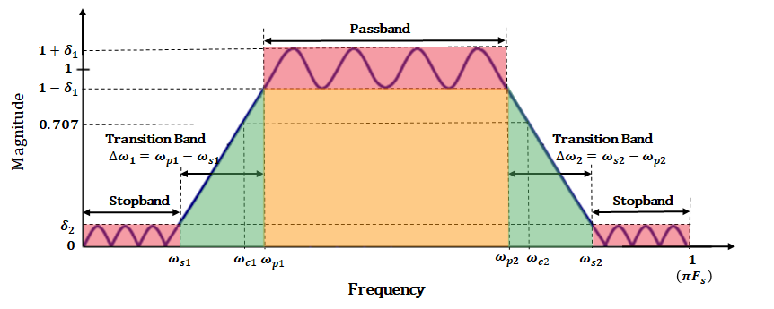
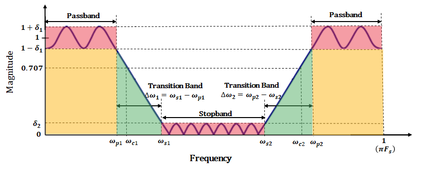
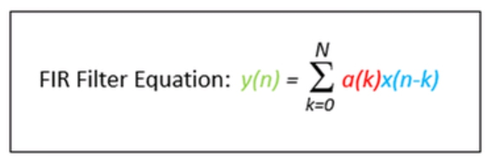
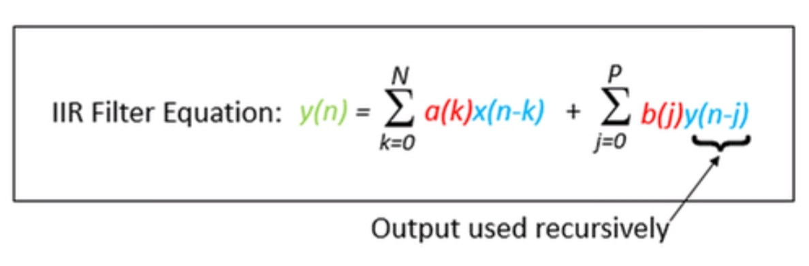
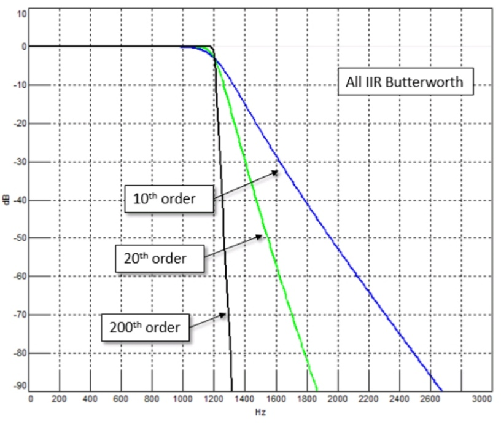
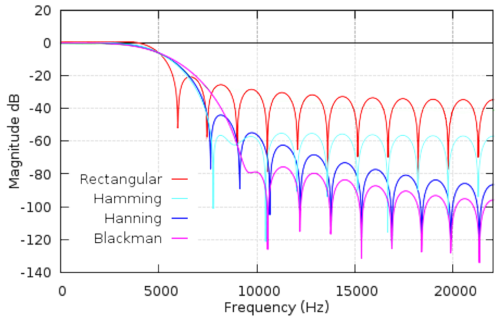
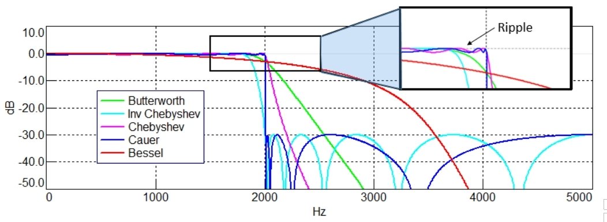
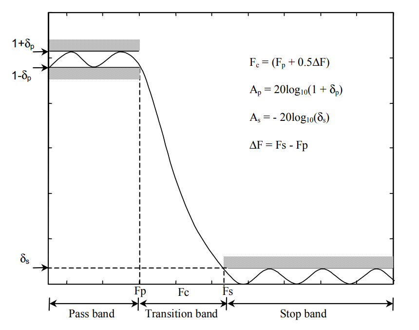

# 數字濾波器簡介

主要用於濾除干擾信號。一般在微弱信號放大的同時附加濾波功能和信號採樣前使用濾波器。

## 數碼濾波器種類

一般可分為四類
 - 低通
 

 - 高通
 

 - 帶通
 

 - 帶阻

## 以上圖表解釋

紅色部份表示通帶漣波，它等於與單位漣波的最大偏差。 δ 符號代表阻帶衰減的幅度響應。

通帶紋波 ( $ R_{p} $ ) 和阻帶衰減 ( $ R_{s}  $ ) 通常以分貝 (dB) 為單位測量，分別定義為:

 $$ R_{p} = -20 \log{10} (1- \delta _{1}) dB $$

 $$ R_{s} = -20 \log{10} (\delta _{2}) dB $$
  
 $$ | R_{p} |  <  | R_{s} | $$  

橙色部份表示設計使用範圍，在這範圍內的訊號只會被通帶漣波所影響，改變輕微。通頻帶中的數據直接輸出到輸出時間序列. 爲了保證通頻帶內的 數據與原始時程數據一致，濾波器中不應有紋波. 紋波是振幅隨頻率的微小變化，理 想情況下，在這個波段，濾波器的振幅應該恰好爲1.

綠色部分表示過渡帶，數字濾波器的截止頻率被定義為頻率響應功率達到單位功率的一半時的頻率，或等效的單位幅度，大約為 3dB。 由於半功率與單位功率相差約 3dB，因此該頻率通常稱為 3dB 截止頻率。 對於低通和高通濾波器，只需要指定一個截止頻率值。 但是，對於帶通和帶阻濾波器，需要指定兩個截止頻率值。

## 濾波器的作用

 - 將有用的信號與噪聲分離，提高信號的抗干擾性及信噪比
 - 濾掉不感興趣的頻率成分，提高分析精度
 - 從複雜頻率成分中分離出單一的頻率分量

## 信號波形的合成

信號波形是由多組不同頻率的正弦波基於時間軸組合而成有如左下圖。如將其分解成以頻率為基準的圖則如右下圖:

在一般信號採集上，在高頻率方面很容易產生噪音。濾波器是將特定頻率啲噪音衰減。使修正後的頻率只著重於我們需要的頻道上。用以獲得我們需要的數碼信號。

## 數碼濾波器設計方法

有限衝激響應（Finite impulse response，縮寫FIR）濾波器

無限衝擊響（Infinite Impulse Response，縮寫IIR）濾波器

## FIR 對比 IIR

IIR濾波器的優點是，對於與FIR類似的濾波器，可以使用較低的階數或項數。這意味着實現，相同結果所需的計算量更少，使得 IIR 的計算速度更快. 然而，IIR 具有非線性相位和穩定性 FIR 濾波器緩慢而穩定，IIR 濾波器非常快，但有時會崩潰。

## 濾波器階數和計算速度

由FIR濾波器方程可知，N越大，濾波器的階數越高. 例如，濾波器項數爲10， 而不是5，那麼濾波器的計算將花費兩倍的時間。然而，濾波器的頻率下降會更清晰。

包含更多項(階數更高)濾波器在通過頻率和截止頻率之間有更劇烈的轉換，這使濾波器的幅頻響應變化更銳利是通過增加濾波器階數來實現的，這意味着需要更多的計算，同時也會影響濾波器引入的時間延遲。

但階數越高，濾波器的幅頻響應變化曲線越陡峭，濾波器對濾除的頻率截斷效果越顯著。

## FIR濾波方法

FIR方法在從頻域到時域的轉換中使用了不同的譜窗。一些窗口方法包括:

## 僅比較簡單的公式的窗口

### Rectangular Window
 
 $$ W_{R}(n) = 1, 0\leqslant n \leqslant N - 1 $$

 
### Hamming window

 $$ W_{hm}(n) = 0.54- 0.46 \cos (\frac{2\pi n}{N-1}) ,  0\leqslant n \leqslant N - 1 $$ 
 
 
### Hanning window

 $$ W_{hn}(n) = 0.5- 0.5 \cos (\frac{2\pi n}{N-1}) ,  0\leqslant n \leqslant N - 1 $$ 

### Blackman window

 $$ W_{hn}(n) = 0.42- 0.5 \cos (\frac{2\pi n}{N-1}) + 0.08 \cos (\frac{4 \pi n}{N-1}) ,  0\leqslant n \leqslant N - 1 $$

 
FIR 濾波器功能穩定，基於以上設計公式，不同窗口的結果如下:

 
|過濾函數方法|特性|
|:---:|:---|
|Rectangular|紋波最大，甚至影響通帶|
|Hamming|過渡區窄，波紋比 Hanning 小|
|Hanning|過渡帶最窄，停止帶紋波較大|
|Blackman|過渡區最寬，通帶外頻率衰減較多|

## IIR濾波方法

IIR方法在從頻域到時域的轉換中使用了不同的譜窗。一些窗口方法包括:

由於 IIR 濾波器可能不穩定，基於以上原因不考慮設計公式，僅顯示不同窗口的結果供您參考。

|過濾函數方法|特性|
|:---:|:---|
|Butterworth|在通帶和停止帶響應平穩，但過渡區較寬|
|Inverse Chebyshev|通帶平坦，過渡帶寬度比巴特沃斯濾波器窄，但在停止帶有波紋|
|Chebyshev|在通帶可以有紋波，但其過渡帶比反向Chebyshev更短|
|Cauer|過渡帶最短，通帶和停止帶均有紋波|
|Bessel|在通帶和停止帶均出現幅度傾斜(Sloping)，過度帶非常寬|

## FIR 濾波器的窗口設計方法

使用窗口法設計 **FIR** 濾波器時，通常首先定義理想的頻率響應濾波器的 $ H_{D}(\Omega) $ ，當獲得了理想的頻率響應，就需要從頻率響應的逆傅立葉變換中獲得理想的脈衝響應 $ h_{D}[n] $。 設計過程的下一步是根據濾波器的通帶 $ \delta_{p} $ 和阻帶 $ \delta_{s} $ 容差的規格選擇合適的窗函數。 **FIR** 濾波器的容差最終取決於用於加窗的窗函數，但在設計過程中，我們總是從假設 $ \delta_{p} $ ≈ $ \delta_{s} $ 開始。在 **窗函數及其對應的屬性** 表中找到了合適的解決方案。當設計者根據濾波器規範確定了合適的窗函數，那麼然後可以計算所需數量的濾波器係數 **N**。 設計過程的最終程序是確定實際濾波器係數 $ h_{D}[n] $ 通過將窗口函數的係數與相應的理想值相乘脈衝響應。 

- 注意：FIR濾波器的係數是對稱的。

$$ h[n] = h_{D}[n] \times w[n] $$

### 窗函數及其對應的屬性

|過濾函數方法|正規化過渡帶寬度|通帶紋波 (dB)|紋波 $ \delta_{p}, \delta_{s} $ | 旁瓣電平 (dB)| 阻帶衰減 (dB)|
|:--|:--:|:--:|:--:|:--:|:--:|
|Rectangular (矩形濾波)| $ \frac {0.9}{N} $ |0.741|0.089|-13|21|
|Hanning (漢寧濾波)| $ \frac {3.1}{N} $ |0.0546|0.063|-31|44|
|Hamming (漢明濾波)| $ \frac {3.3}{N} $ |0.0194|0.0022|-41|53|
|Blackman (布萊克曼濾波)|$ \frac {5.5}{N} $ |0.0017|0000196|-57|74|

### 理想脈衝響應 $ w[n] $

|濾波器類型|$ h_{D}[n] $ , n ≠ 0| $ h_{D}[n] $ , n = 1|
|:---:|:---:|:---:|
|低通| $ 2 F_{c} \frac {\sin ({n \Omega_{c}})} {n \Omega_{c}} $ | $ 2 F_{c} $ |
|高通| $ 1 - 2 F_{c} \frac {\sin ({n \Omega_{c}})} {n \Omega_{c}} $ | $ 1- 2 F_{c} $ |
|帶通| $ 2 F_{2} \frac {\sin ({n \Omega_{2}})} {n \Omega_{2}} - 2 F_{1} \frac {\sin ({n \Omega_{1}})} {n \Omega_{1}} $ | $ F_{2} - 2 F_{1} $ | 
|帶阻| $ 1 - \left [ 2 F_{2} \frac {\sin ({n \Omega_{2}})} {n \Omega_{2}} - 2 F_{1} \frac {\sin ({n \Omega_{1}})} {n \Omega_{1}} \right ] $ | $ 1- \left [ 2 F_{2} - 2 F_{1} \right ] $ |

## FIR 濾波器的實際設計實例

### 低通濾波器 Low Pass Filter

FIR 低通濾波器需要具備以下規格

|參數名稱|公式|參數值|
|:---|:---:|:---:|
|通帶邊緣頻率 ( $ F_{p} $ )| 設計值 | $ 2kH_{z} $ |
|採樣頻率 ( $ F_{s} $ ) | 設計值 | $ 10 kH_{z} $ |
|過渡帶 ( $ \Delta F $ ) |設計值 | $ 200 H_{z} $ |
|通帶紋波 ( $ A_{p} $ ) |設計值 | $ 0.1 dB $ |
|最小阻帶衰減 ( $ A_{s} $ ) | 設計值 | $ 50 dB $ |
|通帶幅度響應容差 ( $ \delta_{p} $ ) | $ 20 \log_{10} ( 1 + \delta _{p}) $ | $ \log_{10}^{-1}\left ( \frac{0.1}{20} \right ) - 1 = 0.0116 $ |
|阻帶幅度響應容差 ( $ \delta_{s} $ ) | $ -20 \log_{10} ( \delta _{2}) $| $ \log_{10}^{-1}\left ( \frac{-50}{20} \right ) - 1 = 0.00316 $ |
|正規化通帶邊緣頻率  ( $ \Delta F_{n} $ )| $ \frac{F_{p}}{F_{s}} $ | $ \frac {2\times{10^3}} {10\times{10^3}} = 0.2 $  |
|正規化過渡帶寬度 ( $ \Delta f_{n} $ ) | $ \frac{\Delta F}{F_{s}} $ | $ \frac {200} {10\times{10^3}} = 0.02 $  |

- 使用窗口，確定合適的窗口函數併計算所需的濾波器數量係數來設計這個濾波器。 此外，確定相應的濾波器係數值 $ h[n] , -10 \leqslant n \leqslant 10 $

首先我們需要從 **窗函數及其對應的屬性** 中選擇一個合適的窗函數，它具有最窄的 $ \Delta f_{n} $ 但滿足 $ \delta_{s} $ 規格為 0.00316。 窗函數及其對應的屬性最接近的規格是具有 $ \delta_{s} $ 的漢明窗 = 0.0022。 從 **窗函數及其對應的屬性** 表中可以找到正規化通帶邊緣頻率 $ \Delta F_{n} = \frac {3.3}{N} $ ，其中 N 是濾波器係數的數量。 經過重新排列這個方程使 N 成為主體並插入歸一化過渡寬度的值，然後可以計算所需數量的濾波器係數。 

對於 FIR 濾波器，係數的數量必須是奇數，所以不要忘記四捨五入到最接近的奇數。

$$ N =  \frac {3.3} { \Delta f_{n} } = \frac{3.3}{0.02} = 165 $$ 

根據設計標準，**N** 參數數量為 **165** 個

$$ W[n] = 0.54 - 0.46 \cos \left ( \frac{2 \pi  n} {N - 1} \right ) = 0.54 - 0.46 \cos \left ( \frac{2 \pi  n} {164} \right ) , N = 165 $$

低通濾波器的設計 $ \Omega_{c} = 2 \pi F_{c} $ :

$$ h_{D}[n] = 2 F_{c} \frac {\sin ({n \Omega_{c}})} {n \Omega_{c}} = 2 F_{c} \frac {\sin ({n \Omega_{c}})} {n 2 \pi F_{c}} = \frac {\sin ({n \Omega_{c}})} {n \pi } $$ 

其中正規化角截止頻率，因 $ \Omega_{c} $ 由以下等式定義:

$$ \Omega_{c} = 2 \pi (F_{n} + 0.5 \Delta f_{n}) = 2 \pi (0.2 + 0.5 \times 0.02) = 0.42 \pi $$

因此，低通濾波器的理想脈衝響應可以改寫如下：

$$ h_{D}[n] = \frac {\sin ({0.42 \pi n})} {\pi n} $$ 

在時域中，截斷是通過將脈衝響應與窗函數 $ w[n] $ 相乘來實現的。 因此濾波器係數 $ h_{D}[n] $ = -10, 10 可以通過以下方式獲得：

$$ h[n] = h_{D}[n] \times w[n] $$

$$ h[n] = \frac {\sin ({0.42 \pi n})} {\pi n} \times \left [ 0.54 - 0.46 \cos \left ( \frac{2 \pi  n} {164} \right ) \right ] $$

當 n=10 如下：因係數是對稱的 $ h[n] = h[-n], h[10] = h[-10] $ 。

$$ h[n] = \frac {\sin ({0.42 \pi 10})} {\pi 10} \times \left [ 0.54 - 0.46 \cos \left ( \frac{2 \pi  10} {164} \right ) \right ]  = 0.0187  \times 0.1133 = 0.0021 $$

