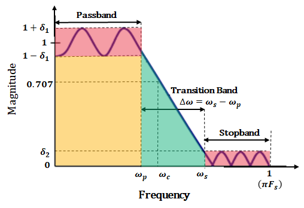
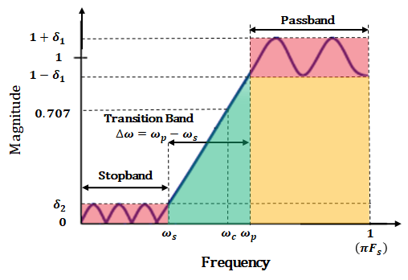

# 數字濾波器簡介

主要用於濾除干擾信號。一般在微弱信號放大的同時附加濾波功能和信號採樣前使用濾波器。

## 數碼濾波器種類

一般可分為四類
 - 低通
 

 - 高通
 

 - 帶通
 

 - 帶阻

## 以上圖表解釋

粉紅色部份表示通帶漣波，它等於與單位漣波的最大偏差。 δ 符號代表阻帶衰減的幅度響應。

通帶紋波 ( $ R_{p} $ ) 和阻帶衰減 ( $ R_{s}  $ ) 通常以分貝 (dB) 為單位測量，分別定義為:

 - $ R_{p} = -20 \log{10} (1- \delta _{1}) dB $

 - $ R_{s} = -20 \log{10} (\delta _{2}) dB $
 - \| $ R_{p} $ \| < \| $ R_{s} $ \| 

橙色部份表示設計使用範圍，在這範圍內的訊號只會被通帶漣波所影響，改變輕微。

綠色部分表示過渡帶，數字濾波器的截止頻率被定義為頻率響應功率達到單位功率的一半時的頻率，或等效的單位幅度，大約為 3 dB。 由於半功率與單位功率相差約 3dB，因此該頻率通常稱為 3dB 截止頻率。 對於低通和高通濾波器，只需要指定一個截止頻率值。 但是，對於帶通和帶阻濾波器，需要指定兩個截止頻率值。

## 濾波器的作用

 - 將有用的信號與噪聲分離，提高信號的抗干擾性及信噪比
 - 濾掉不感興趣的頻率成分，提高分析精度
 - 從複雜頻率成分中分離出單一的頻率分量

## 信號波形的合成

信號波形是由多組不同頻率的正弦波基於時間軸組合而成有如左下圖。如將其分解成以頻率為基準的圖則如右下圖:

在一般信號採集上，在高頻率方面很容易產生噪音。濾波器是將特定頻率啲噪音衰減。使修正後的頻率只著重於我們需要的頻道上。

