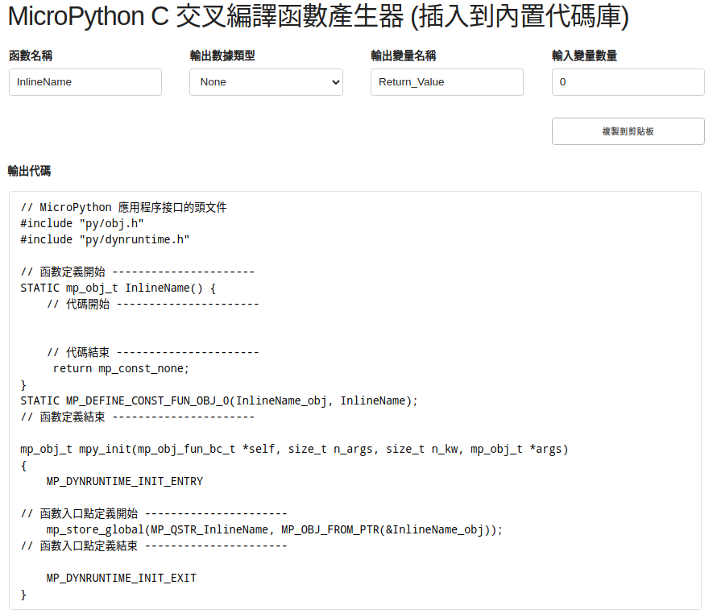
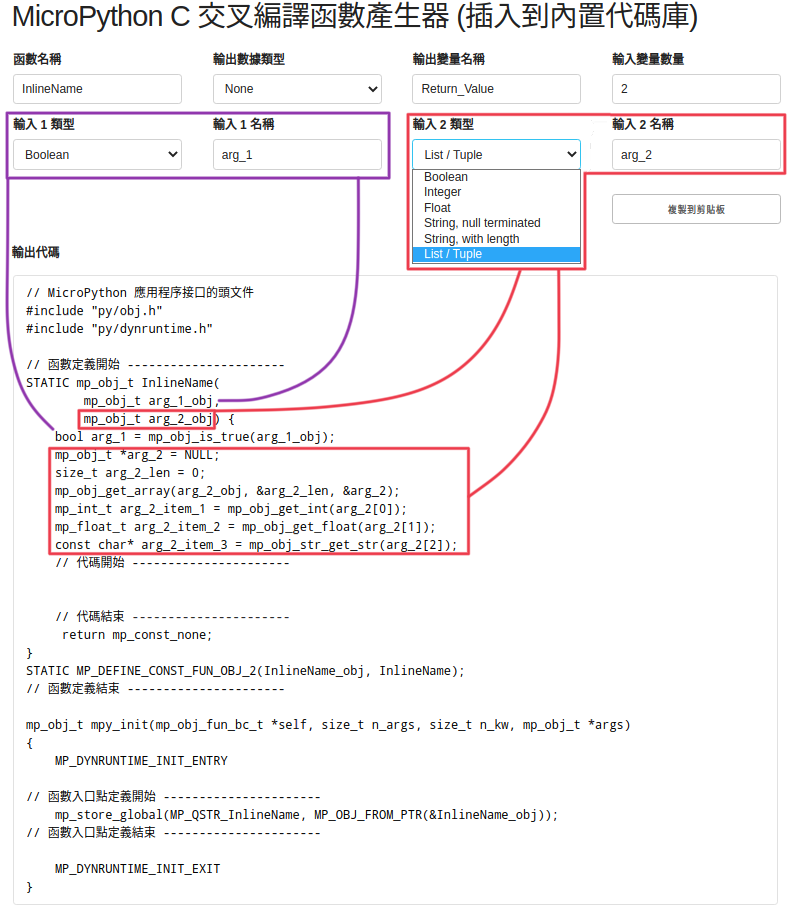
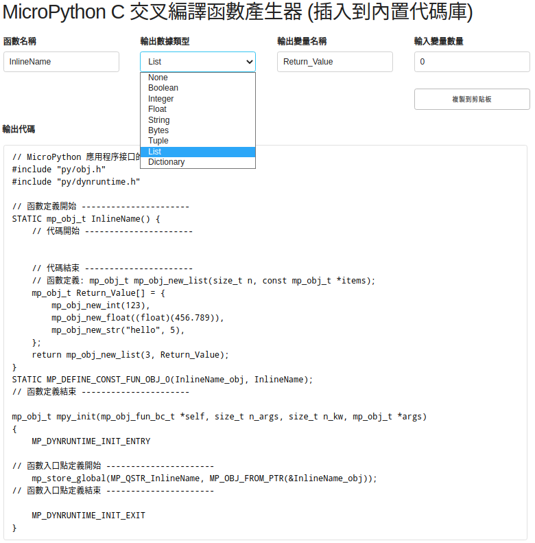
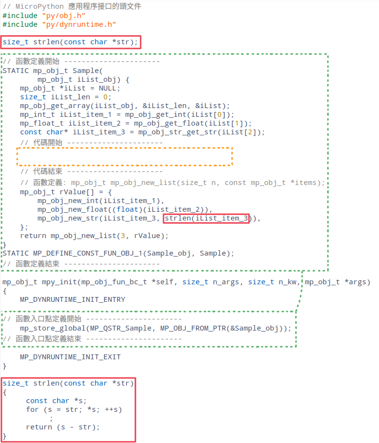
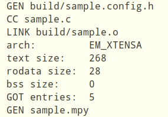
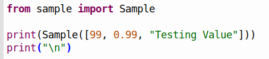

<style>
    table {
        width: 100%;
    }
</style>

## 用交叉編譯器從 C 代碼到 MicroPython 代碼 (mpy)

### 默認啟動頁面



- 方格<font color="#FF1000">紅色</font>內為程序名稱
 
- 方格<font color="#DDBB20">黃色</font>內為主要功能代碼

- 方格<font color="#2ACC20">綠色</font>內為各個功能函數代碼，每個函數有一套各自代碼段

重要<font color="#AA0000">注意事項</font>: 對於交叉編譯器，代碼頁的剩餘部分是固定不改變的。

## 輸入值選擇頁面



 - 方格<font color="#E520FF">紫色</font>內為第一個輸入參數，為布林值    
 - 方格<font color="#FF1000">紅色</font>內為第二個輸入參數，為數組或元組  

### 輸入函數如下

 - mp\_obj\_is\_true(boolValue);
 - mp\_obj\_get\_int(intValue);
 - mp\_obj\_get\_float(floatValue));
 - mp\_obj\_str\_get\_str(stringValue, StringLength);
 - mp\_obj\_get\_array(...);

## 返回值選擇頁面



 - 方格<font color="#FF1000">紅色</font>內為返回值，為數組或元組 

### 返回函數如下

 - mp\_obj\_new\_bool(boolValue);
 - mp\_obj\_new\_int(intValue);
 - mp\_obj\_new\_float(floatValue));
 - mp\_obj\_new\_str(stringValue, StringLength);
 - mp\_obj\_new\_bytes(bytesValue, bytesLength);
 - mp\_obj\_new\_tuple(tupleLength, tupleValue);
 - mp\_obj\_new\_list(listLength, listValue);
 - mp\_obj\_new\_dict(...);

## 實現交叉編譯器功能的示例



 - 方格<font color="#FF1000">紅色</font>內為創建函數，是為了防止錯誤的外部調用。 該函數需要在 MicroPython 調用定義之前定義。 因只是一個示例函數，所以輸入將用作返回值。


### 編譯後在Linux中輸出結果




## 編譯時出現問題

注意：一次只能使用一個程序上傳,以一步步的簡單方式對變量進行分組，防止複雜關係影響交叉編譯

編譯時出現問題代碼

 - ((IR_AC_Max - IR_AC_Min) > 20 & (IR_AC_Max - IR_AC_Min) < 1000)

解決的代碼 (用紅色標記)

 - (<font color="#FF1000"> ( </font>(IR_AC_Max - IR_AC_Min) > 20<font color="#FF1000"> ) </font> & <font color="#FF1000"> ( </font>(IR_AC_Max - IR_AC_Min) < 1000<font color="#FF1000"> ) </font>)

### 將部份函數如 memcpy, memset 加到代碼下，以防止編譯器調用全局頭文件引致錯誤。

```c
#ifndef min
#define min(a,b)    (((a) < (b)) ? (a) : (b))
#endif

#ifndef max
#define max(a,b)    (((a) > (b)) ? (a) : (b))
#endif

void* memcpy(void *dest, const void *src, size_t n)
{
  for (size_t i = 0; i < n; i++)
  {
    ((char *)dest)[i] = ((char *)src)[i];
  }
  return 0;
}

void* memset(void* b, int c, size_t len) {
    char* p = (char*)b;
    for (size_t i = 0; i != len; ++i) {
        p[i] = c;
    }
    return b;
}

size_t strlen(const char *str)
{
    const char *s;
    for (s = str; *s; ++s);
    return (s - str);
}

```

### MicroPython 平台中的示例代碼



### MicroPython 平台輸出結果


## ampy 使用

上傳文件 (*.mpy) 到 ESP32 模塊 (傳送接口為 /dev/ttyUSB0，如不是需自行更改。)

```shell
ampy --port /dev/ttyUSB0 put sample.mpy

```

### ampy 執行輸出中文的問題

MicroPython 程式執行結果的下 1 個位元組, 而 0x04 是 MicroPython 通知結束的特殊數值。這裡為了讓程式執行結果可以經由 USB 傳輸線串流顯示到電腦端, 所以採取了每收到 1 個位元組就立刻清除緩衝區強迫輸出到螢幕上的方式。這個方式對於一般的英數字沒有什麼影響, 可是若是中文字, 在 UTF-8 的編碼下, 至少會有 2 個位元組, 上述作法會把多個位元組拆散, 視為多個字元顯示, 因而造成個別位元組都是無法正常顯示的字元。

要解決這個問題, 最簡單的方式就是把函式中清除緩衝區的哪一行去掉,讓位元組連續輸出, 不要硬去清除緩衝區, 系統就不會認為個別位元組是單一字元了。

您可能會擔心把清除緩衝區的動作去除, 這樣會不會要累積一大堆輸出結果後才會在畫面上看到結果？那我們也可以這樣做, 依據 UTF-8 編碼的規則, 每收到一個完整的 UTF-8 編碼的字元就清除緩衝區強迫送出字元, 將同一函式改寫如下：

```python
utf8Char = b""
counts = 3
def stdout_write_bytes(b):
    global utf8Char, counts

    for i in b:
        curr = b'' + b    
        if curr==b'\x04':                 # end of output
            return;
        elif curr <= b'\x7f':             # 1-byte UTF-8 char
            utf8Char = curr
            counts = 0
        elif b'\xC0' <= curr <= b'\xDF':  # 2-bytes UTF-8 char
            utf8Char = curr
            counts = 1
        elif b'\xE0' <= curr <= b'\xEF':  # 3-bytes UTF-8 char
            utf8Char = curr
            counts = 2
        elif b'\xF0' <= curr <= b'\xF7':  # 4-bytes UTF-8 char
            utf8Char = curr
            counts = 3
        elif b'\x80' <= curr <= b'\xBF':  # 1 byte in a UTF-8 char
            utf8Char = utf8Char + curr
            counts = counts - 1

        if counts == 0:                   # 1 UTF-8 char readed
            print(utf8Char.decode('UTF-8'), end="")
            counts = 3                    # reset count
            utf8Char=b''
            
```            

這樣就可以使用 ampy 執行含有中文輸出的 MicroPython 程式了。


## 位元運算

位元運算位移，將每個二進制表示位元向左或向右移動預定數量的位置。 將二進制數移動位數相當於將數字乘以 $ 2^{移位數} $

- 向左移動 << = 乘 = $ 2^{移位數} $
- 向右移動 >> = 除 = $ 2^{-移位數} $

一個數字位元的二進制向一個方向移動，我們會在另一側出現一個空位。 如何填充這個空位置通常有三種可能性：
 - 填充空位為 <font color="#FF1000">0</font> 
 - 填充空位為 <font color="#FF1000">1</font>
 - 從另一側數字的二進制移出的位即<font color="#FF1000">旋轉</font>二進制數

位移多用於實現快速乘法或除法。 為了獲得這個程序的正確結果，我們必須用 0 填充空位。只有在負數除以 2 的冪的情況下，我們才需要用 1 填充左位，因為 負數表示為正數的 *two's-complement* ，即符號位為1。

對整數處理器，浮點運算會耗用相當多的資源。 如浮點運算可用整數進行操作則是一種更有效的替代方法。

**定點數學** 是一種解決方案，通常採用較大整數的形式，例如 16 位，其中最高八位是整數部分，最低八位是小數部分。 通過簡單地使用整數運算，可以有效地執行數學運算，而精度損失很小。

### 定點數學算法

第一步是定義系統要求及設定相關參數。 為了說明每個步驟，假設以下們子:
 - 從 0 到 1 且粒度為 0.01 的變量
 - 從 0 到 100 且粒度為 0.1 的變量
 - 從 -1,000 到 1,000 個，粒度為 0.01 的變量

### 整數部份

計算整數變量的最大絕對值 $ M $ ，每個示例需求的 $ M $ 值分別為 1、100 和 ±1,000。

並計算存儲這個數字所需的位數 $ x $，使得 

$$ 2^{x} \geq M \geq 2^{x -1} $$

如數字是有正負號，請在 $ x $ 上加 1。 對於我們的示例要求，$ x $ 分別為
- 1 即 $ 2^{1} = 2 \gt 1 $
- 7 即 $ 2^{7} = 128 \gt 100 $
- 11 即 $ 2^{10} = 1024 \gt 1000 $ 再因加正負號的1 即10 + 1 = 11。

**即位元數整數大於所需計的整數值**

### 小數部份

計算所需的粒度 $ G $ 。 計算提供此小數位所需的位數 $ y $，使得 

$$ \frac {1}{2^{y}} \geq  G \geq  \frac {1}{2^{y-1}} $$
 
對於我們的例子如下
 - 7 即 $ \frac {1}{128} = 0.0078125 \lt 0.01 $
 - 4 即 $ \frac {1}{16} = 0.0625 \lt 0.1 $

**即位元數的倒數小於所需計的小數值**

如要系統滿足設計需求，則所需的最小位元數是 $ x + y $。 其總和取整數如為 8、16 或 32位元。此總和將在以後稱為 *FULLSIZEINT*。 如總和大於系統中能使用的最大整數位元。則這系統不能滿足設計上的精確度要求。

### 四則運算

在四則基本運算符：+，-，× 和 ÷，必須按照如下計算

 - 在加法或減法（+ 和 -）時，該值也必須位移 $ x $
 - 在乘法和除法（× 和 ÷）時，該值則不需位移

當需要取出整數部份時，必須右移 $ x $， 如果需要小數部分，則必須將其屏蔽 $ x $

如一個32位元作為定點數學。前16位為整數部份。後16位為分數部份

```c
     integer (MSB)    fraction (LSB)
           v                 v
    0000000000000000.0000000000000000

#define SHIFT_AMOUNT 16 
#define SHIFT_MASK ((1 << SHIFT_AMOUNT) - 1)

int price = 500 << SHIFT_AMOUNT;
price += 10 << SHIFT_AMOUNT;
price *= 3;
price /= 4; 
// now our price is ((500 + 10) * 3) / 4 = 382.5

printf("price integer is %d\n", price >> SHIFT_AMOUNT);
printf("price fraction is %d\n", price & SHIFT_MASK);

printf("price fraction in decimal is %f\n", ((double)(price & SHIFT_MASK) / (1 << SHIFT_AMOUNT)));

printf("price is roughly %d.%lld\n", price >> SHIFT_AMOUNT, (long long)(price & SHIFT_MASK) * 100000 / (1 << SHIFT_AMOUNT));

```

## 倒數算法

因計算除數一般比較佔用CPU資源及對嵌入式CPU比較難於操作。所以就有以下的方法，將除法分解成加法及乘法。

### 牛頓法 (Newton's method)

$$ y = \frac {1}{x} = \frac {1}{\sqrt{x}} \times  \frac {1}{\sqrt{x}} $$

在互聯網上可以容易找到解決 $ \frac {1}{\sqrt{x}} $  的方法如 [Fast inverse square root](https://en.wikipedia.org/wiki/Fast_inverse_square_root) 


```c
float reciprocal(float number)
{
	const float x2 = number * 0.5F;
	const float threehalfs = 1.5F;
	
	union {
		float    f;
		uint32_t i;
	} conv = { .f = number };
	conv.i  = 0x5f3759df - (conv.i >> 1);
	conv.f *= threehalfs - (x2 * conv.f * conv.f);
	conv.f *= threehalfs - (x2 * conv.f * conv.f);
	conv.f *= threehalfs - (x2 * conv.f * conv.f);
	return conv.f * conv.f;
}

```


### 自然三次樣條插值計算 (Natural Cubic Spline)

為了從給定的線計算插值，我創建了一個自然三次樣條函數，如下所示。 它還展示了在 MicroPython 中創建自然 C 函數的基本技術。以下列出了一些需要注意的地方以供參考。

- 基本上不能在自然 C 模塊中使用除法函數
- 基本上不能使用 malloc，calloc，realloc 動態創建內存資源,可以使用數組來替代
- 可用指針函數處理數組，以在函數之間傳遞變量數組
- 在 Micropython 中使用元組返回計算數組
- 可以使用額外的 C 代碼來模擬標準 C 函數

#### make 代碼

```make
## MicroPython 目錄的位置
MPY_DIR = ../../..

# 模塊功能名稱
MOD = spline

# 源文件 (.c or .py)
SRC = spline.c

# 構建的架構為- x86, x64, armv7m, xtensa & xtensawin 
ARCH = xtensawin

# 獲取編譯和鏈接模塊的規則
include $(MPY_DIR)/py/dynruntime.mk

```

#### C 源代碼

```c
#include "py/obj.h"
#include "py/dynruntime.h"
#include <stdio.h>
#include <stdlib.h>

#ifndef min
#define min(a,b)  (((a) < (b)) ? (a) : (b))
#endif

float reciprocal(float x);
void spline(int n, float* x, float* y, float* x0, float* x1, float* a, float* b, float* c, float* d);
void getValue(int n, float* x0, float* x1, float* a, float* b, float* c, float* d, int m, float* ix, float* oy);
void getSplinePt(int n, float* x, float* y, int on, float* ix, float* oy);

STATIC mp_obj_t splineInterpolation(
        mp_obj_t splineObject_obj,
        mp_obj_t outPoints_obj) {
    mp_obj_t *splineObject = NULL;
    size_t splineObject_len = 0;
    mp_obj_get_array(splineObject_obj, &splineObject_len, &splineObject);
    size_t xn = 0;
    mp_obj_t *x = NULL;
    mp_obj_get_array(splineObject[0], &xn, &x);
    size_t yn = 0;
    mp_obj_t *y = NULL;
    mp_obj_get_array(splineObject[1], &yn, &y);
    int i;
    int n = min(xn, yn);
    size_t im = 0;
    mp_obj_t *outPoints = NULL;
    mp_obj_get_array(outPoints_obj, &im, &outPoints);
    int m = n-1;
    float xValues[n],yValues[n];
    for(i=0; i<n;i++){
        xValues[i] = mp_obj_get_float(x[i]);
        yValues[i] = mp_obj_get_float(y[i]);
    }
    m = im;
    float ix[m],oy[m];
    for(i=0; i<m;i++){
        ix[i] = mp_obj_get_float(outPoints[i]);
    }
    getSplinePt(n, xValues, yValues, m, ix, oy);
    mp_obj_tuple_t *rValueX = mp_obj_new_tuple(im, NULL);
    mp_obj_tuple_t *rValueY = mp_obj_new_tuple(im, NULL);
    for(i=0; i<m;i++){
        rValueX->items[i] = mp_obj_new_float(ix[i]);
        rValueY->items[i] = mp_obj_new_float(oy[i]); 
    }
    mp_obj_t iReturn[] = {
        rValueX,
        rValueY,
    };
    return mp_obj_new_list(2, iReturn);
}
STATIC MP_DEFINE_CONST_FUN_OBJ_2(splineInterpolation_obj, splineInterpolation);

mp_obj_t mpy_init(mp_obj_fun_bc_t *self, size_t n_args, size_t n_kw, mp_obj_t *args)
{
    MP_DYNRUNTIME_INIT_ENTRY 
    mp_store_global(MP_QSTR_splineInterpolation, MP_OBJ_FROM_PTR(&splineInterpolation_obj));
    MP_DYNRUNTIME_INIT_EXIT
}

void getSplinePt(int n, float* x, float* y, int on, float* ix, float* oy){
    int m = n-1;
    float x0[m],x1[m],a[m],b[m],c[m],d[m];
    spline(n, x, y, x0, x1, a, b, c, d);
    getValue(m, x0, x1, a, b, c, d, on, ix, oy);
}

void getValue(int n, float* x0, float* x1, float* a, float* b, float* c, float* d, int m, float* ix, float* oy){
    int i, j;
    float x, ix0, ix1, dx;
    for(i=0; i<m; i++){
        x = ix[i];
        for(j=0; j<n; j++){
            ix0 = x0[j];
            ix1 = x1[j];
            if(x >= ix0 && x <=ix1){
                dx = (float)(x-ix0);
                oy[i] = (float)(a[j] + b[j]*dx + c[j]*dx*dx + d[j]*dx*dx*dx);
                j=n;
            }
        }
    }
}

void spline(int n, float* x, float* y, float* x0, float* x1, float* a0, float* b0, float* c0, float* d0){
    int i, j;
	n--;	
    float h[n], A[n], l[n + 1], u[n + 1], z[n + 1], c[n + 1], b[n], d[n];

    for (i = 0; i <= n - 1; ++i) 
        h[i] = x[i + 1] - x[i];

    for (i = 1; i <= n - 1; ++i)
        A[i] = 3 * (y[i + 1] - y[i]) * reciprocal(h[i]) - 3 * (y[i] - y[i - 1]) * reciprocal(h[i - 1]);

    l[0] = 1;
    u[0] = 0;
    z[0] = 0;

    for (i = 1; i <= n - 1; ++i) {
        l[i] = 2 * (x[i + 1] - x[i - 1]) - h[i - 1] * u[i - 1];
        u[i] = h[i] * reciprocal(l[i]);
        z[i] = (A[i] - h[i - 1] * z[i - 1]) * reciprocal(l[i]);
    }

    l[n] = 1;
    z[n] = 0;
    c[n] = 0;

    for (j = n - 1; j >= 0; --j) {
        c[j] = z[j] - u[j] * c[j + 1];
        b[j] = (y[j + 1] - y[j]) * reciprocal(h[j]) - h[j] * (c[j + 1] + 2 * c[j]) * reciprocal(3);
        d[j] = (c[j + 1] - c[j]) * reciprocal((3 * h[j]));
    }

    for (i = 0; i < n; i++){
        x0[i]=(float)x[i];
        x1[i]=(float)x[i+1];
        a0[i]=(float)y[i];
        b0[i]=(float)b[i];
        c0[i]=(float)c[i];
        d0[i]=(float)d[i];
    }
}

float reciprocal(float number)
{
	const float x2 = number * 0.5F;
	const float threehalfs = 1.5F;
	
	union {
		float    f;
		uint32_t i;
	} conv = { .f = number };
	conv.i  = 0x5f3759df - (conv.i >> 1 );
	conv.f *= threehalfs - (x2 * conv.f * conv.f);
	conv.f *= threehalfs - (x2 * conv.f * conv.f);
	conv.f *= threehalfs - (x2 * conv.f * conv.f);
	return conv.f * conv.f;
}

```
#### Python 代碼

```python
from spline import splineInterpolation

x = [1, 2, 3, 4, 6]
y = [3, 6, 8, 11, 8]
o = []
for i in range(100):
    o.append(1 + i*0.05)
    ox,oy = splineInterpolation([x,y],o)
n = len(ox)
for i in range(n):
    print("{},{}".format(ox[i],oy[i]))

```

### 傅里葉變換 (Fast Fourier transform)

用於傅里葉變換的泰勒級數 (Taylor Serie) 模計算函數如下供參考

幾何函數

$$ \frac {1}{1-x} = \sum_{n=0}^{\infty} x^n = 1 + 2x + x^2 + x^3 + \cdots $$

$$ \frac {1}{(1-x)^2} = \sum_{n=1}^{\infty} nx^{n-1} = 1 + 2x + 3x^2 + 4x^3 + \cdots $$

$$ \frac {1}{(1-x)^3} = \sum_{n=2}^{\infty} nx^{n-1} = 1 + 3x + 6x^2 + 10x^3 + \cdots $$

指數函數

$$ e^x = \sum_{n=0}^{\infty} \frac {x^n}{n!} = 1 + \frac {x}{1!} + \frac {x^2}{2!} + \frac {x^3}{3!} + \cdots $$

$$ ln(1-x) = - \sum_{n=1}^{\infty} \frac {x^n}{n} = - x - \frac{x^2}{2} - \frac{x^3}{3} - \cdots $$

$$ ln(1+x) = \sum_{n=1}^{\infty} {(-1)}^{n+1} \frac {x^n}{n} = x - \frac{x^2}{2} + \frac{x^3}{3} - \cdots $$

三角函數

$$ sin(x) = \sum_{n=0}^{\infty} (-1)^n \frac{x^{2n+1}}{(2n+1)!} = x - \frac {x^3}{3!} + \frac {x^5}{5!} - \frac {x^7}{7!} + \cdots $$

$$ cos(x) = \sum_{n=0}^{\infty} (-1)^n \frac{x^{2n}}{(2n)!} = 1 - \frac {x^2}{2!} + \frac {x^4}{4!} - \frac {x^6}{6!} + \cdots $$

$$ tan(x) = \frac {sin(x)}{cos(x)}  $$

$$ \frac {1}{tan(x)} = \sum_{n=0}^{\infty} (-1)^n \frac{x^{2n+1}}{2n+1} = x - \frac {x^3}{3!} + \frac {x^5}{5!} - \frac {x^7}{7!} + \cdots $$

$$ arcsin(x) = \sum_{n=0}^{\infty} \frac{{(2n)!}}{4^n(n!)^2(2n+1)} x^{2n+1} = x + \frac {x^3}{6} + \frac {3x^5}{40} + \cdots $$

$$ arccos(x) = \frac {\pi}{2} - arcsin(x) = \frac {\pi}{2} - x - \frac {x^3}{6} - \frac {3x^5}{40} - \cdots $$

$$ arctan(x) = \sum_{n=0}^{\infty} \frac {(-1)^n}{2n+1} x^{2n+1} = x - \frac{x^3}{3} + \frac{x^5}{5} - \cdots $$


將時域矢量信號轉換為頻域矢量信號，源代碼如下以供參考

#### make 源代碼

```make
## MicroPython 目錄的位置
MPY_DIR = ../../..

# 模塊功能名稱
MOD = fft

# 源文件 (.c or .py)
SRC = fft.c

# 構建的架構為- x86, x64, armv7m, xtensa & xtensawin 
ARCH = xtensawin

# 獲取編譯和鏈接模塊的規則
include $(MPY_DIR)/py/dynruntime.mk

```

#### C 源代碼

```c
#include "py/obj.h"
#include "py/dynruntime.h"
#include <stdio.h>
#include <stdlib.h>
#include <math.h>

#ifndef min
#define min(a,b)    (((a) < (b)) ? (a) : (b))
#endif

typedef struct{
	float Re; 
	float Im;
} complex;

void getFFT(int N, complex* v);
void getiFFT(int N, complex* v);

STATIC mp_obj_t fftr_Conversion(
        mp_obj_t fft_Data_Obj) {
  mp_obj_t *fft_Data_Re = NULL;
  size_t fft_Data_len = 0;
  mp_obj_get_array(fft_Data_Obj, &fft_Data_len, &fft_Data_Re);
  complex data[fft_Data_len];
  int i;
  for(i=0;i<fft_Data_len;i++){
    data[i].Re = mp_obj_get_float(fft_Data_Re[i]);
    data[i].Im = 0;
  }
  getFFT(fft_Data_len, data);
  int n = fft_Data_len >> 1;
  mp_obj_tuple_t *rFFT = mp_obj_new_tuple(n, NULL);
  for(i=0;i<n;i++){
    rFFT->items[i] = mp_obj_new_float(data[i].Re);
  }
  return rFFT;
}
STATIC MP_DEFINE_CONST_FUN_OBJ_1(fftr_Conversion_obj, fftr_Conversion);

STATIC mp_obj_t fft_Conversion(
        mp_obj_t fft_Data_real, mp_obj_t fft_Data_img) {
  mp_obj_t *fft_Data_Re = NULL;
  mp_obj_t *fft_Data_Im = NULL;
  size_t fft_Data_len_re = 0;
  size_t fft_Data_len_im = 0;
  mp_obj_get_array(fft_Data_real, &fft_Data_len_re, &fft_Data_Re);
  mp_obj_get_array(fft_Data_img, &fft_Data_len_im, &fft_Data_Im);
  size_t fft_Data_len = min(fft_Data_len_re, fft_Data_len_im);
  complex data[fft_Data_len];
  int i;
  for(i=0;i<fft_Data_len;i++){
    data[i].Re = mp_obj_get_float(fft_Data_Re[i]);
    data[i].Im = mp_obj_get_float(fft_Data_Im[i]);
  }
  getFFT(fft_Data_len, data);
  int n = fft_Data_len >> 1;
  mp_obj_tuple_t *rFFT = mp_obj_new_tuple(n, NULL);
  mp_obj_tuple_t *iFFT = mp_obj_new_tuple(n, NULL);
  for(i=0;i<n;i++){
    rFFT->items[i] = mp_obj_new_float(data[i].Re);
    iFFT->items[i] = mp_obj_new_float(data[i].Im);
  }
  return rFFT;
    mp_obj_t Return_Value[] = {
        rFFT,
        iFFT,
    };
    return mp_obj_new_tuple(2, Return_Value);
}
STATIC MP_DEFINE_CONST_FUN_OBJ_2(fft_Conversion_obj, fft_Conversion);

mp_obj_t mpy_init(mp_obj_fun_bc_t *self, size_t n_args, size_t n_kw, mp_obj_t *args)
{
  MP_DYNRUNTIME_INIT_ENTRY 
  mp_store_global(MP_QSTR_fftr_Conversion, MP_OBJ_FROM_PTR(&fftr_Conversion_obj));
  mp_store_global(MP_QSTR_fft_Conversion, MP_OBJ_FROM_PTR(&fft_Conversion_obj));
  MP_DYNRUNTIME_INIT_EXIT
}
//--------------------------------------------------------
const float PI=3.14159265358979323846264338327950288;
const float prec=0.0001;

float reciprocal(float x);
float sine(float x);
float cosine(float x);

void fft(complex *v, int n, complex *tmp){
  if(n>1) {
    complex *vo, *ve;
    ve = tmp; 
    vo = tmp+n/2;
    for(int k=0; k < n/2; k++) {
      ve[k] = v[2*k];
      vo[k] = v[2*k+1];
    }
    fft(ve, n/2, v);		
    fft(vo, n/2, v);
    float inv_n = reciprocal(n);
    complex z, w;
    for(int m=0; m < n/2; m++) {
      w.Re = cosine(2*PI*m*inv_n);
      w.Im = -sine(2*PI*m*inv_n);
      z.Re = w.Re*vo[m].Re - w.Im*vo[m].Im;
      z.Im = w.Re*vo[m].Im + w.Im*vo[m].Re;
      v[m].Re = ve[m].Re + z.Re;
      v[m].Im = ve[m].Im + z.Im;
      v[m+n/2].Re = ve[m].Re - z.Re;
      v[m+n/2].Im = ve[m].Im - z.Im;
    }
  }
}

void ifft(complex *v, int n, complex *tmp){
  float inv_n;
  if(n>1) {
    int k,m;    
    complex z, w, *vo, *ve;
    ve = tmp; 
    vo = tmp+n/2;
    for(k=0; k < n/2; k++) {
      ve[k] = v[2*k];
      vo[k] = v[2*k+1];
    }
    ifft(ve, n/2, v);
    ifft(vo, n/2, v);
    inv_n = reciprocal(n);
    for(m=0; m < n/2; m++) {
      w.Re = cosine(2*PI*m*inv_n);
      w.Im = sine(2*PI*m*inv_n);
      z.Re = w.Re*vo[m].Re - w.Im*vo[m].Im;
      z.Im = w.Re*vo[m].Im + w.Im*vo[m].Re;
      v[m].Re = ve[m].Re + z.Re;
      v[m].Im = ve[m].Im + z.Im;
      v[m+n/2].Re = ve[m].Re - z.Re;
      v[m+n/2].Im = ve[m].Im - z.Im;
    }
  }
}

void getFFT(int N, complex* v){
complex scratch[N];
  fft(v, N, scratch);
} 

void getiFFT(int N, complex* v){
complex scratch[N];
  ifft(v, N, scratch);
} 

float reciprocal(float number){
	const float x2 = number * 0.5F;
	const float threehalfs = 1.5F;
	union {
		float    f;
		uint32_t i;
	} conv = { .f = number };
	conv.i  = 0x5f3759df - (conv.i >> 1 );
	conv.f *= threehalfs - (x2 * conv.f * conv.f);
	conv.f *= threehalfs - (x2 * conv.f * conv.f);
	conv.f *= threehalfs - (x2 * conv.f * conv.f);
	return conv.f * conv.f;
}

const int nMaxTerms=20;

float factorial(int n)
{
  if (n==1)
    return (float)1;
  else
    return (float)(n * factorial(n-1));
}

void precalcFactorials(float* factorials){
  for (int i=1; i<nMaxTerms+1; i++){
    factorials[i-1] = factorial(i);
  }
}

float power(float base, int exp)
{
  float result = 1;
  while(exp) { 
    result = result*base;
    exp--; 
    }
  return result;
}

float sine(float rads)
{
  float result = rads;
  float factorials[nMaxTerms];
  precalcFactorials(factorials);
  for (int curTerm=1; curTerm<=(nMaxTerms/2)-1; curTerm++)
  {
    float curTermValue = power(rads,(curTerm*2)+1);
    curTermValue = curTermValue * reciprocal(factorials[curTerm*2]);
    if(curTerm & 0x01)
      result -= curTermValue;
    else
      result += curTermValue;
  }
  return result;
}

float cosine(float rads)
{
  float result = 1.0;
  float factorials[nMaxTerms];
  precalcFactorials(factorials);
  for(int curTerm=1; curTerm<=(nMaxTerms/2)-1; curTerm++)
  {
    float curTermValue = power(rads,(curTerm*2));
    curTermValue = curTermValue * reciprocal(factorials[(curTerm*2)-1]);
    if (curTerm & 0x01)
      result -= curTermValue;
    else
      result += curTermValue;
  }
  return result;
}

```

#### Python 代碼

```python
from fft import fft_Conversion, fftr_Conversion

data = [0.13, 0.07222, -0.04975, -0.1275, -0.09192, 0.02536, 0.1201, 0.10809, 0, -0.10809, \
        -0.1201, -0.02536, 0.09192, 0.1275, 0.04975, -0.07222, -0.13, -0.07222, 0.04975, 0.1275, \
        0.09192, -0.02536, -0.1201, -0.10809, 0, 0.10809, 0.1201, 0.02536, -0.09192, -0.1275, \
        -0.04975, 0.07222]
datai = [0.13, -0.07222, -0.04975, -0.1275, -0.09192, 0.02536, 0.1201, -0.10809, 0, -0.10809, \
         -0.1201, -0.02536, 0.09192, -0.1275, 0.04975, -0.07222, -0.13, -0.07222, 0.04975, 0.1275, \
         0.09192, -0.02536, -0.1201, -0.10809, 0, 0.10809, 0.1201, 0.02536, -0.09192, -0.1275, \
         -0.04975, 0.07222]
         
print(fftr_Conversion(data))
print(fft_Conversion(data, datai))

(0.0, -1.398489e-05, 0.0, -2.894457e-06, 0.0, 2.079952, 0.0, 1.22801e-05, 0.0, 3.150318e-05, 0.0, -3.33786e-06, 0.0, 9.543577e-06, 0.0, 1.387181e-05)
(0.0, -0.3818894, 0.09758596, -0.1506025, 0.23104, 1.790004, -0.4307535, 0.1125471, -0.18326, 0.1125662, -0.430754, -0.2899523, 0.2310402, -0.1505903, 0.09758597, -0.3818622)

```