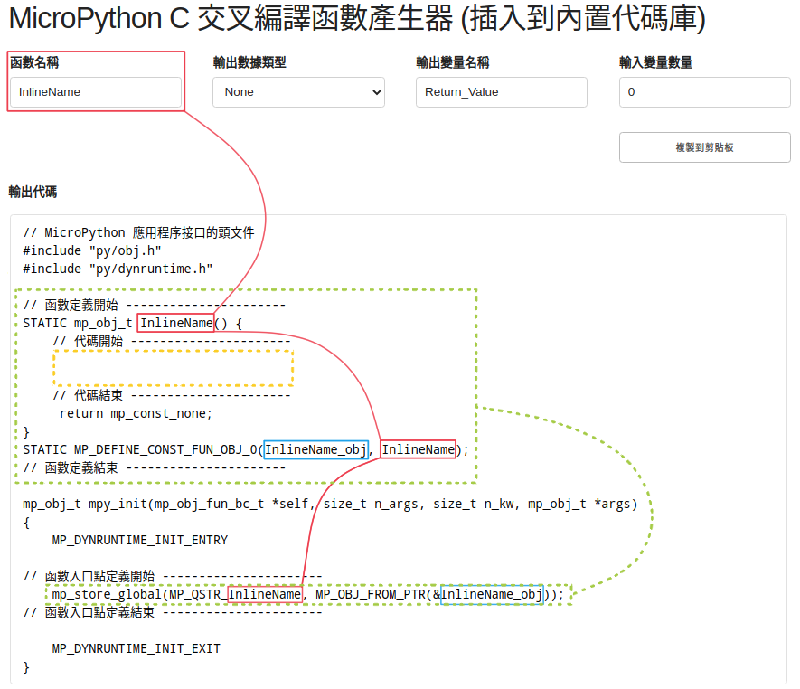
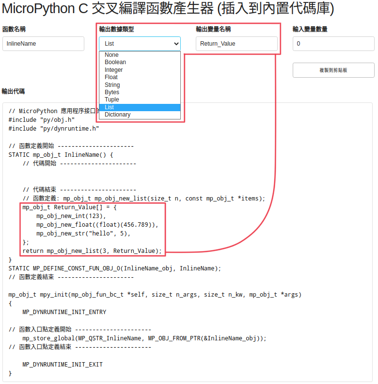
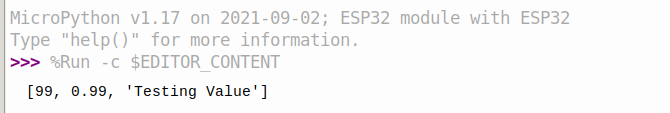

<style>
    table {
        width: 100%;
    }
</style>

## 用交叉編譯器從 C 代碼到 MicroPython 代碼 (mpy)

### 默認啟動頁面



- 方格<font color="#FF1000">紅色</font>內為程序名稱
 
- 方格<font color="#DDBB20">黃色</font>內為主要功能代碼

- 方格<font color="#2ACC20">綠色</font>內為各個功能函數代碼，每個函數有一套各自代碼段

重要<font color="#AA0000">注意事項</font>: 對於交叉編譯器，代碼頁的剩餘部分是固定不改變的。

## 輸入值選擇頁面


 - 方格<font color="#E520FF">紫色</font>內為第一個輸入參數，為布林值    
 - 方格<font color="#FF1000">紅色</font>內為第二個輸入參數，為數組或元組  

### 輸入函數如下

 - mp\_obj\_is\_true(boolValue);
 - mp\_obj\_get\_int(intValue);
 - mp\_obj\_get\_float(floatValue));
 - mp\_obj\_str\_get\_str(stringValue, StringLength);
 - mp\_obj\_get\_array(...);

## 返回值選擇頁面



 - 方格<font color="#FF1000">紅色</font>內為返回值，為數組或元組 

### 返回函數如下

 - mp\_obj\_new\_bool(boolValue);
 - mp\_obj\_new\_int(intValue);
 - mp\_obj\_new\_float(floatValue));
 - mp\_obj\_new\_str(stringValue, StringLength);
 - mp\_obj\_new\_bytes(bytesValue, bytesLength);
 - mp\_obj\_new\_tuple(tupleLength, tupleValue);
 - mp\_obj\_new\_list(listLength, listValue);
 - mp\_obj\_new\_dict(...);

## 實現交叉編譯器功能的示例


 - 方格<font color="#FF1000">紅色</font>內為創建函數，是為了防止錯誤的外部調用。 該函數需要在 MicroPython 調用定義之前定義。 因只是一個示例函數，所以輸入將用作返回值。


### 編譯後在Linux中輸出結果


## 編譯時出現問題

注意：一次只能使用一個程序上傳,以一步步的簡單方式對變量進行分組，防止複雜關係影響交叉編譯

編譯時出現問題代碼

 - ((IR_AC_Max - IR_AC_Min) > 20 & (IR_AC_Max - IR_AC_Min) < 1000)

解決的代碼 (用紅色標記)

 - (<font color="#FF1000"> ( </font>(IR_AC_Max - IR_AC_Min) > 20<font color="#FF1000"> ) </font> & <font color="#FF1000"> ( </font>(IR_AC_Max - IR_AC_Min) < 1000<font color="#FF1000"> ) </font>)

### 將部份函數如 memcpy, memset 加到代碼下，以防止編譯器調用全局頭文件引致錯誤。

```c
#ifndef min
#define min(a,b)    (((a) < (b)) ? (a) : (b))
#endif

#ifndef max
#define max(a,b)    (((a) > (b)) ? (a) : (b))
#endif

void* memcpy(void *dest, const void *src, size_t n)
{
  for (size_t i = 0; i < n; i++)
  {
    ((char *)dest)[i] = ((char *)src)[i];
  }
  return 0;
}

void* memset(void* b, int c, size_t len) {
    char* p = (char*)b;
    for (size_t i = 0; i != len; ++i) {
        p[i] = c;
    }
    return b;
}

size_t strlen(const char *str)
{
    const char *s;
    for (s = str; *s; ++s);
    return (s - str);
}

```

### ampy 使用

上傳文件 (*.mpy) 到 ESP32 模塊 (傳送接口為 /dev/ttyUSB0，如不是需自行更改。)

```shell
ampy --port /dev/ttyUSB0 put sample.mpy

```

### MicroPython 平台中的示例代碼


### MicroPython 平台輸出結果




### ampy 執行輸出中文的問題

MicroPython 程式執行結果的下 1 個位元組, 而 0x04 是 MicroPython 通知結束的特殊數值。這裡為了讓程式執行結果可以經由 USB 傳輸線串流顯示到電腦端, 所以採取了每收到 1 個位元組就立刻清除緩衝區強迫輸出到螢幕上的方式。這個方式對於一般的英數字沒有什麼影響, 可是若是中文字, 在 UTF-8 的編碼下, 至少會有 2 個位元組, 上述作法會把多個位元組拆散, 視為多個字元顯示, 因而造成個別位元組都是無法正常顯示的字元。

要解決這個問題, 最簡單的方式就是把函式中清除緩衝區的哪一行去掉,讓位元組連續輸出, 不要硬去清除緩衝區, 系統就不會認為個別位元組是單一字元了。

您可能會擔心把清除緩衝區的動作去除, 這樣會不會要累積一大堆輸出結果後才會在畫面上看到結果？那我們也可以這樣做, 依據 UTF-8 編碼的規則, 每收到一個完整的 UTF-8 編碼的字元就清除緩衝區強迫送出字元, 將同一函式改寫如下：

```python
utf8Char = b""
counts = 3
def stdout_write_bytes(b):
    global utf8Char, counts

    for i in b:
        curr = b'' + b    
        if curr==b'\x04':                 # end of output
            return;
        elif curr <= b'\x7f':             # 1-byte UTF-8 char
            utf8Char = curr
            counts = 0
        elif b'\xC0' <= curr <= b'\xDF':  # 2-bytes UTF-8 char
            utf8Char = curr
            counts = 1
        elif b'\xE0' <= curr <= b'\xEF':  # 3-bytes UTF-8 char
            utf8Char = curr
            counts = 2
        elif b'\xF0' <= curr <= b'\xF7':  # 4-bytes UTF-8 char
            utf8Char = curr
            counts = 3
        elif b'\x80' <= curr <= b'\xBF':  # 1 byte in a UTF-8 char
            utf8Char = utf8Char + curr
            counts = counts - 1

        if counts == 0:                   # 1 UTF-8 char readed
            print(utf8Char.decode('UTF-8'), end="")
            counts = 3                    # reset count
            utf8Char=b''
            
```            

這樣就可以使用 ampy 執行含有中文輸出的 MicroPython 程式了。