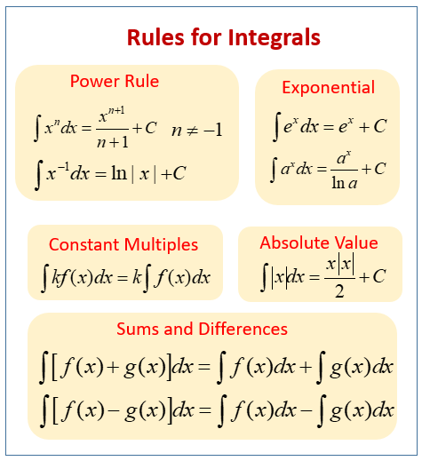

# 微積分

微積分主要是關注物件的變化，從變化中獲取關係變量。並將變化更改為零以獲得該點的值。

## 微分是將某些東西切成小塊，以找出它是如何變化

微分例子: 有人會從 30 m 的建築物上跳下。 1秒後人下落的速度？

使用這個簡化的公式來計算下降的距離: 

$$ d = 3 \times t^2 $$

- d = 下降距離，以米為單位
- t = 從跳躍開始的時間，以秒為單位

根據公式，1 秒後他將下降 3米。

$$ d = 3 \times t^2  = 3 \times 1^2 = 3 $$ 

1 秒後添加小的時間變化如下:

$$ d + \Delta d_{\delta t} = 3 \times (1 + \delta t)^2 $$

$$ d + \Delta d_{\delta t} = 3 \times (1 + 2\delta t + \delta t^2) $$

$$ d + \Delta d_{\delta t} = 3 + 6 \times \delta t + 3 \times \delta t^2 $$

$$ 3 + \Delta d_{\delta t} = 3 + 6 \times \delta t + 3 \times \delta t^2 $$

$$ \Delta d_{\delta t} = 6 \times \delta t + 3 \times \delta t^2 $$

$$ 速度  = \frac {\Delta d_{\delta t}}{\delta t} $$

$$ 速度  =  \frac {6 \times \delta t + 3 \times \delta t^2} {\delta t} $$

$$ 速度  =  6 + 3 \times \delta t $$

當變為零時 

$$ \delta t = 0 $$

距離隨時間變化的速度 

$$ = 6 m /s $$

## 積分是將小塊連接在一起以找出有多少。以找到整體的方法

積分例子:

我們可以計算幾個點的函數並將切片加起來隨著切片的寬度接近零，答案接近真正的答案。

使用上面的例子反向計算距離，正如我們所知

$$ v = \frac {\delta d}{\delta t} = 6 \times t $$

$$ \delta d = (6 \times t) \delta t $$

- v = 下降速度，以米每秒為單位
- t = 跳躍時間，以秒為單位

在微分常數後常數將被刪除，基於以上原因，積分後要加積分常數 C

$$ d = \int_{0}^{\infty } (6 \times t) \delta t $$

$$ d = \frac {6 \times t^2} {2} + C = 3 \times t^2 + C $$

使用綁定條件找積分常數 C，當 t = 0 函數等於 0。

$$ d = \frac {6 \times 0^2} {2} + C $$

$$ C = 0 $$

$$ d = 3 \times t^2 $$

最常用的微分衍生規則之一的冪規則說：

$$ x^n \hspace {0.5cm}  的微分衍生數是 \hspace {0.5cm} nx^{(n−1)} $$

最常用的積分衍生規則：

[互聯網微積分網站](https://www.mathsisfun.com/calculus/index.html)