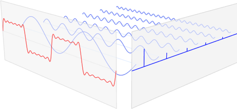

<style>
    table {
        width: 100%;
    }
</style>

# 傅里葉變換

傅里葉變換在工程中應用以確定振動信號中的主要頻率。 當信號的主頻率與結構的固有頻率一致時，發生的振動會因共振而被放大。 這可能會發生到結構可能倒塌的程度。

傅里葉變換通常用於將時間譜中的信號轉換為頻譜。 時間譜的例子有聲波、電、機械振動等。信號看到它看起來像一個具有不同頻率的波。 實際上它看起來像多個波浪。如下圖:



這就是傅里葉變換的用武之地。這種方法利用了這樣一個事實，即每個非線性函數都可以表示為（無限）正弦波的總和。 因為階躍函數是由多個正弦波模擬。

傅立葉變換將分解時間信號並返回有關模擬該時間信號所需的所有正弦波頻率的信息。對於均勻間隔值的序列，離散傅立葉變換 (DFT) 定義為：

$$ X_k = \sum_{n=0}^{N-1} x_n e^{\frac {-2 \pi ikn}{N}} $$

- $ N = $ 樣本數
- $ n = $ 當前樣本
- $ x_n $ = 時間 $ n $ 處的信號值
- $ k = $ 當前頻率（$ 0 H_z $ 至 $ N-1 H_z $）
- $ X_k $ = DFT 的結果（幅度和相位）

$$ a.b = \sum_{n=1}^{N} a_i.b_i $$

## FFT 和 IFFT 之間的差異

### FFT 代表快速傅立葉變換

FFT 將時域矢量信號轉換為頻域矢量信號。

$$ X_k = \sum_{n=0}^{N-1} x_n e^{\frac {-2 \pi ikn}{N}} $$

- $ X_k = $ 頻率域數據
- $ x_n = $ 時間域數據
- $ N = $ 傅里葉數量
- $ k = $ 0 至 $ N - 1 $

### IFFT 代表快速傅立葉逆變換

IFFT 將頻域矢量信號轉換為時域矢量信號。

$$ X_n = \frac {1}{N} \sum_{n=0}^{N-1} x_k e^{\frac {2 \pi ikn}{N}} $$


- $ X_n = $ 時間域數據
- $ x_k = $ 頻率域數據
- $ N = $ 傅里葉數量
- $ k = $ 0 至 $ N - 1 $


頻率分辨率在 *傅里葉* 中定義為 $ \frac {F_s}{N} $ 。 其中 $ F_s $ 是採樣頻率，$ N $ 是 FFT 中使用的數據點數。 例如，如果採樣頻率為 $ 1000 H_z $ ，您在 *傅里葉* 中使用的數據點數為 $ 1000 $。那麼頻率分辨率等於 $ \frac {1000 H_z}{1000} = 1 H_z $。


```c
#include <math.h>
#include <stdio.h>
#include <stdlib.h>	

typedef float real;

typedef struct{
	real Re; 
	real Im;
} complex;

#ifndef PI
# define PI	3.14159265358979323846264338327950288
#endif

void fft( complex *v, int n, complex *tmp )
{
  if(n>1) {
    int k,m;    
    complex z, w, *vo, *ve;
    ve = tmp; 
    vo = tmp+n/2;
    for(k=0; k<n/2; k++) {
      ve[k] = v[2*k];
      vo[k] = v[2*k+1];
    }
    fft( ve, n/2, v );		
    fft( vo, n/2, v );
    for(m=0; m<n/2; m++) {
      w.Re = cos(2*PI*m/(double)n);
      w.Im = -sin(2*PI*m/(double)n);
      z.Re = w.Re*vo[m].Re - w.Im*vo[m].Im;
      z.Im = w.Re*vo[m].Im + w.Im*vo[m].Re;
      v[  m  ].Re = ve[m].Re + z.Re;
      v[  m  ].Im = ve[m].Im + z.Im;
      v[m+n/2].Re = ve[m].Re - z.Re;
      v[m+n/2].Im = ve[m].Im - z.Im;
    }
  }
  return;
}

void ifft( complex *v, int n, complex *tmp )
{
  if(n>1) {
    int k,m;    
    complex z, w, *vo, *ve;
    ve = tmp; 
    vo = tmp+n/2;
    for(k=0; k<n/2; k++) {
      ve[k] = v[2*k];
      vo[k] = v[2*k+1];
    }
    ifft( ve, n/2, v );
    ifft( vo, n/2, v );
    for(m=0; m<n/2; m++) {
      w.Re = cos(2*PI*m/(double)n);
      w.Im = sin(2*PI*m/(double)n);
      z.Re = w.Re*vo[m].Re - w.Im*vo[m].Im;
      z.Im = w.Re*vo[m].Im + w.Im*vo[m].Re;
      v[  m  ].Re = ve[m].Re + z.Re;
      v[  m  ].Im = ve[m].Im + z.Im;
      v[m+n/2].Re = ve[m].Re - z.Re;
      v[m+n/2].Im = ve[m].Im - z.Im;
    }
  }
  return;
}

static void print_vector(
	     const char *title,
	     complex *x,
	     int n)
{
  int i;
  printf("%s (dim=%d):", title, n);
  for(i=0; i<n; i++ ) printf("\n %5.2f,%5.2f ", x[i].Re,x[i].Im);
  putchar('\n');
  return;
}

int main(void)
{
  int N,q;
  printf("2^q, q:");
  scanf("%d", &q);
  N	= 1 << q;
  complex v[N], v1[N], scratch[N];

  for(int k=0; k<N; k++) {
    v[k].Re = 0.125*cos(2*PI*k/(double)N);
    v[k].Im = 0.125*sin(2*PI*k/(double)N);
    v1[k].Re =  0.3*cos(2*PI*k/(double)N);
    v1[k].Im = -0.3*sin(2*PI*k/(double)N);
  }
    
  print_vector("Orig", v, N);
  fft( v, N, scratch );
  print_vector(" FFT", v, N);
  ifft( v, N, scratch );
  print_vector("iFFT", v, N);

  print_vector("Orig", v1, N);
  fft( v1, N, scratch );
  print_vector(" FFT", v1, N);
  ifft( v1, N, scratch );
  print_vector("iFFT", v1, N);

}


```


混疊頻率是實際信號頻率與採樣頻率的最接近整數倍之間的絕對差值。
基於 *傅里葉* 的測量需要對連續信號進行數字化。 根據奈奎斯特准則，採樣頻率 $ F_s $ 必須至少是信號中最大頻率分量的兩倍。 如果違反此標準，則會出現稱為混疊的現象。
當違反奈奎斯特准則時，採樣頻率一半以上的頻率分量將作為採樣頻率一半以下的頻率分量出現，從而導致信號的錯誤表示。 例如，頻率上的分量。

$$ \frac {F_s}{2} < f_a < F_s $$

其中 $ F_s $ 是採集時域信號的採樣頻率，$ N $ 是採樣數量。 頻率線以 $ \Delta f $ 間隔出現，其中

$$ \Delta f = \frac {F_s} {N} $$

頻率線也可以稱為頻率箱或 *傅里葉* 箱，因為您可以將 *傅里葉* 視為一組並行濾波器，其帶寬 $ \Delta f $ 以每個頻率增量為中心，從

$$ 直流 → \frac {F_s}{2} - \frac {F_s}{N} $$

Alternatively you can compute $ \Delta f $ as

$$ \Delta f = \frac {1}{N \times \Delta t} $$

其中 $ \Delta f $ 是採樣週期。 因此，$ N \times \Delta f $ 是包含獲取的時域信號的時間記錄的長度。 

如信號包含 $ 1,024 $ 個採樣點，採樣頻率為 $ 1.024 kH_z $，產生 $ \Delta f = 1 H_z $ ，頻率範圍從直流到 $ 511 H_z $。


頻率軸的計算表明，採樣頻率決定了頻譜的頻率範圍或帶寬，對於給定的採樣頻率，時域信號記錄中獲取的點數決定了分辨率頻率。 要提高給定頻率範圍的頻率分辨率，請增加以相同採樣頻率採集的點數。 

例如，在 $ 1.024 kH_z $ 處採集 $ 2,048 $ 個點會產生 
$$ \Delta f = \frac {F_s}{N} = = \frac {1024 H_z}{2048} = 0.5 H_z $$

頻率範圍為 $ 0 $ 到 $ 511.5 H_z $。

$$ 直流 → \frac {F_s}{2} = \frac {1024H_z}{2} = f_s $$

或者，如果採樣率為 $ 10.24 kH_z $ 和 $ 1,024 $ 個點，$ \Delta f $ 將為 $ 10 H_z $，頻率範圍為 $ 0 $ 到 $ 5.11 kH_z $。

高頻率的分量會干擾測量，可用抗混疊濾波器將高頻過濾掉。 如果確定被測量信號的頻率帶寬低於採樣頻率的一半 $ f_s < \frac {F_s}{2} $，可以選擇不使用抗混疊濾波器 (*Antialiasing filter*)。


