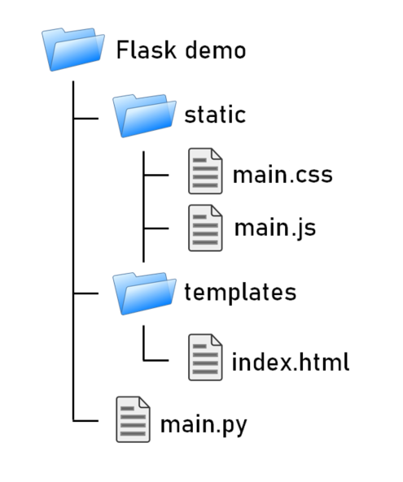

<style>
    table {
        width: 100%;
    }
</style>

# 在 Linux 下的 Python 網絡服務器

Flask 是一個使用 Python 撰寫的輕量級 Web 應用程式框架。Flask 核心十分簡單，主要是由 Werkzeug WSGI 工具箱和 Jinja2 模板引擎所組成。Flask 給予開發者非常大的彈性。可以選用不同的用的 extension 來增加其功能。以下是 Flask 簡易運行的程式，啟動測試伺服器後，可以在瀏覽器中 http://127.0.0.1:5000/ 印出 *歡迎來到 Flask!*。

```python
# 導入 Flask 工具包
from flask import Flask
# 初始化 Flask 類別成為 instance
app = Flask(__name__)

@app.route("/")
def main():
    return "歡迎來到 Flask!"

@app.route("/file")
def file():
    return "歡迎來到 Flask 文件控制環境!"

# 選擇要正確執行的功能模塊
if __name__ == "__main__":
    app.run()
```

網頁由網絡定位器地址控制，如下所示

http://127.0.0.1:5000/


http://127.0.0.1:5000/<font color='red'>file</font> 主要的不同是地址的結尾轉移到不同的功能模塊


## 詳細的 Flask 例子, 包括導入 Html、CSS、Javascript 和參數導入

檔案目錄架構



### Python 導入 main.py 文件如下

```python
import flask
app = flask.Flask(__name__)

@app.route('/')
def index():
    return flask.render_template('index.html', param="從 Python 導入變量")

if __name__ == '__main__':
    app.debug=True
    app.run()
```

### Html 導入 index.html 文件如下

```html
<!DOCTYPE html>
<html lang='en'>

<head>
    <meta charset="utf-8" />
    <title>歡迎來到 Flask!</title>
    <script src="https://code.jquery.com/jquery-3.2.1.min.js"></script>
    <link type="text/css" rel="stylesheet" href="{{ url_for('static',filename='main.css')}}" />
    <script src="{{url_for('static', filename='main.js')}}"></script>
</head>

<body>
    歡迎來到 Flask!
    <p>參數值:
    
        <font color='red'>{{param}}</font>
    
    </p>

    <div id="timer">
        <div id="days"></div>
        <div id="hours"></div>
        <div id="minutes"></div>
        <div id="seconds"></div>
    </div>
</body>

</html>
```

### CSS 導入 main.css 文件如下

```css
@import url(https://fonts.googleapis.com/css?family=Titillium+Web:400,200,200italic,300,300italic,900,700italic,700,600italic,600,400italic);
body {
    font-family: 'Titillium Web', cursive;
    margin: 0 auto;
    text-align: center;
    color: #222;
    background: #f2f3dd42;
    font-weight: 100;
}

div {
    display: inline-block;
    line-height: 1;
    padding: 10px;
    font-size: 40px;
}

span {
    display: block;
    font-size: 20px;
    color: #0f39ff;
}

#days {
    font-size: 50px;
    color: #db4844;
}

#hours {
    font-size: 50px;
    color: #f07c22;
}

#minutes {
    font-size: 50px;
    color: #8549b3;
}

#seconds {
    font-size: 30px;
    color: #405a00;
}
```

### Javascript 導入 main.js 文件如下

```js
function makeTimer() {

    var endTime = new Date("2 April 2022 9:00:00 GMT+08:00");
    endTime = (Date.parse(endTime) / 1000);

    var now = new Date();
    now = (Date.parse(now) / 1000);

    var timeLeft = endTime - now;

    var days = Math.floor(timeLeft / 86400);
    var hours = Math.floor((timeLeft - (days * 86400)) / 3600);
    var minutes = Math.floor((timeLeft - (days * 86400) - (hours * 3600)) / 60);
    var seconds = Math.floor((timeLeft - (days * 86400) - (hours * 3600) - (minutes * 60)));

    if (hours < "10") {
        hours = "0" + hours;
    }
    if (minutes < "10") {
        minutes = "0" + minutes;
    }
    if (seconds < "10") {
        seconds = "0" + seconds;
    }

    $("#days").html(days + "<span>Days</span>");
    $("#hours").html(hours + "<span>Hours</span>");
    $("#minutes").html(minutes + "<span>Minutes</span>");
    $("#seconds").html(seconds + "<span>Seconds</span>");

}

setInterval(function() {
    makeTimer();
}, 1000);
```

完整的網絡服務器如下:


### Flask 的有用設置

更改 Host 或 Port 

```python
app.run(host='0.0.0.0', port=80)
```
url_for 定位到我們檔案的靜態位置，寫在模板中外面要加兩個大括弧包住。以下程序是引入 main.css， 而檔案是儲存在主目錄下的 static 目錄下。

```python
<link rel="stylesheet" href="{{ url_for('static',filename='main.css') }}">
```
@app.route() 的意思是指定這部分程式碼的路由，讓我們可以透過不同的網址列執行不同的服務，這是動態設定網址的方法。


### 測試時間可能發生的問題

 - 背景程序仍運行中。使 Flask 程序不能更新。你可使用以下方法清除掉背景程序。30800為 PID 。

```shell
netstat -tlnp | grep 5000  
tcp  0  0 127.0.0.1:5000   0.0.0.0:*   LISTEN    30800/python
kill -9 30800
```
 - CSS 或 Javascript 更改後沒有更新。這應該是瀏覽器的緩存 *cache* 影響到更新。你可按 Ctrl-F5 手動更新網頁緩存。

## MicroPython 嵌入式系統下的 Picoweb

用 Picoweb 可以簡單地定義 HTTP 請求的端點，採用類似 Flask 的框架樣式。 我們只需使用應用對象的路由裝飾器，將 URL 作為輸入傳遞，該 URL 將觸發我們接下來定義的函數的執行。

```python
@app.route("/")
def index(req, resp):
    (...)

```

最後，我們將使用流編寫器的 awrite 方法發送其餘內容。 我們將發送一個簡單的 hello world 消息。

要考慮的一個重要方面是我們在調用每個函數之前使用關鍵字的 yield。 這與本文討論範圍之外的更高級的 Python 功能有關。 您可以在此處閱讀有關產量的更多信息。 您還可以在此處閱讀有關異步 Python 和關鍵字產量的更多信息。


