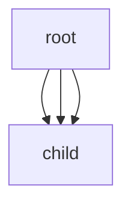

<style>
    table {
        width: 100%;
    }
</style>

# Python (Etree)

Python 內建 XML 格式的程式庫是 Etree。總結較重要部分。其中包括循環資料，字典及列，整理如下。方便參考。


```python
import xml.etree.Element as ET
import requests

url = "http://www.google.com"
response = requests.get(url)
root.ET.fromstrings(response.content)

```

