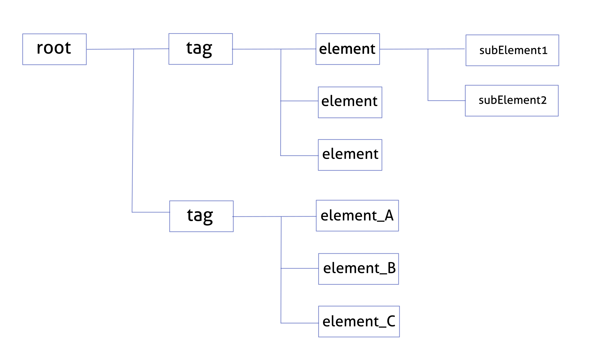
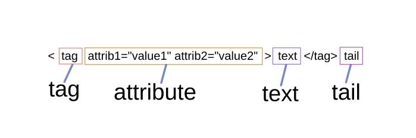

<style>
    table {
        width: 100%;
    }
</style>

# Python (Etree)

Python 內建 XML 格式的程式庫是 Etree。總結較重要部分。其中包括循環資料，字典及列，整理如下。方便參考。

- 應該使用XML格式時候是當你需要自定文件結構時(XML最強大的地方就是結構)。 前後臺互動不應該使用，前後臺互動應該使用JSON格式。

```html
<?xml version="1.0"?>
<root>
    <tag attrib="attrib_data1">
        <element attrib_1="attrib_data2" attrib_1a="attrib_data3">text1
            <subElement1>1</subElement1>
            <subElement2>2</subElement2>
        </element>text_tail
        <element attrib_2="attrib_data4">text2</element>
        <element >3</element>
    </tag>
    <tag attrib_A="attrib_dataA">
        <element_A attrib_A1="attrib_dataA1" attrib_A1a="attrib_dataA1a">text1a</element_A>
        <element_B attrib_A2="attrib_dataA2">text2a</element_B>
        <element_C >3</element_C>
    </tag>
</root>
```
## XML 的結搆圖



Element 是用於XML文檔的主要類。
元素有一些屬性和方法來訪問結構中包含的數據。部分有用的屬性和訪問數據的方法顯示如下

|屬性|XMML|數據類型|
|:---:|:---:|:---:|
|e.tag|< tag >|string|
|e.attrib|attrib="attrib_data1"|{string:string}|
|e.text|<>text</>|string|
|e.tail|<></>tail|string|
|list(e)|<><></></>|[element]|


**ElementTree.fromstring** 可以解析使用請求庫下載的網頁

```python
import xml.etree.Element as ET
import requests

url = "http://www.google.com"
response = requests.get(url)
root = ET.fromstrings(response.content)

```
Element 是用於XML文檔的主要類。
元素有一些屬性和方法來訪問結構中包含的數據。部分有用的屬性和訪問數據的方法顯示如下



當元素設置為
 - root = ET.fromstrings(...)

|屬性|XMML|數據類型|
|:---:|:---:|:---:|
|root.tag|< root >|string|
|root.attrib|{}|{string:string}|
|root.text|{whitespace}|string|
|root.tail|{whitespace}|string|
|list(root)|[< Element 'tag' >, < Element 'tag' >] |[element]|

當元素設置為
 - child = root[0]

|屬性|XMML|數據類型|
|:---:|:---:|:---:|
|child.tag|< tag >|string|
|child.attrib|{attrib:"attrib_data1"}|{string:string}|
|child.text|{whitespace}|string|
|child.tail|{whitespace}|string|
|list(child)|[< Element 'element' >, < Element 'element' >, < Element 'element' >] |[element]|

當元素設置為
 - subchild = child[0]

|屬性|XMML|數據類型|
|:---:|:---:|:---:|
|subchild.tag|< element >|string|
|subchild.attrib|{attrib_1:"attrib_data2", attrib_1a:"attrib_data3"}|{string:string}|
|subchild.text|text1|string|
|subchild.tail|text_tail|string|
|list(subchild)|[< Element 'subElement1' >, < Element 'subElement2' >] |[element]|

結論 : 數據的讀取原理基本上是循環上述過程。

搜索元素結構，以找到所需的元素方法如下:
 
索引搜索搜索元素按

 - node = root[0][1]

搜索下一層元素 (findall / find) - 直接子元素

 - child = root.findall('tag')
 - subchild = child.find('element') 

搜索根據輸入層的元素 (findall / find) - 路徑匹配的直接子元素

 - subchild = root.findall('tag/element')
 - subchild = root.find('tag/element')

搜索任何層元素 (iter) - 遞歸地遍歷標籤元素
    
 - anychild = root.iter('element')


## XPath 支持

 模塊為在樹中搜索元素的 XPath 表達式提供了有限的支持。 目標是支持縮寫語法的部分。

|句法|意義|
|:---:|:---|
|tag|選擇具有給定標籤的所有子元素。 例如 spam 選擇所有名為 spam 的子元素，而 spam/egg 選擇所有名為 spam 的子元素中的所有名為 egg 的孫子元素。 {namespace}* 選擇給定命名空間中的所有標籤，{*}spam 選擇任何（或沒有）命名空間中名為 spam 的標籤，而 {}* 僅選擇不在命名空間中的標籤。|
|..|選擇向上尋找<font color="#FF1000">父元素</font>。 如果路徑嘗試到達起始元素的祖先（調用了元素查找），則返回 None。|
|*|選擇向下尋找<font color="#FF1000">子元素</font>，包括註釋和處理指令。 例如，*/egg 選擇所有名為 egg 的任何層。|
|.|選擇<font color="#FF1000">當前元素</font>。 這在路徑的開頭最有用，表明它是相對路徑。|
|//|選擇當前元素下方所有級別上的<font color="#FF1000">所有子元素</font>。 例如，.//egg 選擇整個樹中的所有 egg 元素。|
|[@attrib]|選擇具有給定屬性的所有元素。|
|[@attrib='value']|選擇給定屬性<font color="#FF1000">具有給定值的所有元素。 該值不能包含引號。|
|[@attrib!='value']|選擇給定屬性<font color="#FF1000">不具有給定值的所有元素。 該值不能包含引號。|
|[tag]|選擇所有具有名為標籤的子元素的元素。 僅支持下<font color="#FF1000">一層</font>。|
|[.='text']|選擇其完整文本內容（任何層）<font color="#FF1000">等於</font>給定文本的所有元素。|
|[.!='text']|選擇其完整文本內容（任何層）<font color="#FF1000">不等於</font>給定文本的所有元素。|
|[tag='text']|選擇具有子命名標記的所有元素，其完整文本內容（任何層）<font color="#FF1000">等於</font>給定文本。|
|[tag!='text']|選擇具有子命名標記的所有元素，其完整文本內容（任何層）<font color="#FF1000">不等於</font>給定文本。|
|[position]|選擇位於<font color="#FF1000">指定位置</font>的所有元素。 位置可以是整數（1 是第一個位置）、表達式 last()（用於最後一個位置）或相對於最後一個位置的位置（例如 root[last()-1]）。|
