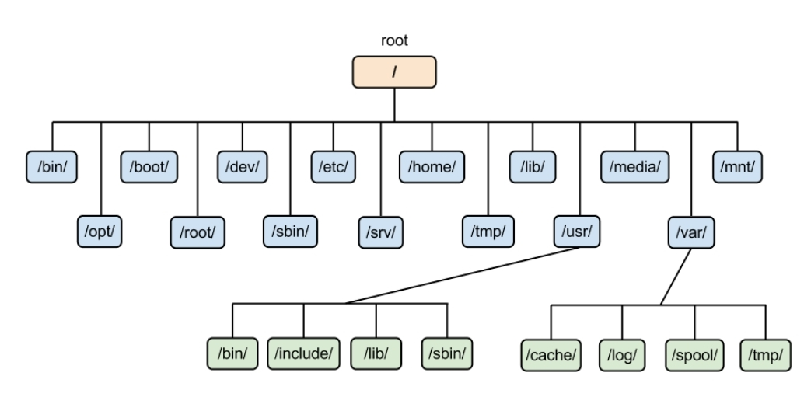

# Linux 檔案結構

|目錄|描述|
|:---:|:---|
|/|最頂層根目錄。|
| /boot| 啟動檔案目錄。|
| /dev | 外部連接設備檔案庫。|
| /etc | 系統及程序的設定檔案。|
| /lib | 共用程式庫。|
| /opt | 儲存程序庫以外的程式。|
| /srv | 系統資料文件。|
| /mnt | 目錄的連接點。|
| /proc| 進程信息偽文件系統。 內核數據結構的接口。|
| /root| 根（超級用戶）主目錄。|
| /sbin| 系統管理員的執行文件（fdisk、fsck、init 等）。|
| /bin | 基本用戶的執行文件。|
| /tmp | 臨時文件。 所有用戶都有權在此處放置臨時文件。|
| /var | 儲存不同變數資料。|

在 /usr 目錄下，是 /usr 目錄部分複制了根 ( / )。 目錄用途如下。  

|目錄|描述|
|:---:|:---|
| /usr/bin| 存放常用的執行文件，例如 clear、gcc、bunzip2|
| /usr/etc| 存儲應用程序配置文件|
| /usr/games| 遊戲應用程序|
| /usr/include| 存放頭文件|
| /usr/lib| 存放庫文件|
| /usr/libexec| 以二進制形式存儲庫文件|
| /usr/local| 通常用作放置其他用戶應用程序|
| /usr/sbin| 存儲需要管理員權限的執行文件|
| /usr/share| 保存安裝在 Linux 中的應用程序的文檔文件|
| /usr/src| 用戶的應用程序源文件|
| /usr/tmp| 應用程序的臨時文件夾。 文件夾可能指向 /var/tmp 目錄|

