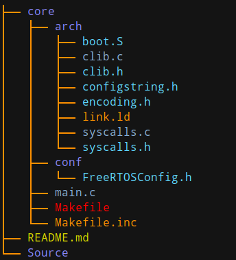

<style>
    table {
        width: 100%;
    }
</style>

# FreeRTOS

[FreeRTOS 互聯網資源](https://www.freertos.org/a00104.html)

## 安裝 FreeRTOS

FreeRTOS 設計簡單只需 3 個實時操作系統移植通用的源文件和一個微控制器特定源文件，API 設計簡單直觀。移植到許多不同的微控制器架構和許多不同的編譯器。每個移植都附帶一個官方例子，無需任何修改即可在開發它的硬件平台上編譯和執行。

建議創建一個新的 FreeRTOS 項目，從提供的預配置演示開始，然後對其進行調整。這樣做可確保新項目包含所有必要的源文件和頭文件，並安裝必要的中斷服務例程，用戶可以很容易地編譯或執行此操作的過程序。

FreeRTOS 應用程序將像非實時操作系統應用程序一樣啟動和執行，直到調用 *vTaskStartScheduler()*。 *vTaskStartScheduler()* 通常從應用程序的 *main()* 函數中調用。實時操作系統僅在調用 vTaskStartScheduler() 後控制執行順序。

### 源文件

FreeRTOS 以標準 C 源文件的形式提供，這些源文件與項目中的所有其他 C 文件一起構建。 FreeRTOS 以 zip 文件源代碼的形式分發。

作為最低要求，項目中必須包含以下源文件：

 - FreeRTOS/Source/tasks.c
 - FreeRTOS/Source/queue.c
 - FreeRTOS/Source/list.c
 - FreeRTOS/Source/portable/[compiler]/[architecture]/port.c。
 - FreeRTOS/Source/portable/MemMang/heap_x.c 其中“x”是 1、2、3、4 或 5。

如果包含 port.c 文件的目錄還包含一個彙編語言文件，那麼也必須使用該彙編語言文件。

### 可選源文件

 - 軟件計時器功能，可添加 FreeRTOS/Source/timers.c 到項目中。
 - 事件組功能，可添加 FreeRTOS/Source/event_groups.c 到項目中。
 - 流緩衝區或消息緩衝區功能，可添加 FreeRTOS/Source/stream_buffer.c 到項目中。
 - 協同程序功能，則將 FreeRTOS/Source/croutine.c 添加到您的項目中（注意程序已被棄用）。

**總結**

|FreeRTOS/Source/下的文件|作用|
|:---|:---:|
|tasks.c |必須，任務|
|list.c |必須，列表|
|queue.c |基本操作、信號量|
|timer.c (可選) |軟件定時器|
|event_groups.c (可選)|事件組功能|
|croutine.c (可選)|協同已被棄用|

### 頭文件

以下目錄必須在編譯器的包含路徑中（必須告知編譯器在這些目錄中搜索頭文件）：
 - FreeRTOS/Source/include
 - FreeRTOS/Source/portable/[compiler]/[architecture].

及目錄包含要使用的 FreeRTOSConfig.h 文件 根據移植的不同，相同的目錄也可能需要位於彙編器的包含路徑中。

### 內存管理文件
每個項目還需要一個名為 [FreeRTOSConfig.h](https://www.freertos.org/a00110.html) 的文件。 FreeRTOSConfig.h 為正在構建的應用程序定制實時操作系統內核。因此它特定於應用程序，而不是實時操作系統，並且應該位於應用程序目錄中，而不是實時操作系統內核源代碼目錄之一。

如項目中包含 heap_1，heap_2，heap_4，或 heap_5，則 FreeRTOSConfig.h 定義 configTOTAL_HEAP_SIZE 將對 FreeRTOS 堆進行標註。
 - 如果 configTOTAL_HEAP_SIZE 設置得太高，應用程序將不能鏈接。

FreeRTOSConfig.h 定義 configMINIMAL_STACK_SIZE 設置空閒任務使用的堆棧大小。
 - 如果 configMINIMAL_STACK_SIZE 設置得太低，那麼空閒任務會產生堆棧溢出。

建議從為相同微控制器架構提供的官方 FreeRTOS 例子中復制 configMINIMAL_STACK_SIZE 設置。 FreeRTOS 例子項目存儲在 FreeRTOS/Demo 目錄的子目錄中。注意一些例子是舊的，因此不包含所有可用的配置選項。

|配置頭文件|作用|
|:---|:---:|
|FreeRTOSConfig.h |配置方案，如選擇調度 configUSE_PREEMPTION|
|FreeRTOS.h| 使用FreeRTOS API函數時，必須包含這個文件|

|內存管理文件|優點|缺點|
|:---|:---:|:---:|
|heap_1.c| 分配簡單，時間確定|不回收|
|heap_2.c| 動態分配，最佳匹配|時間不定，內儲碎片問題|
|heap_3.c| 調用標準庫函數|時間不定，速度慢|
|heap_4.c| 相鄰空閒內存可合併|時間不定|
|heap_5.c| 內存空閒合併及內存塊|時間不定|

注意：heap_x.c 只需選擇一個即可，可以先使用 heap_1.c。

### 特定target的內核文件
 - FreeRTOS/source/portable/[compiler]/[architecture]/port.c
 - FreeRTOS/source/portable/[compiler]/[architecture]/portmacro.h
 - 可能還有portasm.s或者portasm.asm
   - FreeRTOS/source/portable/[compiler]/[architecture]/portasm.s
   - FreeRTOS/source/portable/[compiler]/[architecture]/portasm.asm

### 中斷服務

每個實時操作系統移植都使用一個定時器來生成周期性中斷。移植使用額外的中斷來管理切換。中斷根據實時操作系統移植源文件提供服務。

用於安裝實時操作系統移植提供的中斷處理程序的方法取決於所使用的編譯器。請參閱官方提供的應用程序例子。

## 創建新的 FreeRTOS

將 FreeRTOS 移植到完全不同且尚未受支持的微控制器並非易事。本頁的目的是描述啟動新移植所需的內部管理準備工作。每個移植都是適度獨特的，並且非常依賴於所使用的處理器和工具，因此此頁面無法提供有關移植細節的詳細信息。然而，已經存在許多其他 FreeRTOS 移植，建議將它們用作參考。在同一個處理器系列中移植是一項更直接的任務，例如從一個基於 ARM7 的設備到另一個。如果這是目標，那麼詳細說明如何修改現有例子應用程序的文檔頁面將是一個很好的例子。

### 設置目錄結構
FreeRTOS 內核源代碼通常包含在所有移植通用的 3 個源文件（如果使用協同例程，則為 4 個）和一個或兩個將實時操作系統內核定製到特定架構的 *移植* 文件中。

建議步驟：
 - 下載最新版本的 FreeRTOS 源代碼。
 - 將文件解壓縮到方便的位置。
 - 理解源代碼組織和目錄結構。
 - 創建一個包含移植結構 “移植” 文件的目錄。按照約定，目錄應採用以下形式：FreeRTOS/Source/portable/[compiler name]/[processor name]。例如，如果您使用的是 GCC 編譯器，您可以在現有的 FreeRTOS/Source/portable/GCC 目錄之外創建一個移植結構目錄。
 - 將空的 port.c 和 portmacro.h 文件複製到創建的目錄中。這些文件應該只包含需要實現的函數和宏的存根。有關此類函數和宏的列表，請參見現有的 port.c 和 portmacro.h 文件。可以通過簡單地刪除函數和宏主體從這些現有文件之一創建存根文件。
 - 如果要移植到的微控制器上的堆棧從高內存向下增長到低內存，則將 portmacro.h 中的 portSTACK_GROWTH 設置為 -1，否則將 portSTACK_GROWTH 設置為 1。
 - 創建一個包含移植結構的移植應用程序例子目錄。
 - 將現有的 FreeRTOSConfig.h 和 main.c 文件複製到剛剛創建的目錄中。
 - 查看 FreeRTOSConfig.h 文件。它包含一些需要選擇的硬件設置的宏。
 - 在剛剛創建的目錄之外創建一個目錄並將其命名為 ParTest（可能是 FreeRTOS/Demo/[architecture_compiler]/ParTest）。將一個 ParTest.c 存根文件複製到此目錄中。
 - ParTest.c 包含三個簡單的函數：
    - 設置一些可以閃爍幾個 LED 的 GPIO，
    - 設置或清除特定 LED，以及
    - 切換 LED 的狀態。
    
    這三個功能需要 LED 工作將有助於其餘的測試。查看其他項目例子中包含的許多現有 ParTest.c 文件以作為參考。


## ARM 編譯器簡述

- arm-linux-* 針對執行linux的ARM機器，其依賴於指定的C語言庫 Glibc (是個 C 語言庫，以庫的形式存在於編譯器中，ARM 所使用的 Glibc 庫跟 x86 是不一樣)，執行 linux 的 ARM 機器上編譯顯得更加和諧。

- arm-elf-* 則是一個獨立的編譯體系，不依賴於指定的 C 語言庫 Glibc，可使用 newlib (RedHat專門為嵌入式系統的開發的C庫) 等其他 C 語言庫，不要求作業系統支援(沒有linux等大型作業系統的程式，如監控程式，bootloader等)。系統程式更小巧快捷。


[ARM 嵌入式工具鏈](https://developer.arm.com/tools-and-software/open-source-software/developer-tools/gnu-toolchain/gnu-rm/downloads)

通過鍵入以下命令安裝 GCC、G++ 交叉編譯器和支持程序

```shell
$ sudo apt-get install gcc-arm-none-eabi

Package: gcc-arm-none-eabi
Version: 15:7-2018-q2-6
Priority: optional
Section: devel
Maintainer: Agustin Henze <tin@debian.org>
Installed-Size: 498 MB
Depends: libc6 (>= 2.15), libgcc1 (>= 1:3.0), libgmp10, libmpc3, libmpfr6 (>= 3.1.3), libstdc++6 (>= 5), zlib1g (>= 1:1.1.4), binutils-arm-none-eabi
Recommends: libnewlib-arm-none-eabi
Breaks: libnewlib-dev (<= 2.4.0.20160527-4), libstdc++-arm-none-eabi-newlib (<= 15:6.3.1+svn253039-1+10)
Homepage: https://developer.arm.com/open-source/gnu-toolchain/gnu-rm
Download-Size: 28.4 MB
APT-Manual-Installed: yes
APT-Sources: https://community-packages.deepin.com/deepin apricot/main amd64 Packages
Description: GCC cross compiler for ARM Cortex-R/M processors
 Bare metal C and C++ compiler for embedded ARM chips using Cortex-M, and
 Cortex-R processors.
 This package is based on the GNU ARM toolchain provided by ARM.

```

## RISC V 編譯器簡述




[上述 RISC V 示例下載](../assets/sample/RISCV-1.7z)

示可以通過以下方式編譯 (刷機方式因嵌入板不同而異)：

```shell
$ cd core
$ make clean
$ make
$ objcopy -O ihex riscv-spike.elf output.hex
```
