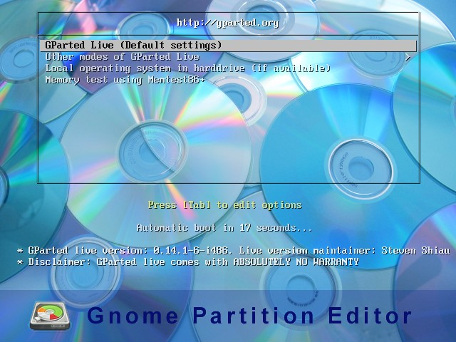
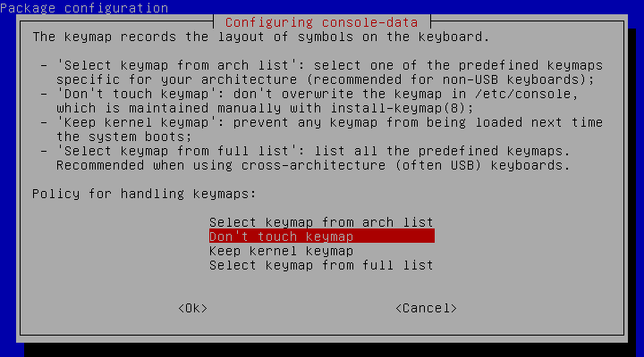
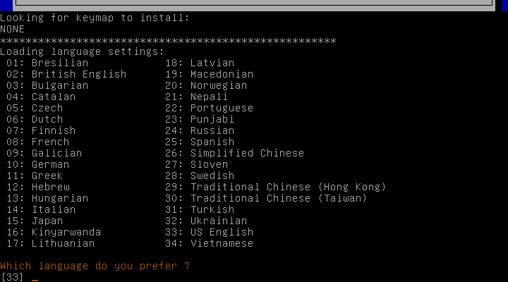
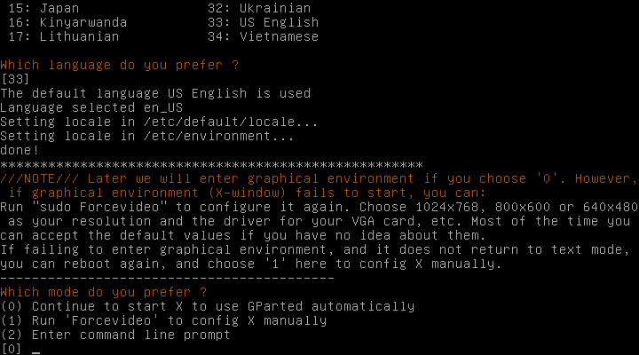
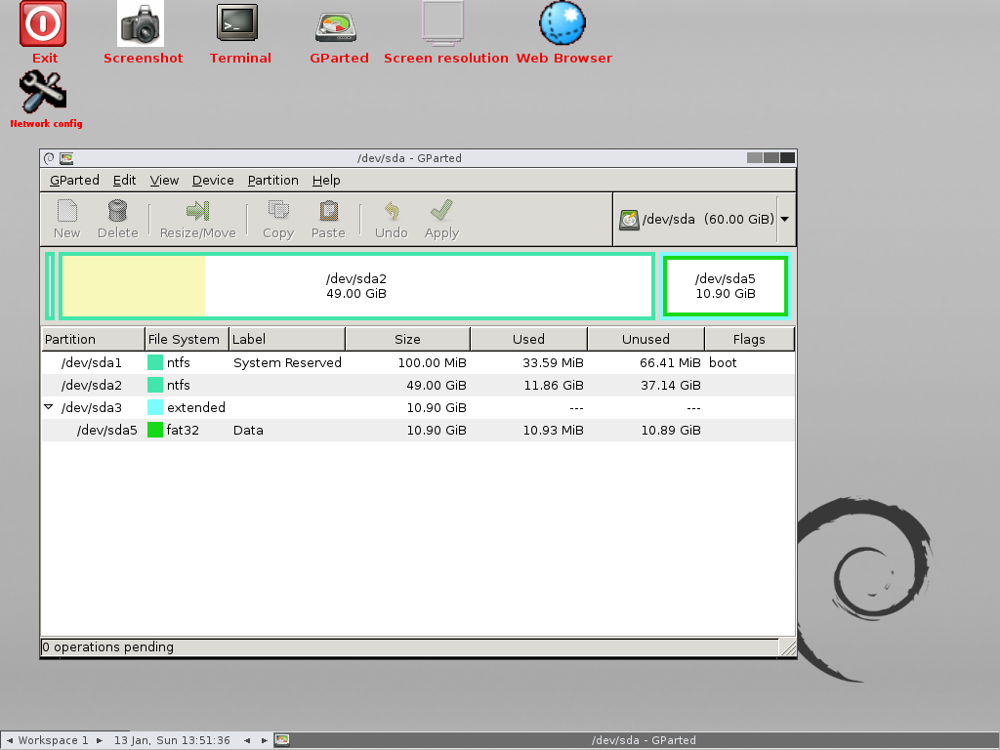

# 硬盤分區編輯器

[GNOME Partition Editor 互聯網資源](https://gparted.org)

## Linux 硬盤分區編輯器

由於系統盤內存大小被耗盡，有時需要調整分區的內存大小以保持linux系統正常工作。下面將介紹一種方法來幫助處理這種類型問題。

下載 ISO 文件 [GNOME Partition Editor](https://gparted.org/download.php)

要調整硬盤分區的大小，必須使用獨立的 USB 磁盤來執行 GNOME 硬盤分區編輯操作。你可以使用 [DeepIn 啟動磁盤製作程序](https://www.deepin.org/en/original/deepin-boot-maker) 刻錄下載的 *ISO* 文件，創建一個 USB 磁盤來運行GNOME 硬盤分區編輯操作。在出現問題時搶救數據。

開始運行獨立的 USB 磁盤

使用標準美式鍵盤，請按 Enter 鍵。

要使用美國英語，請按 Enter 鍵。

要啟動默認圖形環境並開始 GNome 硬盤分區編輯器應用程序，請按 Enter 鍵。

現在可以開始使用 GNome 硬盤分區編輯器應用程序

