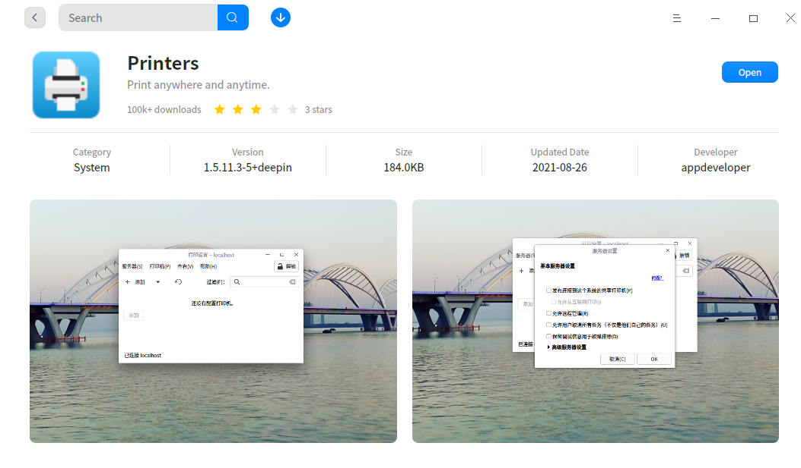
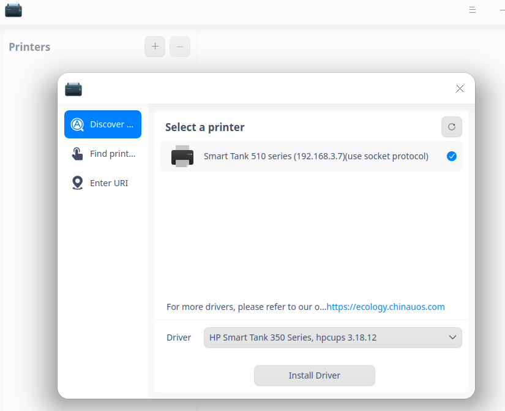
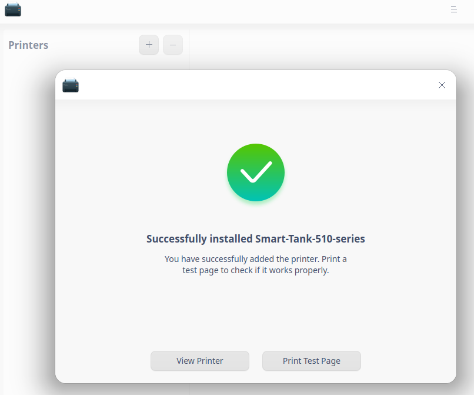
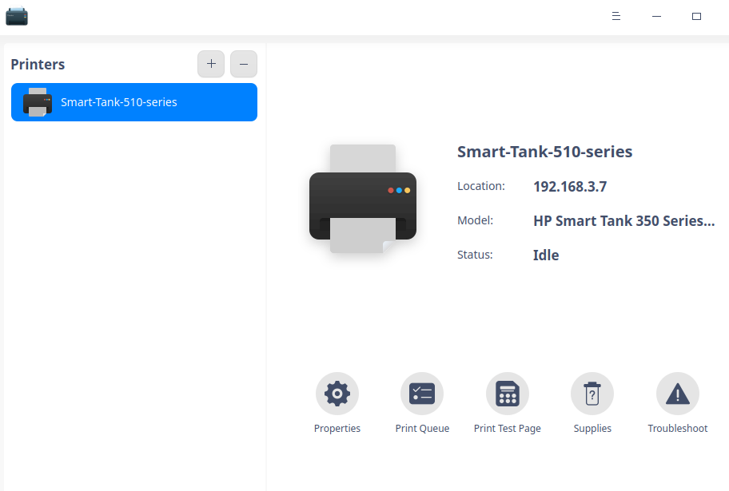

# Linux 安裝打印機

打印機安裝通用對任何計算機系統都非常有用，幾乎所有 Linux 桌面都依賴於一個用戶易於使用的打印機配置/管理工具，稱為 system-config-printer。儘管 GUI 可能存在細微差別（從發行版到發行版），但該工具的使用是相同的——而且非常簡單。即使沒有 GUI 工具，在 Linux 中管理打印機也非常簡單，這要歸功於通用 Unix 打印系統 (CUPS) 的 Web 前端。使用這個基於 Web 的管理工具，甚至可以遠程配置打印機。

如下文章中，將介紹使用 system-config-printer 工具設置打印機。用戶不必擔心將 Linux 用作桌面，甚至使用 Linux 來共享打印機。

## 添加本地打印機

在系統配置打印機窗口中，單擊添 **+** (加)按鈕。在出現的窗口如下圖，可以選擇要添加的列出的打印機，或者如果您的打印機未列出（這不太可能），需要找到驅動程序。找到打印機驅動程序的最佳位置（除了打印機製造商）是 Linux 基金會的 OpenPrinting 工作組。帶有 OpenPrinting 的驅動程序數據庫非常重要。首先要查看打印機列表，找到您的打印機，然後查看驅動程序 OpenPrinting 的建議。

連接打印機後，Linux系統會找到合適的的打印機驅動程序，如下所示:

