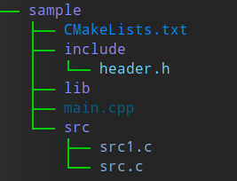
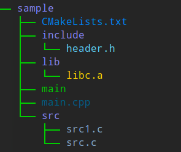

<style>
    table {
        width: 100%;
    }
</style>

# CMake

cmake的出現就是為了幫助構建大型複雜項目。 cmake提供了簡潔的接口，方便設置編譯參數（如優化等級，報警設置等等），添加依賴（頭文件和庫），編譯源代碼等等。 需要注意的是 cmake 的任務並不是構建項目，而是生成構建項目的 g++ 命令（更確切的說就是MakeFile）。

## 安裝 CMake

```shell
$ sudo apt install cmake
```

以下文件創建項目:



CMakeLists.txt的最常用內容如下：

```cmake
# cmake 最低版本需求
cmake_minimum_required(VERSION 3.10)

# 工程名稱
project(Trial_example)

## 設置彙編語言及 C 語言編器
enable_language(C ASM)

# 設置編譯器文件路徑 tools
set(tools /home/dickyko/Downloads/gcc-arm-none-eabi-10.3-2021.10-x86_64-linux/gcc-arm-none-eabi-10.3-2021.10/bin)

# 通過命令設置語言編譯器
set(CMAKE_C_COMPILER ${tools}/arm-none-eabi-gcc)
set(CMAKE_ASM_COMPILER ${tools}/arm-none-eabi-as)

# 設置編譯靜態庫的產出目錄為項目根目錄下的library文件夾
set(LIBRARY_OUTPUT_PATH ${CMAKE_SOURCE_DIR}/lib/)

# 設置編譯可執行文件的產出目錄為項目根目錄下
set(EXECUTABLE_OUTPUT_PATH ${CMAKE_SOURCE_DIR}/)

# 設置包含頭文件路徑 (多次一個參數或多於一個參數以空格分隔)
include_directories(include/ ST_Library/ ST_Library/inc/ port/GCC/ARM_CM4F/)

# 編譯源碼生成目標，尋找 src 目錄下所有的 c 源代碼文件
file(GLOB_RECURSE SRC_LIST src/*.c)

file(GLOB_RECURSE ST_Library/src/*.c)

# 將 src 目錄下的 c 文件編譯為靜態庫 libc.a, 該指令的主要作用就是將指定的源文件生成鏈接文件，然後添加到工程中去。參數為 STATIC, SHARED 和 MODULE 可選擇是指生成庫文件的類型
add_library(c STATIC ${SRC_LIST})

# 設置鏈接庫目錄 (多次一個參數或多於一個參數以空格分隔)
link_directories(${CMAKE_SOURCE_DIR}/lib/)

# 將 main.cpp 編譯為可執行文件 main
add_executable(main main.c)

# 增加可執行文件(可多於一個參數以空格分隔)需要鏈接的靜態庫。一定要放在 add_executable 後面，否則 cmake 會對 main 產生困惑。add_executable 相當於聲明了可執行文件 main 的存在。
target_link_libraries(main libc.a)

# 安裝部份。一般參數為 FILES，PROGRAMS，DIRECTORY
install(FILES COPYRIGHT.md DESTINATION share/loc)
install(PROGRAMS main DESTINATION bin)
install(DIRECTORY doc/ main DESTINATION share/doc)

# 構建完成信息。參數為 FATAL_ERROR，STATUS，WARNING，AUTHOR_WARNING，VERBOSE等，FATAL_ERROR 會停止編譯系統的構建過程； STATUS 類似於編程語言中的 DEBUG 信息。
message(STATUS "構建完成")

```

## 示例中使用命令的解釋

### 變數

 - 變量使用 ${ } 方式取值，指令是大小寫無關，參數和變量是大小寫相關
 - \# 是行的註解。而 \#[[ 及 ]] 是區塊的注解
 - LIBRARY_OUTPUT_PATH, EXECUTABLE_OUTPUT_PATH 為 CMake 系統變量
 - CMAKE_SOURCE_DIR 是定義 CMakeLists.txt 的文件夾 (root)
 - GLOB_RECURSE 模式將遍歷匹配目錄的所有子目錄並匹配文件

### 最基本例子 (只生成 main 的可執行擋案)

```cmake
cmake_minimum_required(VERSION 3.10)

project(Trial_example)

add_executable(main main.c)
```
 - add_executable(main main.c <font color="#FF1000">func.c</font>) 超過一個原始的 C 檔案，可加於主檔案後。

### 有多個原始檔案放在目錄 src 下的例子

```cmake
cmake_minimum_required(VERSION 3.10)

project(Trial_example)

aux_source_directory(src <font color="#FF1000">SRC_LIST</font>)

add_executable(main ${<font color="#FF1000">SRC_LIST</font>})
```
 - aux_source_directory(src SRC_LIST) 將在 src 目錄下的所有檔案名稱放入變數 SCR_LIST 中，以 ${SRC_LIST} 傳入 add_executable 。

### 頭檔案放在 include 目錄下及原始檔案放在目錄 src 下的例子

```cmake
cmake_minimum_required(VERSION 3.10)

project(Trial_example)

aux_source_directory(src SRC_LIST)

include_directories(<font color="#FF1000">include</font>)

add_executable(main ${SRC_LIST})
```
 - include_directories 加入以存放頭檔案

### 正規做法，有不同目錄下有分別 CMakeLists.txt 方便管理
---
#### 主目錄下 CMakeLists.txt

```cmake
cmake_minimum_required(VERSION 3.10)

project(Trial_example)

add_subdirectory(<font color="#FF1000">src</font>)
```
 - add_subdirectory 加入以使用其指定目錄下的 CMakeLists.txt 方便管理。

#### src 目錄下 CMakeLists.txt

```cmake
aux_source_directory(src SRC_LIST)

include_directories(../include)

add_executable(main ${SRC_LIST})

set(EXECUTABLE_OUTPUT_PATH ${<font color="#FF1000">PROJECT_SOURCE_DIR</font>}/bin)
```

 - set 用以設置翻譯後的文件目錄。 <font color="#FF1000">PROJECT_SOURCE_DIR</font> 為工程的根目錄。

#### 制作動態或靜態程式庫

```cmake
aux_source_directory(src SRC_LIST)

# 動態程式庫 (lib.<font color="#FF1000">so</font>)

add_library(func_shared SHARED ${SRC_LIST})

set_target_properties(func_shared PROPERTIES OUTPUT_NAME "func_shared")

# 靜態程式庫 (lib.<font color="#FF1000">a</font>)

add_library(func_static STATIC ${SRC_LIST})

set_target_properties(func_static PROPERTIES OUTPUT_NAME "func_static")

set(LIBRARY_OUTPUT_PATH ${PROJECT_SOURCE_DIR}/lib)
```
### function 函數

function(<font color="#FF1000">Name</font> [arg1 [arg2 [arg3 ...]]])

  ...

endfunction()

### 在特定目錄下添加所有在下面目錄的頭文件

```cmake
function(addInclude param)
    set(rdir ${param})
    file(GLOB_RECURSE subDirectories ${rdir} *.h)
    get_property(inc_dirs DIRECTORY PROPERTY INCLUDE_DIRECTORIES)
    foreach(dir ${subDirectories})
        get_filename_component(ITEM_PATH ${dir} DIRECTORY)
        if(NOT ${ITEM_PATH} IN_LIST inc_dirs)
            include_directories(${ITEM_PATH})
        endif()
        get_property(inc_dirs DIRECTORY PROPERTY INCLUDE_DIRECTORIES)
    endforeach()
endfunction()

addInclude("/os/w801")
```

### 在特定目錄下添加在下面目錄的所有 C 源文件

```cmake
function(addsrc param)
    set(rdir ${param})
    file(GLOB_RECURSE subDirectories ${rdir} *.c)
    foreach(dir ${subDirectories})
        list(APPEND SRC_LIST ${dir})
    endforeach()
    add_executable(main ${SRC_LIST})
endfunction()

addsrc("/os/w801")
```

#### 函數和宏的默認內部變量

|變量	|說明|
|:---:|:---:|
|ARGV#	|ARGV0為第一個參數，ARGV1為第二個參數，依次類推|
|ARGV	|定義宏（函數）時參數為2個，實際傳了4個，則ARGV代表實際傳入的兩個|
|ARGN	|定義宏（函數）時參數為2個，實際傳了4個，則ARGN代表剩下的兩個|
|ARGC	|實際傳入的參數的個數|


---
[互聯網 CMake 命令詳解](https://gitlab.kitware.com/cmake/community/-/wikis/doc/cmake/Useful-Variables)

## CMake 進行編譯

CMake 在生成文件的過程中會生成很多中間緩存文件，為了使項目更簡潔，文件路徑更清楚，一般會在項目的 root 目錄下建立一個文件夾，用於存儲 CMake 生成的中間文件。而一般使用的文件家名稱為build 或者 release。構建項目時，依次執行以下命令：

```shell
# 進入項目的root目錄，本文為：sample
cd sample

# 創建存儲緩存文件的文件夾，build
mkdir build

# 使用 CMake 命令生成 makefile 文件
cmake ..

# 使用 make 命令進行編譯
make
```



此時，就可以在 build 文件夾下看到 MakeFile 文件，cmake 也就正式完成了它的使命，接著執行 make，就可以看到下面的目錄結構，主文件已經出現了可執行文件 **main** 和生成的靜態庫 **libc.ac。

### make 使用命令

 - **make** 編譯生成 **elf** 文件；

 - **make bin** 將 **elf** 文件轉化生成 **bin** 文件；

 - **make hex** 將 **elf** 文件轉化生成 **hex** 文件；

 - **make clean** 即可清除掉所有編譯產生的文件。

## ELF, HEX 及 BIN 的不同

|文件|格式|包含地址|大小|可轉換|
|:---:|:---:|:---:|:---:|:---:|
|ELF|x86 Linux|有|最大|BIN, HEX|
|HEX|單片機|有|2 倍 BIN 大小|BIN|
|BIN|單片機|沒有|最小|加基地址轉 HEX|

 - ELF（Executableand linking format）文件是 x86 Linux 系統下的一種常用目標文件，包含著 ELF header，程序頭部表，節區頭部表等。文件包含的信息量相比於 BIN 和 HEX 文件都要多，可通過 ELF 文件生成 HEX 和 BIN 文件，但 HEX 和 BIN 並不能轉為 ELF。

 - HEX 和 BIN 文件都是單片機常見的刷新格式，HEX 也可以直接轉換為 BIN 文件，但是 BIN 要轉化為 HEX 文件必須要給定一個基地址。雖然可以相互轉換，但兩者在文件格式方面還有一些差異：
   - HEX 文件
     - 文件大小並不是實際的數據大小
     - 包括別的附加信息 (地址，長度，校驗等)
     - 燒寫或下載文件時，一般不需要用戶指定地址
     - 用 ASCII 來表示數據，8bit 就需要 2 個字節
     - 至少需要 2 倍 BIN 文件的空間
   - BIN 文件
     - 查看文件的大小就是數據的實際大小
     - 文件只包含數據本身
     - 燒寫文件時則需要指定燒錄的地址


## 編譯彙編語言例子

從一個簡單的程序例子開始 ，它什麼都不做，只是返回一個錯誤代碼。

```shell
.global main    /* 'main' 是切入點，必須是全局變量 */
main:           /* 這是 main */
    mov r0, #2  /* 將 2 放入寄存器 r0 */
    bx lr       /* 從 main 返回 */
```

創建一個名為 start.s 的彙編語言文件並寫入上面顯示的內容。並鍵入以下命令

```shell
# 編譯彙編指令
$ arm-none-eabi-as -o start.o start.s
```

將創建一個 start.o 文件。現在鏈接此文件以獲取可執行文件

```shell
# 編譯 GCC 指令
$ arm-none-eabi-gcc --specs=nosys.specs -o start start.o
```
如一切按預期進行，將獲得一個可執行文件 start 的 ARM 格式文件

## ELF 轉換成 HEX

一些交叉編譯器將創建一個輸出 *ELF* 文件, 假設文件名是 *output.elf* 從 ELF 到 HEX 的轉換方法如下。文件名 *output.hex* 將根據需要更改。

```shell
# 安裝轉換工具 *objcopy* 如果之前沒有安裝
$ sudo apt-get install binutils-multiarch

# 轉換指令 HEX
$ objcopy -O ihex output.elf output.hex

# 轉換指令 BIN
# objcopy -O binary firmware.elf output.bin
```

[互聯網 ARM 彙編程序](https://thinkingeek.com/2013/01/09/arm-assembler-raspberry-pi-chapter-1/)

## 工具鏈專為 Cortex-A/R/M 裸機開發而構建和優化

下表顯示瞭如何使用正確的命令行調用 GCC/G++ Cortex-A/R 和 Cortex-M 架構變體的選項

| ARM Core | 命令行選項 | 多功能庫工具 |
|:---:|:---:|:---:|
|Cortex-M0+ | -mthumb -mcpu=cortex-m0plus| armv6-m|
|Cortex-M0 | -mthumb -mcpu=cortex-m0 | armv6-m|
|Cortex-M1 | -mthumb -mcpu=cortex-m1 | armv6-m|
|Cortex-M0+, Cortex-M0, Cortex-M1 | -mthumb -march=armv6-m  | armv6-m|
|Cortex-M3 | -mthumb -mcpu=cortex-m3 | armv7-m |
|Cortex-M3 | -mthumb -march=armv7-m | armv7-m |
|Cortex-M4 (No FP) | -mthumb -mcpu=cortex-m4 | armv7e-m |
|Cortex-M4 (No FP) | -mthumb -march=armv7e-m | armv7e-m |
|Cortex-M4 (Soft FP) | -mthumb -mcpu=cortex-m4 -mfloat-abi=softfp | armv7e-m /softfp |
|Cortex-M4 (Soft FP) | -mfpu=fpv4-sp-d16                          |armv7e-m /softfp |
|Cortex-M4 (Soft FP) | -mthumb -march=armv7e-m -mfloat-abi=softfp |armv7e-m /softfp |
|Cortex-M4 (Soft FP) | -mfpu=fpv4-sp-d16                          |armv7e-m /softfp |
|Cortex-M4 (Hard FP) | -mthumb -mcpu=cortex-m4 -mfloat-abi=hard   | armv7e-m /fpu |
|Cortex-M4 (Hard FP) | -mfpu=fpv4-sp-d16                          | armv7e-m /fpu |
|Cortex-M4 (Hard FP) | -mthumb -march=armv7e-m -mfloat-abi=hard   | armv7e-m /fpu |
|Cortex-M4 (Hard FP) | -mfpu=fpv4-sp-d16                          |armv7e-m /fpu |
|Cortex-R4, Cortex-R5, Cortex-R7 (No FP) | [-mthumb] -march=armv7-r | armv7-ar /thumb |
|Cortex-R4, Cortex-R5, Cortex-R7 (Soft FP) | [-mthumb] -march=armv7-r -mfloat-abi=softfp -mfpu=vfpv3-d16 | armv7-ar /thumb /softfp |
|Cortex-R4, Cortex-R5, Cortex-R7 (Hard FP) | -mfpu=vfpv3-d16 | armv7-ar /thumb /fpu |
|Cortex-A* (No FP) | [-mthumb] -march=armv7-a | armv7-ar /thumb |
|Cortex-A* (Soft FP) | [-mthumb] -march=armv7-a -mfloat-abi=softfp -mfpu=vfpv3-d16 | armv7-ar /thumb /softfp |
|Cortex-A* (Hard FP) | [-mthumb] -march=armv7-a -mfloat-abi=hard -mfpu=vfpv3-d16 | armv7-ar /thumb /fpu |
