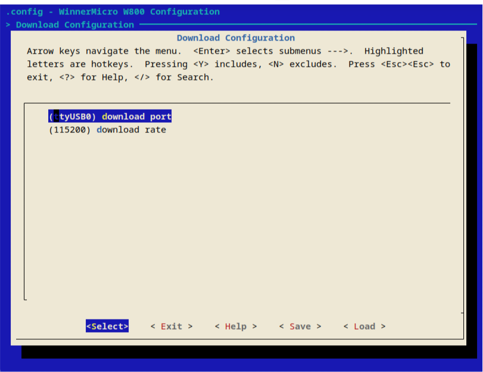

# 安裝交叉編譯器工具鏈

[W801 互聯網資源](https://occ.t-head.cn/community/download?id=3885366095506644992)

交叉編譯器 : **csky-elfabiv2-tools-x86_64-minilibc-20210423**

```shell
$ mkdir csky-elfabiv2-tools-x86_64-minilibc-20210423
$ tar xvf csky-elfabiv2-tools-x86_64-minilibc-20210423.tar.gz  -C csky-elfabiv2-tools-x86_64-minilibc-20210423/

```

移動到 /opt 下, 目錄可以自己定, 設置權限禁止普通用戶修改


```shell
$ sudo mkdir /opt/toolchains
$ cd /opt/toolchains/
$ sudo mv ~/Downloads/csky-elfabiv2-tools-x86_64-minilibc-20210423/ .
$ sudo chown -R root:root csky-elfabiv2-tools-x86_64-minilibc-20210423/

```

# 編譯 RISC-V (XT804)

[W801 互聯網資源](https://gitee.com/iosetting/wm-sdk-w80x)

運行 *menuconfig* 配置工具路徑

```shell
$ cd wm-sdk-w80x
$ make menuconfig
```

在 *menuconfig* 界面中, Toolchain Configuration -> 第二個 toolchain path, 將剛才的路徑填進去, 需要完整路徑, 帶最後的斜桿, 例如

```shell
/opt/toolchains/csky-elfabiv2-tools-x86_64-minilibc-20210423/bin/

```

首先通過 *dmesg*, *lsusb*, *ls /dev/tty* 等命令確定自己開發板在系統中對應的 **USB** 端口, 例如 **ttyUSB0**


在 *menuconfig* 界面中, Download Configuration -> download port, 填入开发板在你的系统中对应的USB端口, 例如 **ttyUSB0**, 注意这里只需要填纯端口名, 不需要用完整的路径. 可以调高波特率加快下载，只支持 *115200*, *460800*, *921600*, *1000000*, *2000000*, **Save** 后退出 *menuconfig*



```shell
make flash
```

下載完成後, 下載工具會發送復位指令, 復位成功後程序會自動開始執行. 如果自動復位失敗, 則需要按一下重啟按鈕 **RESET**

# 主要有用的功能

- wifi（連接互聯網）
- GPIO（控制 開/關）
- I<sup>2</sup>C（與其他設備溝通）
- Web Server（網頁通信/反饋）

## 頭文件 extra.h

```c
#include "wm_include.h"
#include <string.h>

// --- GPIO
void init_GPIO(int Pin_Index);
void on_GPIO(int Pin_Index);
void off_GPIO(int Pin_Index);
void toggle_GPIO(int Pin_Index);

// --- i2c
void i2c_ReadBytes(uint8_t i2cAddr, uint8_t *buf, int len);
void i2c_WriteBytes(uint8_t i2cAddr, uint8_t* data, int length);

// --- spi
void spi_Init(int cs, int mo, int mi, int ck);
uint8_t spi_ReadByte(int cs);
void spi_WriteBytes(int cs, uint8_t *buf, int len);

// --- AHT10
int AHT10(float* temperature, float* humidity);

// --- Web Server
char* getIP(char *ssid, char *pwd);
int webServer(int port, char* htmlContent, void (*fp)(char* sock_rx));

```

## 源代碼 gpio.c

```c
#include "extra.h"

void init_GPIO(int Pin_Index){
    tls_gpio_cfg(Pin_Index, WM_GPIO_DIR_OUTPUT, WM_GPIO_ATTR_FLOATING);
}

void on_GPIO(int Pin_Index){
    tls_gpio_write(Pin_Index, 0);
}

void off_GPIO(int Pin_Index){
    tls_gpio_write(Pin_Index, 1);
}

void toggle_GPIO(int Pin_Index){
    int index = (tls_gpio_read(Pin_Index) ==0 ? 1 : 0);
    tls_gpio_write(Pin_Index, index);
}
```

## 源代碼 i2c.c

```c
#include "extra.h"

void i2c_Init(int scl, int sda, int speed){
    wm_i2c_scl_config(WM_IO_PA_01);
    wm_i2c_sda_config(WM_IO_PA_04);
    tls_i2c_init(speed);
}

void i2c_ReadBytes(uint8_t i2cAddr, uint8_t *buf, int len)
{
    u8 iAddr = i2cAddr << 1 | 1;
    tls_i2c_write_byte(iAddr,1);
    tls_i2c_wait_ack();
    while(len > 1)
    {
        *buf++ = tls_i2c_read_byte(1,0);
        len --;
    }
       *buf = tls_i2c_read_byte(0,1);
}

void i2c_WriteBytes(uint8_t i2cAddr, uint8_t* data, int length)
{
    u8 iAddr = i2cAddr << 1 | 0;
    tls_i2c_write_byte(iAddr, 1);
    tls_i2c_wait_ack();
    for (int i=0; i<length; i++){
        printf("\n%d = %02X : %02X\n", i, iAddr, data[i]);
        tls_i2c_write_byte(data[i], 0);
        tls_i2c_wait_ack();
    }
     tls_i2c_stop();
    tls_os_time_delay(1);
}
```

## 源代碼 spi.c

```c
#include "extra.h"

void spi_Init(int cs, int mo, int mi, int ck)
{
    wm_spi_ck_config(ck);
    wm_spi_di_config(mi);
    wm_spi_do_config(mo);

    tls_spi_init();
    tls_spi_trans_type(SPI_DMA_TRANSFER);
    tls_spi_setup(TLS_SPI_MODE_3, TLS_SPI_CS_LOW, TLS_SPI_FCLK_MAX);

    tls_gpio_cfg(cs, WM_GPIO_DIR_OUTPUT, WM_GPIO_ATTR_PULLHIGH);
    tls_gpio_write(cs, 1);
}

void spi_On(int cs)
{
    tls_gpio_write(cs, 0);
}

void spi_Off(int cs)
{
    tls_gpio_write(cs, 1);
}

uint8_t spi_ReadByte(int cs)
{
    uint8_t data = 0;
    tls_spi_read(&data, 1);
    return data;
}

void spi_WriteBytes(int cs, uint8_t *buf, int length)
{
    for(int i=0; i<length; i++)
        tls_spi_write(&(buf[i]), 1);
}

void spi_W25q(int cs)
{
    u16 id = 0;
    uint8_t data[4] = {0x90, 0x00, 0x00, 0x00};
    spi_On(cs);
    spi_WriteBytes(cs, data, 4);
    uint8_t data1 = spi_ReadByte(cs);
    id |= data1 << 8;
    data1 = spi_ReadByte(cs);
    id |= data1;
    spi_Off(cs);
    if (0XEF13 == id) printf("EN25Q80\r\n");
        else if (0XEF14 == id) printf("EN25Q16\r\n");
        else if (0XEF15 == id) printf("EN25Q32\r\n");
        else if (0XEF16 == id) printf("EN25Q64\r\n");
        else if (0XEF17 == id) printf("EN25Q128\r\n");
        else printf("id = %x, unknown model\n", id);
}

```
## 源代碼 internet.c

```c
#include "extra.h"

char* dateInfo(void)
{
    unsigned int t = tls_ntp_client();
    struct tm *tblock = localtime((const time_t *)&t);	//switch to local time
    tls_set_rtc(tblock);
    return ctime((const time_t *)&t);
}

char* getIP(char *ssid, char *pwd)
{
    struct tls_ethif * ethif;
    tls_wifi_connect(ssid, strlen(ssid), pwd, strlen(pwd));
    while(1)
    {
        tls_os_time_delay(1);
        ethif = tls_netif_get_ethif();
        if(ethif->status)
            break;
    }
    char* ipAddr = malloc(12*sizeof(char));
    ip_addr_t *ip = &ethif->ip_addr;
    sprintf(ipAddr, "%d.%d.%d.%d", ip4_addr1(ip_2_ip4(ip)), ip4_addr2(ip_2_ip4(ip)), ip4_addr3(ip_2_ip4(ip)), ip4_addr4(ip_2_ip4(ip)));
    return ipAddr;
}

int webServer(int port, char* htmlContent, void (*fp)(char* sock_rx))
{
    int ret;
    int new_fd = -1;
    int server_fd = -1;
    char *Http_OK = "HTTP/1.1 200 OK\r\nContent-Type: text/html\r\n\r\n";

    char sock_rx[512] = {0};
    struct sockaddr_in server_addr;
    struct sockaddr_in client_addr;
    socklen_t sin_size;

    while(1) {

        if(server_fd == -1){
            if ((server_fd = socket(AF_INET, SOCK_STREAM, 0)) < 0)
            {
                printf("Socket,錯誤編號 :%d\n",errno);
                break;
            }

            server_addr.sin_family = AF_INET;
            server_addr.sin_port = htons(port);
            server_addr.sin_addr.s_addr = ((u32) 0x00000000UL);
            memset(server_addr.sin_zero, '\0', sizeof(server_addr.sin_zero));

            if (bind(server_fd, (struct sockaddr *) &server_addr, sizeof(server_addr)) != 0){
                printf("Bind,錯誤編號:%d\n",errno);
                break;
            }

            if (listen(server_fd, 1) != 0){
                printf("Listen,錯誤編號:%d\n",errno);
                break;
            }
        }

        sin_size = sizeof(client_addr);
        new_fd = accept(server_fd, (struct sockaddr *) &client_addr, &sin_size);

        if (new_fd < 0){
            printf("Accept,錯誤編號:%d\n",errno);
            break;
        }

        while (1) {
            memset(sock_rx, 0, 512);
            ret = recv(new_fd, sock_rx, sizeof(sock_rx)-1, 0);
                if(ret == 0) {
                    printf("連接斷開\n");
                    break;
                } else if(ret < 0) {
                    printf("-( %d )-", ret);
                    printf("Receive,錯誤編號:%d\n",errno);
                    break;
                    } else {

                        sock_rx[ret] = 0;
                        printf("\nReceive %d bytes from %s\n", ret, inet_ntoa(client_addr.sin_addr.s_addr));

                        ret = send(new_fd, Http_OK, strlen(Http_OK), 0);
                        ret = send(new_fd, htmlContent, strlen(htmlContent), 0);

                        fp(sock_rx);

                        if (ret < 0) {
                            printf("發送過程中發生錯誤,錯誤編號:%d\n",errno);
                            break;
                        }
                        shutdown(new_fd,0);
                        closesocket(new_fd);
                        break;
                    }
                }

        if(new_fd != -1) {
            printf("重新啟動...\n");
            shutdown(new_fd,0);
            closesocket(new_fd);
            vTaskDelay(5);
        }
    }
    shutdown(new_fd,0);
    closesocket(new_fd);
    shutdown(server_fd,0);
    closesocket(server_fd);
    return 0;
}
```

## 源代碼 AHT10.c (溫度傳感器)

```c
#include "extra.h"

int AHT10(float* temperature, float* humidity)
{
    uint8_t i2cAddr = 0x38;
    uint8_t datar[1] = {0xBA};
    uint8_t datai[3] = {0xE1, 0x08, 0x00};
    uint8_t datam[3] = {0xAC, 0x33, 0x00};
    uint8_t buf[6] = {0,0,0,0,0,0};

    i2c_Init(WM_IO_PA_01, WM_IO_PA_04, 400000);
    tls_os_time_delay(1);
    i2c_WriteBytes(i2cAddr, datar, 1);
    vTaskDelay(100);
    i2c_WriteBytes(i2cAddr, datai, 3);
    vTaskDelay(175);
    i2c_WriteBytes(i2cAddr, datam, 3);
    vTaskDelay(75);
    i2c_ReadBytes(i2cAddr, buf, 6);

    if((buf[0] & 0x68) == 0x08){
        int H1 = buf[1];
        H1 = (H1<<8) | buf[2];
        H1 = (H1<<8) | buf[3];
        H1 = H1>>4;
        H1 = (H1*1000)/1024/1024;

        int T1 = buf[3];
        T1 = T1 & 0x0000000F;
        T1 = (T1<<8) | buf[4];
        T1 = (T1<<8) | buf[5];
        T1 = (T1*2000)/1024/1024 - 500;
        *temperature = T1/10.0;
        *humidity = H1/10.0;
        printf("\n\n温度:%3.3lf, 湿度:%3.3lf\n", *temperature, *humidity);
    }else{
        printf("測量錯誤!");
    }
    return WM_SUCCESS;
}

```

## 示例代碼 main.c

### 示例代碼的解釋

 - **htmlCore** 在互聯網連接中與設備進行通信的網頁, *htmlContent* 是最終網頁內容導出到外部設備.
 - **checkGPIO** 在互聯網連接中通過外部選擇反饋到設備進行控制代碼. 功能指針 : void (*f)(char sock_rx);


```c
#include "wm_include.h"
#include "extra.h"

char* htmlCore(char ipAddr)
{
    float temperature;
    float humidity;
    AHT10(&temperature, &humidity);

    char* html = "<html><head><style>body{ font-size: 18px; font-family: georgia; font-weight: 700; text-align: center; padding: 10px;} button{ color: #090909; margin: 10px 10px 10px 10px; padding: 0.7em 1.7em; font-size: 18px; border-radius: 0.5em; background: #e8e8e8; border: 1px solid #e8e8e8; transition: all 0.3s; box-shadow: 6px 6px 12px #c5c5c5, -6px -6px 12px #fff;} button:hover{ border: 2px solid #960505; background: #ff4c4c7a;} button:active{ box-shadow: 4px 4px 12px #c5c5c5, -4px -4px 12px #fff; padding: 0.9em 1.9em;} </style><script>function httpGet(indexUrl){ var xhr=new XMLHttpRequest(); xhr.open(\"GET\", indexUrl, true); xhr.send(null); return xhr.responseText;} function btn1(){ httpGet(\"?value=5\");} function btn2(){ httpGet(\"?value=25\");} function btn3(){ httpGet(\"?value=26\");} function btn4(){ httpGet(\"?value=18\");} function btn5(){ httpGet(\"?value=17\");} function btn6(){ httpGet(\"?value=16\");} function btn7(){ httpGet(\"?value=11\");} </script></head><body><div id=\"time\"></div><p>Temperature:%3.2lf &deg;C</p><p>Humidity:%3.2lf %</p><button onclick=\"btn1()\">LED 5</button><button onclick=\"btn2()\">LED 25</button><button onclick=\"btn3()\">LED 26</button><button onclick=\"btn4()\">LED 18</button><button onclick=\"btn5()\">LED 17</button><button onclick=\"btn6()\">LED 16</button><button onclick=\"btn7()\">LED 11</button><script>var date=new Date(), n=date.toDateString(), time=date.toLocaleTimeString(); document.getElementById(\"time\").innerHTML=n + \" \" + time; </script></body></html>";

    char *htmlContent = (char*) malloc(strlen(html)+512 * sizeof(char));
    sprintf(htmlContent, html, temperature, humidity);
    return htmlContent;
}

void checkGPIO(char sock_rx)
{
    if (strstr(sock_rx, "value=5") != NULL) {
        toggle_GPIO(WM_IO_PB_05);
    }
    if (strstr(sock_rx, "value=25") != NULL) {
        toggle_GPIO(WM_IO_PB_25);
    }
    if (strstr(sock_rx, "value=26") != NULL) {
        toggle_GPIO(WM_IO_PB_26);
    }
    if (strstr(sock_rx, "value=18") != NULL) {
        toggle_GPIO(WM_IO_PB_18);
    }
    if (strstr(sock_rx, "value=17") != NULL) {
        toggle_GPIO(WM_IO_PB_17);
    }
    if (strstr(sock_rx, "value=16") != NULL) {
        toggle_GPIO(WM_IO_PB_16);
    }
    if (strstr(sock_rx, "value=11") != NULL) {
        toggle_GPIO(WM_IO_PB_11);
    }
}

void UserMain(void)
{
    init_GPIO(WM_IO_PB_05);
    init_GPIO(WM_IO_PB_25);
    init_GPIO(WM_IO_PB_26);
    init_GPIO(WM_IO_PB_18);
    init_GPIO(WM_IO_PB_17);
    init_GPIO(WM_IO_PB_16);
    init_GPIO(WM_IO_PB_11);

    char* ipAddr = getIP("ssid", "password");

    int port = 90;
    printf("%s:%d", ipAddr, port);

    char* htmlContent  = htmlCore(ipAddr);

    webServer(port, htmlContent, checkGPIO);

    free(htmlContent);
    free(ipAddr);
}
```
## 添加額外的文件夾來保存添加的 C 代碼和頭文件

在項目目錄下創建一個文件夾（例如: toolkit) 及相關文件 (Makefile, 添加的C代碼.c, extra.h)

```shell
$ mkdir toolkit
$ cd toolkit
$ touch Makefile
$ touch 添加的C代碼.c
$ mkdir include
$ cd include
$ touch extra.h
$ cd ..
```

## **3** 個文件需要更新如下

## 1. 在目錄 toolkit 下創建一個文件 *Makefile*

```make
TOP_DIR = ..
sinclude $(TOP_DIR)/tools/w800/conf.mk

ifndef PDIR
GEN_LIBS = libtoolkit$(LIB_EXT)
endif

sinclude $(TOP_DIR)/tools/w800/rules.mk
INCLUDES := $(INCLUDES) -I $(PDIR)include
PDIR := ../$(PDIR)
sinclude $(PDIR)Makefile

```

 - *Makefile* 文件中 <font color="#FF1000">libtoolkit</font> 是設計輸出庫文件名,需要根據要求修改.

## 2. 修改在項目目錄下的 */tools/w800/inc.mk* 文件目錄

```make
. . .
INCLUDES += -I $(TOP_DIR)/toolkit/include
. . .
```
- 輸入有關添加文件的頭文件 <font color="#FF1000">/toolkit/include</font>,需要根據要求修改.

## 3. 修改項目目錄下的 *Makefile* 文件

```make
. . .
SUBDIRS = \
    $(TOP_DIR)/app \
    $(TOP_DIR)/demo \
    $(TOP_DIR)/toolkit
. . .

COMPONENTS_$(TARGET) =	\
    $(TOP_DIR)/app/libuser$(LIB_EXT) \
    $(TOP_DIR)/demo/libdemo$(LIB_EXT) \
    $(TOP_DIR)/toolkit/libtoolkit$(LIB_EXT)
. . .
```

*Makefile* 文件中, 用於最終鏈接執行文件

 - 在 *SUBDIRS* 範圍內的 <font color="#FF1000"> $(TOP_DIR)/toolkit </font> 是需要編譯的目錄, 目錄裡面的所有文件都將被編譯.
 - 在 *COMPONENTS* 範圍內的 <font color="#FF1000">$(TOP_DIR)/toolkit/libtoolkit</font> 是輸出庫文件名, 用於將相關功能鏈接到程序.


所有文件編譯完成後，將創建一個庫（項目目錄下/bin/libtoolkit.a)