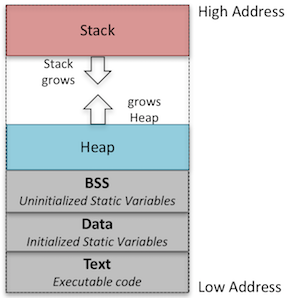

# C 內存管理

Stack (棧區) 是一種讓資料後進先出、或說讓資料先進後出的資料組織方式。

Heap (堆區) 是保留一塊夠用的記憶題，讓程式方便配置它所需要的資料。




# 內存空間分配 malloc, calloc, realloc 與 free

malloc 與 calloc 用來動態分配內存空間，而 realloc 則是對給定的指針所指向的內存空間進行擴大或者縮小。

## malloc

 函數原型 : void* malloc(unsigned size);

 - 函數功能：在堆內存中分配一塊長度為 size 字節的連續區域，參數 size 為需要內存空間的長度。

## calloc

 函數原型 ： void* calloc(size_t numElements, size_t sizeOfElement);  

 - 函數功能 : 與 malloc 相似，參數 sizeOfElement 為單位元素長度（例如：sizeof(int)），numElements 為元素個數，即在內存中申請 numElements * sizeOfElement 字節大小的連續內存空間。

## realloc

 函數原型 ： void* realloc(void* ptr, unsigned newsize);

 - 函數功能： realloc 函數為 ptr 重新分配大小為size的一塊內存空間。 下面是這個函數的工作流程：
   - 對 ptr 進行判斷，如果 ptr 為 NULL，則函數相當於malloc(new_size)，試著分配一塊大小為 new_size 的內存，如果成功將地址返回，否則返回 NULL。 如果 ptr 不為 NULL，則進入以下。
   - 查看 ptr 是不是在堆中，如果不是的話會拋出 realloc invalid pointer 異常。 如果 ptr 在堆中，則查看 new_size 大小，如果 new_size 大小為 0，則相當於free(ptr)，將 ptr 指向的內存空間釋放掉，返回 NULL。 
   - 如果 new_size 小於原大小，則 ptr 中的數據可能會丟失，只有 new_size 大小的數據會保存；如果 size 等於原大小，等於什麼都沒有做。
   - 如果 size 大於原大小，則查看 ptr 指向的位置還有沒有足夠的連續內存空間，如果有的話，分配更多的空間，返回的地址和 ptr 相同，如果沒有的話，在更大的空間內查找，如果找到size大小的空間，將舊的內容拷貝到新的內存中，<font color="#FF1000">把舊的內存釋放掉</font>，則返回新地址，否則返回 NULL。

總結 : malloc 與 calloc 用來動態分配內存空間，而 realloc 則是對給定的指針所指向的內存空間進行擴大或者縮小。

## free

 函數原型 : void free(void* ptr);

 - 函數功能：動態配置的空間，在程式結束前不會自動歸還，必須使用 free 釋放空間，若大量動態配置而沒有適當使用 free ，由於空間一直沒有歸還，最後將導致整個記憶體空間用盡。


# 指針

指針是一個內存地址。 內存中的每個字節都有一個地址。 因此，如果您有一個 4 字節的 int 並且它的地址是 1000，那麼 1001 實際上是該 int 的第二個字節，而 1002 是第三個字節，而 1003 是第四個。 由於 int 的大小可能因編譯器而異，因此當遞增指針時，必須不要獲得 int 中某個中間點的地址。 <font color="#FF1000">在 C 程式中已經處理根據每一個數據類型需要跳過多少字節的工作</font>。所以只要如一般加減方法來尋找指針位置即可。

# 指針應用 -> 與 .

首先 a->b 的含義是 (*a).b ，所以是不同的，不過的確 -> 可以用 * 和 . 實現。有點彙編基礎的也知道在機器碼和彙編的角度來看，不存在變量，不存在 struct 這種東西，只存在寄存器和一個叫做內存的大數組。

對解引用的操作，必須和取成員的偏移的操作，兩者緊密結合起來變成一個單獨的操作，其結果纔有意義。所以 C 就發明了 -> ，表示這兩個操作緊密結合的操作。例子如下:

```c
struct Point {
        int x;
        int y;
};
struct Point* p;

p->x = 1;  // 完全可以使用下面這樣的語句替換
(*p).x = 1;

```

簡潔是 C 語言的特點，就功能性而言， -> 完全可以不要，但是在 C 語言程序開發中，還需要考慮程式設計的應用感受，請看下面這兩種寫法：

 - (\*(\*(\*a).b).c).d ≡ a->b->c->d

它們的功能是一致的，但是 -> 寫法無論是書寫，還是閱讀，都要簡潔。所以 -> 仍然存在。

# typedef

typedef 用來自定義的數據類型取一個新的名字。 例如對結構體使用 typedef 來定義一個新的數據類型名字，然後用這個新的數據類型來直接定義結構變量如下:

```c
typedef unsigned char byte;

byte value;

typedef struct Books
{
   char  title[50];
   char  author[50];
   int   book_id;
} Book;

Book book0;
book0.title = "Sample";

Book *book1;
book1->title = "Sample";
(*book1).title = "Sample";
```

# 內存管理 memcpy, memmove 與 memset

## memcpy

memcpy 函數是從源地址的內存地址的位置開始拷貝所到地址的目標地址位置中。

 函數原型：void *memcpy(void *dest, const void *src, size_t n);

 所需頭文件：string.h

 - 函數功能：如源內存區域和目標內存區域的內存區域重疊，那麼這個函數不能確保源內存區域不被覆蓋。而應用 memmove 移動內存以免內存域重疊。
 - memcpy 跟 strcpy 不同的是 strcpy 遇到 <font color="#FF0010">\0</font> 結束字元就停止複製了，所以 strcpy() 只能用來複製字串。

## memmove

memmove 函數是從源地址的內存地址的位置開始拷貝所到地址的目標地址位置中。如果目標區域和源區域有重疊的話，memmove（）能夠保證源串在被覆蓋之前將重疊區域的字節拷貝到目標區域中。 但複製後source內容會被更改。

 函數原型：void *memmove(void *dest, const void *src, size_t n);

 所需頭文件：string.h

 - 函數功能：內存空間可以重疊，也可以不重疊（相當於 memcpy 的升級優化）
 - 內存操作函數，對與復制的內容沒有要求適用範圍較廣
 - 對複制的內容完全沒有任何的限制，比如數組，結構體等特殊的結構，如要將整個結構體變量的內容複製到 destination 內存區，最好使用 sizeof 將要復制的內容的大小求出來賦值給 num，以保持複製的完整性。

## memset

memset 將所有內容指定為一個內存塊。 該函數對全系列操作時唯一的價值0或-1，該函數通常為新申請的內存做工作。

 函數原型：void *memset(void *s, int ch, size_t n);

 所需頭文件：memory.h 或 string.h

 - 函數功能：是在內存塊中填充給定的值，它是對作用的結構體或範圍內操作。
 - 注意 memset 設置是字節為單位進行的範圍，所用的範圍是 0x00～0xFF。


# '0', '\0' & "0" 

首先比較一下'0'和'\0'的區別。有一個共同點就是一個字符，在 C 語言中，字符是它們的 ASCII 來存儲的，一個字符佔一個字節，在 ASCII 字符集表內，詳細如下 :
 - 第一個 ASCII 碼，字符 '0' 的 ASCII 碼是 48，48 的十六進制數字就是 0x30。
 - 第二個 ASCII 碼，字符 '\0' 的 ASCII 碼字是（Null），其實就是空字符。在 C 中它主要用於表示字符串的終止。 當然，它是一個常規字符，可以這樣使用，用於字串常量的結尾。
 - 第三個是 "0" 是字符串常量，字符串常量是由一对双引号括起的字符。即 "0"  在 C 中是代表 "0\0"。因常量會自動補上 '\0'。

注意 : 在字串常量的內存大小創建時要考慮加上 '\0' 的空間，即加一個字節。例子如下 :
 - char strValue[3] = {'O','K','\0'};
 
可寫成以下語句，常量太少會自動由程序計算。
 - char strValue[] = "OK";