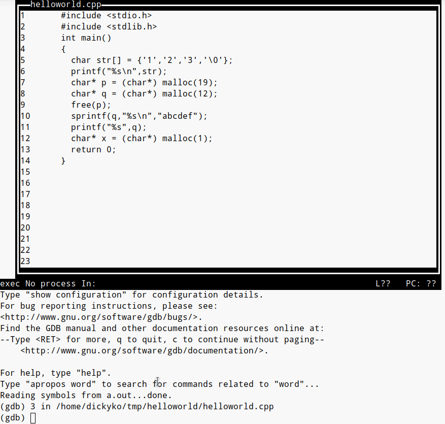
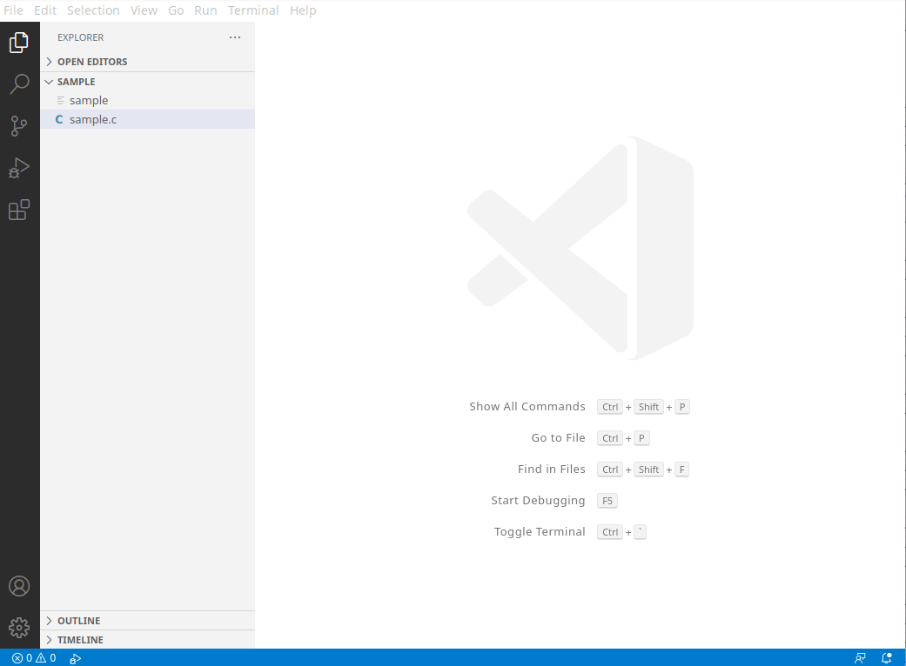

<style>
    table {
        width: 100%;
    }
</style>

# C 工具(Linux)

## clang-format (格式化)

Clang-Format可用於格式化（排版）多種不同語言的程式碼。其自帶的排版格式主要有：
 - LLVM
 - Google
 - Chromium
 - Mozilla
 - WebKit

安裝方式：

```shell
sudo apt-get install clang-format
```

基本使用，用 <font color="#FF1000">LLVM</font> 程式碼風格格式化 *main.cpp*, 結果直接寫到 *main.cpp*

```shell
clang-format -style=LLVM -i main.cpp
```

全部目錄下的 cpp / hpp / c / h 檔案也用 LLVM 風格格式化，並直接更新檔案。

```shell
find . -regex '.*\.\(cpp\|hpp\|c\|h\)' -exec clang-format -style=LLVM -i {} \;
```

## valgrind (抓內存洩漏)

Valgrind 是用於構建動態分析的工具。包括工具集，每個工具執行某種類型的調試、分析或類似的任務，幫助完善程序設計。Valgrind 的架構是模塊化的，可以容易的創建新的工具而又不會擾亂現有的結構。

 提供的有用工具如下：

 - **Memcheck** 是一個內存錯誤檢測器。它有助於使你的程序，尤其是那些用C和C++寫的程序，更加準確;
 - Cachegrind 是一個緩存和分支預測分析器。它有助於使你的程序運行更快;
 - Callgrind 是一個調用圖緩存生成分析器。它與Cachegrind的功能有重疊，但也收集Cachegrind不收集的一些信息;
 - Helgrind 是一個線程錯誤檢測器。它有助於使你的多線程程序更加準確;
 - DRD 是一個線程錯誤檢測器。它和Helgrind相似，但使用不同的分析技術，所以可能找到不同的問題;
 - Massif 是一個堆分析器。它有助於使你的程序使用更少的內存;
 - DHAT 是另一種不同的堆分析器。它有助於理解塊的生命期、塊的使用和佈局的低效等問題;
 - SGcheck 是一個實驗工具，用來檢測堆和全局數組的溢出。它的功能和Memcheck互補：SGcheck找到Memcheck無法找到的問題，反之亦然;
 - BBV 是個實驗性質的SimPoint基本塊矢量生成器。它對於進行計算機架構的研究和開發很有用處;

安裝方式：

```shell
sudo apt-get install valgrind
```

基本使用格式

```shell
valgrind [options] prog-and-args
```

### C 程序示例 供參考

```c
 1: #include <stdio.h>
 2: #include <stdlib.h>
 3: int main()
 4: {
 5: char str[] = {'1','2','3','\0'};
 6:   printf("%s\n",str);
 7: char* p = (char*) malloc(19);
 8: char* q = (char*) malloc(12);
 9:   free(p);
10:   sprintf(q,"%s\n","abcdef");
11:   printf("%s",q);
12: char* x = (char*) malloc(1);
13:   return 0;
14:}
```

### 基本使用 (a.out 是沒有 -o 的編譯默認文件名)

```shell
valgrind --leak-check=full --tool=memcheck ./a.out

==13272== HEAP SUMMARY:
==13272==     in use at exit: 13 bytes in 2 blocks
==13272==   total heap usage: 4 allocs, 2 frees, 1,056 bytes allocated
==13272==
==13272== 1 bytes in 1 blocks are definitely lost in loss record 1 of 2
==13272==    at 0x483577F: malloc (vg_replace_malloc.c:299)
==13272==    by 0x4011E8: main (helloworld.cpp:12) # 第 12 行是內存洩漏 1 字節
==13272==
==13272== 12 bytes in 1 blocks are definitely lost in loss record 2 of 2
==13272==    at 0x483577F: malloc (vg_replace_malloc.c:299)
==13272==    by 0x40119D: main (helloworld.cpp:8)  # 第 8 行是內存洩漏 12 字節
==13272==
==13272== LEAK SUMMARY:
==13272==    definitely lost: 13 bytes in 2 blocks # 在 2 塊內存洩漏 13 字節
==13272==    indirectly lost: 0 bytes in 0 blocks
==13272==      possibly lost: 0 bytes in 0 blocks
==13272==    still reachable: 0 bytes in 0 blocks
==13272==         suppressed: 0 bytes in 0 blocks
==13272==
==13272== For counts of detected and suppressed errors, rerun with: -v
==13272== ERROR SUMMARY: 2 errors from 2 contexts (suppressed: 0 from 0)
```

Valgrind 展示強大的功能。它展示了程序的內存使用情況，並且給出總結:

 - **definitely lost** : 肯定的內存洩漏，這表示在程序退出時，有內存沒有回收，但是也沒有指針指向該內存。 這種情況最為嚴重。

 - indirectly lost: 間接的內存洩漏，如類之中定義的指針指向的內存沒有回收。 這種情況和上述相同。

 - **possibly lost**： 可能出現內存洩漏。 這種情況需要仔細排查，可能代碼沒有問題，也可能有異常的內存洩露。

 - still reachable: 程序沒主動釋放內存，在退出時候該內存仍能訪問到。 這種情況一般問題不大，因為程序退出之後操作系統會回收程序的內存，所以這種情況一般問題不大。

 這裡沒有給出具體洩露的內容，需要加入數 --leak-check=full 將完整的結果打印出來，會指出對應的引起內存洩露的具體代碼，可以繼續深入分析。

# GCC (命令行編譯)

## 靜態共享庫 (Static Library)

靜態函式庫（static library）是由一些物件檔案（object files）所構成的封裝檔，通常其檔案名稱都會以 lib 開頭，而副檔名則為 .a 。

```shell
gcc -c spline.c -o spline.o
ar -rcs libtools.a spline.o
gcc main.c libtools.a -o main_static
```
 - **-c** 編譯和彙編，但不要鏈接
 - **-o** 將輸出文件存儲到文件名
 - **-rcs** <font color="#FF1000">r</font> 是替換現有文件或將新文件插入存檔，<font color="#FF1000">c</font> 是如果必須創建庫，則不發出警告，<font color="#FF1000">s</font> 是創建存檔索引。

### 優化

 - **O**level  （-O後面的數字是優化的水平）
  - **O**1 優化。優化編譯需要更多的時間，並且對於大型函數需要更多的內存。
  - **O**2 優化更多。 GCC 執行幾乎所有不涉及空間速度的支持優化權衡。與 -O 相比，此選項增加了編譯時間和生成代碼的性能。
  - **O**3 優化更多。 -O3 打開 -O2 指定的所有優化，同時打開 -finline-functions，-funswitch-loops、-fpredictive-commoning、-fgcse-after-reload、-ftree-vectorize 和 -fipa-cp-clone 選項。
  - **O**0 減少編譯時間並使調試產生預期結果。這是<font color="#FF1000">默認設置</font>。
  - **O**s 針對<font color="#FF1000">大小</font>進行優化。 -Os 啟用通常不會增加代碼大小的所有 -O2 優化。它也是執行旨在減少代碼大小的進一步優化。
  - **O**fast 無視嚴格的標準合規性。 -Ofast 啟用所有 -O3 優化。它還支持優化並非對所有符合標準的程序都有效。它打開 -ffast-math。

使用 -O，編譯器會嘗試減少代碼大小和執行時間，而不執行任何優化花費大量的編譯時間。

這樣就可以將 main.c 這個程式編譯成 main_static 這個執行檔，而在編譯的過程中就不需要 spline.c 這個原始碼的檔案。

## 動態共享庫 (Shared Library)

共享函式庫（shared library）是在程式實際開始執行時，才會被載入的函式庫，執行檔本身與共享函式庫是分離的，這樣可以讓執行檔的大小比較小，而且未來共享函式庫在更新之後，執行檔也不需要重新編譯，而缺點則是執行檔在執行時就會需要共享函式庫的檔
案，如果缺少了共享函式庫的檔案，就會無法執行。

首先有一些名詞要弄懂，soname, real name與linker name。

 - **-fPIC** 用來產生 position-independent code (為共享庫生成代碼時，**-fpic** 隱含 -msmall-data 和 **-fPIC** 隱含 -mlarge-data。)
 - **-shared** 表示要編譯成 shared library
 - **soname** 用來表示是一個特定 library 的名稱，像是 libmylib.so.1 。前面以 **lib** 開頭，接著是該 library 的名稱，然後是 **.so** ，接著是版號，用來表名他的介面；如果介面改變時，就會增加版號來維護相容度。
 - **real name** 是實際放有 library 程式的檔案名稱，後面會再加上 minor 版號與 release 版號，像是 libmylib.so.1.0.0。
 - **linker name** 是用於連結時的名稱，是不含版號的 soname ，如: libmylib.so。通常 linker name 與 real name 是用 ln 指到對應的 real name，用來提供彈性與維護性。

一般來說版號的改變規則最尾碼的 release 版號用於程式內容的修正，介面完全沒有改變。中間的 minor 用於有新增加介面，但相舊介面沒改變，所以與舊版本相容。最前面的 version 版號用於原介面有移除或改變，與舊版不相容時。

```shell
gcc -c spline.c -fPIC -o spline.o
gcc -shared -Wl,-soname,libtools.so.1 -o libtools.so.1.0.0 spline.o

# 共享函式庫在執行時就會依據 soname 所指定的名稱來尋找
# 函式庫的檔案，如要看共享函式庫的 soname 屬性，
# 可以使用 objdump 指令
objdump -p libtools.so.1.0 | grep SONAME

# 建立好共享函式庫之後，要建立一個不含版本號碼的 .so 連結檔
# gcc 在連結時所需要的函式庫檔案是這一個：
ln -s libtools.so.1.0.0 libtools.so

# 另外再建立一個執行時要用的連結檔：
ln -s libtools.so.1.0.0 libtools.so.1

gcc main.c libtools.so -o main_dynamic
```
### 另一種鏈接方法編譯動態共享庫

```shell
gcc -g main.c -ltools -L. -o main
```
 - ltools : 表示要連結 libtools.so
 - L.: 表示搜尋 libtools.so 時，除了預設目錄外，也要找目前的位置 ( . )。可以指定多次 -LDIR。


# GDB (命令行調試)

在編譯的文件中包含調試信息,可以使用以下參數。如在文件中未提及 -o 則輸出文件的默認名稱為 **a.out**

```shell
gcc -g main.c -o main

# 默認名稱 a.out
gcc -g main.c
```
- **-g** 編譯文件中包含調試信息
- **-o** 將輸出文件存儲到文件名

GDB主要幫忙你完成下面四個方面的功能：

    1.啟動你的程序，可以按照你的自定義的要求隨心所欲的運行程序;
    2.可讓被調試的程序在你所指定的調置的斷點處停住,斷點可以是條件表達式;
    3.當程序被停住時，可以檢查此時你的程序中所發生的事;
    4.動態的改變你程序的執行環境.

從上面看來，GDB和一般的調試工具沒有什麼兩樣，基本上也是完成這些功能，不過在細節上，你會發現GDB這個調試工具的強大，大家可能比較習慣了圖形化的調試工具，但有時候，命令行的調試工具卻有著圖形化工具所不能完成的功能。


### GDB 常用的指令


|GDB 命令 |簡寫| 示例 | 說明 |
|:---|:---:|:---|:---|
|break |b|break 20| 設置一個斷點，當它執行時將導致執行暫停到達第 20 行 |
| || break test.c:18 |在第 18 行處設置斷點,可以帶上代碼路徑和代碼名稱 |
| || break cb_button |條件斷點設置 |
| || break fn1 if a＞b |條件斷點設置 |
| || break func | 在函數 func() 的入口處設置斷點|
|watch | |watch var |(發生變化) - 設置一個觀察點，這將導致執行暫停每當 var 的值發生變化時|
| ||watch i==5 |(發生變化) - 觀察點表達式|
|next|n|next| next 遇到函數調用時，直接調用函數，不會進入到函數內 |
| ||next 10 | (行數) - 執行接下來的 10 行，跳過任何函數調用|
|step|s|step|step 遇到用戶自定義的函數，將步進到函數中去運行|
|||step 20 |(行數) - 執行接下來的 20 行，如果有函數將步進到函數中去運行|
|until| u |until 5 | (行號) - 運行至 5 行，當你厭倦了在一個循環體內單步跟踪時，這個命令可以運行程序直到退出循環體|
|print |p|print var |打印局部變量‘var’的當前值（小寫）|
| ||print modname::var |打印模塊中定義的變量 var 的當前值 modname 並在這裡使用 |
| ||p *((double *)x)@10 |打印雙精度可分配數組‘x’的前10個元素 |
| ||P *((integer *)x+1) |打印 x(2) 其中 x 是整數可分配數組 |
|display |disp| display var |(每次停止) - 停止時給出 var 的當前值。(可用表達式)|
|set | |set var=value | (設置當前值) - 將 var 的當前值更改為 value |
|delete|d|delete| (注意) - 如使用 delete 而不指定數字，所有觀察點和斷點將被刪除|
|||delete 2 | (斷/觀察)點號 - 刪除點號為 2 的點|
|||delete breakpoints | 刪除全部斷點|
|clear ||clear 3 | (行號) - 刪除第 3 行號的斷點點|
|call || call gdb_test(55) | 調用程序中可見的函數，並傳遞參數|
|run |r | run | 運行程序，當遇到斷點後，程序會在斷點處停止運行，等待用戶輸入下一步命令 |
|continue | cont | continue | 繼續執行，到下一個斷點停止（或運行結束）|
|finish || finish | (僅用於函數) - 運行當前函數，打印函數返回時的堆棧地址和返回值及參數值等信息|
|quit |q| quit | 停止調試，終止當前進程並結束 gdb 會話 |
|info |i| info breakpoints| 顯示當前程序的全部斷點設置情況|
| || info watchpoints| 顯示當前程序的全部觀察設置情況|
| ||info b 2| 顯示第 2 個斷點的設置情況|
|help |h| help step | 內置幫助功能可以獲得特定命令的幫助（例如 step) GDB 命令比這幾個命令多得多 |
|list ||list 10, 20 |列出源代碼行 |
|where| |where |給出代碼中的當前位置（又名回溯）|
|disable || disable 2 | (斷點號) - 暫停第 2 個斷點 |
|enable || enable 3 | (斷點號) - 開啟第 3 個斷點 |
|reverse-step ||reverse-step 20 |後退 20 行 |


## GDB -TUI (文本界面調試)

基本使用格式

使用 Ctrl+X+A 隨意進入和退出TUI模式

```shell
gdb -tui prog-and-args
```
基本使用

```shell
gdb -tui ./a.out
```


常用的指令與 GDB 相似，示例如下(在下文本界面鍵入以下操作的命令)：

 - 添加斷點 (break / b)
   - break 行號 : break 9
   - break 函數名 : break main

 - 下一行 (next / n)
    - n
 - 信息
   - info break : 列出所有斷點信息
   - print(i) : 列出變量 i 的內容
  - 刪除
    - delete 1 : 刪除斷點 1
  - 繼續運行
    - continue : 繼續運行直到下一個斷點
  - 運行到程序結束
    - finish
  - 退出程序
    - q

# VSCode 調試

在 VSCode 調試，要配置兩個文件 tasks.json 和 launch.json

```shell
sudo apt-get update
sudo apt-get install gcc
sudo apt-get install build-essential gdb
```

在終端窗口中，創建一個名為 projects 的空文件夾來存儲您的 VS Code 項目。然後創建一個名為 sample 的子文件夾，導航到它，並通過輸入以下命令在該文件夾中打開 VS Code


```shell
mkdir projects
cd projects
mkdir sample
cd sample
code .
```



 - **tasks.json**：用於構建任務，也就是編譯鏈接程序。
 - **launch.json**：用於配置調試環境，例如調試器（gdb），可執行文件路徑等。

按 F5 後會自動在 .vscode 目錄下生成兩個文件 tasks.json 和 launch.json。

## tasks.json (編譯鏈接程序)

```json
{
  "version": "2.0.0",
  "tasks": [
    {
      "type": "cppbuild",
      "label": "C/C++: clang++-7 生成活動文件",
      "command": "/bin/clang++-7",
      "args": [
        "-fdiagnostics-color=always",
        "-g",
        "${file}",
        "-o",
        "${fileDirname}/${fileBasenameNoExtension}"
      ],
      "options": {
        "cwd": "${fileDirname}"
      },
      "problemMatcher": ["$gcc"],
      "group": {
        "kind": "build",
        "isDefault": true
      },
      "detail": "編譯器: /bin/clang++-7"
    }
  ]
}
```

我們需要關注的選項有：

 - label：任務標籤，需與 “preLaunchTask” 保持一致
 - command：需要執行的命令，可以是一個外部程序或者 Shell 命令
 - args：傳遞給 “command” 的參數

深入理解 tasks.json 文件的作用與 command 選項的用法，我們就能靈活地配置構建工程。


## launch.json (調試環境程序)

```json
{
  // 使用 IntelliSense 了解可能的屬性。
  // 懸停查看現有屬性的描述。
  // 更多信息，請訪問： https://go.microsoft.com/fwlink/?linkid=830387
  "version": "0.2.0",
  "configurations": [
    {
      "name": "(gdb) 啟動",
      "type": "cppdbg",
      "request": "launch",
      "program": "${workspaceFolder}/helloworld",
      "args": [],
      "stopAtEntry": true,
      "cwd": "${fileDirname}",
      "environment": [],
      "externalConsole": false,
      "MIMode": "gdb",
      "setupCommands": [
        {
          "description": "為 gdb 啟用整齊打印",
          "text": "-enable-pretty-printing",
          "ignoreFailures": true
        },
        {
          "description": "將反彙編風格設置為 Intel",
          "text": "-gdb-set disassembly-flavor intel",
          "ignoreFailures": true
        }
      ]
    }
  ]
}
```

我們需要關注的選項有：

 - program：<font color="#FF1000">程序名稱必須更新</font>，可執行文件的的路徑，相對路徑或絕對路徑
 - args：運行程序時傳遞的參數
 - stopAtEntry：是否在入口處停止，若為 <font color="#FF1000">true</font> 在調試時會默認在 main() 處停止
 - environment：配置程序運行的環境變量
 - preLaunchTask：調試會話啟動前運行的任務，需與 tasks.json 裡的 “label” 一致若沒有該選項，則按 F5 時會直接使用 “program” 程序調試，不會再試圖重新編譯一次
 - miDebuggerPath：調試器的路徑，用途在後面有介紹

預定義變量:

 - ${workspaceFolder} - 當前工作目錄(根目錄)
 - ${workspaceFolderBasename} - 當前文件的父目錄
 - ${file} - 當前打開的文件名(完整路徑)
 - ${relativeFile} - 當前根目錄到當前打開文件的相對路徑(包括文件名)
 - ${relativeFileDirname} - 當前根目錄到當前打開文件的相對路徑(不包括文件名)
 - ${fileBasename} - 當前打開的文件名(包括擴展名)
 - ${fileBasenameNoExtension} - 當前打開的文件名(不包括擴展名)
 - ${fileDirname} - 當前打開文件的目錄
 - ${fileExtname} - 當前打開文件的擴展名
 - ${cwd} - 啟動時task工作的目錄
 - ${lineNumber} - 當前激活文件所選行
 - ${selectedText} - 當前激活文件中所選擇的文本
 - ${execPath} - vscode執行文件所在的目錄
 - ${defaultBuildTask} - 默認編譯任務(build task)的名字

# gifsicle

**gifsicle** 是一個用於操作 *GIF* 圖片的命令行工具，可以對 gif 文件進行修改尺寸大小、顏色、幀率等等，功能十分強大。

```shell
sudo apt-get update -y
sudo apt-get install -y gifsicle
```

一些示例如下所示，供參考

```shell
# 通過縮小 50% 來調整動畫 gif 的大小
gifsicle --scale 0.5 -i animation.gif > animation-smaller.gif

# 調整動畫 gif 的大小以縮放到具有未指定高度的給定寬度
gifsicle --resize-fit-width 300 -i animation.gif > animation-300px.gif

# 通過縮放到具有未指定寬度的給定高度來調整動畫 gif 的大小
gifsicle --resize-fit-height 100 -i animation.gif > animation-100px.gif

# 將動畫 gif 剪輯調整為大小
gifsicle --resize 300x200  -i animation.gif > animation-clipped.gif

# Gifsicle 有三種 GIF 優化可供選擇：
# -O1 - 僅存儲每個圖像的更改部分。這是默認設置。
# -O2 - 也使用透明度進一步縮小文件。
# -O3 - 嘗試幾種優化方法（通常較慢，有時效果更好）。
gifsicle -O3 animation.gif -o animation-optimized.gif

```
