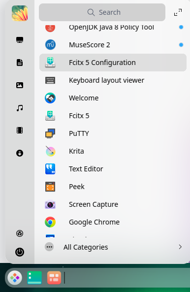
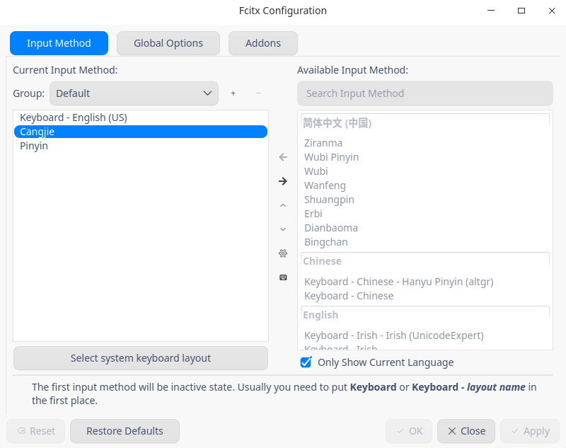
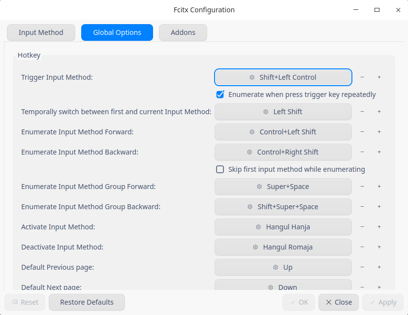
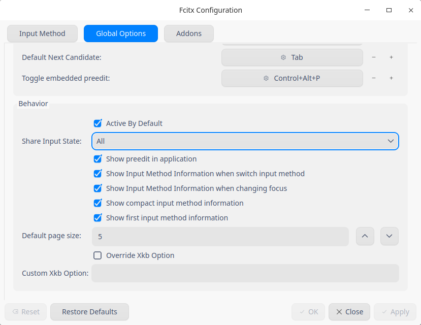
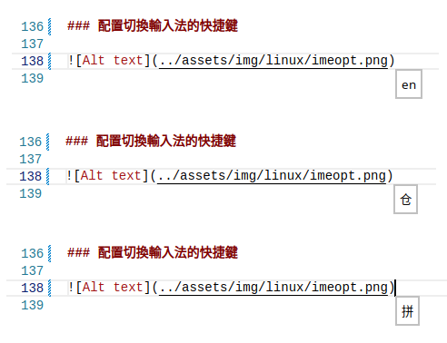

<style>
    table {
        width: 100%;
    }
</style>

# Rime - 中州韻輸入法

**Rime** 全名是「中州韻輸入法引擎」，不僅是一個輸入法，而是一個輸入法算法框架。Rime 算法支持了拼音、雙拼、註音、五筆、倉頡等所有音碼和形碼輸入法，好於基於碼表的輸入法生成器。*Rime* 默認提供了兩個拼音輸入法「朙月拼音」和「地球拼音」，兩者都可以輸入準確的繁體和簡體，而且「地球拼音」還支持聲調輸入。*Rime* 支持了許多種方言拼音，如吳語、粵語，甚至中古漢語。

Rime 是跨平臺的發行版的名字如下:

 - Windows發行版叫做「小狼毫」，
 - Mac發行版叫做「鼠鬚管」，
 - Linux發行版叫做「中州韻」。

## Rime - 中州韻輸入法 (fcitx4)

```shell
# --- 卸載相關軟件包
sudo apt purge fcitx*
# --- 清理依賴包
sudo apt autoremove
# --- 刪除配置文件目錄
rm -rf ~/.config/fcitx

安裝 fcitx5 輸入法方式：

```shell
# --- 中州韻輸入法引擎安裝 ---
sudo apt install fcitx-rime

# --- 可以根據需要安裝以下項目 ---
# --- 朙月拼音（預裝）
sudo apt-get install librime-data-luna-pinyin
# --- 倉頡五代（預裝）
sudo apt-get install librime-data-cangjie5
# --- 雙拼
sudo apt-get install librime-data-double-pinyin
# --- 宮保拼音
sudo apt-get install librime-data-combo-pinyin
# --- 注音、地球拼音
sudo apt-get install librime-data-terra-pinyin librime-data-bopomofo
# --- 速成五代
sudo apt-get install librime-data-quick5
# --- 五筆86、袖珍簡化字拼音、五筆畫
sudo apt-get install librime-data-wubi librime-data-pinyin-simp librime-data-stroke-simp
# --- IPA (X-SAMPA)
sudo apt-get install librime-data-ipa-xsampa
# --- 上海吳語
sudo apt-get install librime-data-wugniu
# --- 粵拼
sudo apt-get install librime-data-jyutping
# --- 中古漢語拼音
sudo apt-get install librime-data-zyenpheng

```

然後需要手動配製 ~/.config/fcitx/rime 目錄


可以在輸入過程中按 **F4** 選擇方案。

按組合鍵 **F4** 選擇輸入方案選單，由此調整 *Rime* 輸入法最常用的選項。可通過方案選單切換已經安裝的輸入方案。

[Rime 互聯網資源](https://github.com/rime/home/wiki/RimeWithIBus)

在 Linux 下有兩大主要的輸入法支持框架：fcitx 和 IBus。
 - fcitx 是 Free Chinese Input Toy for X 的簡稱。
 - IBus 是 Intelligent Input Bus 的簡稱。

在「部署 Rime」操作時，用到這裡的輸入方案源文件,並結合用戶定制的內容來編譯預設輸入方案。*Rime* 中所有文本文檔，均要求以 UTF-8 編碼，並建議使用 UNIX 換行符（LF）。


用戶資料夾則包含為用戶準備的內容：

- 用戶的全局設置 **default.custom.yaml** （應用於所有輸入方案）
- 安裝信息 **installation.yaml**
- 用戶狀態信息 **user.yaml**
- 用戶詞典 **<詞典名>.userdb.kct**
- 用戶詞典快照 **<詞典名>.userdb.txt**, **<詞典名>.userdb.kct.snapshot** 見於同步文 件夾
- 用戶對具體某個輸入方案的設置 **<方案標識>.custom.yaml**
- 用戶製作的輸入方案及配套的詞典文件。

其它配置文件 **weasel.yaml** 和 **default.yaml** 分別和功能

- **weasel.custom.yaml** 主要記錄了外觀設置相關的內容，如顯示字體、字號、橫豎排、 配色方案等。
- **default.custom.yaml** 記錄了快捷鍵、方案列表、標點符號等方面的內容。

需要注意 的是，「候選詞個數」的設定是在 **default.yaml**。

build 目錄：

該目錄中的內容是 Rime 在部署時自動生成的，可以參考裡面的文件配置，比如：

luna_pinyin.schema.yaml：你可發現裡面定義了各種特殊符號。
luna_pinyin_simp.schema.yaml：而這裡並沒有特殊符號。


## Rime - 中州韻輸入法 (fcitx5)

卸載以前的安裝 fcitx 輸入法, 在操作系統中，打開【終端】執行：

```shell
# --- 卸載相關軟件包
sudo apt purge fcitx*
# --- 清理依賴包
sudo apt autoremove
# --- 刪除配置文件目錄
rm -rf ~/.config/fcitx
```

安裝 fcitx5 輸入法方式：

```shell
# --- 中州韻輸入法引擎安裝 ---
sudo apt install fcitx-rime
sudo apt install fcitx5 fcitx5-chinese-addons
```

### 啟動 Fcitx5 配置



### 添加輸入法



### 配置切換輸入法的快捷鍵



### 在 Linux 系統中的所有程序之間共享輸入法設置



### 根據上面的設置輸入法通過 Ctrl + Left Shift 的改變



注意: Cangjie Input Method 倉頡輸入法