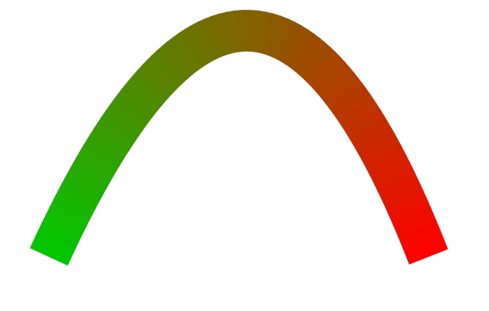
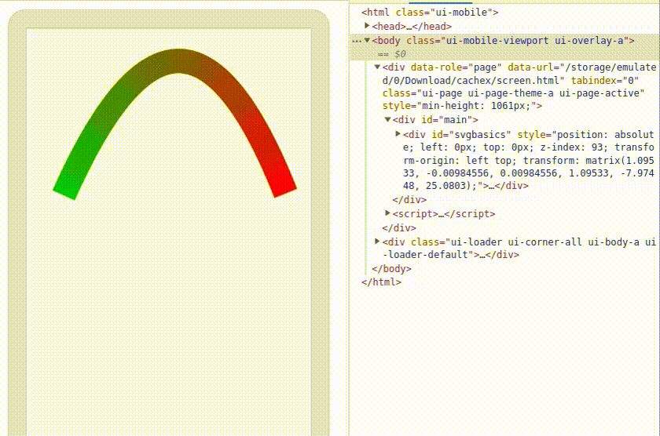

<style>
    table {
        width: 100%;
    }
</style>

# Javascript 有用代碼

## SVG 中的漸變填充路徑

```js
class gradientColor {
  constructor(id, fromColor, toColor, resolution) {
    create(id, fromColor, toColor, resolution);
  }
}

function create(id, fromColor, toColor, resolution){
  let path = d3.select(id).remove();
  let color = d3.interpolate(fromColor, toColor);
  d3.select("svg").selectAll("path")
    .data(polygon(strips(path.node(), resolution)))
    .enter().append("path")
    .style("fill", function(d) { return color(d.t); })
    .style("stroke", function(d) { return color(d.t); })
    .attr("d", function(d) { return lineJoin(d[0], d[1], d[2], d[3], 32); });
}

function strips(path, precision) {
  let n = path.getTotalLength(), t = [0], i = 0, dt = precision;
  while ((i += dt) < n) t.push(i);
  t.push(n);
  return t.map(function(t) {
    let p = path.getPointAtLength(t), a = [p.x, p.y];
    a.t = t / n;
    return a;
  });
}

function polygon(points) {
  return d3.range(points.length - 1).map(function(i) {
    let a = [points[i - 1], points[i], points[i + 1], points[i + 2]];
    a.t = (points[i].t + points[i + 1].t) / 2;
    return a;
  });
}

function lineJoin(p0, p1, p2, p3, width) {
  let u12 = perpendicular(p1, p2),
      r = width / 2,
      a = [p1[0] + u12[0] * r, p1[1] + u12[1] * r],
      b = [p2[0] + u12[0] * r, p2[1] + u12[1] * r],
      c = [p2[0] - u12[0] * r, p2[1] - u12[1] * r],
      d = [p1[0] - u12[0] * r, p1[1] - u12[1] * r];
  if (p0) {
    let u01 = perpendicular(p0, p1), e = [p1[0] + u01[0] + u12[0], p1[1] + u01[1] + u12[1]];
    a = lineIntersect(p1, e, a, b);
    d = lineIntersect(p1, e, d, c);
  }
  if (p3) {
    let u23 = perpendicular(p2, p3), e = [p2[0] + u23[0] + u12[0], p2[1] + u23[1] + u12[1]];
    b = lineIntersect(p2, e, a, b);
    c = lineIntersect(p2, e, d, c);
  }
  return "M" + a + "L" + b + " " + c + " " + d + "Z";
}

function lineIntersect(a, b, c, d) {
  let x1 = c[0], x3 = a[0], x21 = d[0] - x1, x43 = b[0] - x3,
      y1 = c[1], y3 = a[1], y21 = d[1] - y1, y43 = b[1] - y3,
      ua = (x43 * (y1 - y3) - y43 * (x1 - x3)) / (y43 * x21 - x43 * y21);
  return [x1 + ua * x21, y1 + ua * y21];
}

function perpendicular(p0, p1) {
  let u01x = p0[1] - p1[1], u01y = p1[0] - p0[0],
      u01d = Math.sqrt(u01x * u01x + u01y * u01y);
  return [u01x / u01d, u01y / u01d];
}
```

## SVG 中的漸變填充路徑的網頁示例

```html
<svg width="600" height="300">
  <path id="test" d="M100,250 C213,4 310,19 400,250" stroke-width="80" fill="none"/>
</svg>

<script src="https://d3js.org/d3.v7.min.js"></script>
<script src="color_module.js"></script>
<script>
  const gradient = new gradientColor("#test",'rgb(0,200,0)', 'rgb(255,0,0)', 5);
</script>
```
## 屏幕輸出結果



# 手機觸控控制

## jQuery 掛鉤到屏幕控制

```js
$.fn.extend({

	addScreen: function () {
		_mainID = "#" + $(this).attr("id");
		_containerID = "#" + $(this).parent().attr("id");
		var objScreen = new Transform(_containerID, _mainID);
		objScreen.setTapCallback(resetDiv);
        resetDiv();

		$(_containerID).touchstart(function (event) {
			if (typeof objScreen !== "undefined") {
				objScreen.touchStart(event);
			}
		});

		$(_containerID).touchend(function (event) {
			if (typeof objScreen !== "undefined") {
				objScreen.touchEnd(event);
			}
		});

		$(_containerID).touchleave(function (event) {
			if (typeof objScreen !== "undefined") {
				objScreen.touchLeave(event);
			}
		});

		$(_containerID).touchup(function (event) {
			if (typeof objScreen !== "undefined") {
				objScreen.touchUp(event);
			}
		});

		$(_containerID).touchmove(function (event) {
			if (typeof objScreen !== "undefined") {
				objScreen.touchMove(event);
			}
		});

		function resetDiv() {
			if (objScreen) {
				var _param = '{"x":0,"y":0}|{"x":0,"y":0}|{"translation":[0,0],"rotation":0,"scale":[1.0, 1.0],"skew":[0,0]}|[1,0,0,1,0,0]|false';
				objScreen.setParameter(_param);
				$(_containerID + "> :first-child").attr("style", 'position: absolute; left: 0px; top: 0px; z-index: 93; transform-origin: left top; transform: matrix(1, 0, 0, 1, 0, 0);');
				objScreen.updateObject();
				objScreen.rotation = true;
			}
		};
	}
});
```

## jQuery 觸屏控制

```js
(function ($, undefined) {
  let isTouchStateLeave = function ($that) {
    let startX = $that.offset().left;
    let startY = $that.offset().top;
    let endX = $that.outerWidth() + startX;
    let endY = $that.outerHeight() + startY;
    let touchX = event.touches[0].pageX;
    let touchY = event.touches[0].pageY;
    let isXY =
      touchX > startX && touchX < endX && touchY > startY && touchY < endY;
    if (!isXY) {
      return true;
    }
    return false;
  };
  jQuery.fn.extend({
    // 將事件處理程序綁定到 "touchstart" JavaScript 事件。
    touchstart: function (fn) {
      $(this).each(function () {
        if (this == undefined) return;
        let that = this;
        that.addEventListener("touchstart", function (event) {
          fn.call(that, event);
        });
      });
      return this;
    },
    // 將事件處理程序綁定到 "touchend" JavaScript 事件。
    touchend: function (fn) {
      $(this).each(function () {
        if (this == undefined) return;
        let that = this;
        that.addEventListener(
          "touchend",
          function (event) {
            fn.call(that, event);
          },
          false
        );
      });

      return this;
    },
    // 將事件處理程序綁定到 "touchmove" JavaScript 事件。
     touchmove: function (fn) {
      $(this).each(function () {
        if (this == undefined) return;
        let that = this;
        that.addEventListener(
          "touchstart",
          function (event) {
            // event.preventDefault();
          },
          false
        );
        that.addEventListener(
          "touchmove",
          function (event) {
            fn.call(that, event);
          },
          false
        );
      });
      return this;
    },
    // 將事件處理程序綁定到 "touchup" JavaScript 事件。
    touchup: function (fn) {
      $(this).each(function () {
        if (this == undefined) return;
        let that = this, $that = $(this), touchX = null, touchY = null;
        that.addEventListener(
          "touchstart",
          function (event) {
            // event.preventDefault();
            touchX = null;
            touchY = null;
          },
          false
        );
        that.addEventListener(
          "touchmove",
          function (event) {
            touchX = event.touches[0].pageX;
            touchY = event.touches[0].pageY;
          },
          false
        );
        that.addEventListener(
          "touchend",
          function (event) {
            //  event.preventDefault();
            let startX = $that.offset().left;
            let startY = $that.offset().top;
            let endX = $that.outerWidth() + startX;
            let endY = $that.outerHeight() + startY;
            let isXY = touchX > startX && touchX < endX && touchY > startY && touchY < endY;
            let isNotMove = !(touchX && touchY);
            if (isXY || isNotMove) {
              fn.call(that, event);
            }
          },
          false
        );
      });
      return this;
    },
    touchclick: function (fn) {
      $(this).each(function () {
        if (this == undefined) return;
        let that = this;
        let notClick = false;
        that.addEventListener(
          "touchstart",
          function (event) {
            notClick = false;
          },
          false
        );
        that.addEventListener(
          "touchmove",
          function (event) {
            notClick = true;
          },
          false
        );
        that.addEventListener(
          "touchend",
          function (event) {
            if (!notClick) fn.call(that, event);
          },
          false
        );
      });
      return this;
    },
    // 將事件處理程序綁定到 "touchleave" JavaScript 事件。
    touchleave: function (fn) {
      $(this).each(function () {
        if (this == undefined) return;
        let that = this,
          $that = $(this),
          isRun = true;
        that.addEventListener(
          "touchstart",
          function (event) {
            //         event.preventDefault();
          },
          false
        );
        that.addEventListener(
          "touchmove",
          function (event) {
            if (isTouchStateLeave($that)) {
              if (isRun) fn.call(that, event);
              isRun = false;
            } else isRun = true;
          },
          false
        );
      });
      return this;
    },
    // 將事件處理程序綁定到 "touchenter" JavaScript 事件。
     touchenter: function (fn) {
      $(this).each(function () {
        if (this == undefined) return;
        let that = this, $that = $(this), isRun = false;
        that.addEventListener(
          "touchstart",
          function (event) {
            // event.preventDefault();
          },
          false
        );
        that.addEventListener(
          "touchmove",
          function (event) {
            if (!isTouchStateLeave($that)) {
              if (isRun) fn.call(that, event);
              isRun = false;
            } else isRun = true;
          },
          false
        );
      });
      return this;
    },
  });
})(jQuery);
```

## 屏幕二維矩陣變換

```js
// 	| a  c  tx |
// 	| b  d  ty |
// 	| 0  0   1 |

class Matrix2D {

  constructor () {
    this.DEG_TO_RAD = Math.PI / 180;
    this.setValues(1, 0, 0, 1, 0, 0);
  }

  setValues(a, b, c, d, tx, ty) {
    this.a = a == null ? 1 : a;
    this.b = b || 0;
    this.c = c || 0;
    this.d = d == null ? 1 : d;
    this.tx = tx || 0;
    this.ty = ty || 0;
    return this;
  }

  append(a, b, c, d, tx, ty) {
    let a1 = this.a;
    let b1 = this.b;
    let c1 = this.c;
    let d1 = this.d;
    if (a != 1 || b != 0 || c != 0 || d != 1) {
      this.a = a1*a + c1*b;
      this.b = b1*a + d1*b;
      this.c = a1*c + c1*d;
      this.d = b1*c + d1*d;
    }
    this.tx = a1*tx + c1*ty + this.tx;
    this.ty = b1*tx + d1*ty + this.ty;
    return this;
  }

  prepend(a, b, c, d, tx, ty) {
    let a1 = this.a;
    let c1 = this.c;
    let tx1 = this.tx;
    this.a = a*a1 + c*this.b;
    this.b = b*a1 + d*this.b;
    this.c = a*c1 + c*this.d;
    this.d = b*c1 + d*this.d;
    this.tx = a*tx1 + c*this.ty + tx;
    this.ty = b*tx1 + d*this.ty + ty;
    return this;
  }

  appendMatrix (matrix) {
    return this.append(matrix.a, matrix.b, matrix.c, matrix.d, matrix.tx, matrix.ty);
  }

  prependMatrix (matrix) {
    return this.prepend(matrix.a, matrix.b, matrix.c, matrix.d, matrix.tx, matrix.ty);
  }

  appendTransform (x, y, scaleX, scaleY, rotation, skewX, skewY, regX, regY) {
    if (rotation % 360) {
      let r = rotation*this.DEG_TO_RAD;
      let cos = Math.cos(r);
      let sin = Math.sin(r);
    } else {
      cos = 1;
      sin = 0;
    }
    if (skewX || skewY) {
      skewX *= this.DEG_TO_RAD;
      skewY *= this.DEG_TO_RAD;
      this.append(Math.cos(skewY), Math.sin(skewY), -Math.sin(skewX), Math.cos(skewX), x, y);
      this.append(cos*scaleX, sin*scaleX, -sin*scaleY, cos*scaleY, 0, 0);
    } else {
      this.append(cos*scaleX, sin*scaleX, -sin*scaleY, cos*scaleY, x, y);
    }
    if (regX || regY) {
      this.tx -= regX*this.a + regY*this.c;
      this.ty -= regX*this.b + regY*this.d;
    }
    return this;
  }

  prependTransform (x, y, scaleX, scaleY, rotation, skewX, skewY, regX, regY) {
    if (rotation % 360) {
      let r = rotation*this.DEG_TO_RAD;
      let cos = Math.cos(r);
      let sin = Math.sin(r);
    } else {
      cos = 1;
      sin = 0;
    }
    if (regX || regY) {
      this.tx -= regX;
      this.ty -= regY;
    }
    if (skewX || skewY) {
      skewX *= this.DEG_TO_RAD;
      skewY *= this.DEG_TO_RAD;
      this.prepend(cos*scaleX, sin*scaleX, -sin*scaleY, cos*scaleY, 0, 0);
      this.prepend(
        Math.cos(skewY),
        Math.sin(skewY),
        -Math.sin(skewX),
        Math.cos(skewX),
        x,
        y
      );
    } else {
      this.prepend(cos*scaleX, sin*scaleX, -sin*scaleY, cos*scaleY, x, y);
    }
    return this;
  }

  rotate (angle) {
    angle = angle*this.DEG_TO_RAD;
    let cos = Math.cos(angle);
    let sin = Math.sin(angle);
    let a1 = this.a;
    let b1 = this.b;
    this.a = a1*cos + this.c*sin;
    this.b = b1*cos + this.d*sin;
    this.c = -a1*sin + this.c*cos;
    this.d = -b1*sin + this.d*cos;
    return this;
  }

  skew (skewX, skewY) {
    skewX = skewX*this.DEG_TO_RAD;
    skewY = skewY*this.DEG_TO_RAD;
    this.append(
      Math.cos(skewY),
      Math.sin(skewY),
      -Math.sin(skewX),
      Math.cos(skewX),
      0,
      0
    );
    return this;
  };

  scale (x, y) {
    this.a *= x;
    this.b *= x;
    this.c *= y;
    this.d *= y;
    return this;
  }

  translate (x, y) {
    this.tx += this.a*x + this.c*y;
    this.ty += this.b*x + this.d*y;
    return this;
  }

  identity () {
    this.a = this.d = 1;
    this.b = this.c = this.tx = this.ty = 0;
    return this;
  }

  invert () {
    let a1 = this.a;
    let b1 = this.b;
    let c1 = this.c;
    let d1 = this.d;
    let tx1 = this.tx;
    let n = a1*d1 - b1*c1;
    this.a = d1 / n;
    this.b = -b1 / n;
    this.c = -c1 / n;
    this.d = a1 / n;
    this.tx = (c1*this.ty - d1*tx1) / n;
    this.ty = -(a1*this.ty - b1*tx1) / n;
    return this;
  }

  isIdentity () {
    return (
      this.tx === 0 &&
      this.ty === 0 &&
      this.a === 1 &&
      this.b === 0 &&
      this.c === 0 &&
      this.d === 1
    );
  }

  equals (matrix) {
    return (
      this.tx === matrix.tx &&
      this.ty === matrix.ty &&
      this.a === matrix.a &&
      this.b === matrix.b &&
      this.c === matrix.c &&
      this.d === matrix.d
    );
  }

  transformPoint (x, y, pt) {
    pt = pt || {};
    pt.x = x*this.a + y*this.c + this.tx;
    pt.y = x*this.b + y*this.d + this.ty;
    return pt;
  }

  decompose (target) {
    if (target == null) {
      target = {};
    }
    target.x = this.tx;
    target.y = this.ty;
    target.scaleX = Math.sqrt(this.a*this.a + this.b*this.b);
    target.scaleY = Math.sqrt(this.c*this.c + this.d*this.d);
    let skewX = Math.atan2(-this.c, this.d);
    let skewY = Math.atan2(this.b, this.a);
    let delta = Math.abs(1 - skewX / skewY);
    if (delta < 0.00001) {
      target.rotation = skewY / this.DEG_TO_RAD;
      if (this.a < 0 && this.d >= 0) {
        target.rotation += target.rotation <= 0 ? 180 : -180;
      }
      target.skewX = target.skewY = 0;
    } else {
      target.skewX = skewX / this.DEG_TO_RAD;
      target.skewY = skewY / this.DEG_TO_RAD;
    }
    return target;
  }

  copy (matrix) {
    return this.setValues(matrix.a, matrix.b, matrix.c, matrix.d, matrix.tx, matrix.ty);
  }

  clone () {
    return new Matrix2D(this.a, this.b, this.c, this.d, this.tx, this.ty);
  }

  toString () {
    return (
      "[Matrix2D (a=" + this.a + " b=" + this.b + " c=" + this.c + " d=" + this.d + " tx=" + this.tx + " ty=" + this.ty + ")]");
  }

  toArray () {
    return [this.a, this.b, this.c, this.d, this.tx, this.ty];
  }

  toCSS () {
    return ("matrix(" + this.a + ", " + this.b + ", " + this.c + ", " + this.d + ", " + this.tx + ", " + this.ty + ")");
  }
}
```

## 屏幕變換功能（平移, 旋轉 和 縮放）

```js
class Transform {
  constructor(container, coreObject) {
    this.setValues(container, coreObject);
  }

  setValues(container, coreObject) {
    this._matrix = new Matrix2D();
    this._containerID = container;
    this._coreObject = coreObject;
    this._startPt = this.buildPoint(0, 0);
    this._refOrigin = this.buildPoint(0, 0);
    this._refDistance = 1;
    this._matrixStr = null;
    this._preDistance = 0;
    this._tapTime = 0;
    this._refAngle = 0;
    this._TAP_RECORD_DURATION = 300;
    this._tapCallback;
    this._holdCallback;
    this._count = 0;
    this._rotationFlag = true;
    this._translateMode = true;
    this._zoomScaleMode = false;
    this._objectParameter = {
      translation: [0, 0],
      rotation: 0,
      scale: [1, 1],
      skew: [0, 0],
    };
  }

  touchStart(event) {
    this._translateMode = true;
    this._zoomScaleMode = false;
    this._startPt = this.buildPoint(
      event.touches[0].pageX,
      event.touches[0].pageY
    );
  }

  touchEnd(event) {
    if (event.touches.length == 2) {
    }
    //event.preventDefault();
  }

  touchTap(event) {
    var _timeslot = Date.now() - this._tapTime;
    if (this._tapCallback && _timeslot < this._TAP_RECORD_DURATION) {
      this._tapCallback();
    }
    this._tapTime = 0;
  }

  setTapCallback(Callback) {
    this._tapCallback = Callback;
  }

  touchLeave(event) {
    this._count = 0;
  }

  touchUp(event) {
    if (event.touches.length == 0) {
      if (this._tapTime == 0) {
        this._tapTime = Date.now();
      } else {
        this.touchTap(event);
      }
      // event.preventDefault();
    }
  }

  touchMove(event) {
    this._fingers = event.changedTouches.length;
    let pt0 = this.buildPoint(event.touches[0].pageX, event.touches[0].pageY);
    if (this._fingers == 1 && this._translateMode) {
      this._zoomScaleMode = false;
      let pt = this.buildPoint(
        pt0.x - this._startPt.x,
        pt0.y - this._startPt.y
      );
      pt = this.reversePt(pt, this._objectParameter);
      this._startPt = pt0;
      this._matrix.translate(pt.x, pt.y);
      this._matrixStr = this._matrix.toCSS();
    }
    if (this._fingers == 2 && this._zoomScaleMode) {
      this._translateMode = false;
      let pt1 = this.buildPoint(event.touches[1].pageX, event.touches[1].pageY);
      this._refOrigin = this.middlePoint(pt0, pt1);
      let pDistance = this.getDistance(pt0, this._refOrigin);
      let locAngle =
        (Math.atan2(pt0.y - this._refOrigin.y, pt0.x - this._refOrigin.x) *
          180) /
        Math.PI;
      if (this._count < 3) {
        this._refAngle = locAngle;
        this._refDistance = pDistance;
        this._count = this._count + 1;
      } else {
        if (this._rotationFlag) {
          // 旋轉功能
          let rotateAngle = locAngle - this._refAngle;
          if (Math.abs(rotateAngle) < 2.8) {
            rotateAngle = Math.round(rotateAngle * 1000) / 1000;
            let pt = this.getRefOffset(this._refOrigin, this._matrix, this._objectParameter);
            this._matrix.translate(pt.x, pt.y).rotate(rotateAngle).translate(-pt.x, -pt.y);
            this._matrixStr = this._matrix.toCSS();
          }
          this._refAngle = locAngle;
        }
        // 縮放功能
        let scale = pDistance / this._refDistance;
        scale = Math.round(scale * 1000) / 1000;
        let pt = this.getRefOffset(this._refOrigin, this._matrix, this._objectParameter);
        this._matrix.translate(pt.x, pt.y).scale(scale, scale).translate(-pt.x, -pt.y);
        this._matrixStr = this._matrix.toCSS();
        this._refDistance = pDistance;
      }
    }
    if (this._fingers == 2) {
      this._translateMode = false;
      if (!this._zoomScaleMode) {
        this._count = 0;
        this._refAngle = 0;
      }
      this._zoomScaleMode = true;
    }
    this._tapTime = 0;
    this._holdTime = 0;
    this.updateObject();
//    event.preventDefault();
  }

  updateObject() {
    if (this._matrixStr != null) {
      $(this._coreObject).css({
        "transform-origin": "top left",
        position: "absolute",
        transform: this._matrixStr,
      });
      this._objectParameter = this.decompose_2d_matrix(this._matrix);
    }
  }

  getParameter() {
    var _Str = JSON.stringify(this._refOrigin);
    _Str = _Str + "|" + JSON.stringify(this._startPt);
    _Str = _Str + "|" + JSON.stringify(this._objectParameter);
    _Str = _Str + "|" + JSON.stringify(this._matrix.toArray());
    _Str = _Str + "|" + this._freezeFlag;
    return _Str;
  }

  setParameter(parameter) {
    parameter = parameter.split("|");
    this._refOrigin = JSON.parse(parameter[0]);
    this._startPt = JSON.parse(parameter[1]);
    this._objectParameter = JSON.parse(parameter[2]);
    let _array = JSON.parse(parameter[3]);
    this._matrix.setValues(_array[0], _array[1], _array[2], _array[3], _array[4], _array[5]);
    this._freezeFlag = this.getBool(parameter[4]);
    this._matrix.translate(0, 0);
    this._matrixStr = this._matrix.toCSS();
  }

  get rotation() {
    return this._rotationFlag;
  }

  set rotation(flag) {
    this._rotationFlag = flag;
  }

  // 私有函數
  getBool(val) {
    return !!JSON.parse(String(val).toLowerCase());
  }

  getRefOffset(refOrigin, matrix, objectParameter) {
    let pt = this.buildPoint(refOrigin.x - matrix.tx, refOrigin.y - matrix.ty);
    return this.reversePt(pt, objectParameter);
  }

  reversePt(pt, objectParameter) {
    let angle = objectParameter.rotation;
    let scaleX = objectParameter.scale[0];
    let scaleY = objectParameter.scale[1];
    let x = (pt.x * Math.cos(angle)) / scaleX + (pt.y * Math.sin(angle)) / scaleY;
    let y = (-pt.x * Math.sin(angle)) / scaleX + (pt.y * Math.cos(angle)) / scaleY;
    return this.buildPoint(x, y);
  }

  decompose_2d_matrix(mat) {
    let a = mat.a;
    let b = mat.b;
    let c = mat.c;
    let d = mat.d;
    let e = mat.tx;
    let f = mat.ty;
    let delta = a * d - b * c;
    let result = {translation: [e, f], rotation: 0, scale: [0, 0], skew: [0, 0]};
    // 應用 QR 的分解
    if (a != 0 || b != 0) {
      let r = Math.sqrt(a * a + b * b);
      result.rotation = b > 0 ? Math.acos(a / r) : -Math.acos(a / r);
      result.scale = [r, delta / r];
      result.skew = [Math.atan((a * c + b * d) / (r * r)), 0];
    } else {
      if (c != 0 || d != 0) {
        let s = Math.sqrt(c * c + d * d);
        result.rotation =
          Math.PI / 2 - (d > 0 ? Math.acos(-c / s) : -Math.acos(c / s));
        result.scale = [delta / s, s];
        result.skew = [0, Math.atan((a * c + b * d) / (s * s))];
      } else {
        // a = b = c = d = 0
      }
    }
    return result;
  }

  getDistance(a, b) {
    let x, y;
    x = a.x - b.x;
    y = a.y - b.y;
    return Math.sqrt(x * x + y * y);
  }

  buildPoint(left, top) {
    return { x: left, y: top };
  }

  middlePoint(pt0, pt1) {
    return { x: (pt0.x + pt1.x) / 2, y: (pt0.y + pt1.y) / 2 };
  }
}
```

## jQuery 觸屏控制的網頁示例

```html
<html>
  <head>
    <meta charset="utf-8" />
    <meta id="viewport" name="viewport" content="width=device-width,initial-scale=1,user-scalable=yes" />
    <link rel="stylesheet" href="https://code.jquery.com/mobile/1.4.5/jquery.mobile-1.4.5.min.css" />
    <script src="https://code.jquery.com/jquery-1.11.1.min.js"></script>
    <script src="https://code.jquery.com/mobile/1.4.5/jquery.mobile-1.4.5.min.js"></script>
    <script type="text/javascript" src="https://d3js.org/d3.v7.min.js"></script>
    <script type="text/javascript" src="./core/color_module.js"></script>
    <script type="text/javascript" src="./core/matrix2d.js"></script>
    <script type="text/javascript" src="./core/touch.js"></script>
    <script type="text/javascript" src="./core/mTransform.js"></script>
    <script type="text/javascript" src="./core/mScreen.js"></script>
<body>
  <div id="main">
    <div id="svgbasics">
      <svg width="600" height="300">
        <path id="test" d="M100,250 C213,4 310,19 400,250" stroke-width="80" fill="none"/>
      </svg>
    </div>
  </div>
  <script>
    const gradient = new gradientColor("#test",'rgb(0,200,0)', 'rgb(255,0,0)', 5);
    $("#svgbasics").addScreen();
  </script>
</body>
</html>
```

## 屏幕調試信息

