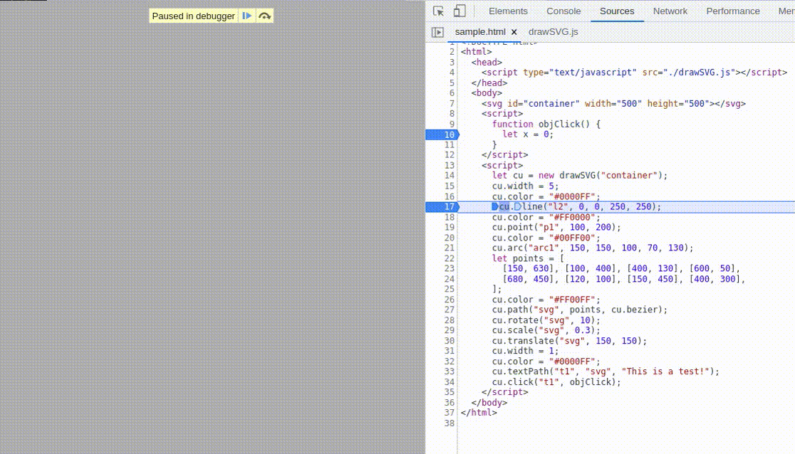

<style>
    table {
        width: 100%;
    }
</style>

# SVG 有用代碼

## SVG 在路徑繪製

```js
class drawSVG {

  constructor(container) {
    this.container = container;
    this.rad_Deg = Math.PI / 180.0;
    this.fillColor = "none";
    this.strokeColor = "#FF0000";
    this.strokeWidth = 1;
  }

  set width(value) {
    this.strokeWidth = value;
  }

  get width() {
    return this.strokeWidth;
  }

  set color(value) {
    this.strokeColor = value;
  }

  get color() {
    return this.strokeColor;
  }

  _createObj(id) {
    let newpath = document.createElementNS("http://www.w3.org/2000/svg", "path");
    newpath.setAttributeNS(null, "id", id);
    newpath.setAttributeNS(null, "fill", "none");
    newpath.setAttributeNS(null, "stroke", this.strokeColor);
    newpath.setAttributeNS(null, "stroke-width", this.strokeWidth);
    document.getElementById(this.container).appendChild(newpath);
  }

  point(id, x, y, radius) {
    this._createObj(id);
    radius = radius || 0.5;
    document.getElementById(id).setAttribute("fill", this.strokeColor);
    this.arc(id, x, y, radius, 0, 359, true);
  }

  line(id, x, y, x1, y1) {
    this._createObj(id);
    let str = ["M", x, y, "L", x1, y1].join(" ");
    this._setAttribute(id, str);
  }

  arc(id, x, y, radius, fromAngle, toAngle, close) {
    this._createObj(id);
    let start = this._polarToCartesian(x, y, radius, toAngle);
    let end = this._polarToCartesian(x, y, radius, fromAngle);
    let largeArcFlag = toAngle - fromAngle <= 180 ? "0" : "1";
    let str = [ "M", start.x, start.y, "A", radius, radius, 0, largeArcFlag, 0, end.x, end.y, ].join(" ");
    str = close ? str + " Z" : str;
    this._setAttribute(id, str);
  }

  path(id, points, command, smoothing) {
    this._createObj(id);
    this.smoothing = smoothing || 0.2;
    let str = points.reduce(
      (acc, point, i, a) => i === 0 ? `M ${point[0]},${point[1]}` : `${acc} ${command(this, point, i, a)}`, "");
    this._setAttribute(id, str);
  }

  textPath(id, pathID, txt) {
    let elem = document.createElementNS("http://www.w3.org/2000/svg", "text");
    elem.setAttributeNS(null, "id", id);
    elem.setAttributeNS(null, "fill", "none");
    elem.setAttributeNS(null, "stroke", this.strokeColor);
    elem.setAttributeNS(null, "stroke-width", this.strokeWidth);
    document.getElementById(this.container).appendChild(elem);
    let tpath = document.createElementNS("http://www.w3.org/2000/svg", "textPath");
    tpath.setAttributeNS("http://www.w3.org/1999/xlink", "xlink:href", "#" + pathID);
    var ringdatenode = document.createTextNode(txt);
    document.getElementById(this.container).appendChild(elem);
    tpath.appendChild(ringdatenode);
    elem.appendChild(tpath);
  }

  bezier(that, point, i, a) {
    let cps = that._controlPoint(a[i - 1], a[i - 2], point, false);
    let cpe = that._controlPoint(point, a[i - 1], a[i + 1], true);
    return `C ${cps[0]},${cps[1]} ${cpe[0]},${cpe[1]} ${point[0]},${point[1]}`;
  }

  scale(id, scaleX, scaleY) {
    scaleY = scaleY || scaleX;
    this._setTransform(id);
    this._transform(scaleX, 0, 0, scaleY, 0, 0);
    this._toCSS(id);
  }

  rotate(id, angle) {
    this._setTransform(id);
    this._rotate(angle);
    this._toCSS(id);
  }

  translate(id, tx, ty) {
    this._setTransform(id);
    this._transform(1, 0, 0, 1, tx, ty);
    this._toCSS(id);
  }

  skew(id, skewX, skewY) {
    skewY = skewY || skewX;
    this._setTransform(id);
    this._transform(1, skewX, skewY, 1, 0, 0);
    this._toCSS(id);
  }

  flipX(id) {
    this._setTransform(id);
    this._transform(-1, 0, 0, 1, 0, 0);
    this._toCSS(id);
  }

  flipY(id) {
    this._setTransform(id);
    this._transform(1, 0, 0, -1, 0, 0);
    this._toCSS(id);
  }

  reset(id) {
    this._setTransform(id);
    this.a = this.d = 1;
    this.b = this.c = this.e = this.f = 0;
    this._toCSS(id);
  }

  _polarToCartesian(centerX, centerY, radius, angleInDegrees) {
    let angleInRadians = (angleInDegrees - 90) * this.rad_Deg;
    return {
      x: centerX + radius * Math.cos(angleInRadians),
      y: centerY + radius * Math.sin(angleInRadians),
    };
  }

  _setAttribute(id, str) {
    document.getElementById(id).setAttribute("d", str);
  }

  _matrixValue(id) {
    let elem = document.getElementById(id);
    let style = window.getComputedStyle(elem, null);
    let trans =
      style.transform == "none" ? "matrix(1, 0, 0, 1, 0, 0)" : style.transform;
    let numberPattern = /-?\d+\.?\d*/g;
    let strArray = trans.match(numberPattern);
    let a = parseFloat(strArray[0]),
      b = parseFloat(strArray[1]),
      c = parseFloat(strArray[2]),
      d = parseFloat(strArray[3]),
      e = parseFloat(strArray[4]),
      f = parseFloat(strArray[5]);
    return [a, b, c, d, e, f];
  }

  _toCSS(id) {
    document
      .getElementById(id)
      .setAttribute("transform","matrix(" + this.a + "," + this.b + "," + this.c + "," + this.d + "," + this.e + "," + this.f + ")");
  }

  _line(pointA, pointB) {
    let lengthX = pointB[0] - pointA[0];
    let lengthY = pointB[1] - pointA[1];
    return {
      length: Math.sqrt(Math.pow(lengthX, 2) + Math.pow(lengthY, 2)),
      angle: Math.atan2(lengthY, lengthX),
    };
  }

  _controlPoint(current, previous, next, reverse) {
    let p = previous || current;
    let n = next || current;
    let o = this._line(p, n);
    let angle = o.angle + (reverse ? Math.PI : 0);
    let length = o.length * this.smoothing;
    let x = current[0] + Math.cos(angle) * length;
    let y = current[1] + Math.sin(angle) * length;
    return [x, y];
  }

  _rotate(angle) {
    angle = angle * this.rad_Deg;
    let cos = Math.cos(angle);
    let sin = Math.sin(angle);
    sin = Math.abs(sin) < 0.0000001 ? 0 : sin;
    cos = Math.abs(cos) < 0.0000001 ? 0 : cos;
    this._transform(cos, sin, -sin, cos, 0, 0);
  }

  _setTransform(id) {
    let iArray = this._matrixValue(id);
    this.a = iArray[0];
    this.b = iArray[1];
    this.c = iArray[2];
    this.d = iArray[3];
    this.e = iArray[4];
    this.f = iArray[5];
  }

  _transform(a2, b2, c2, d2, e2, f2) {
    var a1 = this.a,
      b1 = this.b,
      c1 = this.c,
      d1 = this.d,
      e1 = this.e,
      f1 = this.f;
    this.a = a1 * a2 + c1 * b2;
    this.b = b1 * a2 + d1 * b2;
    this.c = a1 * c2 + c1 * d2;
    this.d = b1 * c2 + d1 * d2;
    this.e = a1 * e2 + c1 * f2 + e1;
    this.f = b1 * e2 + d1 * f2 + f1;
  }
}
```

## SVG 在路徑中繪製的網頁示例

```html
<!DOCTYPE html>
<html>
  <head>
    <script type="text/javascript" src="./drawSVG.js"></script>
  </head>
  <body>
    <svg id="container" width="500" height="500">
     </svg>
    <script>
      let cu = new drawSVG("container");
      cu.width = 5;
      cu.color = "#0000FF";
      cu.line("l2", 0, 0, 250, 250);
      cu.color = "#FF0000";
      cu.point("p1", 100, 200);
      cu.color = "#00FF00";
      cu.arc("arc1", 150, 150, 100, 70, 130);
      let points = [
        [150, 630],
        [100, 400],
        [400, 130],
        [600, 50],
        [680, 450],
        [120, 100],
        [150, 450],
        [400, 300],
      ];
      cu.color = "#FF00FF";
      cu.path("svg", points, cu.bezier);
      cu.rotate("svg", 10);
      cu.scale("svg", 0.3);
      cu.translate("svg", 150, 150);
      cu.width = 1;
      cu.color = "#0000FF";
      cu.textPath("t1", "svg", "This is a test!");
    </script>
  </body>
</html>
```

## 屏幕調試信息


