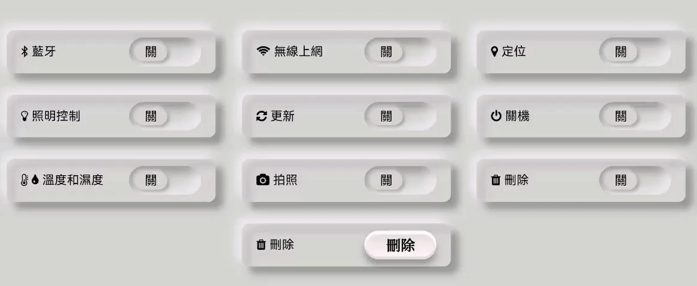

<style>
    table {
        width: 100%;
    }
</style>

# 前端元件代碼

## 開關按鈕 (只使用 CSS)

```css
* {
    box-shadow: none;
}

body {
    font-family: 'Poppins', sans-serif;
    margin: 0;
    width: 100%;
    height: 100vh;
    background-color: #d1dad3;
    display: flex;
    justify-content: center;
    align-items: center;
    font-size: 17px;
}

.container {
    max-width: 1000px;
    width: 100%;
    display: flex;
    flex-wrap: wrap;
    justify-content: space-around;
}

.switch-holder {
    display: flex;
    padding: 10px 20px;
    border-radius: 10px;
    margin-bottom: 30px;
    box-shadow: -8px -8px 15px rgba(255,255,255,.7),
                10px 10px 10px rgba(0,0,0, .3),
                inset 8px 8px 15px rgba(255,255,255,.7),
                inset 10px 10px 10px rgba(0,0,0, .3);
    justify-content: space-between;
    align-items: center;
}

.switch-label {
    width: 150px;
}

.switch-label i {
    margin-right: 5px;
}

.switch-toggle {
    height: 40px;
}

.switch-toggle input[type="checkbox"] {
    position: absolute;
    opacity: 0;
    z-index: -2;
}

.switch-toggle input[type="checkbox"] + label {
    position: relative;
    display: inline-block;
    width: 100px;
    height: 40px;
    border-radius: 20px;
    margin: 0;
    cursor: pointer;
    box-shadow: inset -8px -8px 15px rgba(255,255,255,.6),
                inset 10px 10px 10px rgba(0,0,0, .25);
}

.switch-toggle input[type="checkbox"] + label::before {
    position: absolute;
    content: '關';
    font-size: 18px;
    text-align: center;
    line-height: 25px;
    top: 8px;
    left: 8px;
    width: 45px;
    height: 25px;
    border-radius: 20px;
    background-color: #d1dad3;
    box-shadow: -3px -3px 5px rgba(255,255,255,.5),
                3px 3px 5px rgba(0,0,0, .25);
    transition: .3s ease-in-out;
}

.switch-toggle input[type="checkbox"]:checked + label::before {
    left: 50%;
    content: '開';
    color: #fff;
    background-color: #00b33c;
    box-shadow: -2px -2px 3px rgba(255,255,255,.2),
                2px 2px 3px #006600;
}

.switch-button{
    background-image: -webkit-linear-gradient(top, #dfdfd0, #fff);
    background-image: linear-gradient(top, #dfdfd0, #fff);
    border-radius: 20px;
    box-shadow: 0px 8px 10px 0px rgba(0, 0, 0, .3), inset 0px 4px 1px 1px white, inset 0px -3px 1px 1px rgba(204,198,197,.5);
    float:left;
    position: relative;
    -webkit-transition: all .1s linear;
    transition: all .1s linear;
    height: 40px;
    width: 100px;
    text-align: center;
    vertical-align: middle;
    display:table;
}

.switch-button:active{
    background-image: linear-gradient(top, #efedec, #f7f4f4);
    box-shadow: 0 1px 1px 0 rgba(0,0,0,.4), inset 0px 1px 1px 1px rgba(104,108,107,.5);
}

.switch-button span {
    display:table-cell;
    vertical-align:middle;
    margin : auto;
    font-family: "LiGothic", "PMingLiU", Arial, serif;
    font-weight: bold;
    font-size: 20px;
}

.switch-button span:hover {
    color: blue;
}

.switch-button span:active {
    color: rgb(0,0,0,0);
    text-shadow: 1px 1px #CC0000;
}
```

## 前端元件的網頁示例

```html
<link rel="stylesheet" href="https://cdnjs.cloudflare.com/ajax/libs/font-awesome/4.7.0/css/font-awesome.min.css">
<link rel="stylesheet" href="./switch.css">

<div class="container">
  <div class="switch-holder">
    <div class="switch-label">
      <i class="fa fa-bluetooth-b"></i><span>藍牙</span>
    </div>
    <div class="switch-toggle">
      <input type="checkbox" id="bluetooth">
      <label for="bluetooth"></label>
    </div>
  </div>

  <div class="switch-holder">
    <div class="switch-label">
      <i class="fa fa-wifi"></i><span>無線上網</span>
    </div>
    <div class="switch-toggle">
      <input type="checkbox" id="wifi">
      <label for="wifi"></label>
    </div>
  </div>

  <div class="switch-holder">
    <div class="switch-label">
      <i class="fa fa-map-marker"></i></i><span>定位</span>
    </div>
    <div class="switch-toggle">
      <input type="checkbox" id="location">
      <label for="location"></label>
    </div>
  </div>

  <div class="switch-holder">
    <div class="switch-label">
      <i class="fa fa-lightbulb-o"></i></i><span>照明控制</span>
    </div>
    <div class="switch-toggle">
      <input type="checkbox" id="lighting">
      <label for="lighting"></label>
    </div>
  </div>

  <div class="switch-holder">
    <div class="switch-label">
      <i class="fa fa-refresh"></i></i><span>更新</span>
    </div>
    <div class="switch-toggle">
      <input type="checkbox" id="refresh">
      <label for="refresh"></label>
    </div>
  </div>

  <div class="switch-holder">
    <div class="switch-label">
      <i class="fa fa-power-off"></i></i><span>關機</span>
    </div>
    <div class="switch-toggle">
      <input type="checkbox" id="poweroff">
      <label for="poweroff"></label>
    </div>
  </div>

  <div class="switch-holder">
    <div class="switch-label">
      <i class="fa fa-thermometer-half"></i><i class="fa fa-tint"></i><span>溫度和濕度</span>
    </div>
    <div class="switch-toggle">
      <input type="checkbox" id="thermometer">
      <label for="thermometer"></label>
    </div>
  </div>

  <div class="switch-holder">
    <div class="switch-label">
      <i class="fa fa-camera"></i></i><span>拍照</span>
    </div>
    <div class="switch-toggle">
      <input type="checkbox" id="camera">
      <label for="camera"></label>
    </div>
  </div>

  <div class="switch-holder">
    <div class="switch-label">
      <i class="fa fa-trash"></i></i><span>刪除</span>
    </div>
    <div class="switch-toggle">
      <input type="checkbox" id="trash">
      <label for="trash"></label>
    </div>
  </div>

  <div class="switch-holder">
    <div class="switch-label">
      <i class="fa fa-trash"></i></i><span>刪除</span>
    </div>
      <div class="switch-button"><span>刪除</span></div>
  </div>
</div>
```
## 前端元件輸出結果



# 前端元件代碼 (CSS & Javascript)

## CSS 代碼

```css
* {
  box-shadow: none;
}

body {
  font-family: "Poppins", sans-serif;
  margin: 0;
  width: 100%;
  height: 100vh;
  background-color: #d1dad3;
  display: flex;
  justify-content: center;
  align-items: center;
  font-size: 17px;
}

.container {
  display: flex;
  flex-wrap: wrap;
  justify-content: space-around;
  margin: 10px auto 0;
}

.switch-holder {
  display: flex;
  padding: 10px 20px;
  border-radius: 10px;
  margin-bottom: 10px;
  box-shadow: 2px 2px 3px #909692, -2px -2px 3px #ececec;
  justify-content: space-between;
  align-items: center;
}

.switch-meter {
  width: 190px;
  color: rgb(80, 80, 80);
}

.switch-meter span {
  font-size: 12px;
  margin: -40px 0px 0px -10px;
}

.switch-bar-t {
  display: grid;
  grid-row-gap: 5rem;
  position: relative;
  width: 200px;
  height: 5px;
  font-size: 12px;
  margin: 0px 0px 0px -10px;
  background: linear-gradient(to right, rgb(73, 208, 246), rgb(255, 119, 92));
  border-style: solid;
  border-width: 1px;
  border-color: rgb(140, 110, 110);
  z-index: 10;
}

.switch-bar-rh {
  display: grid;
  grid-row-gap: 5rem;
  position: relative;
  width: 200px;
  height: 5px;
  font-size: 12px;
  margin: 0px 0px 0px -10px;
  background: linear-gradient(to right, rgb(255, 255, 146), rgb(121, 127, 255));
  border-style: solid;
  border-width: 1px;
  border-color: rgb(140, 110, 110);
}

div.bar-start {
  font-size: 12px;
  width: 10px;
  margin: 0px 0px 0px -12px;
  z-index: 1000;
}

div.bar-end-t {
  font-size: 12px;
  margin: -15px 0px 0px 185px;
  z-index: 1001;
}

div.bar-pointer {
  width: 4px;
  height: 8px;
  border-radius: 1px;
  margin-top: -2px;
  margin-left: 100px;
  border-style: solid;
  border-width: 1px;
  border-color: rgb(110, 85, 85);
  background-color: #e4f709;
  z-index: 1002;
}

div.bar-end-rh {
  font-size: 12px;
  margin: -15px 0px 0px 180px;
  z-index: 1001;
}

.switch-text {
  width: 60px;
  display: inline-block;
  margin: 0px -15px 0px 15px;
  color: #555;
  text-shadow: 1px 1px 1px white;
  font-family: "Dosis";
  font-size: 35px;
  font-weight: 400;
  text-align: center;
}

.switch-text span {
  font-size: 15px;
  font-weight: 300;
}

.switch-text strong {
  position: relative;
  left: -15px;
  top: -15px;
  font-size: 17px;
  color: rgb(28, 13, 4);
}

.switch-label {
  width: 150px;
  color: rgb(80, 80, 80);
}

.switch-label i {
  margin-right: 5px;
}

.switch-led {
  height: 40px;
}

.switch-led input[type="checkbox"] {
  position: absolute;
  opacity: 0;
  z-index: -2;
}

.switch-led label {
  position: relative;
  display: inline-block;
  width: 100px;
  height: 40px;
}

.switch-led div {
  position: relative;
  margin: 5px 5px 5px 65px;
  width: 30px;
  height: 30px;
  border-radius: 50%;
}

.switch-led .CLOSE {
  content: "";
  background-color: rgba(226, 213, 213, 0.45);
  box-shadow: rgba(238, 238, 238, 0.2) 0 -1px 7px 1px, inset #7f7f7f 0 -1px 9px,
    rgba(212, 207, 207, 0.5) 0 2px 12px;
}

.switch-led .NORMAL {
  content: "";
  background-color: #abff00;
  box-shadow: rgba(0, 0, 0, 0.2) 0 -1px 7px 1px, inset #304701 0 -1px 9px,
    #89ff00 0 2px 12px;
}

.switch-led .ALARM {
  content: "";
  animation: blinkRed 0.5s infinite;
  background-color: #ff0d00;
  box-shadow: rgba(0, 0, 0, 0.2) 0 -1px 7px 1px, inset #304701 0 -1px 9px,
    #e04018bb 0 2px 12px;
}

@keyframes blinkRed {
  from {
    background-color: rgb(255, 119, 0);
  }
  50% {
    background-color: #a00;
    box-shadow: rgba(0, 0, 0, 0.2) 0 -1px 7px 1px, inset #441313 0 -1px 9px,
      rgba(255, 0, 0, 0.5) 0 2px 0;
  }
  to {
    background-color: #f00;
  }
}

.switch-toggle {
  height: 40px;
}

.switch-toggle input[type="checkbox"] {
  position: absolute;
  opacity: 0;
  z-index: -2;
}

.switch-toggle input[type="checkbox"] + label {
  position: relative;
  display: inline-block;
  width: 100px;
  height: 40px;
  border-radius: 20px;
  margin: 0;
  cursor: pointer;
  background: linear-gradient(145deg, #c7d0ca, #dde4df);
  box-shadow: inset -1px -1px 5px rgba(167, 167, 167, 0.6),
    inset 3px 3px 8px rgba(0, 0, 0, 0.25);
}

.switch-toggle input[type="checkbox"] + label::before {
  position: absolute;
  content: "關";
  font-size: 18px;
  text-align: center;
  line-height: 25px;
  top: 8px;
  left: 8px;
  width: 45px;
  height: 25px;
  border-radius: 20px;
  background-color: #d1dad3;
  box-shadow: -3px -3px 5px rgba(255, 255, 255, 0.5),
    3px 3px 5px rgba(0, 0, 0, 0.25);
  transition: 0.3s ease-in-out;
  color: rgb(80, 80, 80);
}

.switch-toggle input[type="checkbox"]:checked + label::before {
  left: 50%;
  content: "開";
  color: rgb(159, 39, 39);
  background-color: #00b33c;
  box-shadow: -2px -2px 3px rgba(255, 255, 255, 0.2), 2px 2px 3px #006600;
}

.switch-button {
  background-image: -webkit-linear-gradient(top, #dfdfd0, #fff);
  background-image: linear-gradient(top, #dfdfd0, #fff);
  border-radius: 20px;
  box-shadow: 0px 3px 5px 0px rgba(0, 0, 0, 0.3), inset 0px 4px 1px 1px white,
    inset 0px -3px 1px 1px rgba(204, 198, 197, 0.5);
  float: left;
  position: relative;
  -webkit-transition: all 0.1s linear;
  transition: all 0.1s linear;
  height: 40px;
  width: 100px;
  text-align: center;
  vertical-align: middle;
  display: table;
  color: rgb(80, 80, 80);
}

.switch-button:active {
  background-image: linear-gradient(top, #efedec, #f7f4f4);
  box-shadow: 0px 1px 1px 0px rgba(0, 0, 0, 0.3), inset 0px 1px 1px 1px white,
    inset 0px -1px 0px 0px rgba(204, 198, 197, 0.5);
}

.switch-button span {
  display: table-cell;
  vertical-align: middle;
  margin: auto;
  font-family: "LiGothic", "PMingLiU", Arial, serif;
  font-size: 20px;
}

.switch-button span:hover {
  color: rgb(108, 108, 211);
}

.switch-button span:active {
  color: rgb(0, 0, 0, 0);
  text-shadow: -0px -1px #be6363;
}

.datetime {
  color: #fff;
  background: #10101e;
  font-family: "Segoe UI", sans-serif;
  width: 274px;
  border: 8px solid #d1dad3;
  border-radius: 10px;
  margin: 0px 0px 10px 0px;
  transition: 0.5s;
  transition-property: background, box-shdow;
  background: linear-gradient(145deg, #e0e9e2, #bcc4be);
  box-shadow: 2px 2px 3px #909692, -2px -2px 3px #ececec;
}

.datetimei {
  font-family: "Segoe UI", sans-serif;
  padding: 3px 10px;
  width: 255px;
  border-radius: 5px;
  transition: 0.5s;
  background: #e0e0e0;
  box-shadow: inset 9px 9px 11px #c3c3c3, inset -7px -7px 8px #fdfdfd;
}

.datetimei:hover {
  background: #fcffd0;
  box-shadow: 0 0 30px #fbffc5;
}

.date {
  margin: 3px 0px 0px 0px;
  font-size: 12px;
  font-weight: 200;
  text-align: center;
  letter-spacing: 3px;
  color: blue;
}

.time {
  font-size: 20px;
  display: flex;
  justify-content: center;
  align-items: center;
  color: rgb(103, 103, 103);
}

.time span:not(:last-child) {
  position: relative;
  margin: 0px 6px;
  font-weight: 550;
  text-align: center;
  letter-spacing: 3px;
}

.time span:last-child {
  background: #2e94e3;
  font-size: 12px;
  font-weight: 400;
  text-transform: uppercase;
  margin-top: 7px;
  padding: 0 5px;
  border-radius: 3px;
  color: white;
}

```

## Javascript 代碼

```js
class components {
  degree(id) {
    let content = document.getElementById(id).textContent;
    let ilist = content.split(".");
    let str = ilist[0] + "<span>." + ilist[1] + "<strong>&deg;C</strong>";
    document.getElementById(id).innerHTML = str;
  }

  humdity(id) {
    let content = document.getElementById(id).textContent;
    let ilist = content.split(".");
    let str = ilist[0] + "<span>." + ilist[1] + "<strong>%</strong>";
    document.getElementById(id).innerHTML = str;
  }

  clock(id) {
    let elem = document.getElementById(id);
    let newDiv = document.createElement("div");
    newDiv.setAttribute("class", "datetime");
    newDiv.innerHTML = `
    <div class="datetimei">
      <div class="date">
        <span id="dayname">Day</span>
        <span id="month">Month</span>
        <span id="daynum">00</span>,
        <span id="year">Year</span>
      </div>
      <div class="time">
        <span id="hour">00</span>:
        <span id="minutes">00</span>:
        <span id="seconds">00</span>
        <span id="period">AM</span>
      </div>
    </div>`;
    elem.appendChild(newDiv);
  }

  _updateClock() {
    var now = new Date();
    var dname = now.getDay(),
      mo = now.getMonth(),
      dnum = now.getDate(),
      yr = now.getFullYear(),
      hou = now.getHours(),
      min = now.getMinutes(),
      sec = now.getSeconds(),
      pe = "AM";
    if (hou == 0) {
      hou = 12;
    }
    if (hou > 12) {
      hou = hou - 12;
      pe = "PM";
    }
    Number.prototype.pad = function (digits) {
      for (var n = this.toString(); n.length < digits; n = 0 + n);
      return n;
    };
    var months = [
      "January",
      "Febuary",
      "March",
      "April",
      "May",
      "June",
      "July",
      "August",
      "September",
      "October",
      "November",
      "December",
    ];
    var week = ["Sun.", "Mon.", "Tue.", "Wed.", "Thu.", "Fri.", "Sat."];
    var ids = [
      "dayname",
      "month",
      "daynum",
      "year",
      "hour",
      "minutes",
      "seconds",
      "period",
    ];
    var values = [
      week[dname],
      months[mo],
      dnum.pad(2),
      yr.pad(2),
      hou.pad(2),
      min.pad(2),
      sec.pad(2),
      pe,
    ];
    for (var i = 0; i < ids.length; i++) {
      document.getElementById(ids[i]).firstChild.nodeValue = values[i];
    }
  }

  initClock() {
    setInterval(this._updateClock, 1000);
  }

  switch(id) {
    let elem = document.getElementById(id);
    let cname = elem.getAttribute("cname");
    let icon = elem.getAttribute("icon");
    let icons = icon.split(",");
    if (icons.length > 1)
      icon = icons
        .map(function (str) {
          return '<i class="fa ' + str + '"></i>';
        })
        .join("");
    else icon = '<i class=" fa ' + icon + '"></i>';
    let idx = elem.getAttribute("idx");
    elem.setAttribute("class", "switch-holder");
    elem.innerHTML =
      '<div class="switch-label">' +
      icon +
      "<span>" +
      cname +
      "</span></div>" +
      '<div class="switch-toggle">' +
      '<input type="checkbox" id="' +
      idx +
      '">' +
      '<label for="' +
      idx +
      '"></label></div>';
  }

  button(id) {
    let elem = document.getElementById(id);
    let cname = elem.getAttribute("cname");
    let bname = elem.getAttribute("bname");
    let icon = elem.getAttribute("icon");
    let icons = icon.split(",");
    let idx = elem.getAttribute("idx");
    if (icons.length > 1)
      icon = icons
        .map(function (str) {
          return '<i class="fa ' + str + '"></i>';
        })
        .join("");
    else icon = '<i class=" fa ' + icon + '"></i>';
    elem.setAttribute("class", "switch-holder");
    elem.innerHTML =
      '<div class="switch-label">' +
      icon +
      "<span>" +
      cname +
      "</span></div>" +
      '<div class="switch-toggle"><div class="switch-button" id=' +
      idx +
      "><span>" +
      bname +
      "</span></div>";
  }

  meter(id) {
    let elem = document.getElementById(id);
    let idx = elem.getAttribute("idx");
    let cname = elem.getAttribute("cname");
    let max = elem.getAttribute("max");
    let unit = elem.getAttribute("unit");
    let value = elem.getAttribute("value");
    let barStyle = elem.getAttribute("color");
    if (barStyle == null) barStyle = "switch-bar-t";
    let pointer = parseInt(parseFloat(value) * 2);
    if (max != null)
      pointer = parseInt((parseFloat(value) / parseFloat(max)) * 200);
    let ilist = value.split(".");
    value = ilist[0] + "<span>." + ilist[1] + "<strong>" + unit + "</strong>";
    let range = '<div class="bar-start">0</div><div class="bar-end-rh">100';
    if (max != null)
      range = '<div class="bar-start">0</div><div class="bar-end-t">' + max;
    elem.setAttribute("class", "switch-holder");
    elem.innerHTML =
      '<div class="switch-meter">' +
      range +
      '</div><div class="' +
      barStyle +
      '"><div class="bar-pointer" style="margin-left:' +
      pointer +
      'px;"' +
      idx +
      '"></div></div>' +
      "<span>" +
      cname +
      '</span></div><div class="switch-text">' +
      value +
      "</div>";
  }

  led(id) {
    let elem = document.getElementById(id);
    let cname = elem.getAttribute("cname");
    let icon = elem.getAttribute("icon");
    let icons = icon.split(",");
    let idx = elem.getAttribute("idx");
    let status = elem.getAttribute("status");
    if (icons.length > 1)
      icon = icons
        .map(function (str) {
          return '<i class="fa ' + str + '"></i>';
        })
        .join("");
    else icon = '<i class=" fa ' + icon + '"></i>';
    elem.setAttribute("class", "switch-holder");
    elem.innerHTML =
      '<div class="switch-label">' +
      icon +
      "<span>" +
      cname +
      '</span></div><div class="switch-led"><div class=' +
      status +
      " id=" +
      idx +
      "><span></div></div></div>";
  }
}

```
## 前端元件的網頁示例

```html
<!DOCTYPE html>
<html lang="en">
  <head>
		<meta charset="utf-8" />
		<meta id="viewport" name="viewport" content="width=device-width,initial-scale=1,user-scalable=yes" />
    <script src="https://code.jquery.com/jquery-1.11.1.min.js"></script>
    <link
      rel="stylesheet"
      href="https://cdnjs.cloudflare.com/ajax/libs/font-awesome/4.7.0/css/font-awesome.min.css"
    />
    <link rel="stylesheet" href="./switch.css" />
    <script type="text/javascript" src="./components.js"></script>
  </head>
  <body>
    <div class="container">
      <div id="clock"></div>
      <div
        id="L1"
        idx="p1"
        cname="無線上網狀態"
        icon="fa-wifi"
        status="NORMAL"
      ></div>
      <div
        id="L2"
        idx="p1"
        cname="錯誤狀態"
        icon="fa-exclamation-triangle"
        status="ALARM"
      ></div>
      <div
        id="L3"
        idx="p1"
        cname="藍牙狀態"
        icon="fa-bluetooth-b"
        status="CLOSE"
      ></div>
      <div id="L0" idx="lighting" cname="照明控制" icon="fa-lightbulb-o"></div>
      <div id="R0" idx="refresh" cname="更新" icon="fa-refresh"></div>
      <div id="C1" idx="camera" cname="拍照" icon="fa-camera"></div>
      <div
        id="B1"
        idx="measure"
        cname="溫度和濕度"
        bname="測量"
        icon="fa-thermometer-half,fa-tint"
      ></div>
      <div
        id="m1"
        idx="temperature"
        value="33.9"
        cname="溫度 (°C)"
        max="50"
        unit="°C"
      ></div>
      <div
        id="m2"
        idx="humidity"
        value="95.2"
        cname="濕度 (%)"
        unit="%"
        color="switch-bar-rh"
      ></div>
      <div
        id="P0"
        idx="location"
        cname="全球定位系統"
        bname="定位"
        icon="fa-map-marker"
      ></div>
      <script>
        let x = new components();
        x.clock("clock");
        x.initClock();
        x.switch("L0");
        x.switch("R0");
        x.switch("C1");
        x.button("P0");
        x.button("B1");
        x.meter("m1");
        x.meter("m2");
        x.led("L1");
        x.led("L2");
        x.led("L3");
      </script>
    </div>
  </body>
</html>

```

## 前端元件輸出結果


